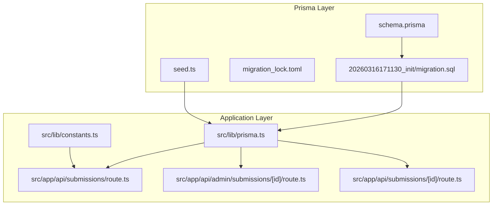
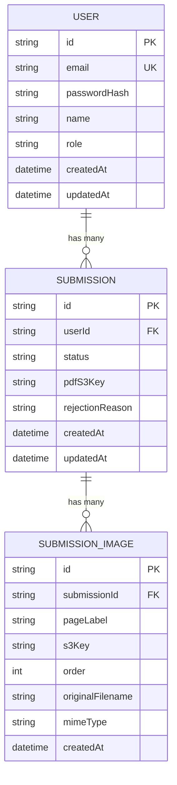
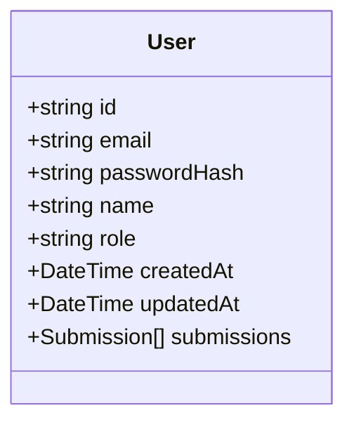
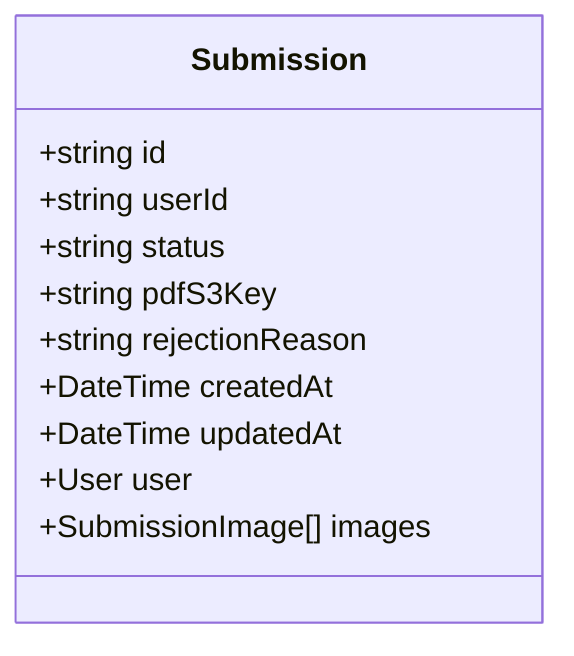
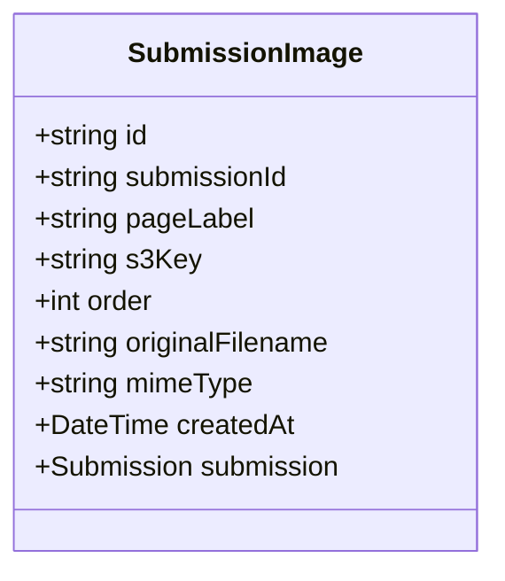
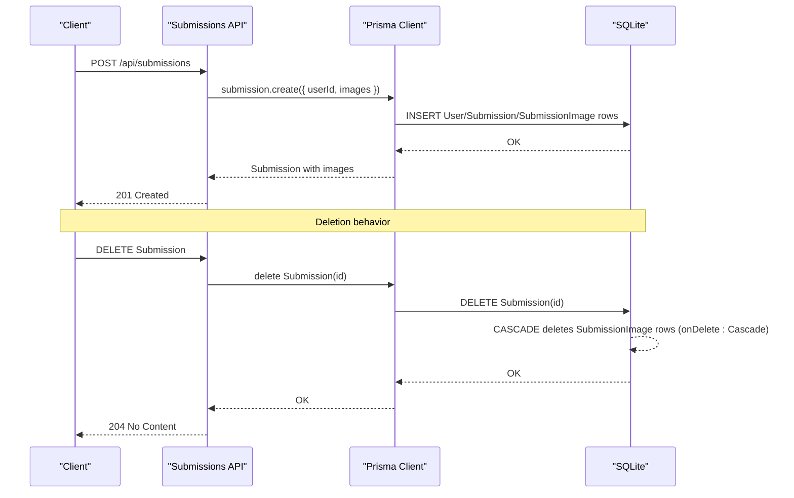
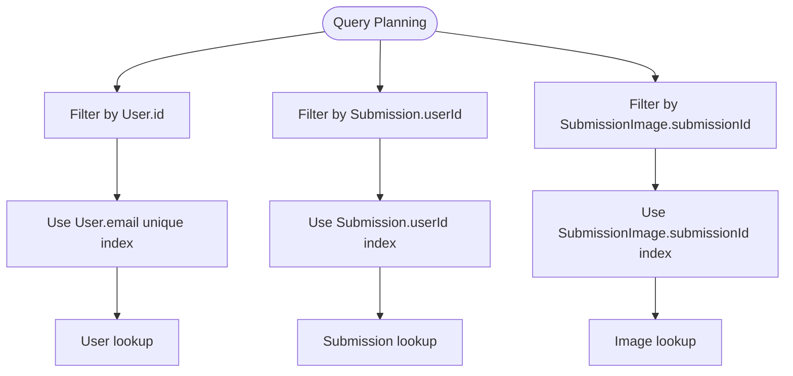
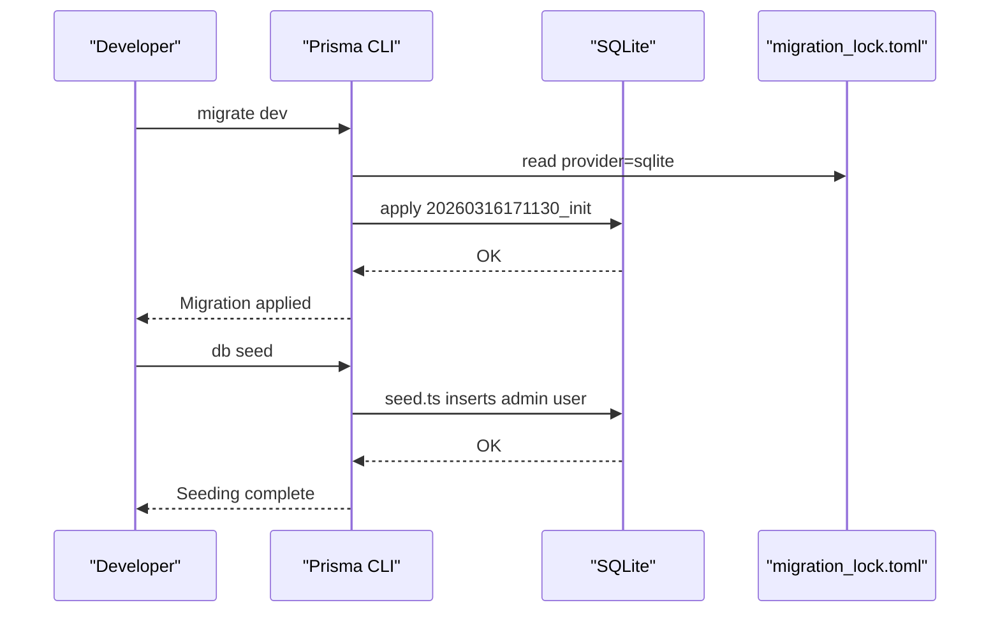
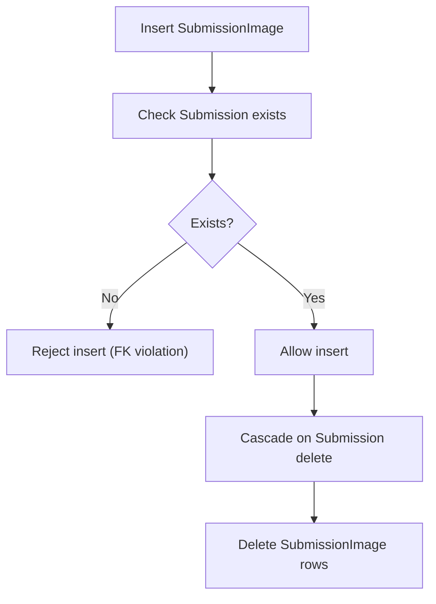
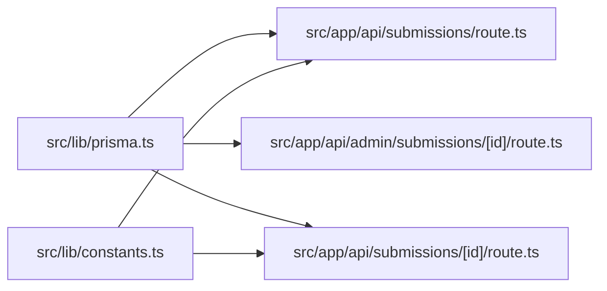

# Schema Relationships & Constraints

<cite>
**Referenced Files in This Document**
- [schema.prisma](file://prisma/schema.prisma)
- [migration.sql](file://prisma/migrations/20260316171130_init/migration.sql)
- [migration_lock.toml](file://prisma/migrations/migration_lock.toml)
- [seed.ts](file://prisma/seed.ts)
- [prisma.ts](file://src/lib/prisma.ts)
- [route.ts](file://src/app/api/submissions/route.ts)
- [route.ts](file://src/app/api/admin/submissions/[id]/route.ts)
- [route.ts](file://src/app/api/submissions/[id]/route.ts)
- [constants.ts](file://src/lib/constants.ts)
</cite>

## Table of Contents
1. [Introduction](#introduction)
2. [Project Structure](#project-structure)
3. [Core Components](#core-components)
4. [Architecture Overview](#architecture-overview)
5. [Detailed Component Analysis](#detailed-component-analysis)
6. [Dependency Analysis](#dependency-analysis)
7. [Performance Considerations](#performance-considerations)
8. [Troubleshooting Guide](#troubleshooting-guide)
9. [Conclusion](#conclusion)

## Introduction
This document explains the database relationships and constraints among the User, Submission, and SubmissionImage models in Titchybook Creator. It focuses on:
- The three-way relationship: User → Submission (one-to-many), Submission ← User (many-to-one), and Submission → SubmissionImage (one-to-many)
- Foreign key constraints and referential integrity
- Cascade behaviors, specifically onDelete: Cascade on SubmissionImage submissionId
- Indexing strategies for query performance
- Migration history and schema evolution patterns
- Database integrity enforcement mechanisms

## Project Structure
The database schema is defined declaratively with Prisma and materialized through SQL migrations. The application uses Prisma Client to interact with the SQLite database.

**Diagram sources**
- [schema.prisma:1-48](file://prisma/schema.prisma#L1-L48)
- [migration.sql:1-45](file://prisma/migrations/20260316171130_init/migration.sql#L1-L45)
- [migration_lock.toml:1-3](file://prisma/migrations/migration_lock.toml#L1-L3)
- [seed.ts:1-36](file://prisma/seed.ts#L1-L36)
- [prisma.ts:1-10](file://src/lib/prisma.ts#L1-L10)
- [route.ts:1-96](file://src/app/api/submissions/route.ts#L1-L96)
- [route.ts:1-63](file://src/app/api/admin/submissions/[id]/route.ts#L1-L63)
- [route.ts:1-37](file://src/app/api/submissions/[id]/route.ts#L1-L37)
- [constants.ts:1-49](file://src/lib/constants.ts#L1-L49)

**Section sources**
- [schema.prisma:1-48](file://prisma/schema.prisma#L1-L48)
- [migration.sql:1-45](file://prisma/migrations/20260316171130_init/migration.sql#L1-L45)
- [prisma.ts:1-10](file://src/lib/prisma.ts#L1-L10)

## Core Components
- User model: Represents registered users with unique email, roles, and a collection of Submissions.
- Submission model: Links to a User (many-to-one) and contains multiple SubmissionImages (one-to-many).
- SubmissionImage model: Links to a Submission (many-to-one) with onDelete: Cascade to ensure data consistency.

Key constraints and indexes:
- Unique index on User.email
- Index on Submission.userId for efficient user-scoped queries
- Index on SubmissionImage.submissionId for efficient image retrieval per submission
- Foreign keys:
  - Submission.userId → User.id with RESTRICT on delete
  - SubmissionImage.submissionId → Submission.id with CASCADE on delete

**Section sources**
- [schema.prisma:10-47](file://prisma/schema.prisma#L10-L47)
- [migration.sql:12-44](file://prisma/migrations/20260316171130_init/migration.sql#L12-L44)

## Architecture Overview
The application enforces referential integrity at the database level while exposing clean APIs for CRUD operations. The Prisma schema defines relations and indexes; migrations apply them to SQLite. Application routes use Prisma Client to create submissions with associated images and to fetch them with ordering.

**Diagram sources**
- [schema.prisma:10-47](file://prisma/schema.prisma#L10-L47)

## Detailed Component Analysis

### User Model
- Identity: String id (auto-generated)
- Uniqueness: email is unique
- Role: defaults to "USER"; seeded admin user demonstrates role assignment
- Relations: Has many Submissions via submissions field
- Timestamps: createdAt and updatedAt managed automatically

**Diagram sources**
- [schema.prisma:10-19](file://prisma/schema.prisma#L10-L19)
- [seed.ts:17-25](file://prisma/seed.ts#L17-L25)

**Section sources**
- [schema.prisma:10-19](file://prisma/schema.prisma#L10-L19)
- [seed.ts:17-25](file://prisma/seed.ts#L17-L25)

### Submission Model
- Identity: String id (auto-generated)
- Foreign key: userId references User.id
- Defaults: status defaults to "PENDING"
- Relations: belongs to User (many-to-one), has many SubmissionImages (one-to-many)
- Index: @@index([userId]) for fast user-scoped queries
- Timestamps: createdAt and updatedAt managed automatically

**Diagram sources**
- [schema.prisma:21-33](file://prisma/schema.prisma#L21-L33)

**Section sources**
- [schema.prisma:21-33](file://prisma/schema.prisma#L21-L33)
- [migration.sql:12-22](file://prisma/migrations/20260316171130_init/migration.sql#L12-L22)

### SubmissionImage Model
- Identity: String id (auto-generated)
- Foreign key: submissionId references Submission.id
- onDelete: Cascade ensures deletion of images when a submission is deleted
- Fields: pageLabel, s3Key, order, originalFilename, mimeType
- Index: @@index([submissionId]) for fast retrieval of images per submission
- Timestamps: createdAt managed automatically

**Diagram sources**
- [schema.prisma:35-47](file://prisma/schema.prisma#L35-L47)

**Section sources**
- [schema.prisma:35-47](file://prisma/schema.prisma#L35-L47)
- [migration.sql:24-35](file://prisma/migrations/20260316171130_init/migration.sql#L24-L35)

### Relationship Summary and Cascade Behavior
- User → Submission: one-to-many
- Submission ← User: many-to-one
- Submission → SubmissionImage: one-to-many
- SubmissionImage.submissionId: onDelete: Cascade

**Diagram sources**
- [route.ts:35-96](file://src/app/api/submissions/route.ts#L35-L96)
- [schema.prisma:24](file://prisma/schema.prisma#L24)
- [schema.prisma:38](file://prisma/schema.prisma#L38)
- [migration.sql:21](file://prisma/migrations/20260316171130_init/migration.sql#L21)
- [migration.sql:34](file://prisma/migrations/20260316171130_init/migration.sql#L34)

**Section sources**
- [schema.prisma:24](file://prisma/schema.prisma#L24)
- [schema.prisma:38](file://prisma/schema.prisma#L38)
- [migration.sql:21](file://prisma/migrations/20260316171130_init/migration.sql#L21)
- [migration.sql:34](file://prisma/migrations/20260316171130_init/migration.sql#L34)

### Indexing Strategies
- User.email: UNIQUE index enforced at creation
- Submission.userId: Index for efficient user-scoped queries
- SubmissionImage.submissionId: Index for efficient per-submission image retrieval

**Diagram sources**
- [migration.sql:37-44](file://prisma/migrations/20260316171130_init/migration.sql#L37-L44)
- [schema.prisma:32](file://prisma/schema.prisma#L32)
- [schema.prisma:46](file://prisma/schema.prisma#L46)

**Section sources**
- [migration.sql:37-44](file://prisma/migrations/20260316171130_init/migration.sql#L37-L44)
- [schema.prisma:32](file://prisma/schema.prisma#L32)
- [schema.prisma:46](file://prisma/schema.prisma#L46)

### Migration History and Schema Evolution
- Initial migration: 20260316171130_init
  - Creates User, Submission, and SubmissionImage tables
  - Adds foreign key constraints and indexes
  - Sets provider to sqlite in migration_lock.toml
- Seed script: Creates an admin user with role ADMIN for administrative access

**Diagram sources**
- [migration_lock.toml:1-3](file://prisma/migrations/migration_lock.toml#L1-L3)
- [migration.sql:1-45](file://prisma/migrations/20260316171130_init/migration.sql#L1-L45)
- [seed.ts:7-25](file://prisma/seed.ts#L7-L25)

**Section sources**
- [migration_lock.toml:1-3](file://prisma/migrations/migration_lock.toml#L1-L3)
- [migration.sql:1-45](file://prisma/migrations/20260316171130_init/migration.sql#L1-L45)
- [seed.ts:7-25](file://prisma/seed.ts#L7-L25)

### Database Integrity Enforcement Mechanisms
- Foreign key constraints:
  - Submission.userId → User.id with RESTRICT on delete
  - SubmissionImage.submissionId → Submission.id with CASCADE on delete
- Unique constraint on User.email
- Indexes for performance and referential integrity support
- Application-level checks:
  - Authentication and authorization in API routes
  - Validation of page labels and image metadata
  - Ordering of images by order field

**Diagram sources**
- [migration.sql:21](file://prisma/migrations/20260316171130_init/migration.sql#L21)
- [migration.sql:34](file://prisma/migrations/20260316171130_init/migration.sql#L34)

**Section sources**
- [migration.sql:21](file://prisma/migrations/20260316171130_init/migration.sql#L21)
- [migration.sql:34](file://prisma/migrations/20260316171130_init/migration.sql#L34)

## Dependency Analysis
- Prisma Client is initialized once and reused globally to avoid multiple connections.
- API routes depend on Prisma Client for database operations.
- Constants define submission statuses and page labels used in validation and display.

**Diagram sources**
- [prisma.ts:1-10](file://src/lib/prisma.ts#L1-L10)
- [route.ts:1-96](file://src/app/api/submissions/route.ts#L1-L96)
- [route.ts:1-63](file://src/app/api/admin/submissions/[id]/route.ts#L1-L63)
- [route.ts:1-37](file://src/app/api/submissions/[id]/route.ts#L1-L37)
- [constants.ts:1-49](file://src/lib/constants.ts#L1-L49)

**Section sources**
- [prisma.ts:1-10](file://src/lib/prisma.ts#L1-L10)
- [route.ts:1-96](file://src/app/api/submissions/route.ts#L1-L96)
- [route.ts:1-63](file://src/app/api/admin/submissions/[id]/route.ts#L1-L63)
- [route.ts:1-37](file://src/app/api/submissions/[id]/route.ts#L1-L37)
- [constants.ts:1-49](file://src/lib/constants.ts#L1-L49)

## Performance Considerations
- Use the existing indexes:
  - Filter by User.email for login and uniqueness checks
  - Filter by Submission.userId for user dashboards
  - Filter by SubmissionImage.submissionId for per-submission image retrieval
- Batch operations:
  - Create submissions with images in a single transaction to minimize round trips
- Avoid N+1 queries:
  - Use include with orderBy to fetch images in a single query
- Consider pagination for large lists of submissions or images

## Troubleshooting Guide
- Unauthorized or forbidden requests:
  - Ensure the session contains a valid user id and role for admin actions
- Not found errors:
  - Verify submission id exists and belongs to the requesting user or is accessible by admins
- Validation errors:
  - Ensure exactly 8 unique page labels and valid image metadata
- Cascade deletion:
  - Deleting a submission will remove all associated images due to onDelete: Cascade

**Section sources**
- [route.ts:20-33](file://src/app/api/submissions/route.ts#L20-L33)
- [route.ts:12-32](file://src/app/api/admin/submissions/[id]/route.ts#L12-L32)
- [route.ts:6-28](file://src/app/api/submissions/[id]/route.ts#L6-L28)
- [constants.ts:18-27](file://src/lib/constants.ts#L18-L27)

## Conclusion
The Titchybook Creator database schema enforces strong referential integrity through foreign keys and indexes, while the Prisma onDelete: Cascade behavior guarantees data consistency for SubmissionImage records. The initial migration establishes the foundational tables and constraints, and the application’s API routes leverage these relationships to provide robust user experiences. Administrators can manage submissions and enforce status changes, while users can submit and retrieve their own content efficiently.