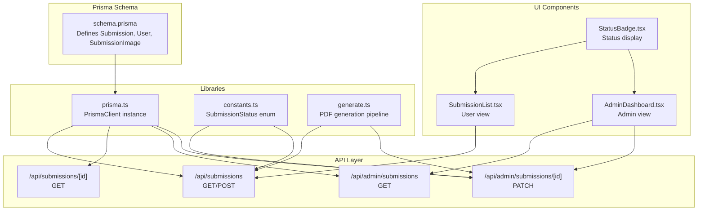
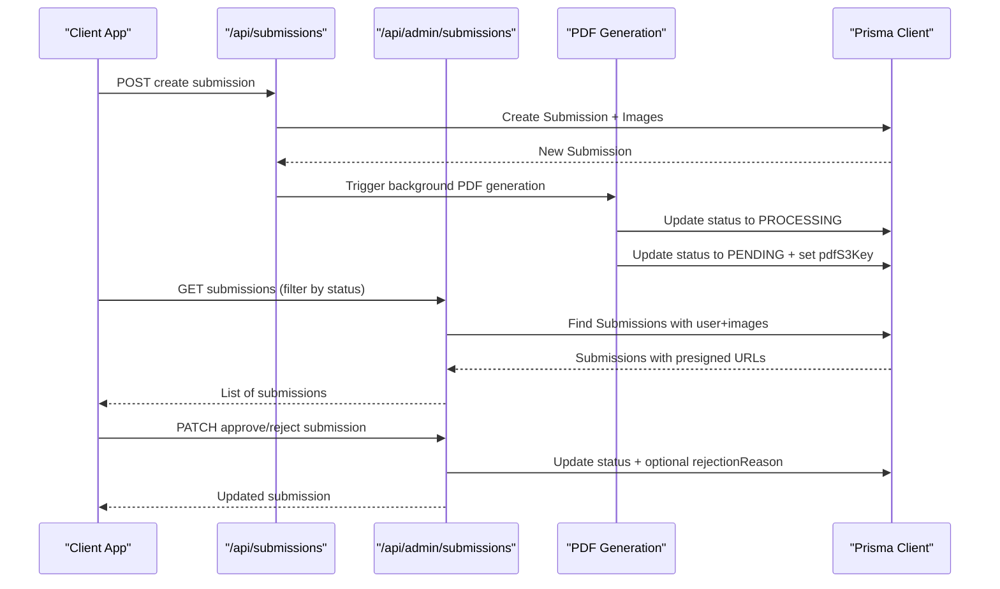
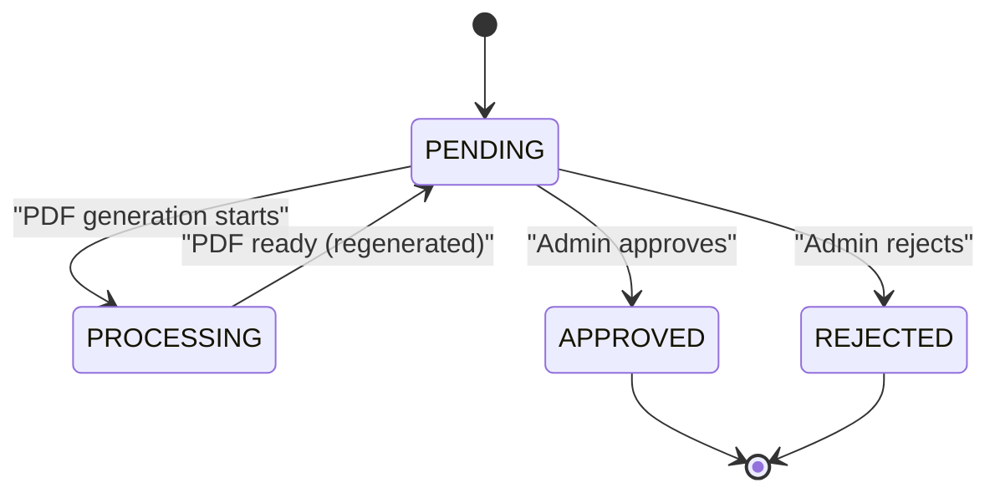
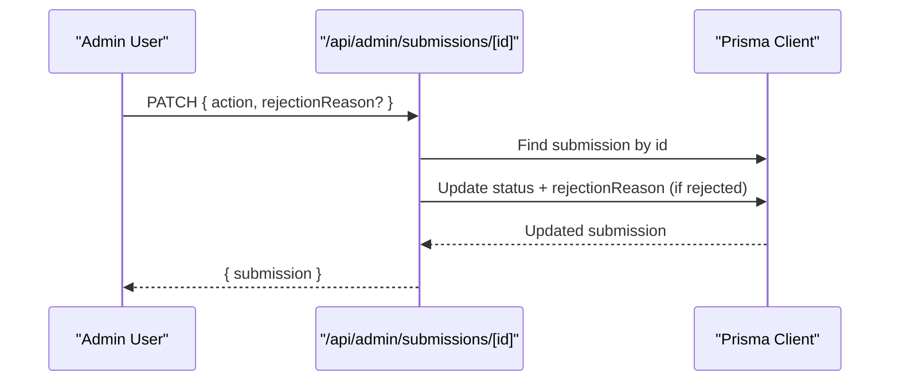
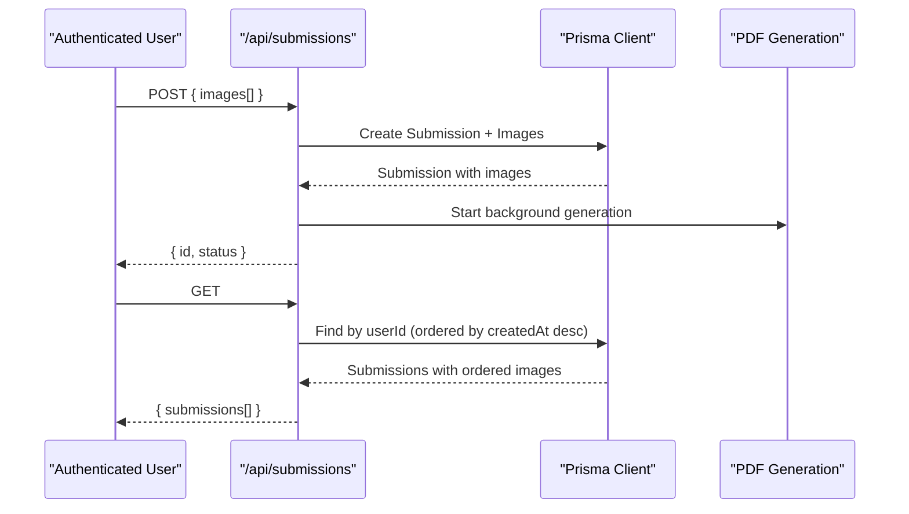
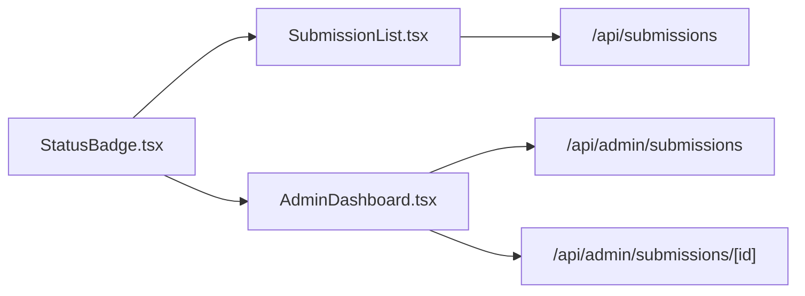
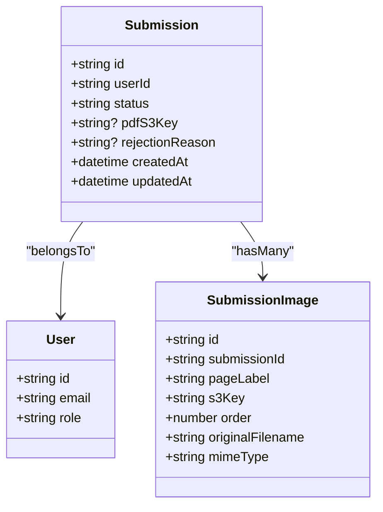

# Submission Model

<cite>
**Referenced Files in This Document**
- [schema.prisma](file://prisma/schema.prisma)
- [prisma.ts](file://src/lib/prisma.ts)
- [route.ts](file://src/app/api/submissions/route.ts)
- [route.ts](file://src/app/api/submissions/[id]/route.ts)
- [route.ts](file://src/app/api/admin/submissions/route.ts)
- [route.ts](file://src/app/api/admin/submissions/[id]/route.ts)
- [generate.ts](file://src/lib/pdf/generate.ts)
- [constants.ts](file://src/lib/constants.ts)
- [SubmissionList.tsx](file://src/components/submissions/SubmissionList.tsx)
- [AdminDashboard.tsx](file://src/components/admin/AdminDashboard.tsx)
- [StatusBadge.tsx](file://src/components/submissions/StatusBadge.tsx)
</cite>

## Table of Contents
1. [Introduction](#introduction)
2. [Project Structure](#project-structure)
3. [Core Components](#core-components)
4. [Architecture Overview](#architecture-overview)
5. [Detailed Component Analysis](#detailed-component-analysis)
6. [Dependency Analysis](#dependency-analysis)
7. [Performance Considerations](#performance-considerations)
8. [Troubleshooting Guide](#troubleshooting-guide)
9. [Conclusion](#conclusion)

## Introduction
This document provides comprehensive documentation for the Submission model in Titchybook Creator, which represents a user's booklet creation request. It covers the entity structure, relationships, status workflow, admin moderation process, and practical usage patterns for creating submissions, updating statuses, and approving content.

## Project Structure
The Submission model is defined in the Prisma schema and is used across API routes, UI components, and background PDF generation. The following diagram shows how the model integrates with related components.

**Diagram sources**
- [schema.prisma:21-33](file://prisma/schema.prisma#L21-L33)
- [prisma.ts:1-10](file://src/lib/prisma.ts#L1-L10)
- [constants.ts:6-11](file://src/lib/constants.ts#L6-L11)
- [generate.ts:23-111](file://src/lib/pdf/generate.ts#L23-L111)
- [route.ts:1-96](file://src/app/api/submissions/route.ts#L1-L96)
- [route.ts:1-37](file://src/app/api/submissions/[id]/route.ts#L1-L37)
- [route.ts:1-38](file://src/app/api/admin/submissions/route.ts#L1-L38)
- [route.ts:1-63](file://src/app/api/admin/submissions/[id]/route.ts#L1-L63)
- [SubmissionList.tsx:15-119](file://src/components/submissions/SubmissionList.tsx#L15-L119)
- [AdminDashboard.tsx:21-168](file://src/components/admin/AdminDashboard.tsx#L21-L168)
- [StatusBadge.tsx:1-18](file://src/components/submissions/StatusBadge.tsx#L1-L18)

**Section sources**
- [schema.prisma:10-47](file://prisma/schema.prisma#L10-L47)
- [prisma.ts:1-10](file://src/lib/prisma.ts#L1-L10)

## Core Components
This section documents the Submission entity and its relationships.

- Entity: Submission
  - id: String, @id, @default(cuid())
  - userId: String
  - status: String, @default("PENDING")
  - pdfS3Key: String? (nullable)
  - rejectionReason: String? (nullable)
  - createdAt: DateTime, @default(now()), @updatedAt
  - updatedAt: DateTime, @updatedAt
  - Indices: @@index([userId])

- Relationships
  - Belongs to User via userId → User.id
  - Has many SubmissionImage via SubmissionImage.submissionId → Submission.id (with cascade delete)

- Field Constraints and Defaults
  - status defaults to "PENDING"
  - pdfS3Key and rejectionReason are optional
  - Timestamps managed automatically

**Section sources**
- [schema.prisma:21-33](file://prisma/schema.prisma#L21-L33)
- [schema.prisma:10-19](file://prisma/schema.prisma#L10-L19)
- [schema.prisma:35-47](file://prisma/schema.prisma#L35-L47)

## Architecture Overview
The Submission model participates in two primary workflows:
- User submission creation and retrieval
- Admin moderation and approval

**Diagram sources**
- [route.ts:35-95](file://src/app/api/submissions/route.ts#L35-L95)
- [route.ts:6-37](file://src/app/api/admin/submissions/route.ts#L6-L37)
- [route.ts:12-62](file://src/app/api/admin/submissions/[id]/route.ts#L12-L62)
- [generate.ts:23-111](file://src/lib/pdf/generate.ts#L23-L111)
- [constants.ts:6-11](file://src/lib/constants.ts#L6-L11)

## Detailed Component Analysis

### Submission Entity Structure
- Identity and Ownership
  - id: Unique identifier generated by cuid()
  - userId: Foreign key linking to User.id
- Moderation Fields
  - status: One of PENDING, APPROVED, REJECTED, PROCESSING
  - rejectionReason: Optional reason for rejection
  - pdfS3Key: S3 key for generated PDF when approved
- Metadata
  - createdAt/updatedAt: Automatic timestamps
- Indexing
  - userId indexed for efficient user-scoped queries

**Section sources**
- [schema.prisma:21-33](file://prisma/schema.prisma#L21-L33)
- [constants.ts:6-11](file://src/lib/constants.ts#L6-L11)

### Status Workflow
The status lifecycle is:
- Initial: PENDING
- Processing: PROCESSING during PDF generation
- Final: APPROVED or REJECTED

**Diagram sources**
- [generate.ts:27-108](file://src/lib/pdf/generate.ts#L27-L108)
- [constants.ts:6-11](file://src/lib/constants.ts#L6-L11)

**Section sources**
- [generate.ts:23-111](file://src/lib/pdf/generate.ts#L23-L111)
- [constants.ts:6-11](file://src/lib/constants.ts#L6-L11)

### Admin Moderation Process
- Access Control
  - Only users with role ADMIN can access admin endpoints
- Listing Submissions
  - Filter by status via query parameter
  - Includes user and images with ordered pages
  - Generates presigned URLs for PDFs when available
- Approving/Rejecting
  - Requires action: APPROVE or REJECT
  - On reject, optional rejectionReason is stored
  - On approve, status becomes APPROVED

**Diagram sources**
- [route.ts:12-62](file://src/app/api/admin/submissions/[id]/route.ts#L12-L62)
- [constants.ts:6-11](file://src/lib/constants.ts#L6-L11)

**Section sources**
- [route.ts:12-62](file://src/app/api/admin/submissions/[id]/route.ts#L12-L62)
- [constants.ts:6-11](file://src/lib/constants.ts#L6-L11)

### User Submission Creation and Retrieval
- Creating a Submission
  - Validates payload shape and ensures all 8 page labels are present
  - Creates Submission with associated images in a transaction
  - Triggers asynchronous PDF generation
- Retrieving Submissions
  - Users see their own submissions with images ordered by page position
  - Individual submission retrieval enforces ownership or admin privileges

**Diagram sources**
- [route.ts:35-95](file://src/app/api/submissions/route.ts#L35-L95)
- [route.ts:6-36](file://src/app/api/submissions/[id]/route.ts#L6-L36)

**Section sources**
- [route.ts:16-95](file://src/app/api/submissions/route.ts#L16-L95)
- [route.ts:6-36](file://src/app/api/submissions/[id]/route.ts#L6-L36)

### UI Integration
- SubmissionList
  - Displays user's submissions with status badges
  - Shows rejection reason when applicable
  - Enables PDF download when approved
- AdminDashboard
  - Filters submissions by status
  - Shows user info and presigned PDF links
  - Approve/Reject actions with prompts for rejection reasons

**Diagram sources**
- [SubmissionList.tsx:15-119](file://src/components/submissions/SubmissionList.tsx#L15-L119)
- [AdminDashboard.tsx:21-168](file://src/components/admin/AdminDashboard.tsx#L21-L168)
- [StatusBadge.tsx:1-18](file://src/components/submissions/StatusBadge.tsx#L1-L18)
- [route.ts:20-33](file://src/app/api/submissions/route.ts#L20-L33)
- [route.ts:6-37](file://src/app/api/admin/submissions/route.ts#L6-L37)
- [route.ts:12-62](file://src/app/api/admin/submissions/[id]/route.ts#L12-L62)

**Section sources**
- [SubmissionList.tsx:15-119](file://src/components/submissions/SubmissionList.tsx#L15-L119)
- [AdminDashboard.tsx:21-168](file://src/components/admin/AdminDashboard.tsx#L21-L168)
- [StatusBadge.tsx:1-18](file://src/components/submissions/StatusBadge.tsx#L1-L18)

## Dependency Analysis
Submission depends on:
- Prisma schema for entity definition and indices
- Prisma client for database operations
- Constants for status values
- PDF generation pipeline for background processing
- UI components for presentation and user actions

**Diagram sources**
- [schema.prisma:21-33](file://prisma/schema.prisma#L21-L33)
- [schema.prisma:10-19](file://prisma/schema.prisma#L10-L19)
- [schema.prisma:35-47](file://prisma/schema.prisma#L35-L47)

**Section sources**
- [schema.prisma:21-33](file://prisma/schema.prisma#L21-L33)
- [schema.prisma:10-19](file://prisma/schema.prisma#L10-L19)
- [schema.prisma:35-47](file://prisma/schema.prisma#L35-L47)

## Performance Considerations
- Index on userId
  - Efficient filtering of submissions per user
  - Reduces query cost for user-specific lists
- Background PDF generation
  - Prevents blocking user requests
  - Uses PROCESSING state to avoid concurrent runs
- Asynchronous processing
  - PDF generation runs independently after submission creation

**Section sources**
- [schema.prisma:32](file://prisma/schema.prisma#L32)
- [generate.ts:27-108](file://src/lib/pdf/generate.ts#L27-L108)

## Troubleshooting Guide
Common issues and resolutions:
- Unauthorized Access
  - User endpoints require authentication; admin endpoints additionally require ADMIN role
- Validation Errors
  - Submission creation requires exactly 8 unique page labels; errors return 400
- Not Found
  - Accessing a submission outside one's ownership (and not ADMIN) returns 403
- Internal Errors
  - Catch-all handlers return 500 with generic message
- PDF Not Available
  - Approved submissions may still be generating; check status and regenerate if needed

**Section sources**
- [route.ts:20-33](file://src/app/api/submissions/route.ts#L20-L33)
- [route.ts:35-95](file://src/app/api/submissions/route.ts#L35-L95)
- [route.ts:10-28](file://src/app/api/submissions/[id]/route.ts#L10-L28)
- [route.ts:16-19](file://src/app/api/admin/submissions/[id]/route.ts#L16-L19)

## Conclusion
The Submission model encapsulates the core workflow for Titchybook creation requests. It integrates tightly with Prisma for persistence, supports robust validation and moderation via admin endpoints, and leverages background processing for scalable PDF generation. The status lifecycle, user/admin roles, and UI components work together to provide a clear, maintainable system for managing booklet submissions.