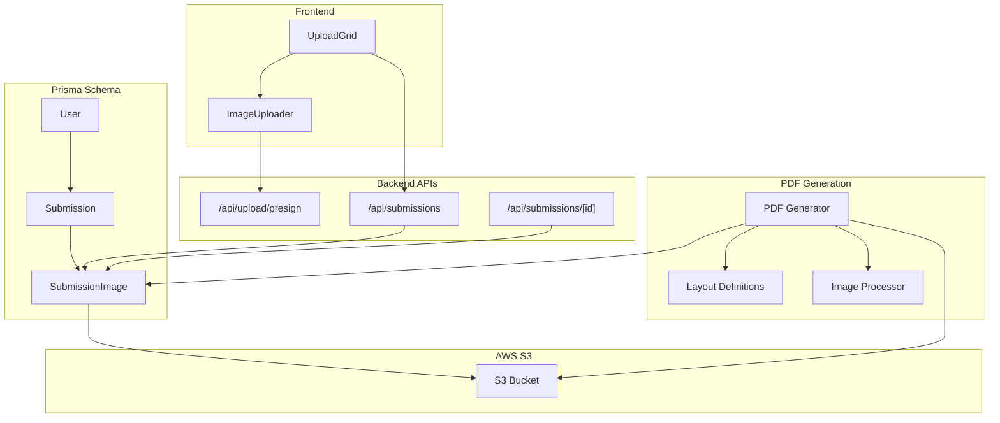
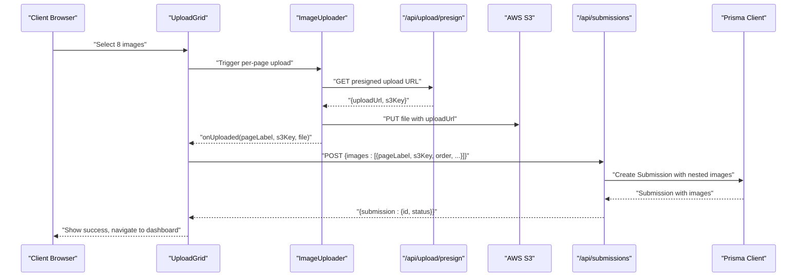
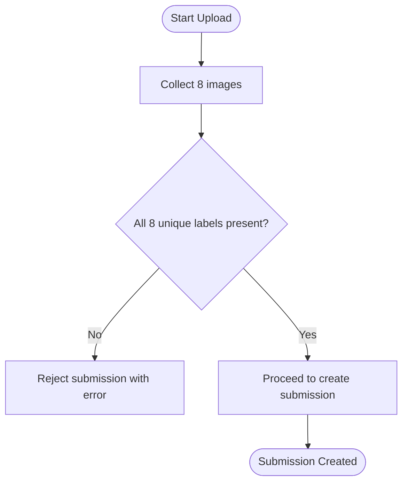
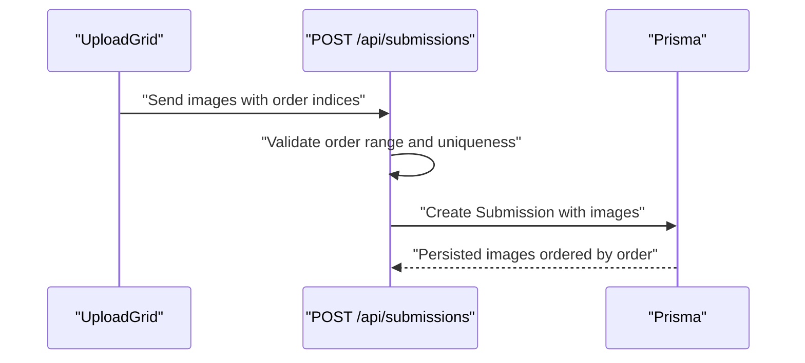
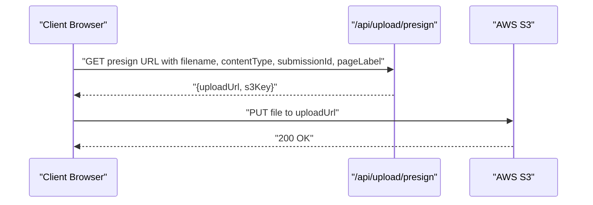
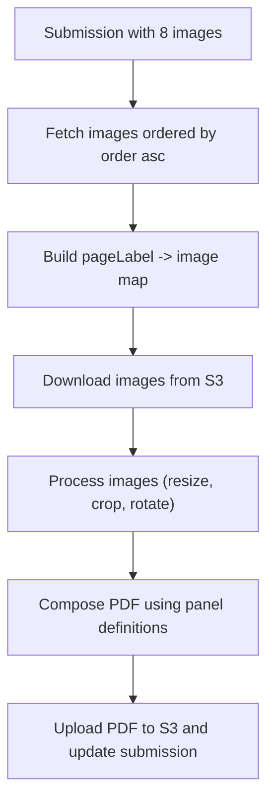
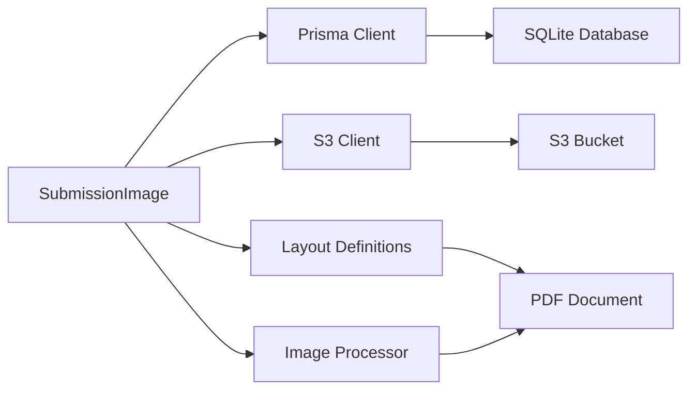

# SubmissionImage Model

<cite>
**Referenced Files in This Document**
- [schema.prisma](file://prisma/schema.prisma)
- [migration.sql](file://prisma/migrations/20260316171130_init/migration.sql)
- [prisma.ts](file://src/lib/prisma.ts)
- [constants.ts](file://src/lib/constants.ts)
- [s3.ts](file://src/lib/s3.ts)
- [presign.route.ts](file://src/app/api/upload/presign/route.ts)
- [submissions.route.ts](file://src/app/api/submissions/route.ts)
- [submissions.id.route.ts](file://src/app/api/submissions/[id]/route.ts)
- [upload.grid.tsx](file://src/components/create/UploadGrid.tsx)
- [image.uploader.tsx](file://src/components/create/ImageUploader.tsx)
- [generate.pdf.ts](file://src/lib/pdf/generate.ts)
- [layout.ts](file://src/lib/pdf/layout.ts)
- [image-processor.ts](file://src/lib/pdf/image-processor.ts)
</cite>

## Table of Contents
1. [Introduction](#introduction)
2. [Project Structure](#project-structure)
3. [Core Components](#core-components)
4. [Architecture Overview](#architecture-overview)
5. [Detailed Component Analysis](#detailed-component-analysis)
6. [Dependency Analysis](#dependency-analysis)
7. [Performance Considerations](#performance-considerations)
8. [Troubleshooting Guide](#troubleshooting-guide)
9. [Conclusion](#conclusion)

## Introduction
This document provides comprehensive documentation for the SubmissionImage model that manages individual page images in Titchybook Creator. It explains the entity structure, relationships with the Submission model, page labeling system for booklet layout, image ordering mechanism, S3 integration for cloud storage, validation rules, indexing strategies, and the complete image upload and PDF generation workflow. It also covers the cascade deletion behavior that ensures automatic cleanup when a parent submission is removed.

## Project Structure
The SubmissionImage model is defined in the Prisma schema and backed by a SQLite database. The application integrates with AWS S3 for secure, presigned uploads and downloads. Frontend components orchestrate the upload experience, while backend APIs validate inputs, persist records, and trigger asynchronous PDF generation.



**Diagram sources**
- [schema.prisma:35-47](file://prisma/schema.prisma#L35-L47)
- [presign.route.ts:1-38](file://src/app/api/upload/presign/route.ts#L1-L38)
- [submissions.route.ts:1-96](file://src/app/api/submissions/route.ts#L1-L96)
- [submissions.id.route.ts:1-37](file://src/app/api/submissions/[id]/route.ts#L1-L37)
- [s3.ts:1-81](file://src/lib/s3.ts#L1-L81)
- [generate.pdf.ts:1-112](file://src/lib/pdf/generate.ts#L1-L112)
- [layout.ts:1-105](file://src/lib/pdf/layout.ts#L1-L105)
- [image-processor.ts:1-30](file://src/lib/pdf/image-processor.ts#L1-L30)

**Section sources**
- [schema.prisma:1-48](file://prisma/schema.prisma#L1-L48)
- [migration.sql:1-45](file://prisma/migrations/20260316171130_init/migration.sql#L1-L45)

## Core Components
SubmissionImage is a Prisma model representing a single page image within a submission. It maintains metadata for S3 storage, ordering, and labeling to support the booklet layout.

- Identity and timestamps
  - id: String, @id, @default(cuid())
  - createdAt: DateTime, @default(now())
- Relationship
  - submissionId: String
  - submission: Submission relation with onDelete: Cascade
- Content metadata
  - pageLabel: String (validated via enum)
  - s3Key: String (S3 object key)
  - order: Int (0–7)
  - originalFilename: String
  - mimeType: String

Field validation rules enforced by the API:
- pageLabel: Enumerated value from PAGE_LABELS
- s3Key: Non-empty string
- order: Integer between 0 and 7 inclusive
- originalFilename: Non-empty string
- mimeType: Non-empty string

Indexing strategies:
- SubmissionImage.submissionId: Indexed for efficient joins and cascading deletes
- Submission.userId: Indexed for user-scoped queries

Cascade deletion:
- When a Submission is deleted, all associated SubmissionImage records are automatically removed due to onDelete: Cascade.

**Section sources**
- [schema.prisma:35-47](file://prisma/schema.prisma#L35-L47)
- [migration.sql:24-35](file://prisma/migrations/20260316171130_init/migration.sql#L24-L35)
- [submissions.route.ts:8-18](file://src/app/api/submissions/route.ts#L8-L18)
- [constants.ts:18-27](file://src/lib/constants.ts#L18-L27)

## Architecture Overview
The SubmissionImage model participates in a multi-tier architecture:
- Frontend upload components collect images and prepare structured payloads
- Backend APIs validate and persist SubmissionImage records
- S3 handles secure, presigned uploads and downloads
- PDF generator composes images into a booklet layout and stores the PDF in S3
- Prisma manages relationships and cascade deletion



**Diagram sources**
- [upload.grid.tsx:16-115](file://src/components/create/UploadGrid.tsx#L16-L115)
- [image.uploader.tsx:12-148](file://src/components/create/ImageUploader.tsx#L12-L148)
- [presign.route.ts:6-37](file://src/app/api/upload/presign/route.ts#L6-L37)
- [submissions.route.ts:35-95](file://src/app/api/submissions/route.ts#L35-L95)
- [prisma.ts:1-10](file://src/lib/prisma.ts#L1-L10)

## Detailed Component Analysis

### SubmissionImage Entity Definition
SubmissionImage encapsulates a single page image with strict validation and clear relationships.

```mermaid
classDiagram
class SubmissionImage {
+string id
+string submissionId
+string pageLabel
+string s3Key
+number order
+string originalFilename
+string mimeType
+datetime createdAt
}
class Submission {
+string id
+string userId
+string status
+string? pdfS3Key
+string? rejectionReason
+datetime createdAt
+datetime updatedAt
}
SubmissionImage --> Submission : "belongsTo<br/>onDelete : Cascade"
```

**Diagram sources**
- [schema.prisma:35-47](file://prisma/schema.prisma#L35-L47)
- [schema.prisma:21-33](file://prisma/schema.prisma#L21-L33)

**Section sources**
- [schema.prisma:35-47](file://prisma/schema.prisma#L35-L47)
- [migration.sql:24-35](file://prisma/migrations/20260316171130_init/migration.sql#L24-L35)

### Page Labeling System for Booklet Layout
The page labeling system defines the exact sequence and orientation for booklet composition. Eight distinct labels are required, each mapped to a specific panel in the final layout.

- Page labels: FRONT_COVER, BACK_COVER, PAGE_2, PAGE_3, PAGE_4, PAGE_5, PAGE_6, PAGE_7
- Display labels: Human-readable names for UI
- Validation: API enforces presence of all eight unique labels during submission creation



**Diagram sources**
- [constants.ts:18-40](file://src/lib/constants.ts#L18-L40)
- [submissions.route.ts:54-61](file://src/app/api/submissions/route.ts#L54-L61)

**Section sources**
- [constants.ts:18-40](file://src/lib/constants.ts#L18-L40)
- [submissions.route.ts:8-18](file://src/app/api/submissions/route.ts#L8-L18)

### Image Ordering Mechanism
Images are ordered using an integer index ranging from 0 to 7. The frontend constructs the ordered array based on the label sequence, ensuring deterministic placement during PDF generation.

- Ordering range: 0 ≤ order ≤ 7
- API validation: Enforced via Zod schema
- Retrieval: Submission includes images ordered by order ascending



**Diagram sources**
- [upload.grid.tsx:42-76](file://src/components/create/UploadGrid.tsx#L42-L76)
- [submissions.route.ts:10-14](file://src/app/api/submissions/route.ts#L10-L14)
- [submissions.id.route.ts:17-20](file://src/app/api/submissions/[id]/route.ts#L17-L20)

**Section sources**
- [upload.grid.tsx:47-56](file://src/components/create/UploadGrid.tsx#L47-L56)
- [submissions.route.ts:10-14](file://src/app/api/submissions/route.ts#L10-L14)
- [submissions.id.route.ts:17-20](file://src/app/api/submissions/[id]/route.ts#L17-L20)

### S3 Integration for Cloud Storage
S3 integration uses presigned URLs for secure uploads and downloads. Keys are constructed with user and submission identifiers to ensure isolation and organization.

- Presigned upload URL generation: Expires in 10 minutes
- Presigned download URL generation: Expires in 1 hour
- Upload key construction: uploads/{userId}/{submissionId}/{pageLabel}.{ext}
- PDF key construction: pdfs/{userId}/{submissionId}/titchybook.pdf



**Diagram sources**
- [presign.route.ts:6-37](file://src/app/api/upload/presign/route.ts#L6-L37)
- [s3.ts:18-36](file://src/lib/s3.ts#L18-L36)
- [s3.ts:66-80](file://src/lib/s3.ts#L66-L80)

**Section sources**
- [presign.route.ts:6-37](file://src/app/api/upload/presign/route.ts#L6-L37)
- [s3.ts:18-36](file://src/lib/s3.ts#L18-L36)
- [s3.ts:66-80](file://src/lib/s3.ts#L66-L80)

### Field Validation Rules
Validation occurs at the API boundary to ensure data integrity before persistence.

- pageLabel: Must be one of the predefined PAGE_LABELS
- s3Key: Required, non-empty string
- order: Integer, min 0, max 7
- originalFilename: Required, non-empty string
- mimeType: Required, non-empty string

Additionally, the API verifies that exactly eight unique page labels are provided during submission creation.

**Section sources**
- [submissions.route.ts:8-18](file://src/app/api/submissions/route.ts#L8-L18)
- [submissions.route.ts:54-61](file://src/app/api/submissions/route.ts#L54-L61)

### Indexing Strategies
Indexes improve query performance and enable efficient cascading operations.

- SubmissionImage.submissionId: Indexed to accelerate joins and cascade deletions
- Submission.userId: Indexed to filter submissions by user efficiently

These indexes are defined in both the Prisma schema and the initial migration.

**Section sources**
- [schema.prisma:46](file://prisma/schema.prisma#L46)
- [schema.prisma:32](file://prisma/schema.prisma#L32)
- [migration.sql:43-44](file://prisma/migrations/20260316171130_init/migration.sql#L43-L44)

### Relationships with Submission Model
SubmissionImage belongs to Submission via submissionId. The relationship enforces referential integrity and enables cascade deletion.

- Foreign key constraint: SubmissionImage.submissionId → Submission.id
- Cascade delete: onDelete: Cascade ensures automatic cleanup
- Reverse relation: Submission.images contains all associated images

**Section sources**
- [schema.prisma:38](file://prisma/schema.prisma#L38)
- [migration.sql:34](file://prisma/migrations/20260316171130_init/migration.sql#L34)

### Examples of Image Upload Workflows
- Single-page upload flow: Drag-and-drop or file selection triggers presigned upload, followed by callback to update local state
- Multi-page upload flow: Grid collects eight uploads, constructs ordered payload, and submits to create a submission
- Error handling: Client-side validation (file type and size) and server-side validation (Zod schema) ensure robustness

**Section sources**
- [image.uploader.tsx:22-73](file://src/components/create/ImageUploader.tsx#L22-L73)
- [upload.grid.tsx:24-76](file://src/components/create/UploadGrid.tsx#L24-L76)
- [presign.route.ts:6-37](file://src/app/api/upload/presign/route.ts#L6-L37)

### Ordering Systems and Booklet Page Arrangement Patterns
- Ordering system: Each image has an order index (0–7) determining its position in the final booklet
- Booklet arrangement: The PDF generator composes images according to predefined panel definitions, mapping pageLabel to panel coordinates and rotations
- Layout specification: Panels define x, y, width, height, and rotation for each label, ensuring precise placement



**Diagram sources**
- [submissions.id.route.ts:17-20](file://src/app/api/submissions/[id]/route.ts#L17-L20)
- [generate.pdf.ts:23-111](file://src/lib/pdf/generate.ts#L23-L111)
- [layout.ts:29-104](file://src/lib/pdf/layout.ts#L29-L104)
- [image-processor.ts:9-29](file://src/lib/pdf/image-processor.ts#L9-L29)

**Section sources**
- [layout.ts:29-104](file://src/lib/pdf/layout.ts#L29-L104)
- [generate.pdf.ts:23-111](file://src/lib/pdf/generate.ts#L23-L111)

## Dependency Analysis
SubmissionImage depends on several layers: Prisma for persistence, AWS S3 for storage, and PDF generation for downstream processing.



**Diagram sources**
- [prisma.ts:1-10](file://src/lib/prisma.ts#L1-L10)
- [s3.ts:1-81](file://src/lib/s3.ts#L1-L81)
- [generate.pdf.ts:1-112](file://src/lib/pdf/generate.ts#L1-L112)
- [layout.ts:1-105](file://src/lib/pdf/layout.ts#L1-L105)
- [image-processor.ts:1-30](file://src/lib/pdf/image-processor.ts#L1-L30)

**Section sources**
- [prisma.ts:1-10](file://src/lib/prisma.ts#L1-L10)
- [s3.ts:1-81](file://src/lib/s3.ts#L1-L81)
- [generate.pdf.ts:1-112](file://src/lib/pdf/generate.ts#L1-L112)

## Performance Considerations
- Asynchronous PDF generation: The system starts PDF generation in the background after submission creation to avoid blocking the API response
- Parallel processing: Image downloads and processing are performed concurrently to reduce latency
- Index usage: Proper indexing on foreign keys improves join performance and cascade operations
- Presigned URLs: Offloads upload bandwidth to S3 and reduces server load

[No sources needed since this section provides general guidance]

## Troubleshooting Guide
Common issues and resolutions:
- Unauthorized or missing parameters in presigned URL endpoint
  - Ensure filename, contentType, submissionId, and pageLabel are provided and valid
- Invalid file type during upload
  - Only JPG, PNG, and WebP are accepted
- Missing required page labels during submission
  - Exactly eight unique labels must be provided
- Cascade deletion not working
  - Verify foreign key constraint and index on submissionId

**Section sources**
- [presign.route.ts:18-30](file://src/app/api/upload/presign/route.ts#L18-L30)
- [submissions.route.ts:54-61](file://src/app/api/submissions/route.ts#L54-L61)
- [migration.sql:34](file://prisma/migrations/20260316171130_init/migration.sql#L34)

## Conclusion
The SubmissionImage model is central to Titchybook Creator’s image management and booklet production pipeline. Its design emphasizes strong validation, clear relationships, and efficient indexing. The integration with AWS S3 and the PDF generation workflow ensures scalable, high-quality output. The cascade deletion behavior guarantees data consistency when submissions are removed.