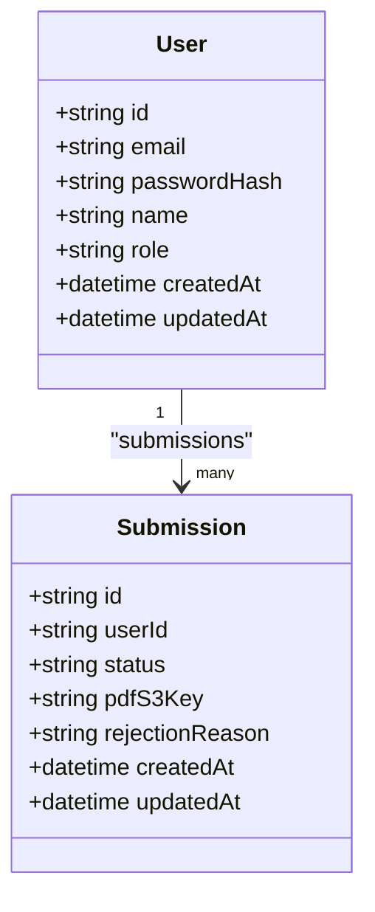
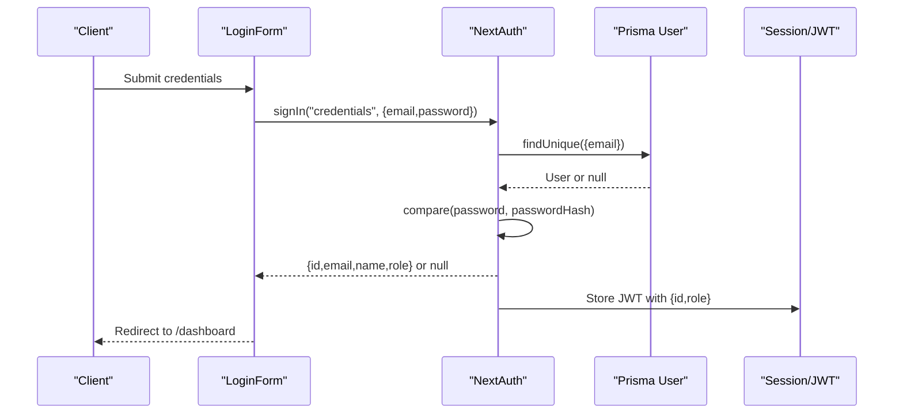
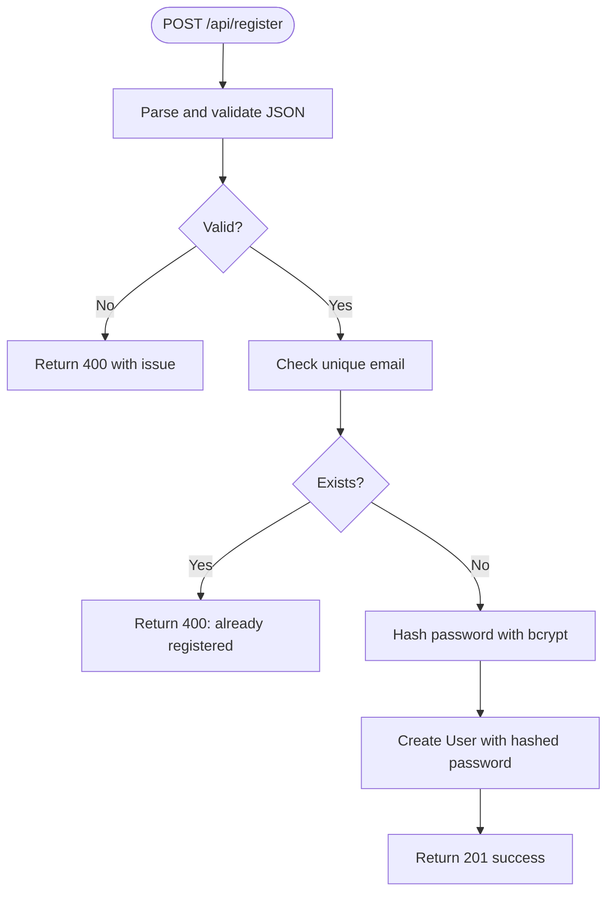
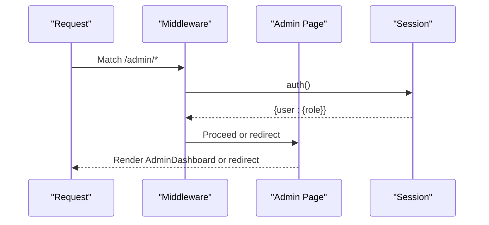
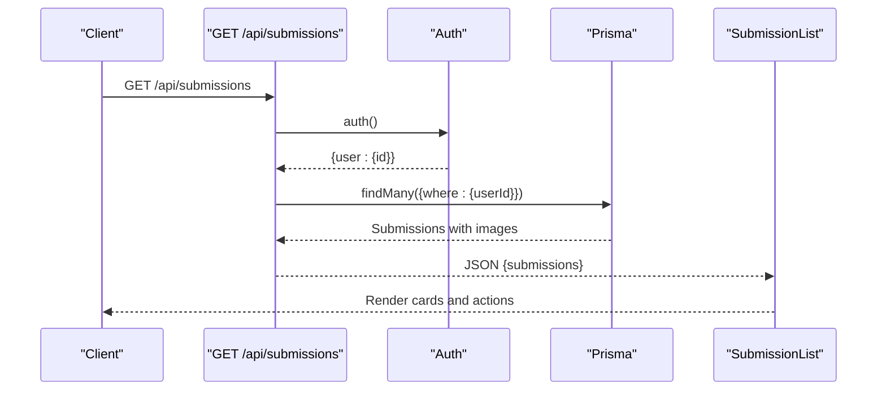

# User Model

<cite>
**Referenced Files in This Document**
- [schema.prisma](file://prisma/schema.prisma)
- [prisma.ts](file://src/lib/prisma.ts)
- [auth.ts](file://src/auth.ts)
- [route.ts](file://src/app/api/register/route.ts)
- [LoginForm.tsx](file://src/components/auth/LoginForm.tsx)
- [RegisterForm.tsx](file://src/components/auth/RegisterForm.tsx)
- [middleware.ts](file://src/middleware.ts)
- [page.tsx](file://src/app/(admin)/admin/page.tsx)
- [route.ts](file://src/app/api/submissions/route.ts)
- [SubmissionList.tsx](file://src/components/submissions/SubmissionList.tsx)
- [constants.ts](file://src/lib/constants.ts)
</cite>

## Table of Contents
1. [Introduction](#introduction)
2. [Project Structure](#project-structure)
3. [Core Components](#core-components)
4. [Architecture Overview](#architecture-overview)
5. [Detailed Component Analysis](#detailed-component-analysis)
6. [Dependency Analysis](#dependency-analysis)
7. [Performance Considerations](#performance-considerations)
8. [Troubleshooting Guide](#troubleshooting-guide)
9. [Conclusion](#conclusion)

## Introduction
This document provides comprehensive documentation for the User model in Titchybook Creator’s database. It explains the entity structure, field constraints, defaults, and indexes; describes authentication and session management via NextAuth; documents the relationship with the Submission model; and outlines role-based access patterns. Security considerations for password hashing and session storage are addressed, along with practical examples for user creation, authentication workflows, and role-based access checks.

## Project Structure
The User model is defined in the Prisma schema and is used across the application for authentication, authorization, and data relations. Supporting components include:
- Prisma client initialization
- NextAuth configuration for credentials-based authentication and JWT sessions
- Registration API endpoint with Zod validation and bcrypt password hashing
- Login and registration UI components
- Middleware enforcing protected routes
- Admin route gated by role
- Submission APIs and UI that consume user context

```mermaid
graph TB
subgraph "Prisma Schema"
U["User model<br/>id, email, passwordHash, name, role, createdAt, updatedAt"]
S["Submission model<br/>userId, status, images[], createdAt, updatedAt"]
end
subgraph "Runtime"
PC["Prisma Client"]
NA["NextAuth"]
REG["/api/register"]
SUB["/api/submissions"]
MW["Middleware"]
ADM["Admin Route"]
end
U --> S
PC <- --> U
PC <- --> S
NA --> PC
REG --> PC
SUB --> PC
MW --> NA
ADM --> NA
```

**Diagram sources**
- [schema.prisma:10-33](file://prisma/schema.prisma#L10-L33)
- [prisma.ts:1-10](file://src/lib/prisma.ts#L1-L10)
- [auth.ts:27-79](file://src/auth.ts#L27-L79)
- [route.ts:12-46](file://src/app/api/register/route.ts#L12-L46)
- [route.ts:20-95](file://src/app/api/submissions/route.ts#L20-L95)
- [middleware.ts:1-6](file://src/middleware.ts#L1-L6)
- [page.tsx:5-12](file://src/app/(admin)/admin/page.tsx#L5-L12)

**Section sources**
- [schema.prisma:10-33](file://prisma/schema.prisma#L10-L33)
- [prisma.ts:1-10](file://src/lib/prisma.ts#L1-L10)
- [auth.ts:27-79](file://src/auth.ts#L27-L79)
- [route.ts:12-46](file://src/app/api/register/route.ts#L12-L46)
- [route.ts:20-95](file://src/app/api/submissions/route.ts#L20-L95)
- [middleware.ts:1-6](file://src/middleware.ts#L1-L6)
- [page.tsx:5-12](file://src/app/(admin)/admin/page.tsx#L5-L12)

## Core Components
- User model fields and constraints
  - id: String, @id, @default(cuid())
  - email: String, @unique
  - passwordHash: String
  - name: String? (nullable)
  - role: String, @default("USER")
  - createdAt: DateTime, @default(now())
  - updatedAt: DateTime, @updatedAt
  - submissions: Relation to Submission[]
- Submission model (relevant for relationship)
  - userId: String (foreign key)
  - user: Relation to User
  - status: String, @default("PENDING")
  - pdfS3Key: String?
  - rejectionReason: String?
  - images: Relation to SubmissionImage[]
  - createdAt: DateTime, @default(now())
  - updatedAt: DateTime, @updatedAt
  - Index: [userId]
- Prisma client initialization
  - Singleton PrismaClient with global leak protection
- Authentication and session
  - NextAuth with Credentials provider and JWT strategy
  - Role propagated in JWT and session
- Registration API
  - Zod validation for name, email, password
  - bcrypt hashing with salt rounds
  - Unique email enforcement
- Middleware and admin gating
  - Matcher for protected routes
  - Admin route requires role === "ADMIN"

**Section sources**
- [schema.prisma:10-33](file://prisma/schema.prisma#L10-L33)
- [prisma.ts:1-10](file://src/lib/prisma.ts#L1-L10)
- [auth.ts:27-79](file://src/auth.ts#L27-L79)
- [route.ts:12-46](file://src/app/api/register/route.ts#L12-L46)
- [middleware.ts:1-6](file://src/middleware.ts#L1-L6)
- [page.tsx:5-12](file://src/app/(admin)/admin/page.tsx#L5-L12)

## Architecture Overview
The User model integrates with Prisma ORM, NextAuth for authentication, and route handlers for registration and submissions. The Submission model maintains a foreign key relationship to User via userId, enabling per-user submission queries and management.



**Diagram sources**
- [schema.prisma:10-33](file://prisma/schema.prisma#L10-L33)

**Section sources**
- [schema.prisma:10-33](file://prisma/schema.prisma#L10-L33)

## Detailed Component Analysis

### User Model Definition and Constraints
- Identity and uniqueness
  - id: cuid() primary key
  - email: unique index enforced at DB level
- Security and defaults
  - passwordHash: stores bcrypt-hashed passwords
  - role: defaults to "USER"; ADMIN role enforced at route level
  - timestamps: createdAt defaults to now(); updatedAt auto-updated
- Relationship
  - One-to-many with Submission via submissions[]
- Indexing
  - Implicit unique index on email
  - Explicit index on Submission.userId for efficient joins

**Section sources**
- [schema.prisma:10-19](file://prisma/schema.prisma#L10-L19)
- [schema.prisma:21-33](file://prisma/schema.prisma#L21-L33)

### Authentication and Session Management
- Provider and strategy
  - Credentials provider validates email/password against stored hash
  - Session strategy: JWT
- Token and session propagation
  - JWT payload includes id and role
  - Session response includes id and role
- Pages and callbacks
  - Redirects to /login on sign-in page
  - JWT and session callbacks attach role and id



**Diagram sources**
- [LoginForm.tsx:14-33](file://src/components/auth/LoginForm.tsx#L14-L33)
- [auth.ts:27-79](file://src/auth.ts#L27-L79)
- [route.ts:43-57](file://src/app/api/register/route.ts#L43-L57)

**Section sources**
- [auth.ts:27-79](file://src/auth.ts#L27-L79)
- [LoginForm.tsx:14-33](file://src/components/auth/LoginForm.tsx#L14-L33)

### User Registration Workflow
- Validation
  - Zod schema enforces name, email format, and minimum password length
- Uniqueness and hashing
  - Checks for existing email; rejects duplicates
  - Hashes password using bcrypt with configured salt rounds
- Persistence
  - Creates User record with hashed password
- Response
  - Returns success on creation; otherwise returns appropriate errors



**Diagram sources**
- [route.ts:12-46](file://src/app/api/register/route.ts#L12-L46)

**Section sources**
- [route.ts:12-46](file://src/app/api/register/route.ts#L12-L46)

### Role-Based Access Patterns
- Middleware
  - Protects routes under /dashboard, /create, and /admin
- Admin route
  - Requires session with role === "ADMIN"
  - Otherwise redirects to /dashboard



**Diagram sources**
- [middleware.ts:1-6](file://src/middleware.ts#L1-L6)
- [page.tsx:5-12](file://src/app/(admin)/admin/page.tsx#L5-L12)

**Section sources**
- [middleware.ts:1-6](file://src/middleware.ts#L1-L6)
- [page.tsx:5-12](file://src/app/(admin)/admin/page.tsx#L5-L12)

### User Profile Management and Submissions
- Retrieving user submissions
  - API filters submissions by current user id
  - Includes associated images ordered by position
- UI rendering
  - Submission list displays status badges, creation date, and actions
  - Provides download links for approved PDFs and re-upload for rejected ones



**Diagram sources**
- [route.ts:20-33](file://src/app/api/submissions/route.ts#L20-L33)
- [SubmissionList.tsx:15-60](file://src/components/submissions/SubmissionList.tsx#L15-L60)

**Section sources**
- [route.ts:20-33](file://src/app/api/submissions/route.ts#L20-L33)
- [SubmissionList.tsx:15-60](file://src/components/submissions/SubmissionList.tsx#L15-L60)

## Dependency Analysis
- Prisma client
  - Used by NextAuth for user lookup during sign-in
  - Used by registration API for uniqueness and persistence
  - Used by submissions API for querying user-owned records
- NextAuth
  - Depends on Prisma adapter (via generated client)
  - Propagates role and id in JWT/session
- Middleware
  - Wraps application to enforce protected routes
- Admin route
  - Enforces role-based access using session data

```mermaid
graph LR
PRIS["Prisma Client"] <- --> AUTH["NextAuth"]
PRIS <- --> REG["/api/register"]
PRIS <- --> SUBAPI["/api/submissions"]
AUTH --> MW["Middleware"]
MW --> ADMIN["/admin/*"]
```

**Diagram sources**
- [prisma.ts:1-10](file://src/lib/prisma.ts#L1-L10)
- [auth.ts:27-79](file://src/auth.ts#L27-L79)
- [route.ts:12-46](file://src/app/api/register/route.ts#L12-L46)
- [route.ts:20-95](file://src/app/api/submissions/route.ts#L20-L95)
- [middleware.ts:1-6](file://src/middleware.ts#L1-L6)
- [page.tsx:5-12](file://src/app/(admin)/admin/page.tsx#L5-L12)

**Section sources**
- [prisma.ts:1-10](file://src/lib/prisma.ts#L1-L10)
- [auth.ts:27-79](file://src/auth.ts#L27-L79)
- [route.ts:12-46](file://src/app/api/register/route.ts#L12-L46)
- [route.ts:20-95](file://src/app/api/submissions/route.ts#L20-L95)
- [middleware.ts:1-6](file://src/middleware.ts#L1-L6)
- [page.tsx:5-12](file://src/app/(admin)/admin/page.tsx#L5-L12)

## Performance Considerations
- Indexing
  - Unique index on User.email ensures fast lookups and prevents duplicates
  - Index on Submission.userId supports efficient per-user queries
- Hashing cost
  - bcrypt salt rounds are configured in the registration handler; adjust based on target verification latency and server capacity
- Query patterns
  - Prefer filtering by userId in submission queries to limit result sets
  - Use include with ordering to minimize client-side sorting
- Background tasks
  - PDF generation is initiated asynchronously to avoid blocking submission creation

[No sources needed since this section provides general guidance]

## Troubleshooting Guide
- Authentication failures
  - Ensure email exists and password matches stored hash
  - Confirm NextAuth callbacks are attaching id and role to JWT/session
- Registration errors
  - Validate input against Zod schema (name, email, password length)
  - Check for duplicate email before attempting creation
- Role access denied
  - Verify session contains role and value is "ADMIN" for admin route
  - Confirm middleware matcher includes intended paths
- Submission retrieval unauthorized
  - Ensure session carries a valid user id
  - Confirm API filters by userId

**Section sources**
- [auth.ts:27-79](file://src/auth.ts#L27-L79)
- [route.ts:12-46](file://src/app/api/register/route.ts#L12-L46)
- [page.tsx:5-12](file://src/app/(admin)/admin/page.tsx#L5-L12)
- [route.ts:20-33](file://src/app/api/submissions/route.ts#L20-L33)

## Conclusion
The User model in Titchybook Creator is designed with clear constraints, defaults, and indexes to support secure and efficient operations. Authentication leverages NextAuth with JWT sessions, while registration enforces validation and secure password hashing. Role-based access is enforced at the route level, and the Submission model’s foreign key relationship enables robust per-user workflows. Together, these components form a cohesive foundation for user management, authentication, and content submission.