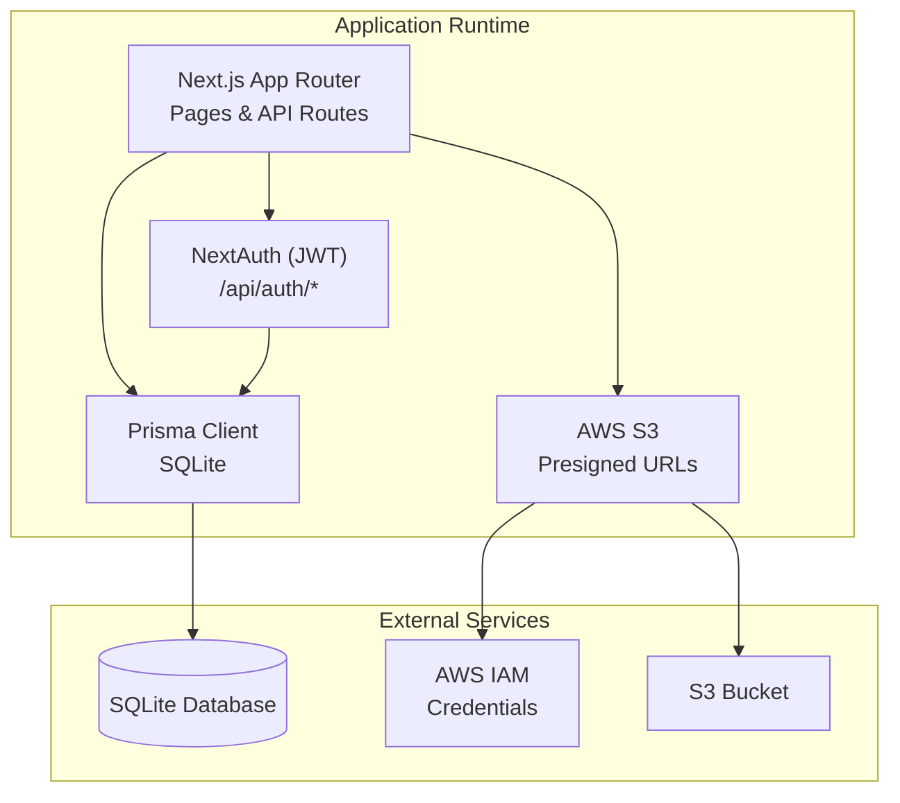
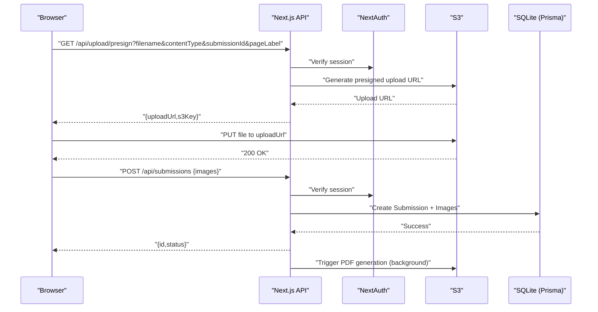
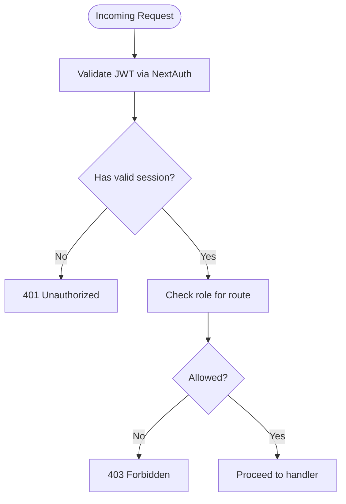
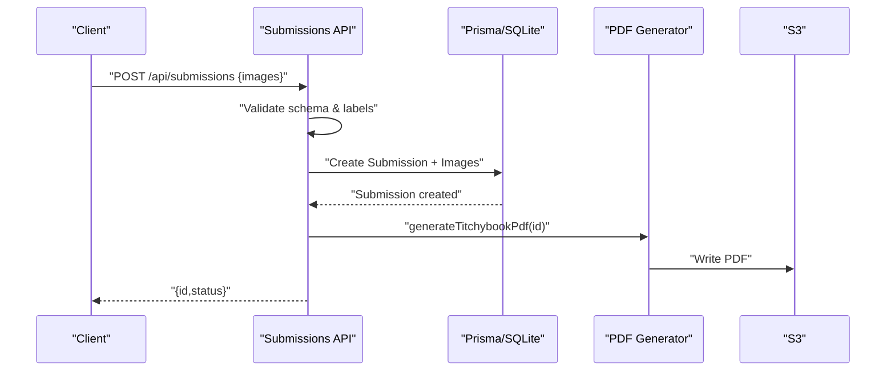
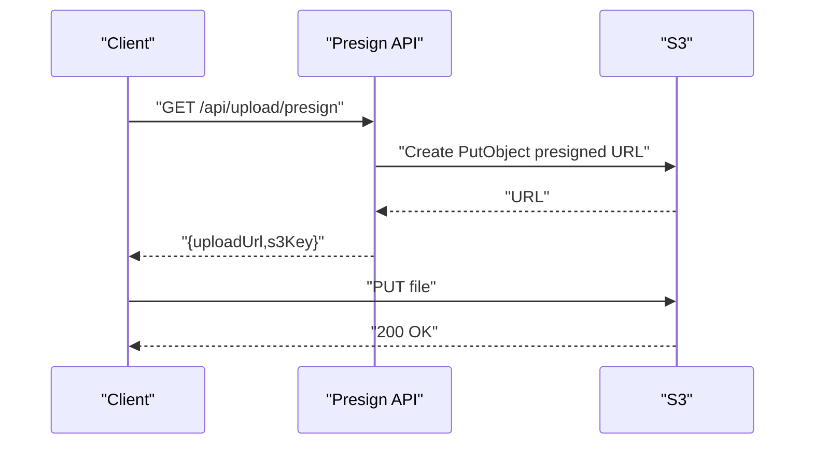
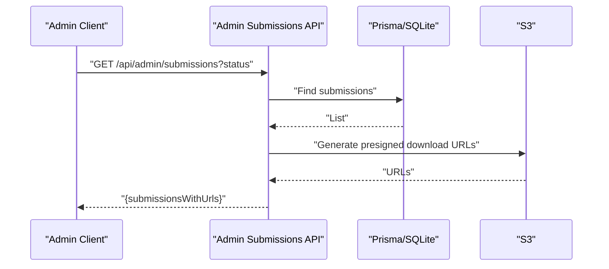
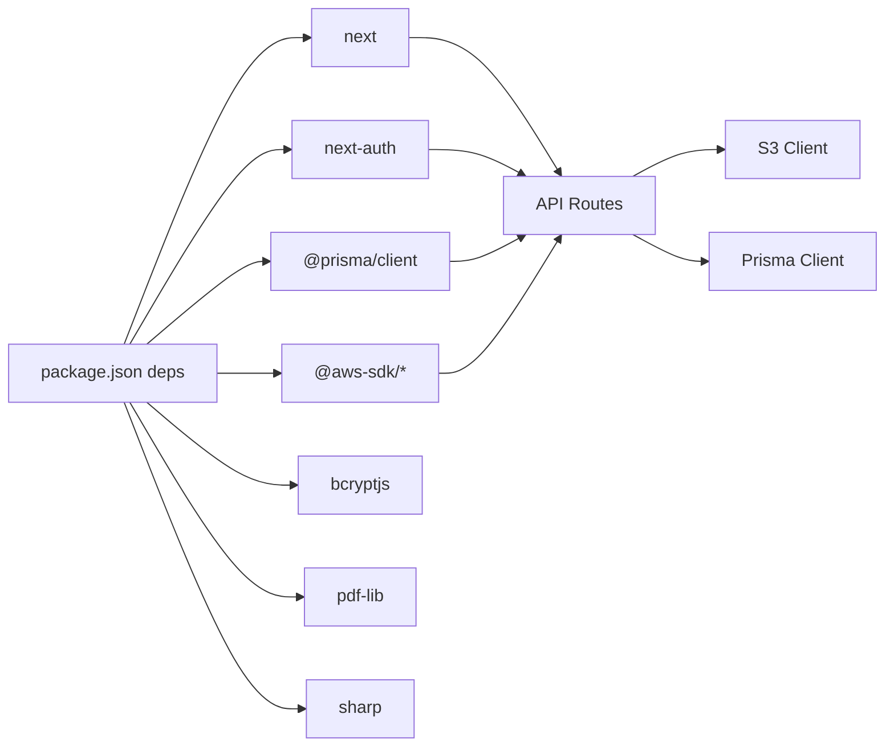

# Deployment & Operations

<cite>
**Referenced Files in This Document**
- [package.json](file://package.json)
- [README.md](file://README.md)
- [next.config.ts](file://next.config.ts)
- [src/lib/prisma.ts](file://src/lib/prisma.ts)
- [prisma/schema.prisma](file://prisma/schema.prisma)
- [prisma/migrations/20260316171130_init/migration.sql](file://prisma/migrations/20260316171130_init/migration.sql)
- [src/lib/s3.ts](file://src/lib/s3.ts)
- [src/auth.ts](file://src/auth.ts)
- [src/middleware.ts](file://src/middleware.ts)
- [src/app/api/admin/submissions/route.ts](file://src/app/api/admin/submissions/route.ts)
- [src/app/api/upload/presign/route.ts](file://src/app/api/upload/presign/route.ts)
- [src/app/api/submissions/[id]/route.ts](file://src/app/api/submissions/[id]/route.ts)
- [src/app/api/submissions/route.ts](file://src/app/api/submissions/route.ts)
- [src/app/api/auth/[...nextauth]/route.ts](file://src/app/api/auth/[...nextauth]/route.ts)
- [src/components/create/ImageUploader.tsx](file://src/components/create/ImageUploader.tsx)
- [src/components/create/UploadGrid.tsx](file://src/components/create/UploadGrid.tsx)
- [prisma/seed.ts](file://prisma/seed.ts)
</cite>

## Table of Contents
1. [Introduction](#introduction)
2. [Project Structure](#project-structure)
3. [Core Components](#core-components)
4. [Architecture Overview](#architecture-overview)
5. [Detailed Component Analysis](#detailed-component-analysis)
6. [Dependency Analysis](#dependency-analysis)
7. [Performance Considerations](#performance-considerations)
8. [Monitoring & Observability](#monitoring--observability)
9. [Backup & Disaster Recovery](#backup--disaster-recovery)
10. [Scaling & Load Balancing](#scaling--load-balancing)
11. [Security Operations](#security-operations)
12. [Environment Configuration](#environment-configuration)
13. [Deployment Strategies](#deployment-strategies)
14. [Troubleshooting Guide](#troubleshooting-guide)
15. [Maintenance Procedures](#maintenance-procedures)
16. [Conclusion](#conclusion)

## Introduction
This document provides comprehensive deployment and operations guidance for Titchybook Creator. It covers production deployment strategies across Vercel, AWS, and other platforms; environment configuration for secrets, database, and cloud services; monitoring and logging; backup and disaster recovery; scaling and performance optimization; security and compliance; troubleshooting; and operational runbooks.

## Project Structure
Titchybook Creator is a Next.js 16 application with an API-driven architecture:
- Frontend pages under src/app
- API routes under src/app/api
- Authentication via NextAuth (JWT)
- Database via Prisma with SQLite
- File storage via AWS S3 with signed URLs
- Middleware enforces protected routes

**Diagram sources**
- [src/app/api/auth/[...nextauth]/route.ts](file://src/app/api/auth/[...nextauth]/route.ts#L1-L4)
- [src/lib/prisma.ts:1-10](file://src/lib/prisma.ts#L1-L10)
- [prisma/schema.prisma:5-8](file://prisma/schema.prisma#L5-L8)
- [src/lib/s3.ts:1-81](file://src/lib/s3.ts#L1-L81)

**Section sources**
- [README.md:1-37](file://README.md#L1-L37)
- [next.config.ts:1-8](file://next.config.ts#L1-L8)

## Core Components
- Authentication and Authorization
  - NextAuth with JWT strategy and custom callbacks
  - Protected routes via middleware
- Data Access
  - Prisma Client connecting to SQLite
- Storage
  - S3 integration with presigned upload/download URLs
- API Surface
  - Submission management, admin views, and auth endpoints

**Section sources**
- [src/auth.ts:1-80](file://src/auth.ts#L1-L80)
- [src/middleware.ts:1-6](file://src/middleware.ts#L1-L6)
- [src/lib/prisma.ts:1-10](file://src/lib/prisma.ts#L1-L10)
- [src/lib/s3.ts:1-81](file://src/lib/s3.ts#L1-L81)
- [prisma/schema.prisma:1-48](file://prisma/schema.prisma#L1-L48)

## Architecture Overview
High-level runtime architecture:
- Client uploads images via presigned URLs to S3
- Backend validates and persists metadata to SQLite via Prisma
- Background PDF generation is triggered after submission
- Admins can review and download PDFs via presigned URLs

**Diagram sources**
- [src/app/api/upload/presign/route.ts:1-38](file://src/app/api/upload/presign/route.ts#L1-L38)
- [src/app/api/submissions/route.ts:1-96](file://src/app/api/submissions/route.ts#L1-L96)
- [src/lib/s3.ts:18-28](file://src/lib/s3.ts#L18-L28)
- [src/auth.ts:27-79](file://src/auth.ts#L27-L79)

## Detailed Component Analysis

### Authentication and Authorization
- NextAuth configuration with JWT strategy and credential provider
- Session and JWT callbacks enrich roles for access control
- Middleware protects protected routes

**Diagram sources**
- [src/middleware.ts:1-6](file://src/middleware.ts#L1-L6)
- [src/auth.ts:27-79](file://src/auth.ts#L27-L79)

**Section sources**
- [src/auth.ts:1-80](file://src/auth.ts#L1-L80)
- [src/middleware.ts:1-6](file://src/middleware.ts#L1-L6)
- [src/app/api/auth/[...nextauth]/route.ts](file://src/app/api/auth/[...nextauth]/route.ts#L1-L4)

### Submission Management API
- GET /api/submissions lists current user’s submissions
- POST /api/submissions validates and persists images, then triggers background PDF generation
- GET /api/submissions/[id] retrieves a single submission with optional presigned PDF URL

**Diagram sources**
- [src/app/api/submissions/route.ts:35-96](file://src/app/api/submissions/route.ts#L35-L96)
- [src/app/api/submissions/[id]/route.ts](file://src/app/api/submissions/[id]/route.ts#L1-L37)

**Section sources**
- [src/app/api/submissions/route.ts:1-96](file://src/app/api/submissions/route.ts#L1-L96)
- [src/app/api/submissions/[id]/route.ts](file://src/app/api/submissions/[id]/route.ts#L1-L37)

### Upload Workflow with Presigned URLs
- Client requests a presigned upload URL from /api/upload/presign
- Client uploads directly to S3
- Server records metadata and later generates a PDF

**Diagram sources**
- [src/app/api/upload/presign/route.ts:1-38](file://src/app/api/upload/presign/route.ts#L1-L38)
- [src/lib/s3.ts:18-28](file://src/lib/s3.ts#L18-L28)

**Section sources**
- [src/app/api/upload/presign/route.ts:1-38](file://src/app/api/upload/presign/route.ts#L1-L38)
- [src/components/create/ImageUploader.tsx:1-148](file://src/components/create/ImageUploader.tsx#L1-L148)
- [src/components/create/UploadGrid.tsx:1-115](file://src/components/create/UploadGrid.tsx#L1-L115)

### Admin Dashboard API
- GET /api/admin/submissions filters by status and returns presigned PDF download URLs for admin review

**Diagram sources**
- [src/app/api/admin/submissions/route.ts:1-38](file://src/app/api/admin/submissions/route.ts#L1-L38)
- [src/lib/s3.ts:30-36](file://src/lib/s3.ts#L30-L36)

**Section sources**
- [src/app/api/admin/submissions/route.ts:1-38](file://src/app/api/admin/submissions/route.ts#L1-L38)

## Dependency Analysis
- Application dependencies include Next.js, NextAuth, Prisma, AWS SDK, bcrypt, pdf-lib, and sharp
- Environment variables drive database URL, AWS credentials, and bucket name
- Middleware and API routes depend on NextAuth for session validation

**Diagram sources**
- [package.json:11-25](file://package.json#L11-L25)
- [src/lib/s3.ts:1-81](file://src/lib/s3.ts#L1-L81)
- [src/lib/prisma.ts:1-10](file://src/lib/prisma.ts#L1-L10)
- [src/auth.ts:1-80](file://src/auth.ts#L1-L80)

**Section sources**
- [package.json:1-43](file://package.json#L1-L43)

## Performance Considerations
- Asynchronous PDF generation avoids blocking API responses
- Image uploads use presigned URLs to reduce server bandwidth
- Middleware restricts protected routes to minimize unnecessary work
- Consider enabling Next.js static generation and ISR for read-heavy pages where appropriate

[No sources needed since this section provides general guidance]

## Monitoring & Observability
Recommended observability stack:
- Logs: Capture API logs, PDF generation errors, and authentication events
- Metrics: Track request latency, error rates, upload sizes, and PDF generation duration
- Tracing: Add distributed tracing for end-to-end request flows
- Health checks: Expose a lightweight health endpoint at /health

Implementation pointers:
- Use platform-native logging (e.g., Vercel logs, CloudWatch logs)
- Centralize logs with a SIEM or log aggregation service
- Instrument API routes for timing and error reporting
- Monitor S3 upload/download latencies and failure rates

[No sources needed since this section provides general guidance]

## Backup & Disaster Recovery
- Database backups
  - For SQLite in production, schedule regular filesystem snapshots or export SQL periodically
  - Consider migrating to a managed database for higher availability
- File storage backups
  - Enable S3 versioning and cross-region replication
  - Periodically audit bucket contents and maintain offsite copies
- Recovery testing
  - Practice restoring database and S3 buckets from backups
  - Validate end-to-end recovery for PDF generation and user uploads

[No sources needed since this section provides general guidance]

## Scaling & Load Balancing
- Horizontal scaling
  - Run multiple Next.js instances behind a load balancer
  - Ensure shared stateless design; rely on external services (S3, database)
- CDN and caching
  - Serve static assets via CDN; cache infrequent pages
- Background tasks
  - Offload PDF generation to workers or queues to avoid cold starts
- Auto-scaling
  - Configure CPU/memory-based autoscaling on your platform

[No sources needed since this section provides general guidance]

## Security Operations
- Secrets management
  - Store AWS credentials and database URL in secure environment variables
  - Rotate keys regularly; revoke compromised credentials immediately
- Network security
  - Restrict S3 bucket policies to least privilege
  - Enforce HTTPS and HSTS
- Vulnerability management
  - Pin dependency versions and monitor advisories
  - Scan container images and dependencies regularly
- Compliance
  - Align logging retention and data deletion with privacy regulations
  - Audit access to admin endpoints and S3 resources

[No sources needed since this section provides general guidance]

## Environment Configuration
Production environment variables:
- Database
  - DATABASE_URL: SQLite connection string
- AWS
  - AWS_REGION, AWS_ACCESS_KEY_ID, AWS_SECRET_ACCESS_KEY, S3_BUCKET_NAME
- Authentication
  - NEXTAUTH_SECRET: Strong random secret
  - NEXTAUTH_URL: Public base URL for NextAuth
- Application
  - NODE_ENV=production
  - Optional: NEXT_PUBLIC_APP_BASE_URL

Validation and defaults:
- S3 client construction requires all AWS variables
- Prisma connects via DATABASE_URL
- NextAuth requires NEXTAUTH_SECRET and NEXTAUTH_URL

**Section sources**
- [src/lib/s3.ts:8-14](file://src/lib/s3.ts#L8-L14)
- [prisma/schema.prisma:5-8](file://prisma/schema.prisma#L5-L8)
- [src/auth.ts:27-79](file://src/auth.ts#L27-L79)

## Deployment Strategies

### Vercel
- Build and runtime
  - Use Next.js build; deploy API routes and static assets
  - Configure environment variables in Vercel dashboard
- Static generation
  - Optimize read-heavy pages with ISR or static export
- Edge Functions
  - Consider moving lightweight logic to Edge Functions for lower latency

**Section sources**
- [README.md:32-36](file://README.md#L32-L36)
- [package.json:5-10](file://package.json#L5-L10)

### AWS (Elastic Beanstalk / ECS / Lambda)
- Elastic Beanstalk
  - Package application and deploy with environment variables
- ECS/Fargate
  - Containerize the app; manage secrets via AWS Systems Manager Parameter Store or Secrets Manager
- Lambda@Edge or API Gateway + Lambda
  - For API-only deployments; pair with RDS or managed database

[No sources needed since this section provides general guidance]

### Other Platforms
- Railway, Render, Fly.io, etc.
  - Follow platform-specific environment variable configuration
  - Ensure database connectivity and S3 access permissions

[No sources needed since this section provides general guidance]

## Troubleshooting Guide

Common issues and resolutions:
- Authentication failures
  - Verify NEXTAUTH_SECRET and NEXTAUTH_URL
  - Confirm session cookie domain/path and HTTPS
- Unauthorized or forbidden responses
  - Ensure user is logged in and has required role
  - Check middleware matcher and route protection
- Upload failures
  - Confirm AWS credentials and bucket permissions
  - Validate presigned URL parameters and expiration
- PDF generation errors
  - Inspect background job logs and S3 write permissions
- Database connectivity
  - Verify DATABASE_URL and Prisma migrations applied
- CORS and preflight
  - Configure CORS headers for API routes if needed

Operational runbooks:
- Incident response
  - Define escalation paths for auth, storage, and PDF generation failures
- Rollback procedure
  - Keep previous builds tagged; revert on persistent errors
- Postmortem process
  - Document root causes and remediation steps

**Section sources**
- [src/auth.ts:27-79](file://src/auth.ts#L27-L79)
- [src/middleware.ts:1-6](file://src/middleware.ts#L1-L6)
- [src/lib/s3.ts:8-14](file://src/lib/s3.ts#L8-L14)
- [src/app/api/upload/presign/route.ts:1-38](file://src/app/api/upload/presign/route.ts#L1-L38)
- [src/app/api/submissions/route.ts:35-96](file://src/app/api/submissions/route.ts#L35-L96)

## Maintenance Procedures
- Database migrations
  - Apply Prisma migrations before deploying
  - Back up database prior to migration
- Seed data
  - Use seed script to provision admin accounts
- Dependency updates
  - Test upgrades in staging; monitor logs and performance
- Rotation and auditing
  - Rotate secrets and review access logs quarterly

**Section sources**
- [prisma/migrations/20260316171130_init/migration.sql](file://prisma/migrations/20260316171130_init/migration.sql)
- [prisma/seed.ts:1-36](file://prisma/seed.ts#L1-L36)

## Conclusion
This guide outlines a production-ready deployment and operations model for Titchybook Creator. By securing environment variables, validating integrations, instrumenting observability, and establishing robust backup and scaling practices, teams can reliably deliver a high-quality image-to-PDF creation experience.