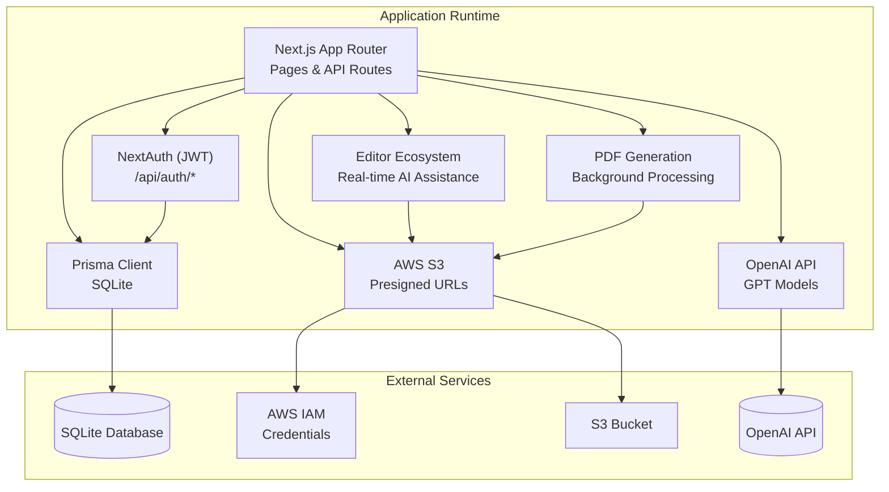
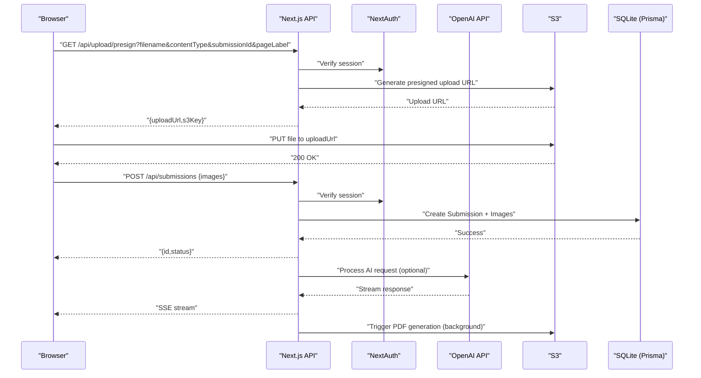
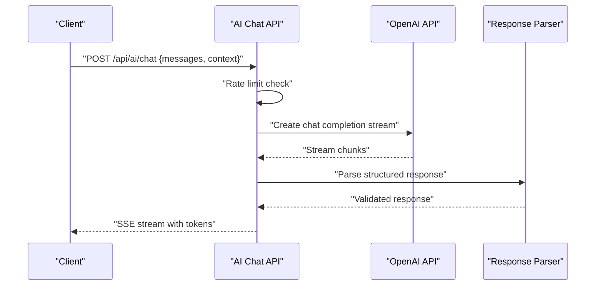
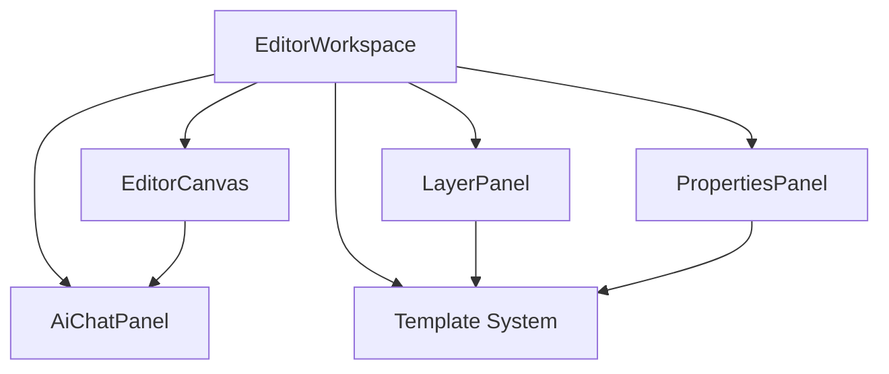
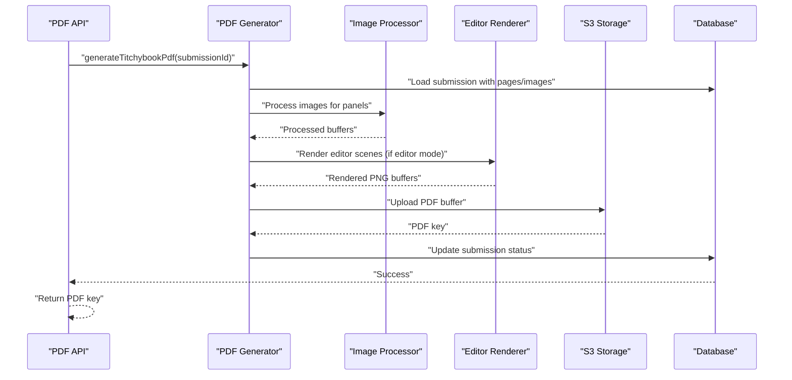
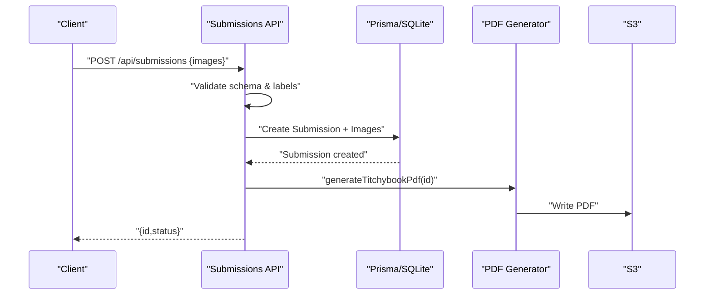
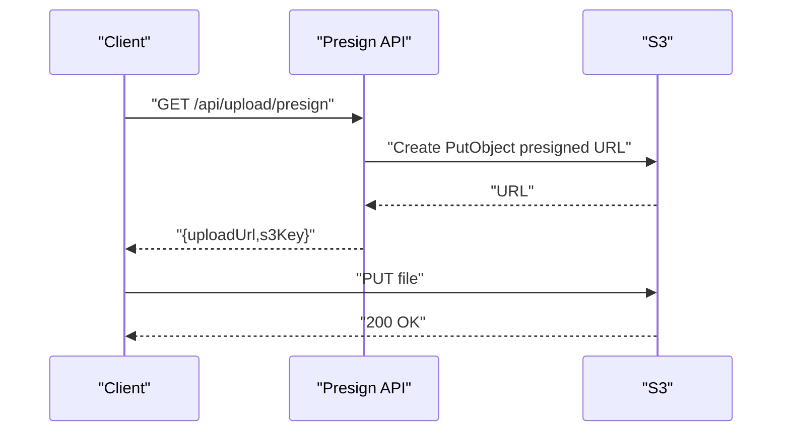
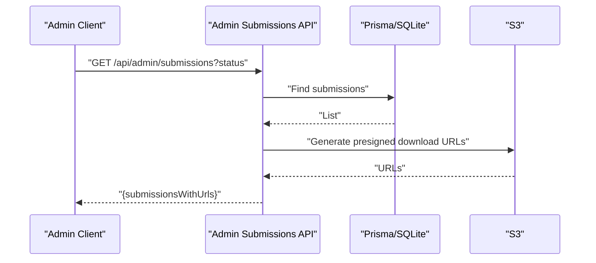
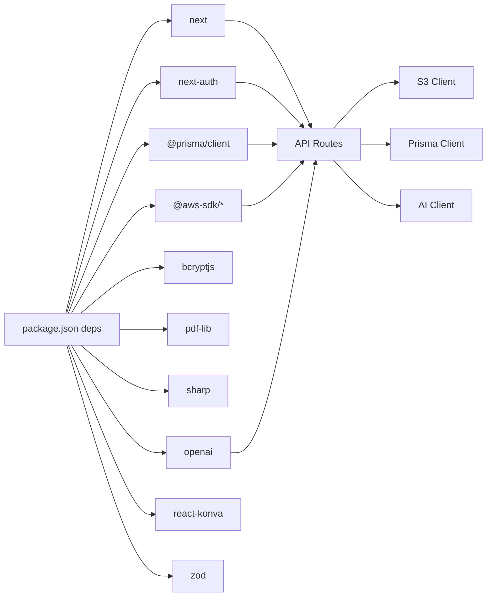

# Deployment & Operations

<cite>
**Referenced Files in This Document**
- [package.json](file://package.json)
- [README.md](file://README.md)
- [next.config.ts](file://next.config.ts)
- [src/lib/prisma.ts](file://src/lib/prisma.ts)
- [prisma/schema.prisma](file://prisma/schema.prisma)
- [prisma/migrations/20260316171130_init/migration.sql](file://prisma/migrations/20260316171130_init/migration.sql)
- [src/lib/s3.ts](file://src/lib/s3.ts)
- [src/auth.ts](file://src/auth.ts)
- [src/middleware.ts](file://src/middleware.ts)
- [src/app/api/admin/submissions/route.ts](file://src/app/api/admin/submissions/route.ts)
- [src/app/api/upload/presign/route.ts](file://src/app/api/upload/presign/route.ts)
- [src/app/api/submissions/[id]/route.ts](file://src/app/api/submissions/[id]/route.ts)
- [src/app/api/submissions/route.ts](file://src/app/api/submissions/route.ts)
- [src/app/api/auth/[...nextauth]/route.ts](file://src/app/api/auth/[...nextauth]/route.ts)
- [src/app/api/ai/chat/route.ts](file://src/app/api/ai/chat/route.ts)
- [src/app/api/submissions/[id]/pdf/route.ts](file://src/app/api/submissions/[id]/pdf/route.ts)
- [src/components/create/ImageUploader.tsx](file://src/components/create/ImageUploader.tsx)
- [src/components/create/UploadGrid.tsx](file://src/components/create/UploadGrid.tsx)
- [src/components/editor/AiChatPanel.tsx](file://src/components/editor/AiChatPanel.tsx)
- [src/components/editor/EditorCanvas.tsx](file://src/components/editor/EditorCanvas.tsx)
- [src/components/editor/EditorWorkspace.tsx](file://src/components/editor/EditorWorkspace.tsx)
- [src/components/editor/LayerPanel.tsx](file://src/components/editor/LayerPanel.tsx)
- [src/components/editor/PropertiesPanel.tsx](file://src/components/editor/PropertiesPanel.tsx)
- [src/components/submissions/SubmissionList.tsx](file://src/components/submissions/SubmissionList.tsx)
- [src/components/orders/OrderPanel.tsx](file://src/components/orders/OrderPanel.tsx)
- [src/lib/ai/client.ts](file://src/lib/ai/client.ts)
- [src/lib/ai/system-prompt.ts](file://src/lib/ai/system-prompt.ts)
- [src/lib/ai/protocol.ts](file://src/lib/ai/protocol.ts)
- [src/lib/pdf/generate.ts](file://src/lib/pdf/generate.ts)
- [src/lib/pdf/layout.ts](file://src/lib/pdf/layout.ts)
- [src/lib/pdf/image-processor.ts](file://src/lib/pdf/image-processor.ts)
- [src/lib/pdf/editor-render.ts](file://src/lib/pdf/editor-render.ts)
- [src/lib/editor/schema.ts](file://src/lib/editor/schema.ts)
- [src/lib/editor/constants.ts](file://src/lib/editor/constants.ts)
- [src/lib/editor/crop.ts](file://src/lib/editor/crop.ts)
- [prisma/seed.ts](file://prisma/seed.ts)
</cite>

## Update Summary
**Changes Made**
- Added comprehensive AI integration documentation with OpenAI API configuration
- Documented the new editor ecosystem with real-time AI assistance capabilities
- Updated PDF generation service configuration and background processing
- Enhanced S3 storage setup requirements for editor assets and PDF outputs
- Added template system integration for AI-powered content generation
- Expanded monitoring and observability requirements for AI chat streams
- Updated deployment requirements for production AI assistant support

## Table of Contents
1. [Introduction](#introduction)
2. [Project Structure](#project-structure)
3. [Core Components](#core-components)
4. [Architecture Overview](#architecture-overview)
5. [Detailed Component Analysis](#detailed-component-analysis)
6. [Dependency Analysis](#dependency-analysis)
7. [Performance Considerations](#performance-considerations)
8. [Monitoring & Observability](#monitoring--observability)
9. [Backup & Disaster Recovery](#backup--disaster-recovery)
10. [Scaling & Load Balancing](#scaling--load-balancing)
11. [Security Operations](#security-operations)
12. [Environment Configuration](#environment-configuration)
13. [Deployment Strategies](#deployment-strategies)
14. [Troubleshooting Guide](#troubleshooting-guide)
15. [Maintenance Procedures](#maintenance-procedures)
16. [Conclusion](#conclusion)

## Introduction
This document provides comprehensive deployment and operations guidance for Titchybook Creator. It covers production deployment strategies across Vercel, AWS, and other platforms; environment configuration for secrets, database, and cloud services; monitoring and logging; backup and disaster recovery; scaling and performance optimization; security and compliance; troubleshooting; and operational runbooks.

**Updated** The deployment process now supports the comprehensive editor ecosystem with AI integration, S3 storage setup for editor assets, and PDF generation service configuration.

## Project Structure
Titchybook Creator is a Next.js 16 application with an API-driven architecture featuring a sophisticated editor ecosystem:
- Frontend pages under src/app with comprehensive editor components
- API routes under src/app/api including AI chat functionality
- Authentication via NextAuth (JWT)
- Database via Prisma with SQLite
- File storage via AWS S3 with signed URLs for both images and PDFs
- Middleware enforces protected routes
- AI integration with OpenAI GPT models for content assistance
- Template system for AI-powered content generation

**Diagram sources**
- [src/app/api/auth/[...nextauth]/route.ts](file://src/app/api/auth/[...nextauth]/route.ts#L1-L4)
- [src/lib/prisma.ts:1-10](file://src/lib/prisma.ts#L1-L10)
- [prisma/schema.prisma:5-8](file://prisma/schema.prisma#L5-L8)
- [src/lib/s3.ts:1-81](file://src/lib/s3.ts#L1-L81)
- [src/lib/ai/client.ts:1-26](file://src/lib/ai/client.ts#L1-L26)
- [src/app/api/ai/chat/route.ts:1-141](file://src/app/api/ai/chat/route.ts#L1-L141)

**Section sources**
- [README.md:1-37](file://README.md#L1-L37)
- [next.config.ts:1-8](file://next.config.ts#L1-L8)

## Core Components
- Authentication and Authorization
  - NextAuth with JWT strategy and custom callbacks
  - Protected routes via middleware
- Data Access
  - Prisma Client connecting to SQLite
- Storage
  - S3 integration with presigned upload/download URLs for images, assets, and PDFs
- AI Integration
  - OpenAI API client with configurable models
  - Real-time chat streaming with rate limiting
  - AI-powered content suggestions for editor
- PDF Generation
  - Background processing with sharp and pdf-lib
  - Template-aware rendering for editor mode
- Editor Ecosystem
  - Real-time collaborative editing with AI assistance
  - Template system with per-instance customization
  - Comprehensive layer management and properties panel

**Section sources**
- [src/auth.ts:1-80](file://src/auth.ts#L1-L80)
- [src/middleware.ts:1-6](file://src/middleware.ts#L1-L6)
- [src/lib/prisma.ts:1-10](file://src/lib/prisma.ts#L1-L10)
- [src/lib/s3.ts:1-81](file://src/lib/s3.ts#L1-L81)
- [src/lib/ai/client.ts:1-26](file://src/lib/ai/client.ts#L1-L26)
- [src/lib/pdf/generate.ts:1-306](file://src/lib/pdf/generate.ts#L1-L306)
- [src/components/editor/EditorWorkspace.tsx:265-311](file://src/components/editor/EditorWorkspace.tsx#L265-L311)

## Architecture Overview
High-level runtime architecture with AI integration:
- Client uploads images via presigned URLs to S3
- Backend validates and persists metadata to SQLite via Prisma
- AI assistant processes user requests with OpenAI API
- Background PDF generation is triggered after submission or manual generation
- Admins can review and download PDFs via presigned URLs
- Editor ecosystem provides real-time collaboration with AI assistance

**Diagram sources**
- [src/app/api/upload/presign/route.ts:1-38](file://src/app/api/upload/presign/route.ts#L1-L38)
- [src/app/api/submissions/route.ts:1-96](file://src/app/api/submissions/route.ts#L1-L96)
- [src/app/api/ai/chat/route.ts:32-141](file://src/app/api/ai/chat/route.ts#L32-L141)
- [src/lib/s3.ts:18-28](file://src/lib/s3.ts#L18-L28)
- [src/auth.ts:27-79](file://src/auth.ts#L27-L79)

## Detailed Component Analysis

### Authentication and Authorization
- NextAuth configuration with JWT strategy and credential provider
- Session and JWT callbacks enrich roles for access control
- Middleware protects protected routes

**Diagram sources**
- [src/middleware.ts:1-6](file://src/middleware.ts#L1-L6)
- [src/auth.ts:27-79](file://src/auth.ts#L27-L79)

**Section sources**
- [src/auth.ts:1-80](file://src/auth.ts#L1-L80)
- [src/middleware.ts:1-6](file://src/middleware.ts#L1-L6)
- [src/app/api/auth/[...nextauth]/route.ts](file://src/app/api/auth/[...nextauth]/route.ts#L1-L4)

### AI Integration and Chat System
- Real-time AI chat with OpenAI GPT models
- Server-Sent Events (SSE) for streaming responses
- Rate limiting to prevent abuse
- Structured response parsing with schema validation
- Integration with editor ecosystem for content suggestions

**Diagram sources**
- [src/app/api/ai/chat/route.ts:32-141](file://src/app/api/ai/chat/route.ts#L32-L141)
- [src/lib/ai/protocol.ts:37-44](file://src/lib/ai/protocol.ts#L37-L44)
- [src/lib/ai/system-prompt.ts:24-91](file://src/lib/ai/system-prompt.ts#L24-L91)

**Section sources**
- [src/app/api/ai/chat/route.ts:1-141](file://src/app/api/ai/chat/route.ts#L1-L141)
- [src/lib/ai/client.ts:1-26](file://src/lib/ai/client.ts#L1-L26)
- [src/lib/ai/protocol.ts:1-56](file://src/lib/ai/protocol.ts#L1-L56)
- [src/lib/ai/system-prompt.ts:1-92](file://src/lib/ai/system-prompt.ts#L1-L92)

### Editor Ecosystem with AI Assistance
- Comprehensive editor workspace with real-time collaboration
- AI chat panel for content suggestions and assistance
- Layer management with template-aware rendering
- Properties panel for element manipulation
- Template system with per-instance customization

**Diagram sources**
- [src/components/editor/EditorWorkspace.tsx:265-311](file://src/components/editor/EditorWorkspace.tsx#L265-L311)
- [src/components/editor/EditorCanvas.tsx:1-800](file://src/components/editor/EditorCanvas.tsx#L1-L800)
- [src/components/editor/LayerPanel.tsx:1-212](file://src/components/editor/LayerPanel.tsx#L1-L212)
- [src/components/editor/PropertiesPanel.tsx:1-586](file://src/components/editor/PropertiesPanel.tsx#L1-L586)
- [src/components/editor/AiChatPanel.tsx:1-270](file://src/components/editor/AiChatPanel.tsx#L1-L270)

**Section sources**
- [src/components/editor/EditorWorkspace.tsx:265-311](file://src/components/editor/EditorWorkspace.tsx#L265-L311)
- [src/components/editor/EditorCanvas.tsx:1-800](file://src/components/editor/EditorCanvas.tsx#L1-L800)
- [src/components/editor/LayerPanel.tsx:1-212](file://src/components/editor/LayerPanel.tsx#L1-L212)
- [src/components/editor/PropertiesPanel.tsx:1-586](file://src/components/editor/PropertiesPanel.tsx#L1-L586)
- [src/components/editor/AiChatPanel.tsx:1-270](file://src/components/editor/AiChatPanel.tsx#L1-L270)

### PDF Generation Service
- Background PDF generation with sharp and pdf-lib
- Template-aware rendering for editor mode submissions
- Asset processing and panel composition
- Branding overlay for back cover
- S3 integration for PDF storage and retrieval

**Diagram sources**
- [src/app/api/submissions/[id]/pdf/route.ts:1-26](file://src/app/api/submissions/[id]/pdf/route.ts#L1-L26)
- [src/lib/pdf/generate.ts:33-305](file://src/lib/pdf/generate.ts#L33-L305)
- [src/lib/pdf/image-processor.ts](file://src/lib/pdf/image-processor.ts)
- [src/lib/pdf/editor-render.ts](file://src/lib/pdf/editor-render.ts)

**Section sources**
- [src/app/api/submissions/[id]/pdf/route.ts:1-26](file://src/app/api/submissions/[id]/pdf/route.ts#L1-L26)
- [src/lib/pdf/generate.ts:1-306](file://src/lib/pdf/generate.ts#L1-L306)
- [src/lib/pdf/layout.ts:1-69](file://src/lib/pdf/layout.ts#L1-L69)

### Submission Management API
- GET /api/submissions lists current user's submissions
- POST /api/submissions validates and persists images, then triggers background PDF generation
- GET /api/submissions/[id] retrieves a single submission with optional presigned PDF URL

**Diagram sources**
- [src/app/api/submissions/route.ts:35-96](file://src/app/api/submissions/route.ts#L35-L96)
- [src/app/api/submissions/[id]/route.ts](file://src/app/api/submissions/[id]/route.ts#L1-L37)

**Section sources**
- [src/app/api/submissions/route.ts:1-96](file://src/app/api/submissions/route.ts#L1-L96)
- [src/app/api/submissions/[id]/route.ts](file://src/app/api/submissions/[id]/route.ts#L1-L37)

### Upload Workflow with Presigned URLs
- Client requests a presigned upload URL from /api/upload/presign
- Client uploads directly to S3
- Server records metadata and later generates a PDF

**Diagram sources**
- [src/app/api/upload/presign/route.ts:1-38](file://src/app/api/upload/presign/route.ts#L1-L38)
- [src/lib/s3.ts:18-28](file://src/lib/s3.ts#L18-L28)

**Section sources**
- [src/app/api/upload/presign/route.ts:1-38](file://src/app/api/upload/presign/route.ts#L1-L38)
- [src/components/create/ImageUploader.tsx:1-148](file://src/components/create/ImageUploader.tsx#L1-L148)
- [src/components/create/UploadGrid.tsx:1-115](file://src/components/create/UploadGrid.tsx#L1-L115)

### Admin Dashboard API
- GET /api/admin/submissions filters by status and returns presigned PDF download URLs for admin review

**Diagram sources**
- [src/app/api/admin/submissions/route.ts:1-38](file://src/app/api/admin/submissions/route.ts#L1-L38)
- [src/lib/s3.ts:30-36](file://src/lib/s3.ts#L30-L36)

**Section sources**
- [src/app/api/admin/submissions/route.ts:1-38](file://src/app/api/admin/submissions/route.ts#L1-L38)

## Dependency Analysis
- Application dependencies include Next.js, NextAuth, Prisma, AWS SDK, bcrypt, pdf-lib, sharp, openai, react-konva, and zod
- Environment variables drive database URL, AWS credentials, OpenAI API key, and bucket name
- Middleware and API routes depend on NextAuth for session validation
- AI functionality depends on OpenAI API client configuration
- Editor components require react-konva for canvas rendering
- PDF generation depends on sharp for image processing and pdf-lib for PDF creation

**Diagram sources**
- [package.json:11-25](file://package.json#L11-L25)
- [src/lib/s3.ts:1-81](file://src/lib/s3.ts#L1-L81)
- [src/lib/prisma.ts:1-10](file://src/lib/prisma.ts#L1-L10)
- [src/auth.ts:1-80](file://src/auth.ts#L1-L80)
- [src/lib/ai/client.ts:1-26](file://src/lib/ai/client.ts#L1-L26)

**Section sources**
- [package.json:1-43](file://package.json#L1-L43)

## Performance Considerations
- Asynchronous PDF generation avoids blocking API responses
- Image uploads use presigned URLs to reduce server bandwidth
- Middleware restricts protected routes to minimize unnecessary work
- AI chat streaming with SSE prevents long polling overhead
- Editor canvas rendering optimized with react-konva virtual DOM
- Template system caches processed assets for reuse
- Consider enabling Next.js static generation and ISR for read-heavy pages where appropriate

## Monitoring & Observability
Recommended observability stack:
- Logs: Capture API logs, PDF generation errors, authentication events, and AI chat interactions
- Metrics: Track request latency, error rates, upload sizes, PDF generation duration, and AI response times
- Tracing: Add distributed tracing for end-to-end request flows including AI chat streams
- Health checks: Expose a lightweight health endpoint at /health
- AI-specific monitoring: Track OpenAI API usage, rate limits, and response times
- Editor performance: Monitor canvas rendering performance and user interaction latency

Implementation pointers:
- Use platform-native logging (e.g., Vercel logs, CloudWatch logs)
- Centralize logs with a SIEM or log aggregation service
- Instrument API routes for timing and error reporting
- Monitor S3 upload/download latencies and failure rates
- Track AI API costs and usage patterns
- Implement circuit breakers for AI service dependencies

## Backup & Disaster Recovery
- Database backups
  - For SQLite in production, schedule regular filesystem snapshots or export SQL periodically
  - Consider migrating to a managed database for higher availability
- File storage backups
  - Enable S3 versioning and cross-region replication
  - Periodically audit bucket contents and maintain offsite copies
  - Backup both user images and generated PDFs
- AI integration backups
  - Monitor OpenAI API quotas and implement fallback strategies
  - Cache frequently requested AI responses where appropriate
- Recovery testing
  - Practice restoring database and S3 buckets from backups
  - Validate end-to-end recovery for PDF generation and user uploads
  - Test AI service failover scenarios

## Scaling & Load Balancing
- Horizontal scaling
  - Run multiple Next.js instances behind a load balancer
  - Ensure shared stateless design; rely on external services (S3, database, OpenAI)
- CDN and caching
  - Serve static assets via CDN; cache infrequent pages
  - Cache AI response fragments where appropriate
- Background tasks
  - Offload PDF generation to workers or queues to avoid cold starts
  - Scale AI processing separately from web requests
- Auto-scaling
  - Configure CPU/memory-based autoscaling on your platform
  - Scale PDF generation workers independently from web instances
- AI service scaling
  - Implement rate limiting and queuing for AI API calls
  - Consider AI service clustering for high-throughput scenarios

## Security Operations
- Secrets management
  - Store AWS credentials, database URL, and OpenAI API key in secure environment variables
  - Rotate keys regularly; revoke compromised credentials immediately
- Network security
  - Restrict S3 bucket policies to least privilege
  - Enforce HTTPS and HSTS
  - Implement AI API key encryption at rest
- Vulnerability management
  - Pin dependency versions and monitor advisories
  - Scan container images and dependencies regularly
  - Validate AI response content for safety
- Compliance
  - Align logging retention and data deletion with privacy regulations
  - Audit access to admin endpoints, S3 resources, and AI API usage
  - Implement data residency requirements for AI processing

## Environment Configuration
Production environment variables:
- Database
  - DATABASE_URL: SQLite connection string
- AWS
  - AWS_REGION, AWS_ACCESS_KEY_ID, AWS_SECRET_ACCESS_KEY, S3_BUCKET_NAME
- Authentication
  - NEXTAUTH_SECRET: Strong random secret
  - NEXTAUTH_URL: Public base URL for NextAuth
- AI Integration
  - OPENAI_API_KEY: OpenAI API authentication
  - OPENAI_MODEL: Default GPT model (default: gpt-4o)
- Application
  - NODE_ENV=production
  - Optional: NEXT_PUBLIC_APP_BASE_URL

Validation and defaults:
- S3 client construction requires all AWS variables
- Prisma connects via DATABASE_URL
- NextAuth requires NEXTAUTH_SECRET and NEXTAUTH_URL
- AI client requires OPENAI_API_KEY; throws error if missing
- Default model is gpt-4o if OPENAI_MODEL not set

**Section sources**
- [src/lib/s3.ts:8-14](file://src/lib/s3.ts#L8-L14)
- [prisma/schema.prisma:5-8](file://prisma/schema.prisma#L5-L8)
- [src/auth.ts:27-79](file://src/auth.ts#L27-L79)
- [src/lib/ai/client.ts:5-25](file://src/lib/ai/client.ts#L5-L25)

## Deployment Strategies

### Vercel
- Build and runtime
  - Use Next.js build; deploy API routes and static assets
  - Configure environment variables in Vercel dashboard
  - Enable Edge Functions for AI chat streaming
- Static generation
  - Optimize read-heavy pages with ISR or static export
- Edge Functions
  - Consider moving lightweight logic to Edge Functions for lower latency
  - AI chat endpoints can leverage Edge Functions for better performance

**Section sources**
- [README.md:32-36](file://README.md#L32-L36)
- [package.json:5-10](file://package.json#L5-L10)

### AWS (Elastic Beanstalk / ECS / Lambda)
- Elastic Beanstalk
  - Package application and deploy with environment variables
  - Configure IAM roles for S3 access and OpenAI API access
- ECS/Fargate
  - Containerize the app; manage secrets via AWS Systems Manager Parameter Store or Secrets Manager
  - Scale PDF generation workers independently
- Lambda@Edge or API Gateway + Lambda
  - For API-only deployments; pair with RDS or managed database
  - Consider Lambda for AI chat processing to reduce costs

### Other Platforms
- Railway, Render, Fly.io, etc.
  - Follow platform-specific environment variable configuration
  - Ensure database connectivity, S3 access permissions, and OpenAI API access
  - Configure proper scaling for AI and PDF generation workloads

## Troubleshooting Guide

Common issues and resolutions:
- Authentication failures
  - Verify NEXTAUTH_SECRET and NEXTAUTH_URL
  - Confirm session cookie domain/path and HTTPS
- Unauthorized or forbidden responses
  - Ensure user is logged in and has required role
  - Check middleware matcher and route protection
- Upload failures
  - Confirm AWS credentials and bucket permissions
  - Validate presigned URL parameters and expiration
- PDF generation errors
  - Inspect background job logs and S3 write permissions
  - Check image processing pipeline for corrupted assets
- AI chat failures
  - Verify OPENAI_API_KEY is configured and valid
  - Check OpenAI API quota limits and rate limits
  - Monitor SSE streaming for connection issues
- Database connectivity
  - Verify DATABASE_URL and Prisma migrations applied
- CORS and preflight
  - Configure CORS headers for API routes if needed
- Editor performance issues
  - Monitor canvas rendering performance
  - Check asset loading and caching strategies

Operational runbooks:
- Incident response
  - Define escalation paths for auth, storage, AI API, and PDF generation failures
- Rollback procedure
  - Keep previous builds tagged; revert on persistent errors
- Postmortem process
  - Document root causes and remediation steps
- AI service degradation
  - Implement circuit breakers and graceful degradation
  - Monitor API costs and usage patterns

**Section sources**
- [src/auth.ts:27-79](file://src/auth.ts#L27-L79)
- [src/middleware.ts:1-6](file://src/middleware.ts#L1-L6)
- [src/lib/s3.ts:8-14](file://src/lib/s3.ts#L8-L14)
- [src/app/api/upload/presign/route.ts:1-38](file://src/app/api/upload/presign/route.ts#L1-L38)
- [src/app/api/submissions/route.ts:35-96](file://src/app/api/submissions/route.ts#L35-L96)
- [src/lib/ai/client.ts:5-25](file://src/lib/ai/client.ts#L5-L25)

## Maintenance Procedures
- Database migrations
  - Apply Prisma migrations before deploying
  - Back up database prior to migration
- Seed data
  - Use seed script to provision admin accounts
- Dependency updates
  - Test upgrades in staging; monitor logs and performance
  - Pay special attention to AI SDK updates and breaking changes
- Rotation and auditing
  - Rotate secrets and review access logs quarterly
  - Monitor AI API usage and costs
- AI system maintenance
  - Regularly test AI model availability and performance
  - Update AI prompts and system messages as needed
- Editor ecosystem updates
  - Test editor performance after dependency updates
  - Validate template system compatibility

**Section sources**
- [prisma/migrations/20260316171130_init/migration.sql](file://prisma/migrations/20260316171130_init/migration.sql)
- [prisma/seed.ts:1-36](file://prisma/seed.ts#L1-L36)

## Conclusion
This guide outlines a production-ready deployment and operations model for Titchybook Creator with comprehensive AI integration and editor ecosystem support. By securing environment variables, validating integrations with OpenAI API, configuring S3 storage for both images and PDFs, instrumenting observability for AI chat streams, and establishing robust backup and scaling practices, teams can reliably deliver a high-quality AI-assisted image-to-PDF creation experience with real-time collaborative editing capabilities.