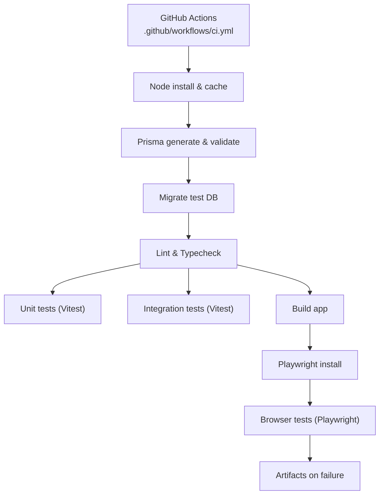
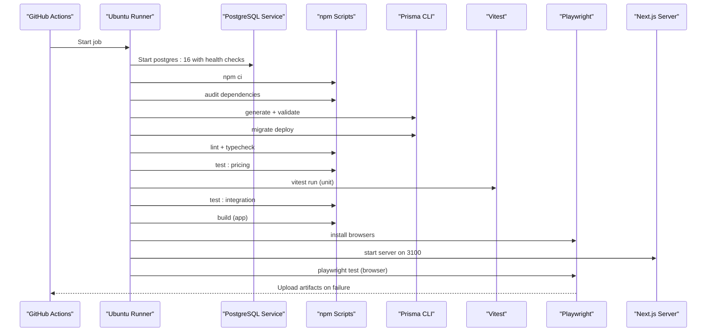
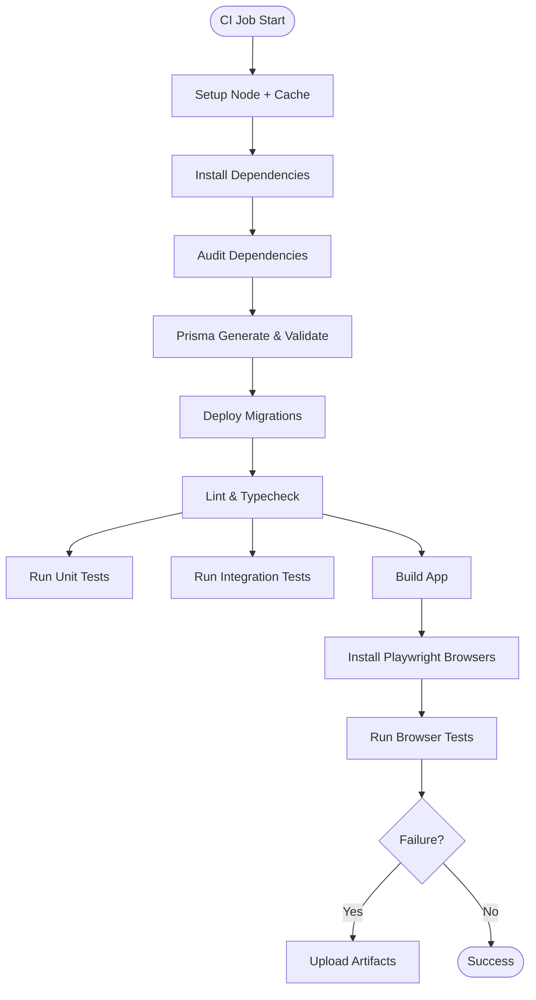
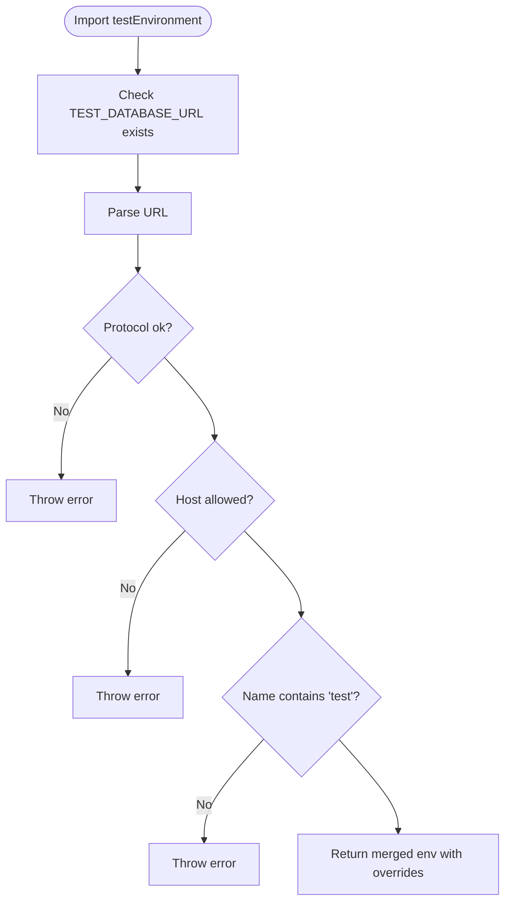
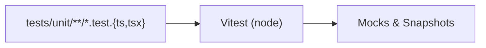
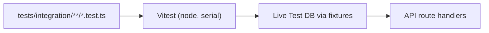
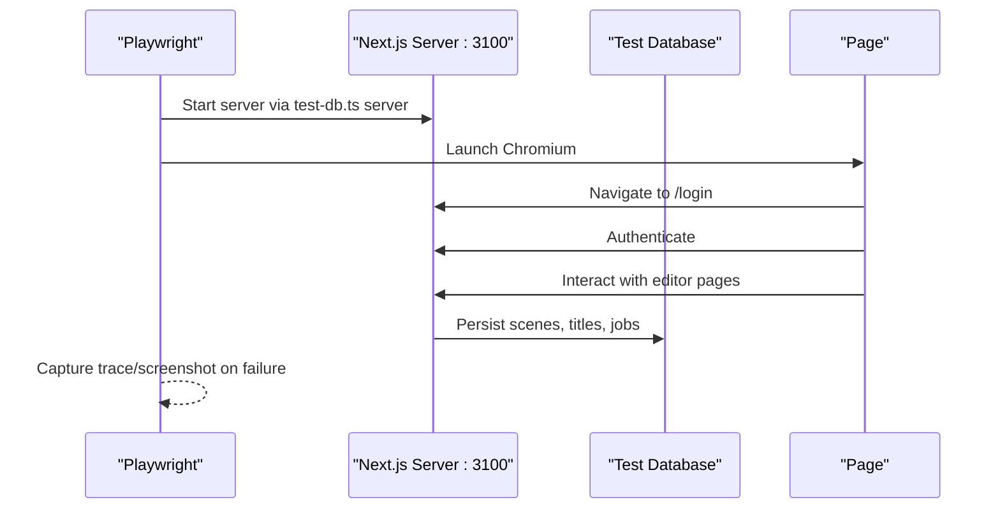
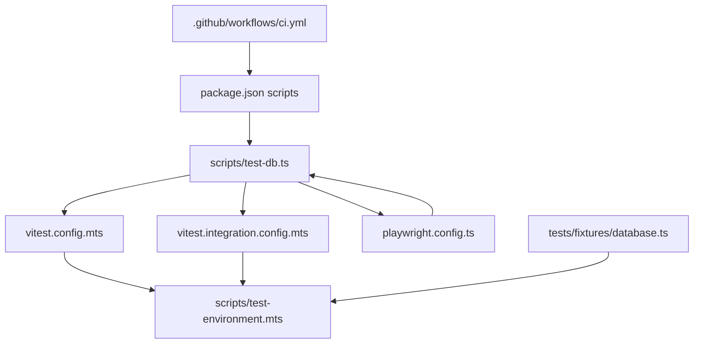

# CI/CD Pipeline & Automated Testing

<cite>
**Referenced Files in This Document**
- [ci.yml](file://.github/workflows/ci.yml)
- [package.json](file://package.json)
- [vitest.config.mts](file://vitest.config.mts)
- [vitest.integration.config.mts](file://vitest.integration.config.mts)
- [playwright.config.ts](file://playwright.config.ts)
- [test-db.ts](file://scripts/test-db.ts)
- [test-environment.mts](file://scripts/test-environment.mts)
- [database.ts](file://tests/fixtures/database.ts)
- [auth.spec.ts](file://tests/browser/auth.spec.ts)
- [editor.spec.ts](file://tests/browser/editor.spec.ts)
- [editor-queue.test.ts](file://tests/integration/editor-queue.test.ts)
- [rendering.test.ts](file://tests/unit/rendering.test.ts)
- [test-environment.test.ts](file://tests/unit/test-environment.test.ts)
</cite>

## Table of Contents
1. [Introduction](#introduction)
2. [Project Structure](#project-structure)
3. [Core Components](#core-components)
4. [Architecture Overview](#architecture-overview)
5. [Detailed Component Analysis](#detailed-component-analysis)
6. [Dependency Analysis](#dependency-analysis)
7. [Performance Considerations](#performance-considerations)
8. [Troubleshooting Guide](#troubleshooting-guide)
9. [Conclusion](#conclusion)

## Introduction
This document explains the CI/CD pipeline and automated testing strategy for the application. It covers how continuous integration runs reliability checks, how unit, integration, and browser tests are configured and executed, and how a secure test environment isolates databases and external services during CI and local runs.

## Project Structure
The testing and CI infrastructure is organized around:
- GitHub Actions workflow that orchestrates dependency installation, database setup, migrations, linting, type checking, and all test suites.
- A unified test entry script that delegates to Prisma, Vitest, and Playwright with consistent environment variables.
- Separate configurations for unit and integration tests, plus a Playwright configuration that starts a Next.js server on a dedicated port for end-to-end scenarios.
- A strict test environment helper that enforces safe database targets and overrides sensitive provider credentials.



**Diagram sources**
- [ci.yml:1-53](file://.github/workflows/ci.yml#L1-L53)
- [package.json:5-18](file://package.json#L5-L18)

**Section sources**
- [ci.yml:1-53](file://.github/workflows/ci.yml#L1-L53)
- [package.json:5-18](file://package.json#L5-L18)

## Core Components
- CI pipeline job: provisions a PostgreSQL service, sets test-only environment variables, runs migrations, lints, typechecks, executes unit and integration tests, builds the app, installs Playwright browsers, and runs browser tests. Artifacts are uploaded on failure.
- Test scripts: a single CLI wrapper that invokes Prisma, Vitest, and Playwright with shared environment variables.
- Unit test runner: Vitest configured for Node environment with alias resolution and isolated mocks.
- Integration test runner: Vitest configured for serial execution against a live test database.
- Browser test runner: Playwright configured to start a Next.js server on port 3100, run Chromium tests, capture traces/screenshots on failure, and enforce forbidOnly in CI.
- Test environment helper: validates TEST_DATABASE_URL format and hostname, forces test-only credentials, and ensures application DATABASE_URL is never used by tests.

**Section sources**
- [ci.yml:1-53](file://.github/workflows/ci.yml#L1-L53)
- [test-db.ts:1-27](file://scripts/test-db.ts#L1-L27)
- [vitest.config.mts:1-13](file://vitest.config.mts#L1-L13)
- [vitest.integration.config.mts:1-19](file://vitest.integration.config.mts#L1-L19)
- [playwright.config.ts:1-25](file://playwright.config.ts#L1-L25)
- [test-environment.mts:1-28](file://scripts/test-environment.mts#L1-L28)

## Architecture Overview
The CI pipeline coordinates multiple stages to ensure code quality and correctness before merging or deploying. The flow below maps directly to the workflow steps and scripts.



**Diagram sources**
- [ci.yml:1-53](file://.github/workflows/ci.yml#L1-L53)
- [test-db.ts:1-27](file://scripts/test-db.ts#L1-L27)
- [playwright.config.ts:16-23](file://playwright.config.ts#L16-L23)

## Detailed Component Analysis

### CI Workflow Reliability Checks
- Triggers on pull requests and pushes.
- Uses an Ubuntu runner with a 20-minute timeout.
- Spins up a PostgreSQL service with explicit credentials and health checks.
- Sets TEST_DATABASE_URL and DATABASE_URL to point at the service container.
- Executes dependency audit, Prisma generation/validation, migration deployment, linting, typechecking, pricing tests, unit tests, integration tests, app build, Playwright browser install, and browser tests.
- Uploads Playwright reports and test results on failure for 7 days.



**Diagram sources**
- [ci.yml:1-53](file://.github/workflows/ci.yml#L1-L53)

**Section sources**
- [ci.yml:1-53](file://.github/workflows/ci.yml#L1-L53)

### Test Environment Safety and Overrides
- Enforces that TEST_DATABASE_URL is set explicitly; application DATABASE_URL is never used for tests.
- Validates protocol, hostname, and database name patterns to prevent accidental writes to non-test databases.
- Overrides sensitive environment variables with test-only values (e.g., AWS, OpenAI, Resend).
- Ensures NextAuth URLs and trust settings are suitable for localhost testing.



**Diagram sources**
- [test-environment.mts:1-28](file://scripts/test-environment.mts#L1-L28)

**Section sources**
- [test-environment.mts:1-28](file://scripts/test-environment.mts#L1-L28)
- [test-environment.test.ts:1-26](file://tests/unit/test-environment.test.ts#L1-L26)

### Unified Test Script Orchestration
- Provides commands for migrating the test database, running integration tests, launching browser tests, building the app, and starting the server on port 3100.
- Delegates to Prisma, Vitest, and Playwright while inheriting the validated environment from the test environment helper.

```mermaid
flowchart TD
Arg["CLI arg"] --> Migrate{"migrate?"}
Arg --> Integration{"integration?"}
Arg --> Browser{"browser?"}
Arg --> Build{"build?"}
Arg --> Server{"server?"}
Migrate --> |Yes| PrismaMigrate["Prisma migrate deploy + diff"]
Integration --> |Yes| VitestInt["Vitest integration config"]
Browser --> |Yes| Playwright["Playwright test"]
Build --> |Yes| PrismaGen["Prisma generate"] + NextBuild["Next build"]
Server --> |Yes| NextStart["Next start -p 3100"]
```

**Diagram sources**
- [test-db.ts:1-27](file://scripts/test-db.ts#L1-L27)

**Section sources**
- [test-db.ts:1-27](file://scripts/test-db.ts#L1-L27)

### Unit Tests (Vitest)
- Target directory: tests/unit.
- Node environment with aliases and mock cleanup enabled.
- Example coverage includes rendering logic, PDF generation, and snapshot parsing.



**Diagram sources**
- [vitest.config.mts:1-13](file://vitest.config.mts#L1-L13)
- [rendering.test.ts:1-66](file://tests/unit/rendering.test.ts#L1-L66)

**Section sources**
- [vitest.config.mts:1-13](file://vitest.config.mts#L1-L13)
- [rendering.test.ts:1-66](file://tests/unit/rendering.test.ts#L1-L66)

### Integration Tests (Vitest)
- Target directory: tests/integration.
- Serial execution with longer timeouts to coordinate with a live test database.
- Exercises editor APIs, transactional submissions, render queue behavior, worker claims, retries, and admin moderation flows.



**Diagram sources**
- [vitest.integration.config.mts:1-19](file://vitest.integration.config.mts#L1-L19)
- [editor-queue.test.ts:1-306](file://tests/integration/editor-queue.test.ts#L1-L306)
- [database.ts:1-36](file://tests/fixtures/database.ts#L1-L36)

**Section sources**
- [vitest.integration.config.mts:1-19](file://vitest.integration.config.mts#L1-L19)
- [editor-queue.test.ts:1-306](file://tests/integration/editor-queue.test.ts#L1-L306)
- [database.ts:1-36](file://tests/fixtures/database.ts#L1-L36)

### Browser Tests (Playwright)
- Targets: tests/browser.
- Starts a Next.js server on port 3100 using the same test environment.
- Runs Chromium with a fixed viewport, captures traces/screenshots on failure, and enforces forbidOnly in CI.
- Tests cover authentication guards, public vs protected routes, session handling, editor workflows, save failures, AI assistant interactions, and recovery after reload.



**Diagram sources**
- [playwright.config.ts:1-25](file://playwright.config.ts#L1-L25)
- [auth.spec.ts:1-85](file://tests/browser/auth.spec.ts#L1-L85)
- [editor.spec.ts:1-152](file://tests/browser/editor.spec.ts#L1-L152)

**Section sources**
- [playwright.config.ts:1-25](file://playwright.config.ts#L1-L25)
- [auth.spec.ts:1-85](file://tests/browser/auth.spec.ts#L1-L85)
- [editor.spec.ts:1-152](file://tests/browser/editor.spec.ts#L1-L152)

## Dependency Analysis
The following diagram shows how CI, scripts, and test runners depend on each other and on the test environment.



**Diagram sources**
- [ci.yml:1-53](file://.github/workflows/ci.yml#L1-L53)
- [package.json:5-18](file://package.json#L5-L18)
- [test-db.ts:1-27](file://scripts/test-db.ts#L1-L27)
- [test-environment.mts:1-28](file://scripts/test-environment.mts#L1-L28)
- [vitest.config.mts:1-13](file://vitest.config.mts#L1-L13)
- [vitest.integration.config.mts:1-19](file://vitest.integration.config.mts#L1-L19)
- [playwright.config.ts:1-25](file://playwright.config.ts#L1-L25)
- [database.ts:1-36](file://tests/fixtures/database.ts#L1-L36)

**Section sources**
- [ci.yml:1-53](file://.github/workflows/ci.yml#L1-L53)
- [package.json:5-18](file://package.json#L5-L18)
- [test-db.ts:1-27](file://scripts/test-db.ts#L1-L27)
- [test-environment.mts:1-28](file://scripts/test-environment.mts#L1-L28)
- [vitest.config.mts:1-13](file://vitest.config.mts#L1-L13)
- [vitest.integration.config.mts:1-19](file://vitest.integration.config.mts#L1-L19)
- [playwright.config.ts:1-25](file://playwright.config.ts#L1-L25)
- [database.ts:1-36](file://tests/fixtures/database.ts#L1-L36)

## Performance Considerations
- Use a dedicated PostgreSQL service in CI to avoid flaky network calls and ensure isolation.
- Keep integration tests serial to reduce contention on the test database and simplify assertions about state transitions.
- Limit Playwright workers to one per run to stabilize UI tests and reduce resource pressure in CI.
- Enable artifact uploads only on failure to minimize storage usage while preserving diagnostics when needed.
- Reuse cached node_modules via npm caching to speed up subsequent runs.

[No sources needed since this section provides general guidance]

## Troubleshooting Guide
- Missing TEST_DATABASE_URL: The test environment helper will throw an error if not set. Ensure it points to a local PostgreSQL instance with a database name containing “test”.
- Unsafe database target: If the host is remote or the database name does not match the expected pattern, the helper rejects it to protect production data.
- External provider calls blocked: Integration and browser tests stub or block external HTTP to prevent secrets leakage and flakiness. If tests fail due to missing mocks, add appropriate stubs.
- Playwright failures: Inspect uploaded artifacts (reports and screenshots) and traces retained on failure. Verify the Next.js server started successfully on port 3100 and that the test database was migrated.
- Migration issues: Confirm that migrations have been deployed before running integration or browser tests. Use the migrate command through the test script to apply schema changes.

**Section sources**
- [test-environment.mts:1-28](file://scripts/test-environment.mts#L1-L28)
- [test-environment.test.ts:1-26](file://tests/unit/test-environment.test.ts#L1-L26)
- [ci.yml:45-53](file://.github/workflows/ci.yml#L45-L53)
- [playwright.config.ts:16-23](file://playwright.config.ts#L16-L23)
- [test-db.ts:11-24](file://scripts/test-db.ts#L11-L24)

## Conclusion
The CI/CD pipeline integrates robust safety checks, comprehensive test coverage across unit, integration, and browser layers, and a hardened test environment to prevent accidental access to production resources. By enforcing strict database targeting, serializing integration tests, and capturing detailed artifacts on failure, the system maintains high reliability and fast feedback for contributors.

[No sources needed since this section summarizes without analyzing specific files]