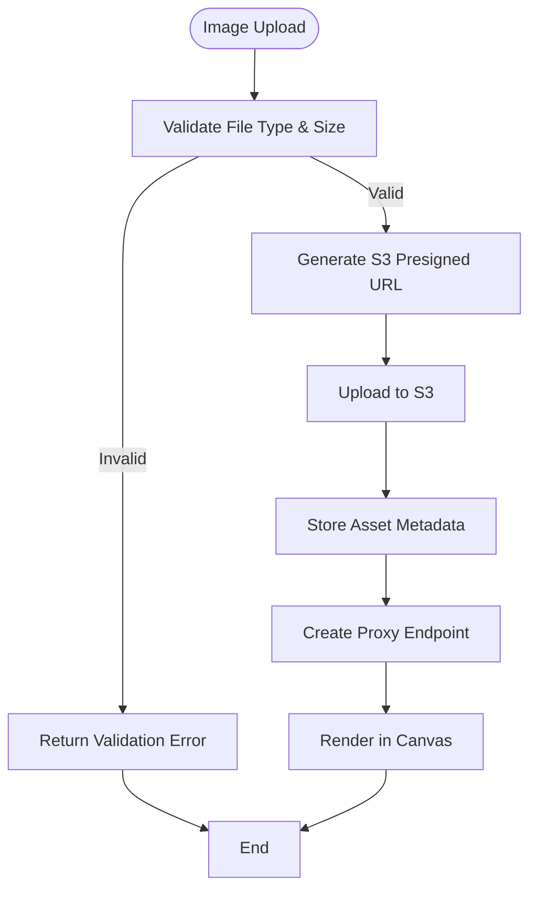
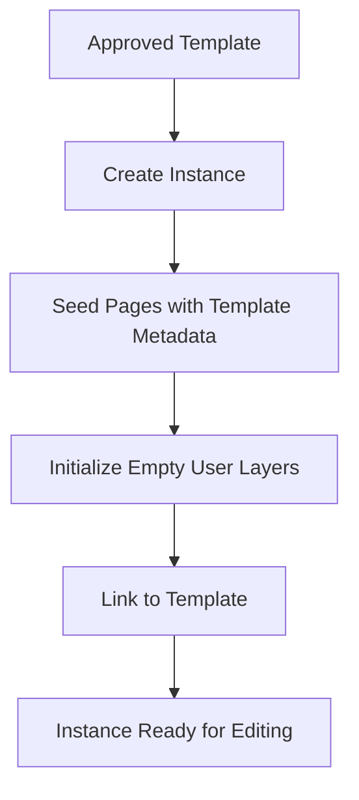
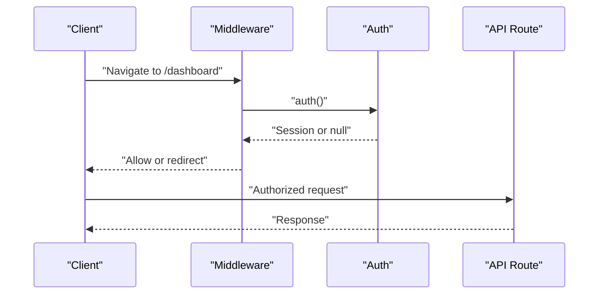
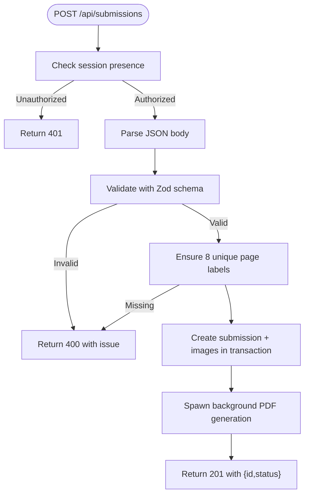
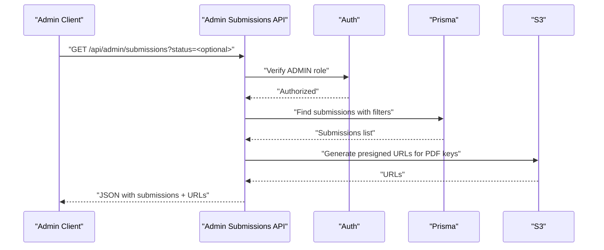
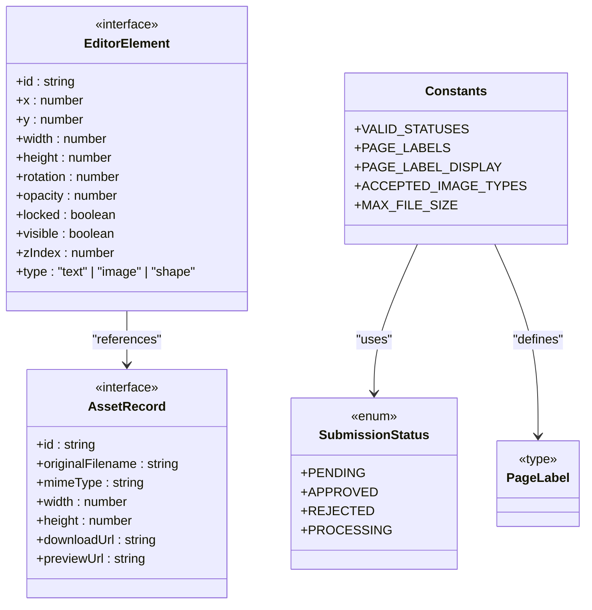
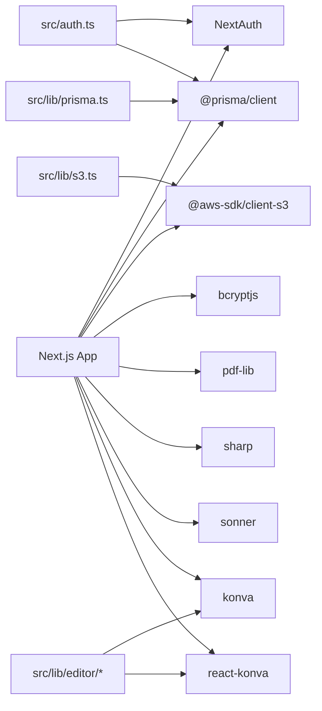

# Development Guidelines

<cite>
**Referenced Files in This Document**
- [package.json](file://package.json)
- [README.md](file://README.md)
- [eslint.config.mjs](file://eslint.config.mjs)
- [tsconfig.json](file://tsconfig.json)
- [next.config.ts](file://next.config.ts)
- [src/app/layout.tsx](file://src/app/layout.tsx)
- [src/components/Providers.tsx](file://src/components/Providers.tsx)
- [src/lib/constants.ts](file://src/lib/constants.ts)
- [src/middleware.ts](file://src/middleware.ts)
- [src/auth.ts](file://src/auth.ts)
- [src/components/auth/LoginForm.tsx](file://src/components/auth/LoginForm.tsx)
- [src/app/api/admin/submissions/route.ts](file://src/app/api/admin/submissions/route.ts)
- [src/app/api/submissions/route.ts](file://src/app/api/submissions/route.ts)
- [src/lib/prisma.ts](file://src/lib/prisma.ts)
- [src/lib/s3.ts](file://src/lib/s3.ts)
- [src/components/editor/EditorWorkspace.tsx](file://src/components/editor/EditorWorkspace.tsx)
- [src/components/editor/EditorCanvas.tsx](file://src/components/editor/EditorCanvas.tsx)
- [src/components/editor/LayerPanel.tsx](file://src/components/editor/LayerPanel.tsx)
- [src/components/editor/PropertiesPanel.tsx](file://src/components/editor/PropertiesPanel.tsx)
- [src/components/editor/AiChatPanel.tsx](file://src/components/editor/AiChatPanel.tsx)
- [src/components/admin/TemplateManager.tsx](file://src/components/admin/TemplateManager.tsx)
- [src/components/create/ImageUploader.tsx](file://src/components/create/ImageUploader.tsx)
- [src/components/create/UploadGrid.tsx](file://src/components/create/UploadGrid.tsx)
- [src/lib/editor/schema.ts](file://src/lib/editor/schema.ts)
- [src/lib/editor/constants.ts](file://src/lib/editor/constants.ts)
- [src/lib/editor/validation.ts](file://src/lib/editor/validation.ts)
- [src/lib/editor/template-merge.ts](file://src/lib/editor/template-merge.ts)
- [src/lib/editor/template-types.ts](file://src/lib/editor/template-types.ts)
- [src/app/api/assets/route.ts](file://src/app/api/assets/route.ts)
- [src/app/api/submissions/from-template/route.ts](file://src/app/api/submissions/from-template/route.ts)
</cite>

## Update Summary
**Changes Made**
- Added comprehensive editor component architecture documentation
- Documented asset management system with S3 integration
- Added template system implementation details
- Included collaborative editing patterns and AI integration
- Updated component development guidelines for new editor patterns
- Enhanced API design patterns for editor components
- Added performance considerations for canvas-based editing

## Table of Contents
1. [Introduction](#introduction)
2. [Project Structure](#project-structure)
3. [Core Components](#core-components)
4. [Architecture Overview](#architecture-overview)
5. [Editor Component System](#editor-component-system)
6. [Asset Management System](#asset-management-system)
7. [Template System Implementation](#template-system-implementation)
8. [Collaborative Editing Patterns](#collaborative-editing-patterns)
9. [AI Integration Framework](#ai-integration-framework)
10. [Detailed Component Analysis](#detailed-component-analysis)
11. [Dependency Analysis](#dependency-analysis)
12. [Performance Considerations](#performance-considerations)
13. [Troubleshooting Guide](#troubleshooting-guide)
14. [Contribution and Review Standards](#contribution-and-review-standards)
15. [Debugging and Local Development](#debugging-and-local-development)
16. [Release Procedures and Deployment](#release-procedures-and-deployment)
17. [Conclusion](#conclusion)

## Introduction
This document provides comprehensive development guidelines for Titchybook Creator, focusing on the new editor component architecture, asset management system, template system, and collaborative editing features. It covers code structure standards, TypeScript usage patterns, ESLint and Prettier configuration, component development practices, API design and error handling, testing strategies, contribution workflows, debugging techniques, and release procedures.

## Project Structure
The project follows a Next.js App Router structure with enhanced editor capabilities:
- Application pages under src/app organized by feature routes and protected areas
- Editor components under src/components/editor for canvas-based editing
- Asset management components under src/components/create for media handling
- Template management under src/components/admin for administrative features
- Editor libraries under src/lib/editor for core functionality
- Shared UI and reusable components under src/components
- Libraries for database, AWS S3, and shared constants under src/lib
- Global styles and root layout under src/app
- Authentication and middleware integrations under src
- Type definitions and shared types under src/types

```mermaid
graph TB
subgraph "App Layer"
L["Root Layout<br/>src/app/layout.tsx"]
P["Providers<br/>src/components/Providers.tsx"]
H["Header<br/>src/components/layout/Header.tsx"]
end
subgraph "Editor System"
EW["EditorWorkspace<br/>src/components/editor/EditorWorkspace.tsx"]
EC["EditorCanvas<br/>src/components/editor/EditorCanvas.tsx"]
LP["LayerPanel<br/>src/components/editor/LayerPanel.tsx"]
PP["PropertiesPanel<br/>src/components/editor/PropertiesPanel.tsx"]
ACP["AiChatPanel<br/>src/components/editor/AiChatPanel.tsx"]
end
subgraph "Asset Management"
IMG["ImageUploader<br/>src/components/create/ImageUploader.tsx"]
UG["UploadGrid<br/>src/components/create/UploadGrid.tsx"]
AS["Assets API<br/>src/app/api/assets/route.ts"]
end
subgraph "Template System"
TM["TemplateManager<br/>src/components/admin/TemplateManager.tsx"]
TE["Template Elements<br/>src/lib/editor/template-merge.ts"]
TT["Template Types<br/>src/lib/editor/template-types.ts"]
end
subgraph "Features"
A1["Auth Pages<br/>src/app/(auth)/login & register"]
A2["Protected Pages<br/>src/app/(protected)/create & dashboard"]
A3["Admin Area<br/>src/app/(admin)/admin"]
end
subgraph "API Routes"
R1["Submissions API<br/>src/app/api/submissions/route.ts"]
R2["Admin Submissions API<br/>src/app/api/admin/submissions/route.ts"]
R3["Auth API<br/>src/app/api/auth/[...nextauth]/route.ts"]
R4["Upload Presign API<br/>src/app/api/upload/presign/route.ts"]
R5["Template API<br/>src/app/api/templates/route.ts"]
end
subgraph "Libraries"
C["Constants & Types<br/>src/lib/constants.ts"]
PR["Prisma Client<br/>src/lib/prisma.ts"]
S3["S3 Utilities<br/>src/lib/s3.ts"]
AU["Auth Config<br/>src/auth.ts"]
MW["Middleware<br/>src/middleware.ts"]
ES["Editor Schema<br/>src/lib/editor/schema.ts"]
ET["Editor Types<br/>src/lib/editor/template-types.ts"]
EM["Editor Merge<br/>src/lib/editor/template-merge.ts"]
EV["Editor Validation<br/>src/lib/editor/validation.ts"]
ECO["Editor Constants<br/>src/lib/editor/constants.ts"]
END
L --> P --> H
A1 --> R3
A2 --> R1
A3 --> R2
EW --> EC
EW --> LP
EW --> PP
EW --> ACP
IMG --> AS
UG --> AS
TM --> R5
R1 --> PR
R2 --> PR
R1 --> S3
R2 --> S3
AU --> PR
MW --> AU
```

**Diagram sources**
- [src/app/layout.tsx:1-42](file://src/app/layout.tsx#L1-L42)
- [src/components/Providers.tsx:1-8](file://src/components/Providers.tsx#L1-L8)
- [src/components/editor/EditorWorkspace.tsx:1-800](file://src/components/editor/EditorWorkspace.tsx#L1-L800)
- [src/components/editor/EditorCanvas.tsx:1-800](file://src/components/editor/EditorCanvas.tsx#L1-L800)
- [src/components/create/ImageUploader.tsx:1-47](file://src/components/create/ImageUploader.tsx#L1-L47)
- [src/components/admin/TemplateManager.tsx:1-269](file://src/components/admin/TemplateManager.tsx#L1-L269)
- [src/lib/editor/schema.ts:1-116](file://src/lib/editor/schema.ts#L1-L116)
- [src/lib/editor/template-merge.ts:1-89](file://src/lib/editor/template-merge.ts#L1-L89)
- [src/lib/editor/template-types.ts:1-103](file://src/lib/editor/template-types.ts#L1-L103)
- [src/app/api/assets/route.ts:1-89](file://src/app/api/assets/route.ts#L1-L89)
- [src/app/api/submissions/from-template/route.ts:1-100](file://src/app/api/submissions/from-template/route.ts#L1-L100)

**Section sources**
- [README.md:1-37](file://README.md#L1-L37)
- [src/app/layout.tsx:1-42](file://src/app/layout.tsx#L1-L42)
- [src/components/Providers.tsx:1-8](file://src/components/Providers.tsx#L1-L8)
- [src/lib/constants.ts:1-49](file://src/lib/constants.ts#L1-L49)
- [src/middleware.ts:1-6](file://src/middleware.ts#L1-L6)
- [src/auth.ts:1-80](file://src/auth.ts#L1-L80)
- [src/app/api/submissions/route.ts:1-96](file://src/app/api/submissions/route.ts#L1-L96)
- [src/app/api/admin/submissions/route.ts:1-38](file://src/app/api/admin/submissions/route.ts#L1-L38)
- [src/lib/s3.ts:1-81](file://src/lib/s3.ts#L1-L81)
- [src/lib/prisma.ts:1-10](file://src/lib/prisma.ts#L1-L10)

## Core Components
- **EditorWorkspace**: Main editor container managing state, history, assets, and template integration
- **EditorCanvas**: Canvas-based rendering system using Konva for interactive editing
- **LayerPanel**: Element management with visibility, locking, and ordering controls
- **PropertiesPanel**: Element property editing with template-aware text overrides
- **AiChatPanel**: AI-powered content generation and editing assistance
- **ImageUploader**: Drag-and-drop image upload with preview and validation
- **TemplateManager**: Administrative template creation, publishing, and management
- **Asset Management**: S3-backed asset storage with presigned URLs and metadata
- **Template System**: Layer merging, element organization, and instance creation

**Section sources**
- [src/components/editor/EditorWorkspace.tsx:1-800](file://src/components/editor/EditorWorkspace.tsx#L1-L800)
- [src/components/editor/EditorCanvas.tsx:1-800](file://src/components/editor/EditorCanvas.tsx#L1-L800)
- [src/components/editor/LayerPanel.tsx:1-52](file://src/components/editor/LayerPanel.tsx#L1-L52)
- [src/components/editor/PropertiesPanel.tsx:41-173](file://src/components/editor/PropertiesPanel.tsx#L41-L173)
- [src/components/editor/AiChatPanel.tsx:1-569](file://src/components/editor/AiChatPanel.tsx#L1-L569)
- [src/components/create/ImageUploader.tsx:1-47](file://src/components/create/ImageUploader.tsx#L1-L47)
- [src/components/admin/TemplateManager.tsx:1-269](file://src/components/admin/TemplateManager.tsx#L1-L269)
- [src/app/api/assets/route.ts:1-89](file://src/app/api/assets/route.ts#L1-L89)

## Architecture Overview
The system integrates Next.js App Router with NextAuth for authentication, Prisma for data modeling, AWS S3 for storage, and specialized editor components for canvas-based editing. The architecture supports template-based editing, asset management, and AI-assisted content creation.

```mermaid
sequenceDiagram
participant U as "User"
participant EW as "EditorWorkspace"
participant EC as "EditorCanvas"
participant TM as "TemplateManager"
participant AS as "AssetService"
participant S3 as "AWS S3"
U->>EW : "Open Editor"
EW->>TM : "Load Template Elements"
TM-->>EW : "Template + User Elements"
EW->>AS : "Load Assets"
AS->>S3 : "Get Presigned URLs"
S3-->>AS : "Download URLs"
AS-->>EW : "Asset Metadata"
EW->>EC : "Render Canvas"
EC->>U : "Interactive Editing"
U->>EC : "Modify Elements"
EC->>EW : "Update Scene State"
EW->>AS : "Upload New Assets"
AS->>S3 : "Upload Images"
S3-->>AS : "Storage Keys"
AS-->>EW : "Asset Records"
```



**Diagram sources**
- [src/components/editor/EditorWorkspace.tsx:1-800](file://src/components/editor/EditorWorkspace.tsx#L1-L800)
- [src/components/editor/EditorCanvas.tsx:1-800](file://src/components/editor/EditorCanvas.tsx#L1-L800)
- [src/components/admin/TemplateManager.tsx:1-269](file://src/components/admin/TemplateManager.tsx#L1-L269)
- [src/app/api/assets/route.ts:1-89](file://src/app/api/assets/route.ts#L1-L89)

## Editor Component System
The editor system consists of several interconnected components working together to provide a rich canvas-based editing experience.

### EditorWorkspace Architecture
The EditorWorkspace serves as the central orchestrator, managing:
- State normalization and validation
- History management with undo/redo support
- Asset loading and caching
- Template integration and merging
- AI context generation
- Keyboard shortcuts and accessibility

### EditorCanvas Rendering
The EditorCanvas uses Konva for high-performance canvas rendering:
- Element-specific renderers for text, images, and shapes
- Transform controls with anchor points
- Crop overlay for image editing
- Template layer rendering with interaction restrictions
- Real-time scaling and responsive design

### Layer Management
The LayerPanel provides comprehensive element management:
- Visual hierarchy with z-index sorting
- Element selection and deselection
- Visibility and lock toggles
- Duplicate and delete operations
- Template-aware layer differentiation

**Section sources**
- [src/components/editor/EditorWorkspace.tsx:1-800](file://src/components/editor/EditorWorkspace.tsx#L1-L800)
- [src/components/editor/EditorCanvas.tsx:1-800](file://src/components/editor/EditorCanvas.tsx#L1-L800)
- [src/components/editor/LayerPanel.tsx:1-52](file://src/components/editor/LayerPanel.tsx#L1-L52)

## Asset Management System
The asset management system provides comprehensive media handling with S3 integration and metadata management.

### Asset Lifecycle
Assets flow through several stages:
1. **Upload**: Client-side validation and S3 presigned URL generation
2. **Storage**: Secure S3 bucket storage with user-scoped keys
3. **Metadata**: Database records with dimensions and file info
4. **Access**: Proxy endpoints to avoid CORS issues
5. **Usage**: Canvas rendering and element binding

### Image Processing Pipeline
The system handles various image formats with automatic optimization:
- File type validation (JPG, PNG, WebP)
- Size limits and dimension constraints
- Preview generation for immediate feedback
- Crop rectangle calculation for aspect ratios



**Diagram sources**
- [src/components/create/ImageUploader.tsx:1-47](file://src/components/create/ImageUploader.tsx#L1-L47)
- [src/app/api/assets/route.ts:1-89](file://src/app/api/assets/route.ts#L1-L89)

**Section sources**
- [src/components/create/ImageUploader.tsx:1-47](file://src/components/create/ImageUploader.tsx#L1-L47)
- [src/components/create/UploadGrid.tsx:1-50](file://src/components/create/UploadGrid.tsx#L1-L50)
- [src/app/api/assets/route.ts:1-89](file://src/app/api/assets/route.ts#L1-L89)

## Template System Implementation
The template system enables powerful template-based editing with instance management and layer merging.

### Template Architecture
Templates are stored as submission instances with special flags:
- **Template Flag**: `isTemplate: true` identifies template records
- **Element Storage**: JSON-encoded elements per page
- **Versioning**: Template version tracking for instances
- **Publishing**: Approval workflow for template availability

### Layer Merging Strategy
The system merges template and user elements seamlessly:
- **Template Layer**: Locked background elements (z-index below)
- **User Layer**: Editable foreground elements (z-index above)
- **Interaction Rules**: Template elements are non-interactive except text
- **Text Overrides**: Per-element text modifications in instances

### Instance Creation Flow
Instances are created from approved templates:
1. **Template Validation**: Approved status and existence check
2. **Page Seeding**: Copy page metadata with empty user layers
3. **Scene Initialization**: Empty element arrays for user editing
4. **Template Association**: Link instance to template with version



**Diagram sources**
- [src/app/api/submissions/from-template/route.ts:1-100](file://src/app/api/submissions/from-template/route.ts#L1-L100)
- [src/lib/editor/template-merge.ts:1-89](file://src/lib/editor/template-merge.ts#L1-L89)
- [src/lib/editor/template-types.ts:1-103](file://src/lib/editor/template-types.ts#L1-L103)

**Section sources**
- [src/components/admin/TemplateManager.tsx:1-269](file://src/components/admin/TemplateManager.tsx#L1-L269)
- [src/app/api/submissions/from-template/route.ts:1-100](file://src/app/api/submissions/from-template/route.ts#L1-L100)
- [src/lib/editor/template-merge.ts:1-89](file://src/lib/editor/template-merge.ts#L1-L89)
- [src/lib/editor/template-types.ts:1-103](file://src/lib/editor/template-types.ts#L1-L103)

## Collaborative Editing Patterns
The system supports collaborative editing through shared state management and real-time updates.

### State Synchronization
- **Local State**: React component state for immediate UI feedback
- **Server State**: Database-backed persistent storage
- **Conflict Resolution**: Last-write-wins with user notification
- **Offline Support**: Local storage caching with sync on reconnect

### Undo/Redo System
- **History Tracking**: Snapshot-based state history
- **Memory Management**: Fixed-size history with configurable depth
- **Atomic Operations**: Single undo/redo per user action
- **Performance Optimization**: Efficient state comparison and diffing

### Real-time Collaboration
- **WebSocket Integration**: Future enhancement for live collaboration
- **Presence Indicators**: User activity and selection states
- **Conflict Prevention**: Locking mechanisms for shared elements
- **Graceful Degradation**: Fallback to sequential editing modes

**Section sources**
- [src/components/editor/EditorWorkspace.tsx:1-800](file://src/components/editor/EditorWorkspace.tsx#L1-L800)

## AI Integration Framework
The AI integration provides intelligent content assistance and automated editing capabilities.

### AI Chat Interface
The AiChatPanel offers:
- **Stream Processing**: Real-time response streaming with SSE
- **Context Awareness**: Editor state and page context injection
- **Suggestion System**: Structured content suggestions with apply actions
- **Error Handling**: Graceful degradation and user feedback

### Content Generation Pipeline
- **Context Building**: Extract text snippets and page metadata
- **Prompt Engineering**: System prompts with role-based conversations
- **Response Parsing**: Structured JSON parsing for suggestions
- **Application Logic**: Safe text application with style preservation

### Integration Patterns
- **Abort Controllers**: Proper cleanup of AI requests
- **Loading States**: Visual feedback during generation
- **Error Recovery**: User-friendly error messages and retry
- **Performance**: Debounced requests and efficient state updates

**Section sources**
- [src/components/editor/AiChatPanel.tsx:1-569](file://src/components/editor/AiChatPanel.tsx#L1-L569)
- [src/lib/editor/schema.ts:1-116](file://src/lib/editor/schema.ts#L1-L116)

## Detailed Component Analysis

### Authentication and Authorization
- NextAuth configuration defines a credential provider, JWT session strategy, and typed session/user interfaces.
- Middleware enforces route protection for dashboard, create, and admin paths.
- API routes validate session presence and roles before processing requests.



**Diagram sources**
- [src/middleware.ts:1-6](file://src/middleware.ts#L1-L6)
- [src/auth.ts:1-80](file://src/auth.ts#L1-L80)
- [src/app/api/admin/submissions/route.ts:1-38](file://src/app/api/admin/submissions/route.ts#L1-L38)
- [src/app/api/submissions/route.ts:1-96](file://src/app/api/submissions/route.ts#L1-L96)

**Section sources**
- [src/auth.ts:1-80](file://src/auth.ts#L1-L80)
- [src/middleware.ts:1-6](file://src/middleware.ts#L1-L6)
- [src/app/api/admin/submissions/route.ts:1-38](file://src/app/api/admin/submissions/route.ts#L1-L38)
- [src/app/api/submissions/route.ts:1-96](file://src/app/api/submissions/route.ts#L1-L96)

### Submission Management API
- GET /api/submissions lists current user's submissions with included images ordered by creation date.
- POST /api/submissions validates payload with Zod, ensures all 8 page labels are present, creates submission in a transaction, and triggers asynchronous PDF generation.



**Diagram sources**
- [src/app/api/submissions/route.ts:1-96](file://src/app/api/submissions/route.ts#L1-L96)
- [src/lib/constants.ts:1-49](file://src/lib/constants.ts#L1-L49)

**Section sources**
- [src/app/api/submissions/route.ts:1-96](file://src/app/api/submissions/route.ts#L1-L96)
- [src/lib/constants.ts:1-49](file://src/lib/constants.ts#L1-L49)

### Admin Submissions API
- GET /api/admin/submissions filters by optional status, includes user and ordered images, and enriches each submission with presigned PDF download URLs.



**Diagram sources**
- [src/app/api/admin/submissions/route.ts:1-38](file://src/app/api/admin/submissions/route.ts#L1-L38)
- [src/lib/s3.ts:1-81](file://src/lib/s3.ts#L1-L81)
- [src/lib/prisma.ts:1-10](file://src/lib/prisma.ts#L1-L10)

**Section sources**
- [src/app/api/admin/submissions/route.ts:1-38](file://src/app/api/admin/submissions/route.ts#L1-L38)
- [src/lib/s3.ts:1-81](file://src/lib/s3.ts#L1-L81)
- [src/lib/prisma.ts:1-10](file://src/lib/prisma.ts#L1-L10)

### Component Development Guidelines
- **File Organization**
  - Feature-based grouping under src/components with domain-specific folders (auth, create, editor, admin)
  - Editor components use dedicated subfolders for canvas, panels, and utilities
  - Keep components client-side when using hooks or client-only features
- **Naming Conventions**
  - PascalCase for component files and default exports
  - kebab-case for route segments (e.g., src/app/(protected)/create/page.tsx)
  - Prefix editor components with "Editor" for clear categorization
- **Prop Interfaces and State**
  - Define explicit props for components; prefer functional components with clear input/output contracts
  - Manage local state with useState and avoid unnecessary lifting
  - Use TypeScript interfaces for complex prop structures
- **Performance**
  - Use React.memo for stable props, useMemo/useCallback for derived data, and lazy loading for heavy assets
  - Implement virtualization for large lists (templates, assets)
  - Avoid blocking operations in render; defer heavy work to background tasks or server actions
  - Use dynamic imports for heavy editor components

**Section sources**
- [src/components/auth/LoginForm.tsx:1-86](file://src/components/auth/LoginForm.tsx#L1-L86)
- [src/app/layout.tsx:1-42](file://src/app/layout.tsx#L1-L42)
- [src/components/editor/EditorWorkspace.tsx:1-800](file://src/components/editor/EditorWorkspace.tsx#L1-L800)

### TypeScript Usage Patterns and Type Definitions
- Strict compiler options enable type checking without emitting JS.
- Path aliases simplify imports via @/ prefix.
- Centralized enums and discriminated unions for submission status and page labels.
- Zod schemas for runtime validation of API payloads.
- Editor-specific types for canvas elements, scenes, and template structures.



**Diagram sources**
- [src/lib/constants.ts:1-49](file://src/lib/constants.ts#L1-L49)
- [src/lib/editor/schema.ts:1-116](file://src/lib/editor/schema.ts#L1-L116)
- [src/app/api/assets/route.ts:1-89](file://src/app/api/assets/route.ts#L1-L89)

**Section sources**
- [tsconfig.json:1-35](file://tsconfig.json#L1-L35)
- [src/lib/constants.ts:1-49](file://src/lib/constants.ts#L1-L49)
- [src/lib/editor/schema.ts:1-116](file://src/lib/editor/schema.ts#L1-L116)

### ESLint and Formatting
- ESLint configuration extends Next.js recommended configs for web vitals and TypeScript.
- Ignores are overridden to include non-default paths as needed.
- Run linting via npm script; integrate with editor for real-time feedback.

**Section sources**
- [eslint.config.mjs:1-19](file://eslint.config.mjs#L1-L19)
- [package.json:1-43](file://package.json#L1-L43)

### Testing Strategies
- Unit tests for pure functions and utilities (constants, S3 key builders, editor validation).
- Component tests for client components using React Testing Library and Next's test renderer.
- API route tests with mock auth and Prisma client to validate request parsing, authorization, and error responses.
- Integration tests for end-to-end flows (submission creation, PDF generation, template merging).
- Canvas rendering tests for editor component interactions and state management.

### Error Handling
- API routes return structured errors with appropriate HTTP status codes.
- Client components surface user-facing errors and disable interactions during loading.
- Background tasks (PDF generation, AI processing) are fire-and-forget with error logging.
- Editor components implement graceful degradation for network failures and invalid states.

**Section sources**
- [src/app/api/submissions/route.ts:1-96](file://src/app/api/submissions/route.ts#L1-L96)
- [src/components/auth/LoginForm.tsx:1-86](file://src/components/auth/LoginForm.tsx#L1-L86)
- [src/components/editor/EditorWorkspace.tsx:1-800](file://src/components/editor/EditorWorkspace.tsx#L1-L800)

## Dependency Analysis
External dependencies include Next.js, NextAuth, Prisma, AWS SDK, bcrypt, pdf-lib, sharp, Konva, react-konva, and Tailwind CSS. Internal libraries encapsulate Prisma client initialization, S3 operations, and editor-specific functionality.



**Diagram sources**
- [package.json:1-43](file://package.json#L1-L43)
- [src/lib/prisma.ts:1-10](file://src/lib/prisma.ts#L1-L10)
- [src/lib/s3.ts:1-81](file://src/lib/s3.ts#L1-L81)
- [src/auth.ts:1-80](file://src/auth.ts#L1-L80)
- [src/lib/editor/schema.ts:1-116](file://src/lib/editor/schema.ts#L1-L116)

**Section sources**
- [package.json:1-43](file://package.json#L1-L43)
- [src/lib/prisma.ts:1-10](file://src/lib/prisma.ts#L1-L10)
- [src/lib/s3.ts:1-81](file://src/lib/s3.ts#L1-L81)
- [src/auth.ts:1-80](file://src/auth.ts#L1-L80)

## Performance Considerations
- **Canvas Optimization**: Use Konva's built-in optimization features and minimize DOM manipulation.
- **Memory Management**: Implement proper cleanup for image objects and event listeners.
- **Lazy Loading**: Dynamic imports for heavy editor components and AI panels.
- **State Normalization**: Efficient state updates and selective re-renders.
- **Asset Caching**: Local storage for frequently used assets and templates.
- **Background Processing**: Long-running tasks (PDF generation, AI processing) off the main thread.
- **Responsive Design**: Adaptive canvas scaling and element sizing for different screen sizes.

## Troubleshooting Guide
- **Authentication failures**: Verify environment variables for NextAuth and ensure proper JWT callbacks.
- **Database connection issues**: Confirm Prisma client initialization and environment variables for database URL.
- **S3 upload/download failures**: Check AWS credentials, bucket permissions, and key formats.
- **Canvas rendering issues**: Verify Konva installation and check for memory leaks in image objects.
- **Template loading failures**: Ensure template approval status and proper element JSON encoding.
- **Asset upload problems**: Validate file types, sizes, and S3 permissions.
- **AI integration errors**: Check API endpoints, model availability, and request/response formats.

**Section sources**
- [src/auth.ts:1-80](file://src/auth.ts#L1-L80)
- [src/lib/prisma.ts:1-10](file://src/lib/prisma.ts#L1-L10)
- [src/lib/s3.ts:1-81](file://src/lib/s3.ts#L1-L81)
- [src/app/api/submissions/route.ts:1-96](file://src/app/api/submissions/route.ts#L1-L96)
- [src/components/editor/EditorCanvas.tsx:1-800](file://src/components/editor/EditorCanvas.tsx#L1-L800)

## Contribution and Review Standards
- **Branching**: Feature branches from develop; keep commits small and focused.
- **Pull Requests**: Include a summary, rationale, and screenshots for UI changes; ensure CI passes.
- **Code Reviews**: Focus on correctness, readability, performance, and adherence to conventions.
- **Editor Components**: Review canvas performance, state management, and accessibility.
- **Template System**: Verify layer merging logic, template validation, and instance creation.
- **Asset Management**: Check S3 integration, security, and error handling.
- **AI Integration**: Validate request/response handling and user experience.
- **Linting and Formatting**: Run ESLint and apply automatic fixes before submitting.

## Debugging and Local Development
- Start the development server using the provided scripts.
- Use browser DevTools and React DevTools to inspect components and state.
- Add console logs strategically and rely on Next.js error pages for unhandled exceptions.
- For API debugging, log request bodies and responses; validate payloads with Zod errors.
- **Editor Debugging**: Use React DevTools Profiler for performance analysis.
- **Canvas Debugging**: Enable Konva debug mode and inspect element properties.
- **Template Debugging**: Verify layer merging and element ID matching.

**Section sources**
- [README.md:1-37](file://README.md#L1-L37)
- [package.json:1-43](file://package.json#L1-L43)

## Release Procedures and Deployment
- Build: Run the build script to compile the Next.js application.
- Test: Execute unit and integration tests locally before tagging.
- Tag and Version: Increment version in package.json; create a Git tag.
- Deploy: Push to the production branch and deploy via your platform of choice.
- **Editor Release**: Ensure canvas dependencies are properly bundled and optimized.
- **Template Migration**: Verify template data integrity and backward compatibility.
- **Asset Migration**: Check S3 bucket permissions and data consistency.
- **AI Integration**: Validate API endpoints and model availability in production.

**Section sources**
- [package.json:1-43](file://package.json#L1-L43)
- [README.md:1-37](file://README.md#L1-L37)

## Conclusion
These guidelines establish a comprehensive foundation for building, maintaining, and extending Titchybook Creator's advanced editor system. The new architecture supports sophisticated canvas-based editing, template management, asset handling, and AI integration while maintaining high performance and user experience. By adhering to the outlined conventions for code structure, TypeScript usage, API design, testing, and deployment, contributors can collaborate effectively while ensuring scalable, reliable software for creative content creation.