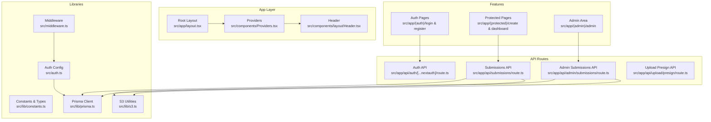
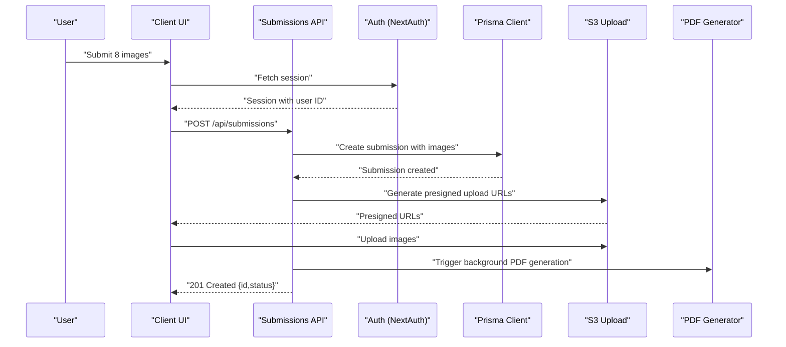
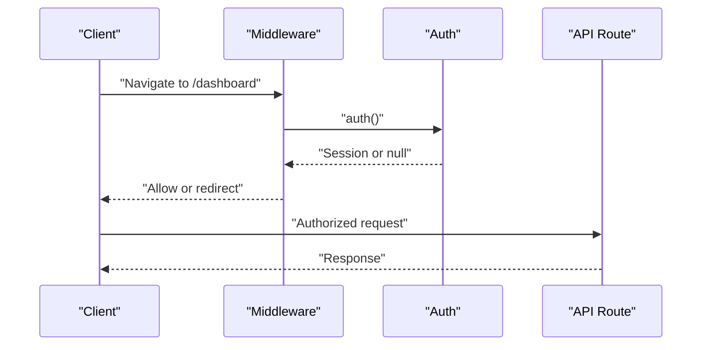
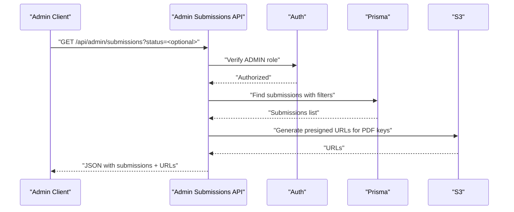
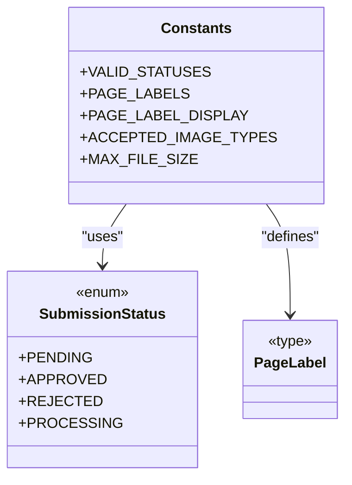
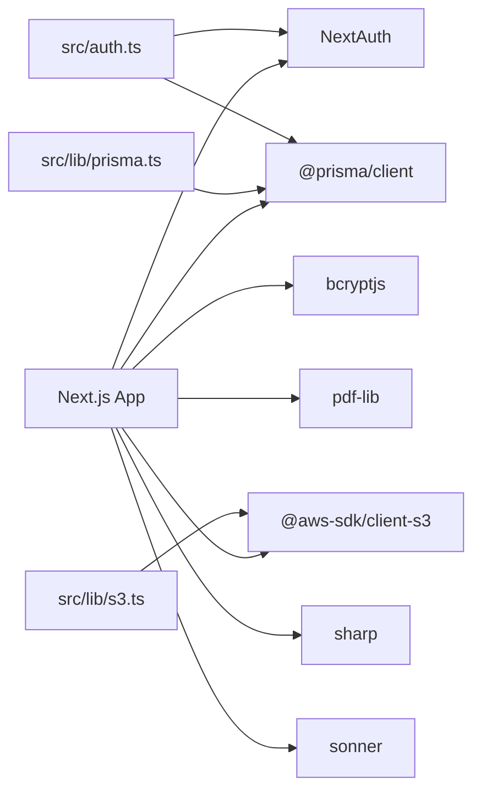

# Development Guidelines

<cite>
**Referenced Files in This Document**
- [package.json](file://package.json)
- [README.md](file://README.md)
- [eslint.config.mjs](file://eslint.config.mjs)
- [tsconfig.json](file://tsconfig.json)
- [next.config.ts](file://next.config.ts)
- [src/app/layout.tsx](file://src/app/layout.tsx)
- [src/components/Providers.tsx](file://src/components/Providers.tsx)
- [src/lib/constants.ts](file://src/lib/constants.ts)
- [src/middleware.ts](file://src/middleware.ts)
- [src/auth.ts](file://src/auth.ts)
- [src/components/auth/LoginForm.tsx](file://src/components/auth/LoginForm.tsx)
- [src/app/api/admin/submissions/route.ts](file://src/app/api/admin/submissions/route.ts)
- [src/app/api/submissions/route.ts](file://src/app/api/submissions/route.ts)
- [src/lib/prisma.ts](file://src/lib/prisma.ts)
- [src/lib/s3.ts](file://src/lib/s3.ts)
</cite>

## Table of Contents
1. [Introduction](#introduction)
2. [Project Structure](#project-structure)
3. [Core Components](#core-components)
4. [Architecture Overview](#architecture-overview)
5. [Detailed Component Analysis](#detailed-component-analysis)
6. [Dependency Analysis](#dependency-analysis)
7. [Performance Considerations](#performance-considerations)
8. [Troubleshooting Guide](#troubleshooting-guide)
9. [Contribution and Review Standards](#contribution-and-review-standards)
10. [Debugging and Local Development](#debugging-and-local-development)
11. [Release Procedures and Deployment](#release-procedures-and-deployment)
12. [Conclusion](#conclusion)

## Introduction
This document provides comprehensive development guidelines for Titchybook Creator. It covers code structure standards, TypeScript usage patterns, ESLint and Prettier configuration, component development practices, API design and error handling, testing strategies, contribution workflows, debugging techniques, and release procedures. The goal is to ensure consistent, maintainable, and scalable development across the Next.js application.

## Project Structure
The project follows a Next.js App Router structure with a clear separation of concerns:
- Application pages under src/app organized by feature routes and protected areas
- Shared UI and reusable components under src/components
- Libraries for database, AWS S3, and shared constants under src/lib
- Global styles and root layout under src/app
- Authentication and middleware integrations under src
- Type definitions and shared types under src/types

**Diagram sources**
- [src/app/layout.tsx:1-42](file://src/app/layout.tsx#L1-L42)
- [src/components/Providers.tsx:1-8](file://src/components/Providers.tsx#L1-L8)
- [src/app/api/submissions/route.ts:1-96](file://src/app/api/submissions/route.ts#L1-L96)
- [src/app/api/admin/submissions/route.ts:1-38](file://src/app/api/admin/submissions/route.ts#L1-L38)
- [src/lib/prisma.ts:1-10](file://src/lib/prisma.ts#L1-L10)
- [src/lib/s3.ts:1-81](file://src/lib/s3.ts#L1-L81)
- [src/auth.ts:1-80](file://src/auth.ts#L1-L80)
- [src/middleware.ts:1-6](file://src/middleware.ts#L1-L6)

**Section sources**
- [README.md:1-37](file://README.md#L1-L37)
- [src/app/layout.tsx:1-42](file://src/app/layout.tsx#L1-L42)
- [src/components/Providers.tsx:1-8](file://src/components/Providers.tsx#L1-L8)
- [src/lib/constants.ts:1-49](file://src/lib/constants.ts#L1-L49)
- [src/middleware.ts:1-6](file://src/middleware.ts#L1-L6)
- [src/auth.ts:1-80](file://src/auth.ts#L1-L80)
- [src/app/api/submissions/route.ts:1-96](file://src/app/api/submissions/route.ts#L1-L96)
- [src/app/api/admin/submissions/route.ts:1-38](file://src/app/api/admin/submissions/route.ts#L1-L38)
- [src/lib/prisma.ts:1-10](file://src/lib/prisma.ts#L1-L10)
- [src/lib/s3.ts:1-81](file://src/lib/s3.ts#L1-L81)

## Core Components
- Providers: Wraps the app with session provider for authentication state management.
- Root Layout: Sets up fonts, theme classes, global header, and toast notifications.
- Constants and Types: Centralized enums and type-safe constants for submission statuses and page labels.
- Middleware: Enforces authentication guards for protected routes.
- Auth: NextAuth configuration with JWT strategy, custom user/session typings, and credential provider.
- API Routes: Submission CRUD and admin listing with validation, authorization, and S3 presigned URLs.
- S3 Utilities: Presigned upload/download helpers and key builders for uploads and generated PDFs.
- Prisma Client: Singleton client with global caching for non-production environments.

**Section sources**
- [src/components/Providers.tsx:1-8](file://src/components/Providers.tsx#L1-L8)
- [src/app/layout.tsx:1-42](file://src/app/layout.tsx#L1-L42)
- [src/lib/constants.ts:1-49](file://src/lib/constants.ts#L1-L49)
- [src/middleware.ts:1-6](file://src/middleware.ts#L1-L6)
- [src/auth.ts:1-80](file://src/auth.ts#L1-L80)
- [src/app/api/submissions/route.ts:1-96](file://src/app/api/submissions/route.ts#L1-L96)
- [src/app/api/admin/submissions/route.ts:1-38](file://src/app/api/admin/submissions/route.ts#L1-L38)
- [src/lib/s3.ts:1-81](file://src/lib/s3.ts#L1-L81)
- [src/lib/prisma.ts:1-10](file://src/lib/prisma.ts#L1-L10)

## Architecture Overview
The system integrates Next.js App Router with NextAuth for authentication, Prisma for data modeling, and AWS S3 for storage. The flow below illustrates the end-to-end submission creation and PDF generation pipeline.

**Diagram sources**
- [src/app/api/submissions/route.ts:1-96](file://src/app/api/submissions/route.ts#L1-L96)
- [src/auth.ts:1-80](file://src/auth.ts#L1-L80)
- [src/lib/prisma.ts:1-10](file://src/lib/prisma.ts#L1-L10)
- [src/lib/s3.ts:1-81](file://src/lib/s3.ts#L1-L81)

## Detailed Component Analysis

### Authentication and Authorization
- NextAuth configuration defines a credential provider, JWT session strategy, and typed session/user interfaces.
- Middleware enforces route protection for dashboard, create, and admin paths.
- API routes validate session presence and roles before processing requests.

**Diagram sources**
- [src/middleware.ts:1-6](file://src/middleware.ts#L1-L6)
- [src/auth.ts:1-80](file://src/auth.ts#L1-L80)
- [src/app/api/admin/submissions/route.ts:1-38](file://src/app/api/admin/submissions/route.ts#L1-L38)
- [src/app/api/submissions/route.ts:1-96](file://src/app/api/submissions/route.ts#L1-L96)

**Section sources**
- [src/auth.ts:1-80](file://src/auth.ts#L1-L80)
- [src/middleware.ts:1-6](file://src/middleware.ts#L1-L6)
- [src/app/api/admin/submissions/route.ts:1-38](file://src/app/api/admin/submissions/route.ts#L1-L38)
- [src/app/api/submissions/route.ts:1-96](file://src/app/api/submissions/route.ts#L1-L96)

### Submission Management API
- GET /api/submissions lists current user’s submissions with included images ordered by creation date.
- POST /api/submissions validates payload with Zod, ensures all 8 page labels are present, creates submission in a transaction, and triggers asynchronous PDF generation.

**Diagram sources**
- [src/app/api/submissions/route.ts:1-96](file://src/app/api/submissions/route.ts#L1-L96)
- [src/lib/constants.ts:1-49](file://src/lib/constants.ts#L1-L49)

**Section sources**
- [src/app/api/submissions/route.ts:1-96](file://src/app/api/submissions/route.ts#L1-L96)
- [src/lib/constants.ts:1-49](file://src/lib/constants.ts#L1-L49)

### Admin Submissions API
- GET /api/admin/submissions filters by optional status, includes user and ordered images, and enriches each submission with presigned PDF download URLs.

**Diagram sources**
- [src/app/api/admin/submissions/route.ts:1-38](file://src/app/api/admin/submissions/route.ts#L1-L38)
- [src/lib/s3.ts:1-81](file://src/lib/s3.ts#L1-L81)
- [src/lib/prisma.ts:1-10](file://src/lib/prisma.ts#L1-L10)

**Section sources**
- [src/app/api/admin/submissions/route.ts:1-38](file://src/app/api/admin/submissions/route.ts#L1-L38)
- [src/lib/s3.ts:1-81](file://src/lib/s3.ts#L1-L81)
- [src/lib/prisma.ts:1-10](file://src/lib/prisma.ts#L1-L10)

### Component Development Guidelines
- File Organization
  - Feature-based grouping under src/components with domain-specific folders (e.g., auth, create, submissions).
  - Keep components client-side when using hooks or client-only features.
- Naming Conventions
  - PascalCase for component files and default exports.
  - kebab-case for route segments (e.g., src/app/(protected)/create/page.tsx).
- Prop Interfaces and State
  - Define explicit props for components; prefer functional components with clear input/output contracts.
  - Manage local state with useState and avoid unnecessary lifting.
- Performance
  - Use React.memo for stable props, useMemo/useCallback for derived data, and lazy loading for heavy assets.
  - Avoid blocking operations in render; defer heavy work to background tasks or server actions.

**Section sources**
- [src/components/auth/LoginForm.tsx:1-86](file://src/components/auth/LoginForm.tsx#L1-L86)
- [src/app/layout.tsx:1-42](file://src/app/layout.tsx#L1-L42)

### TypeScript Usage Patterns and Type Definitions
- Strict compiler options enable type checking without emitting JS.
- Path aliases simplify imports via @/ prefix.
- Centralized enums and discriminated unions for submission status and page labels.
- Zod schemas for runtime validation of API payloads.

**Diagram sources**
- [src/lib/constants.ts:1-49](file://src/lib/constants.ts#L1-L49)

**Section sources**
- [tsconfig.json:1-35](file://tsconfig.json#L1-L35)
- [src/lib/constants.ts:1-49](file://src/lib/constants.ts#L1-L49)

### ESLint and Formatting
- ESLint configuration extends Next.js recommended configs for web vitals and TypeScript.
- Ignores are overridden to include non-default paths as needed.
- Run linting via npm script; integrate with editor for real-time feedback.

**Section sources**
- [eslint.config.mjs:1-19](file://eslint.config.mjs#L1-L19)
- [package.json:1-43](file://package.json#L1-L43)

### Testing Strategies
- Unit tests for pure functions and utilities (e.g., constants, S3 key builders).
- Component tests for client components using React Testing Library and Next’s test renderer.
- API route tests with mock auth and Prisma client to validate request parsing, authorization, and error responses.
- Integration tests for end-to-end flows (e.g., submission creation, PDF generation trigger).

[No sources needed since this section provides general guidance]

### Error Handling
- API routes return structured errors with appropriate HTTP status codes.
- Client components surface user-facing errors and disable interactions during loading.
- Background tasks (e.g., PDF generation) are fire-and-forget with error logging.

**Section sources**
- [src/app/api/submissions/route.ts:1-96](file://src/app/api/submissions/route.ts#L1-L96)
- [src/components/auth/LoginForm.tsx:1-86](file://src/components/auth/LoginForm.tsx#L1-L86)

## Dependency Analysis
External dependencies include Next.js, NextAuth, Prisma, AWS SDK, bcrypt, pdf-lib, sharp, and Tailwind CSS. Internal libraries encapsulate Prisma client initialization and S3 operations.

**Diagram sources**
- [package.json:1-43](file://package.json#L1-L43)
- [src/lib/prisma.ts:1-10](file://src/lib/prisma.ts#L1-L10)
- [src/lib/s3.ts:1-81](file://src/lib/s3.ts#L1-L81)
- [src/auth.ts:1-80](file://src/auth.ts#L1-L80)

**Section sources**
- [package.json:1-43](file://package.json#L1-L43)
- [src/lib/prisma.ts:1-10](file://src/lib/prisma.ts#L1-L10)
- [src/lib/s3.ts:1-81](file://src/lib/s3.ts#L1-L81)
- [src/auth.ts:1-80](file://src/auth.ts#L1-L80)

## Performance Considerations
- Use background processing for long-running tasks (e.g., PDF generation) to avoid blocking API responses.
- Minimize payload sizes and leverage presigned URLs for efficient uploads/downloads.
- Enable incremental builds and strict mode to catch regressions early.
- Optimize image processing with sharp and cache frequently accessed assets.

[No sources needed since this section provides general guidance]

## Troubleshooting Guide
- Authentication failures: Verify environment variables for NextAuth and ensure proper JWT callbacks.
- Database connection issues: Confirm Prisma client initialization and environment variables for database URL.
- S3 upload/download failures: Check AWS credentials, bucket permissions, and key formats.
- API validation errors: Inspect Zod schema mismatches and ensure frontend sends exactly 8 unique page labels.

**Section sources**
- [src/auth.ts:1-80](file://src/auth.ts#L1-L80)
- [src/lib/prisma.ts:1-10](file://src/lib/prisma.ts#L1-L10)
- [src/lib/s3.ts:1-81](file://src/lib/s3.ts#L1-L81)
- [src/app/api/submissions/route.ts:1-96](file://src/app/api/submissions/route.ts#L1-L96)

## Contribution and Review Standards
- Branching: Feature branches from develop; keep commits small and focused.
- Pull Requests: Include a summary, rationale, and screenshots for UI changes; ensure CI passes.
- Code Reviews: Focus on correctness, readability, performance, and adherence to conventions.
- Linting and Formatting: Run ESLint and apply automatic fixes before submitting.

[No sources needed since this section provides general guidance]

## Debugging and Local Development
- Start the development server using the provided scripts.
- Use browser DevTools and React DevTools to inspect components and state.
- Add console logs strategically and rely on Next.js error pages for unhandled exceptions.
- For API debugging, log request bodies and responses; validate payloads with Zod errors.

**Section sources**
- [README.md:1-37](file://README.md#L1-L37)
- [package.json:1-43](file://package.json#L1-L43)

## Release Procedures and Deployment
- Build: Run the build script to compile the Next.js application.
- Test: Execute unit and integration tests locally before tagging.
- Tag and Version: Increment version in package.json; create a Git tag.
- Deploy: Push to the production branch and deploy via your platform of choice.

**Section sources**
- [package.json:1-43](file://package.json#L1-L43)
- [README.md:1-37](file://README.md#L1-L37)

## Conclusion
These guidelines establish a consistent foundation for building, maintaining, and extending Titchybook Creator. By adhering to the outlined conventions for code structure, TypeScript usage, API design, testing, and deployment, contributors can collaborate effectively while ensuring high-quality, reliable software.