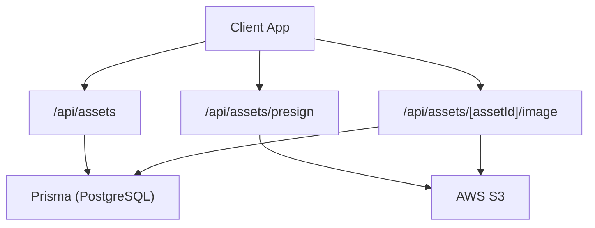
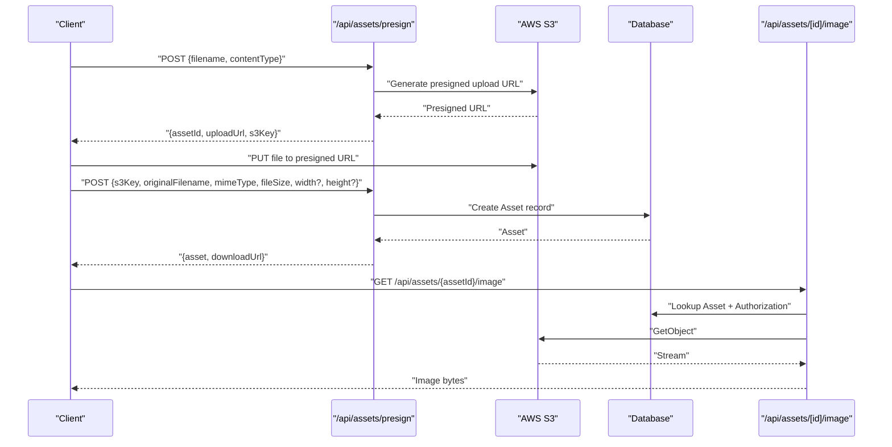
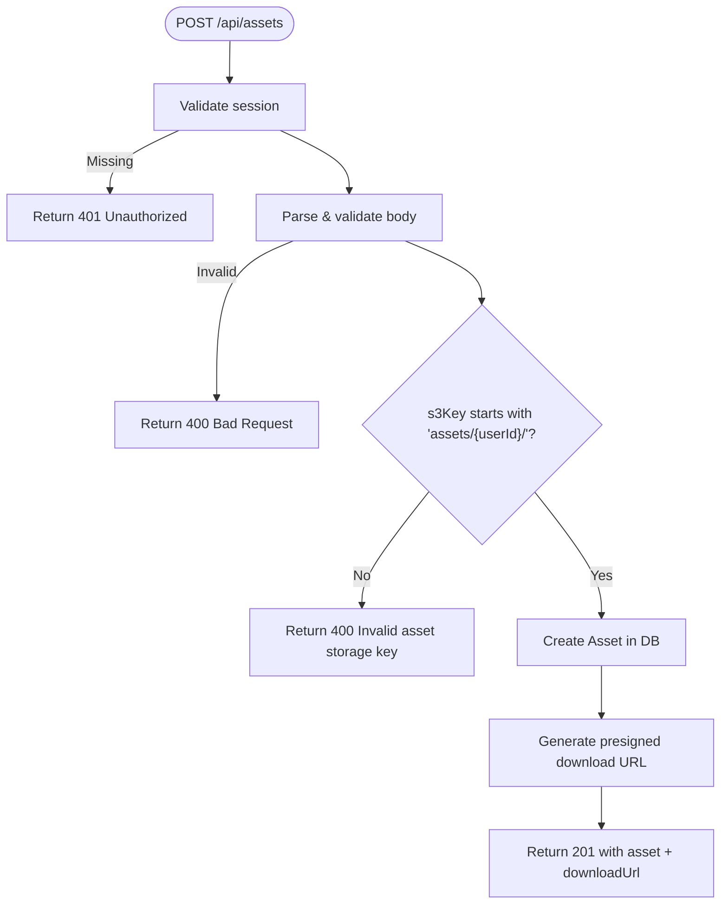
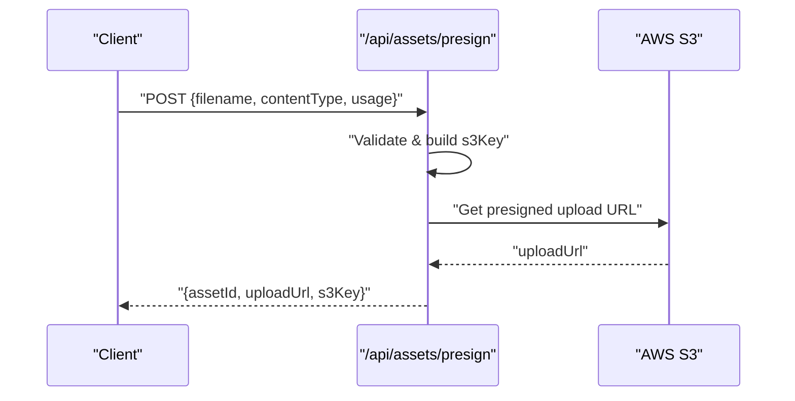
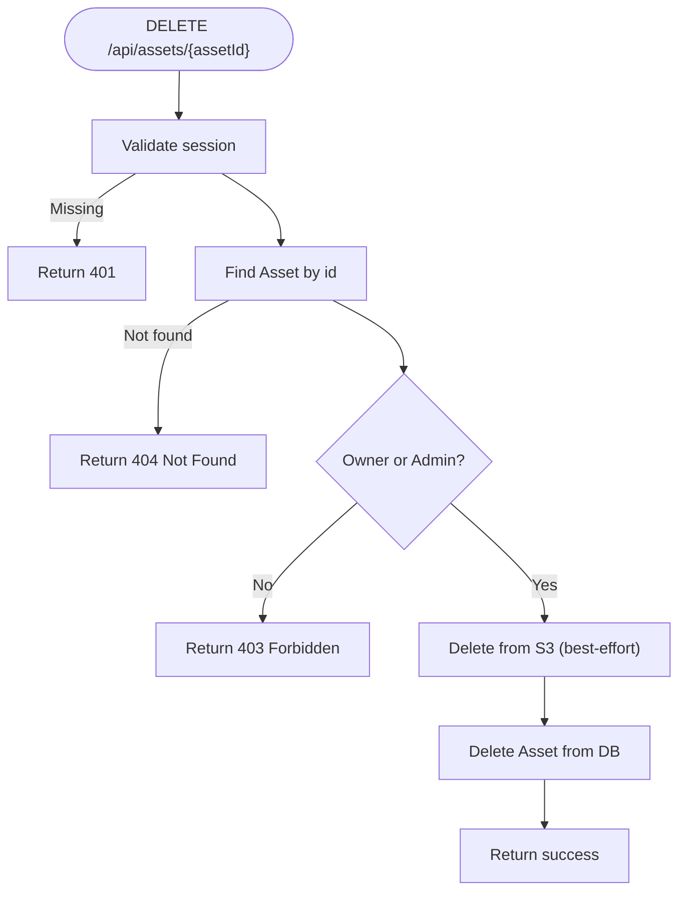
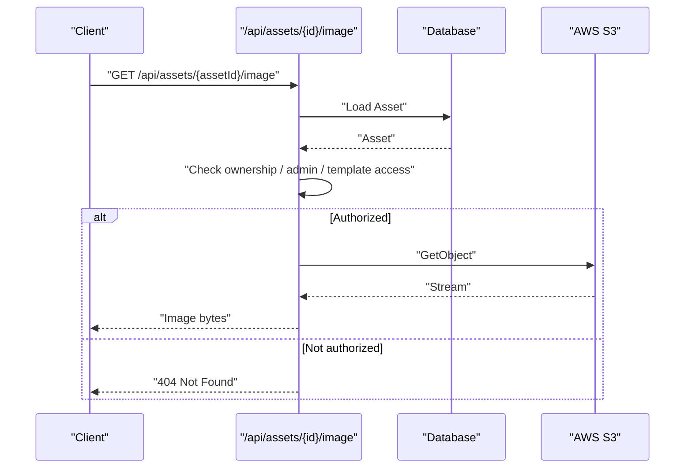
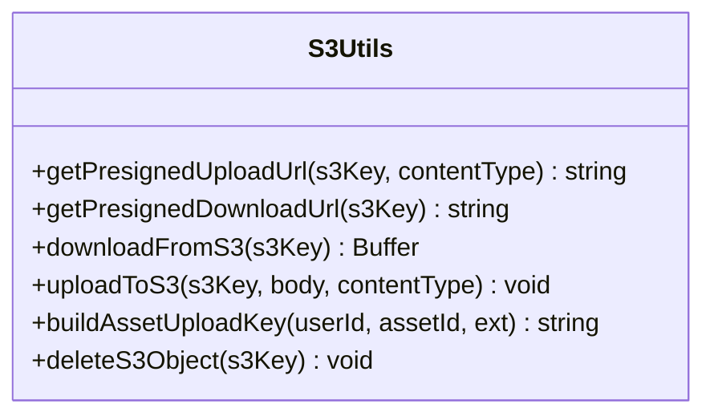
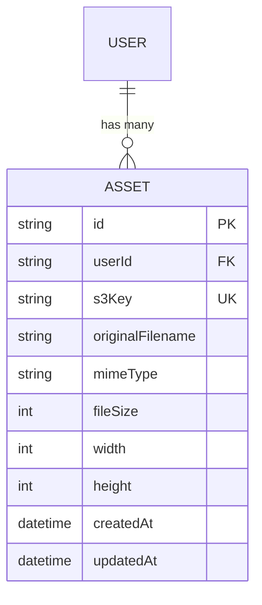
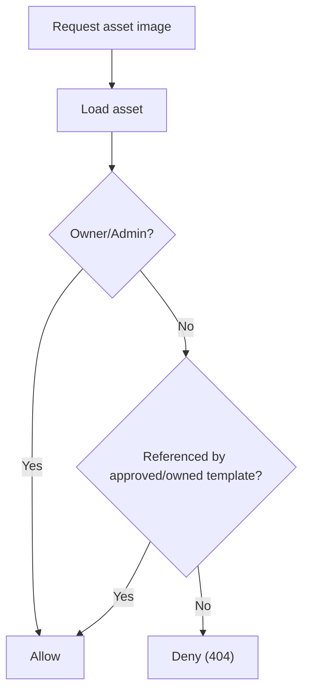
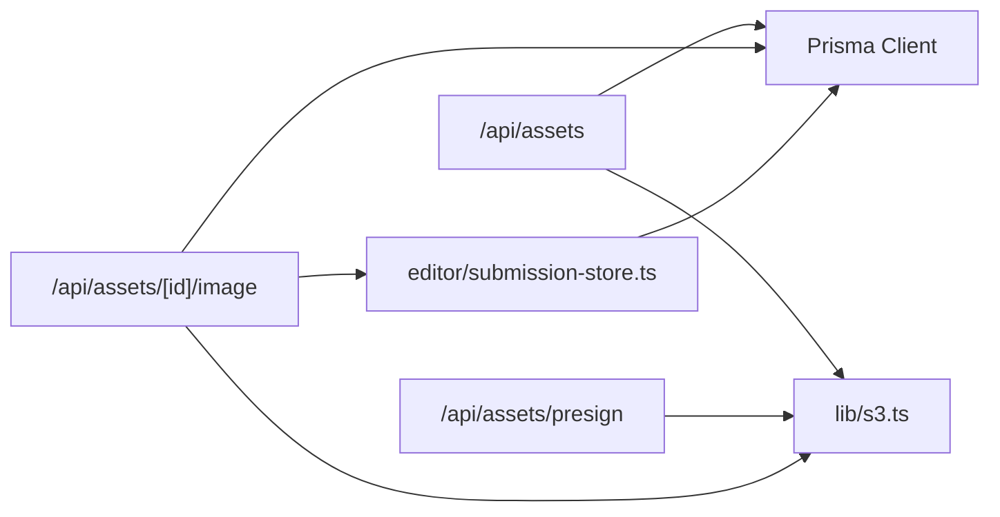

# Asset Management Utility

<cite>
**Referenced Files in This Document**
- [route.ts](file://src/app/api/assets/route.ts)
- [route.ts](file://src/app/api/assets/[assetId]/route.ts)
- [route.ts](file://src/app/api/assets/presign/route.ts)
- [route.ts](file://src/app/api/assets/[assetId]/image/route.ts)
- [s3.ts](file://src/lib/s3.ts)
- [constants.ts](file://src/lib/constants.ts)
- [schema.prisma](file://prisma/schema.prisma)
- [submission-store.ts](file://src/lib/editor/submission-store.ts)
- [check-assets.ts](file://scripts/check-assets.ts)
</cite>

## Table of Contents
1. [Introduction](#introduction)
2. [Project Structure](#project-structure)
3. [Core Components](#core-components)
4. [Architecture Overview](#architecture-overview)
5. [Detailed Component Analysis](#detailed-component-analysis)
6. [Dependency Analysis](#dependency-analysis)
7. [Performance Considerations](#performance-considerations)
8. [Troubleshooting Guide](#troubleshooting-guide)
9. [Conclusion](#conclusion)

## Introduction
This document explains the Asset Management Utility that powers secure, user-scoped image storage and retrieval for the application. It covers how assets are uploaded via presigned URLs, registered in the database, served through a protected proxy endpoint, and integrated with templates so that shared images can be used across approved templates or template instances.

## Project Structure
The asset system is implemented as a set of Next.js API routes backed by Prisma (PostgreSQL) and AWS S3:
- Upload orchestration and listing: /api/assets
- Presigned upload URL generation: /api/assets/presign
- Asset deletion: /api/assets/[assetId]
- Secure asset serving: /api/assets/[assetId]/image
- S3 client utilities: src/lib/s3.ts
- Validation constants: src/lib/constants.ts
- Data model: prisma/schema.prisma
- Template-based access control: src/lib/editor/submission-store.ts
- Diagnostic script: scripts/check-assets.ts

**Diagram sources**
- [route.ts:20-41](file://src/app/api/assets/route.ts#L20-L41)
- [route.ts:13-46](file://src/app/api/assets/presign/route.ts#L13-L46)
- [route.ts:26-86](file://src/app/api/assets/[assetId]/image/route.ts#L26-L86)
- [s3.ts:19-37](file://src/lib/s3.ts#L19-L37)

**Section sources**
- [route.ts:20-41](file://src/app/api/assets/route.ts#L20-L41)
- [route.ts:13-46](file://src/app/api/assets/presign/route.ts#L13-L46)
- [route.ts:26-86](file://src/app/api/assets/[assetId]/image/route.ts#L26-L86)
- [s3.ts:19-37](file://src/lib/s3.ts#L19-L37)

## Core Components
- Asset listing and creation: GET/POST on /api/assets
- Presigned upload URL generation: POST on /api/assets/presign
- Asset deletion: DELETE on /api/assets/[assetId]
- Secure asset serving: GET on /api/assets/[assetId]/image
- S3 operations: upload/download/delete and presigning
- Access control: ownership, admin role, and template-based sharing

Key behaviors:
- All endpoints require authentication; responses include appropriate error codes for unauthorized or forbidden access.
- Uploads use presigned URLs to avoid routing large files through the server.
- Asset metadata is stored in the database with constraints and indexes for efficient queries.
- Serving assets uses a proxy endpoint that enforces authorization before streaming from S3.

**Section sources**
- [route.ts:11-91](file://src/app/api/assets/route.ts#L11-L91)
- [route.ts:9-54](file://src/app/api/assets/[assetId]/route.ts#L9-L54)
- [route.ts:13-46](file://src/app/api/assets/presign/route.ts#L13-L46)
- [route.ts:26-86](file://src/app/api/assets/[assetId]/image/route.ts#L26-L86)
- [s3.ts:19-109](file://src/lib/s3.ts#L19-L109)
- [schema.prisma:101-115](file://prisma/schema.prisma#L101-L115)

## Architecture Overview
The asset flow combines client-side uploads directly to S3 with server-side registration and controlled serving.

**Diagram sources**
- [route.ts:13-46](file://src/app/api/assets/presign/route.ts#L13-L46)
- [route.ts:43-91](file://src/app/api/assets/route.ts#L43-L91)
- [route.ts:26-86](file://src/app/api/assets/[assetId]/image/route.ts#L26-L86)
- [s3.ts:19-37](file://src/lib/s3.ts#L19-L37)

## Detailed Component Analysis

### Asset Listing and Creation (/api/assets)
- Authentication: Requires a valid session; returns 401 if missing.
- GET: Returns all assets for the current user, sorted by newest first, with preview/download URLs proxied through the image endpoint.
- POST: Validates input using a schema (file size limits, accepted MIME types), ensures the S3 key belongs under the user’s folder, creates an Asset record, and returns a presigned download URL.

**Diagram sources**
- [route.ts:43-91](file://src/app/api/assets/route.ts#L43-L91)
- [constants.ts:52-58](file://src/lib/constants.ts#L52-L58)

**Section sources**
- [route.ts:11-91](file://src/app/api/assets/route.ts#L11-L91)
- [constants.ts:52-58](file://src/lib/constants.ts#L52-L58)

### Presigned Upload URL Generation (/api/assets/presign)
- Authentication: Required; returns 401 if missing.
- Input validation: filename, contentType must be allowed image types; usage defaults to editor.
- Generates a unique assetId and constructs an S3 key scoped to the user.
- Returns assetId, uploadUrl, and s3Key for direct client upload to S3.

**Diagram sources**
- [route.ts:13-46](file://src/app/api/assets/presign/route.ts#L13-L46)
- [s3.ts:19-29](file://src/lib/s3.ts#L19-L29)

**Section sources**
- [route.ts:13-46](file://src/app/api/assets/presign/route.ts#L13-L46)
- [s3.ts:19-29](file://src/lib/s3.ts#L19-L29)

### Asset Deletion (/api/assets/[assetId])
- Authentication and ownership checks: Only the owner or an admin can delete.
- Attempts to delete the object from S3 first; continues even if S3 deletion fails to ensure DB cleanup.
- Deletes the Asset record from the database.

**Diagram sources**
- [route.ts:9-54](file://src/app/api/assets/[assetId]/route.ts#L9-L54)

**Section sources**
- [route.ts:9-54](file://src/app/api/assets/[assetId]/route.ts#L9-L54)

### Secure Asset Serving (/api/assets/[assetId]/image)
- Authentication required; returns 401 if missing.
- Authorization ladder:
  - Owner of the asset
  - Admin role
  - Asset referenced by a TemplateElement whose parent template is approved or owned by the caller
- Streams the file from S3 with proper content type and caching headers.

**Diagram sources**
- [route.ts:26-86](file://src/app/api/assets/[assetId]/image/route.ts#L26-L86)
- [submission-store.ts:53-66](file://src/lib/editor/submission-store.ts#L53-L66)

**Section sources**
- [route.ts:26-86](file://src/app/api/assets/[assetId]/image/route.ts#L26-L86)
- [submission-store.ts:53-66](file://src/lib/editor/submission-store.ts#L53-L66)

### S3 Utilities (src/lib/s3.ts)
- Provides an S3 client configured via environment variables.
- Functions:
  - getPresignedUploadUrl: generates PUT presigned URLs
  - getPresignedDownloadUrl: generates GET presigned URLs
  - downloadFromS3/uploadToS3: direct stream/buffer operations
  - buildAssetUploadKey: constructs user-scoped keys
  - deleteS3Object: deletes objects by key

**Diagram sources**
- [s3.ts:19-109](file://src/lib/s3.ts#L19-L109)

**Section sources**
- [s3.ts:19-109](file://src/lib/s3.ts#L19-L109)

### Data Model (prisma/schema.prisma)
- Asset model stores per-user image metadata and links to S3 keys.
- Indexes on userId for efficient listing and filtering.
- Relationships tie assets to users.

**Diagram sources**
- [schema.prisma:10-30](file://prisma/schema.prisma#L10-L30)
- [schema.prisma:101-115](file://prisma/schema.prisma#L101-L115)

**Section sources**
- [schema.prisma:101-115](file://prisma/schema.prisma#L101-L115)

### Template-Based Asset Access
- Assets can be shared via templates: if an asset is referenced by a TemplateElement within an approved template or a template instance owned by the caller, it becomes accessible.
- The image serving endpoint delegates this check to submission-store logic.

**Diagram sources**
- [submission-store.ts:53-66](file://src/lib/editor/submission-store.ts#L53-L66)
- [route.ts:26-86](file://src/app/api/assets/[assetId]/image/route.ts#L26-L86)

**Section sources**
- [submission-store.ts:53-66](file://src/lib/editor/submission-store.ts#L53-L66)
- [route.ts:26-86](file://src/app/api/assets/[assetId]/image/route.ts#L26-L86)

## Dependency Analysis
- API routes depend on:
  - Authentication middleware
  - Prisma client for DB operations
  - S3 utilities for presigning and I/O
  - Constants for validation rules
  - Submission store for template-based access checks
- The data layer depends on PostgreSQL via Prisma.
- External dependency: AWS S3 for object storage.

**Diagram sources**
- [route.ts:20-41](file://src/app/api/assets/route.ts#L20-L41)
- [route.ts:13-46](file://src/app/api/assets/presign/route.ts#L13-L46)
- [route.ts:26-86](file://src/app/api/assets/[assetId]/image/route.ts#L26-L86)
- [submission-store.ts:53-66](file://src/lib/editor/submission-store.ts#L53-L66)

**Section sources**
- [route.ts:20-41](file://src/app/api/assets/route.ts#L20-L41)
- [route.ts:13-46](file://src/app/api/assets/presign/route.ts#L13-L46)
- [route.ts:26-86](file://src/app/api/assets/[assetId]/image/route.ts#L26-L86)
- [submission-store.ts:53-66](file://src/lib/editor/submission-store.ts#L53-L66)

## Performance Considerations
- Use presigned URLs to offload large uploads directly to S3, reducing server bandwidth and CPU.
- Stream asset responses instead of buffering entire files when possible; current image route buffers chunks into memory before sending—consider streaming for very large images.
- Cache images at the browser level with appropriate Cache-Control headers; the image endpoint sets public caching for one hour.
- Database indexes on userId improve listing performance.
- Avoid unnecessary re-fetches by leveraging stable asset IDs and CDN-friendly paths.

[No sources needed since this section provides general guidance]

## Troubleshooting Guide
Common issues and diagnostics:
- 401 Unauthorized: Missing or invalid session; verify authentication.
- 400 Bad Request: Invalid payload or file type/size; check constants for allowed MIME types and max file size.
- 403 Forbidden: Attempted deletion or access without ownership/admin rights; confirm user role and ownership.
- 404 Not Found: Asset does not exist or not accessible; verify asset ID and template-based access rules.
- S3 errors: Misconfigured credentials, bucket name, or region; validate environment variables.

Diagnostic tool:
- scripts/check-assets.ts queries the database for specific asset IDs and performs HEAD requests against S3 to verify existence and metadata.

**Section sources**
- [route.ts:20-41](file://src/app/api/assets/route.ts#L20-L41)
- [route.ts:43-91](file://src/app/api/assets/route.ts#L43-L91)
- [route.ts:9-54](file://src/app/api/assets/[assetId]/route.ts#L9-L54)
- [route.ts:26-86](file://src/app/api/assets/[assetId]/image/route.ts#L26-L86)
- [constants.ts:52-58](file://src/lib/constants.ts#L52-L58)
- [check-assets.ts:7-50](file://scripts/check-assets.ts#L7-L50)

## Conclusion
The Asset Management Utility provides a secure, scalable approach to handling user-owned images with optional sharing via templates. It leverages presigned URLs for efficient uploads, enforces strict authorization for access, and integrates cleanly with the template system to support collaborative workflows. Proper configuration of environment variables and adherence to validation rules ensures reliable operation.

[No sources needed since this section summarizes without analyzing specific files]