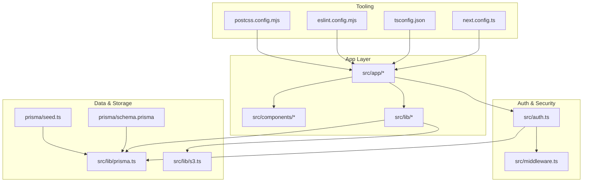
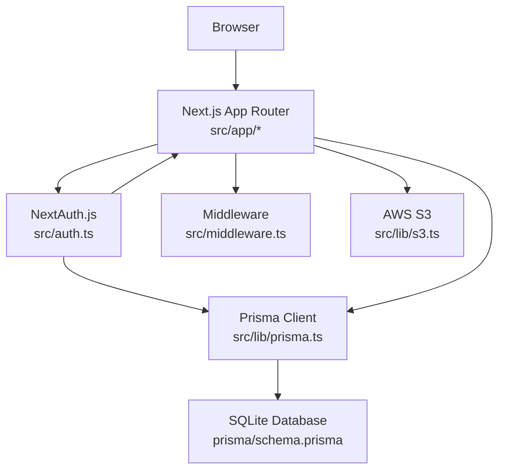
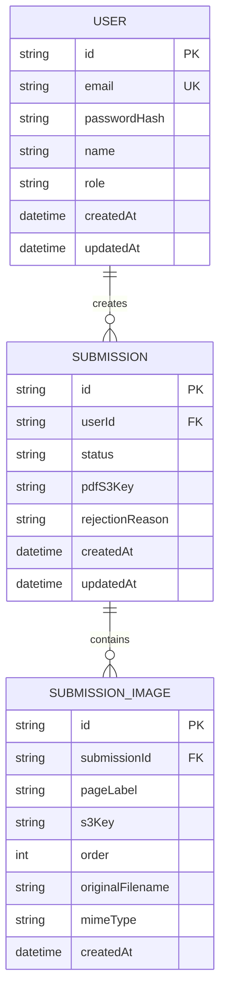
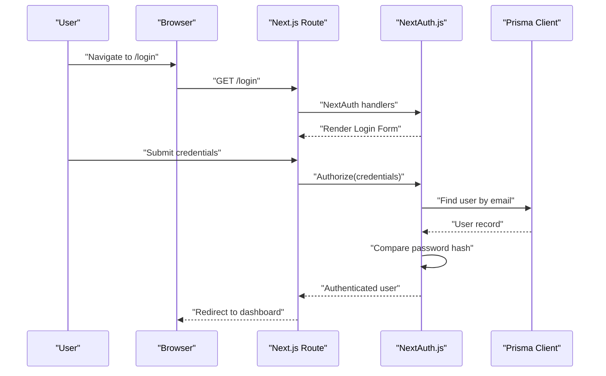
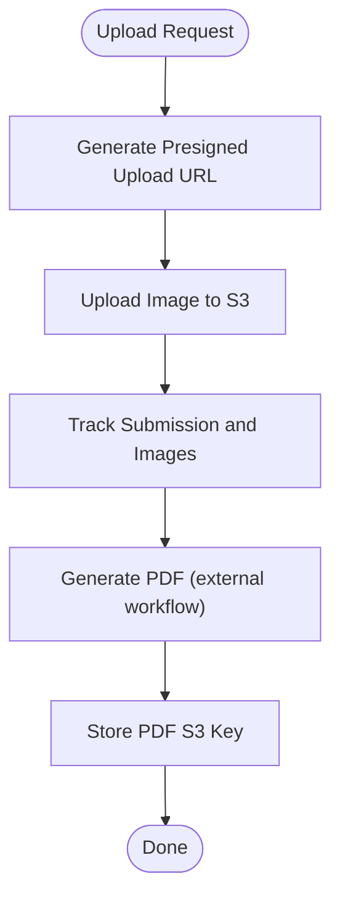
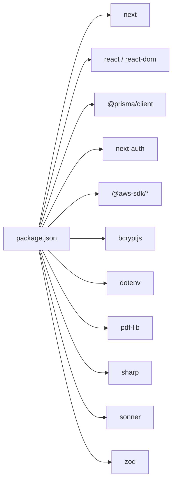

# Getting Started

<cite>
**Referenced Files in This Document**
- [README.md](file://README.md)
- [package.json](file://package.json)
- [next.config.ts](file://next.config.ts)
- [tsconfig.json](file://tsconfig.json)
- [eslint.config.mjs](file://eslint.config.mjs)
- [postcss.config.mjs](file://postcss.config.mjs)
- [prisma/schema.prisma](file://prisma/schema.prisma)
- [prisma/seed.ts](file://prisma/seed.ts)
- [src/lib/prisma.ts](file://src/lib/prisma.ts)
- [src/lib/s3.ts](file://src/lib/s3.ts)
- [src/auth.ts](file://src/auth.ts)
- [src/middleware.ts](file://src/middleware.ts)
- [src/lib/constants.ts](file://src/lib/constants.ts)
</cite>

## Table of Contents
1. [Introduction](#introduction)
2. [Project Structure](#project-structure)
3. [Core Components](#core-components)
4. [Architecture Overview](#architecture-overview)
5. [Detailed Component Analysis](#detailed-component-analysis)
6. [Dependency Analysis](#dependency-analysis)
7. [Performance Considerations](#performance-considerations)
8. [Troubleshooting Guide](#troubleshooting-guide)
9. [Conclusion](#conclusion)
10. [Appendices](#appendices)

## Introduction
Titchybook Creator is a Next.js application that enables users to submit image assets for print-on-demand book creation. It integrates authentication, image uploads via signed URLs, database persistence with Prisma and SQLite, and PDF generation workflows. This guide helps you install, configure, and run the project locally, including environment setup, database initialization, and first-run verification.

## Project Structure
The repository follows a standard Next.js App Router layout with TypeScript, Tailwind CSS v4 via PostCSS, ESLint, and Prisma ORM. Key areas include:
- Application routes under src/app
- Shared UI components under src/components
- Libraries and integrations under src/lib
- Authentication and middleware under src/auth.ts and src/middleware.ts
- Prisma schema and seed under prisma/
- Build and lint configurations under next.config.ts, tsconfig.json, eslint.config.mjs, postcss.config.mjs

**Diagram sources**
- [next.config.ts:1-8](file://next.config.ts#L1-L8)
- [tsconfig.json:1-35](file://tsconfig.json#L1-L35)
- [eslint.config.mjs:1-19](file://eslint.config.mjs#L1-L19)
- [postcss.config.mjs:1-8](file://postcss.config.mjs#L1-L8)
- [prisma/schema.prisma:1-48](file://prisma/schema.prisma#L1-L48)
- [prisma/seed.ts:1-36](file://prisma/seed.ts#L1-L36)
- [src/lib/prisma.ts:1-10](file://src/lib/prisma.ts#L1-L10)
- [src/lib/s3.ts:1-81](file://src/lib/s3.ts#L1-L81)
- [src/auth.ts:1-80](file://src/auth.ts#L1-L80)
- [src/middleware.ts:1-6](file://src/middleware.ts#L1-L6)

**Section sources**
- [next.config.ts:1-8](file://next.config.ts#L1-L8)
- [tsconfig.json:1-35](file://tsconfig.json#L1-L35)
- [eslint.config.mjs:1-19](file://eslint.config.mjs#L1-L19)
- [postcss.config.mjs:1-8](file://postcss.config.mjs#L1-L8)
- [prisma/schema.prisma:1-48](file://prisma/schema.prisma#L1-L48)
- [prisma/seed.ts:1-36](file://prisma/seed.ts#L1-L36)
- [src/lib/prisma.ts:1-10](file://src/lib/prisma.ts#L1-L10)
- [src/lib/s3.ts:1-81](file://src/lib/s3.ts#L1-L81)
- [src/auth.ts:1-80](file://src/auth.ts#L1-L80)
- [src/middleware.ts:1-6](file://src/middleware.ts#L1-L6)

## Core Components
- Next.js App Router: Routes, pages, API handlers, and shared UI live under src/app.
- Authentication: NextAuth.js with JWT strategy, credential provider, and protected routes via middleware.
- Database: Prisma Client with SQLite datasource configured via DATABASE_URL.
- Storage: AWS S3 integration using presigned URLs for uploads and downloads.
- Tooling: TypeScript compiler options, ESLint configuration, Tailwind CSS via PostCSS plugin, and Next.js config.

**Section sources**
- [package.json:1-43](file://package.json#L1-L43)
- [src/auth.ts:1-80](file://src/auth.ts#L1-L80)
- [src/middleware.ts:1-6](file://src/middleware.ts#L1-L6)
- [prisma/schema.prisma:1-48](file://prisma/schema.prisma#L1-L48)
- [src/lib/s3.ts:1-81](file://src/lib/s3.ts#L1-L81)
- [next.config.ts:1-8](file://next.config.ts#L1-L8)
- [tsconfig.json:1-35](file://tsconfig.json#L1-L35)
- [eslint.config.mjs:1-19](file://eslint.config.mjs#L1-L19)
- [postcss.config.mjs:1-8](file://postcss.config.mjs#L1-L8)

## Architecture Overview
The system integrates frontend routing, authentication, local database, and cloud storage. Requests flow through Next.js API routes and pages, with authentication enforced by middleware and protected routes. Data is persisted via Prisma and stored in SQLite, while images and PDFs are handled via AWS S3 using presigned URLs.

**Diagram sources**
- [src/auth.ts:1-80](file://src/auth.ts#L1-L80)
- [src/middleware.ts:1-6](file://src/middleware.ts#L1-L6)
- [src/lib/prisma.ts:1-10](file://src/lib/prisma.ts#L1-L10)
- [prisma/schema.prisma:1-48](file://prisma/schema.prisma#L1-L48)
- [src/lib/s3.ts:1-81](file://src/lib/s3.ts#L1-L81)

## Detailed Component Analysis

### Prerequisites and Environment Setup
- Node.js: The project uses Next.js 16.1.6 and TypeScript; ensure a compatible Node.js version per your platform’s LTS policy. The project does not declare a minimum Node.js version in package metadata; align with your environment’s supported LTS range.
- Package Managers: The project supports npm, yarn, pnpm, and bun for development scripts.
- Environment Variables: Required variables include database and AWS S3 credentials. See the Environment Variables section for details.

**Section sources**
- [package.json:5-15](file://package.json#L5-L15)
- [prisma/schema.prisma:5-8](file://prisma/schema.prisma#L5-L8)
- [src/lib/s3.ts:8-14](file://src/lib/s3.ts#L8-L14)

### Installation Steps
1. Clone the repository to your machine.
2. Install dependencies using your preferred package manager:
   - npm: npm ci
   - yarn: yarn install
   - pnpm: pnpm install
   - bun: bun install
3. Create a local SQLite database using Prisma Migrate and seed the admin user:
   - Initialize and apply migrations
   - Seed the database with an admin user using environment variables or defaults
4. Configure environment variables as described below.
5. Start the development server and open http://localhost:3000.

Verification:
- The development script runs the Next.js dev server.
- Opening the browser to the localhost URL should render the home page.

**Section sources**
- [README.md:3-21](file://README.md#L3-L21)
- [package.json:5-10](file://package.json#L5-L10)
- [prisma/schema.prisma:1-8](file://prisma/schema.prisma#L1-L8)
- [prisma/seed.ts:7-28](file://prisma/seed.ts#L7-L28)

### Development Server Setup
- Run the development server using your chosen package manager:
  - npm run dev
  - yarn dev
  - pnpm dev
  - bun dev
- Expected output: The terminal displays Next.js starting the development server on port 3000. Open http://localhost:3000 in your browser.

**Section sources**
- [README.md:5-17](file://README.md#L5-L17)
- [package.json:6](file://package.json#L6)

### First Run and Feature Exploration
- Visit http://localhost:3000 to see the landing page.
- Navigate to the login page and authenticate using the seeded admin account (see Seed section).
- Explore protected routes:
  - Dashboard: Accessible after login
  - Create: Submit images for processing
  - Admin: Manage submissions (requires ADMIN role)
- Verify authentication enforcement via middleware for protected paths.

**Section sources**
- [src/middleware.ts:3-5](file://src/middleware.ts#L3-L5)
- [prisma/seed.ts:7-28](file://prisma/seed.ts#L7-L28)

### Environment Variables and Configuration
Required environment variables:
- Database
  - DATABASE_URL: SQLite connection string for Prisma
- AWS S3
  - AWS_REGION
  - AWS_ACCESS_KEY_ID
  - AWS_SECRET_ACCESS_KEY
  - S3_BUCKET_NAME
- Optional (for seeding)
  - ADMIN_EMAIL
  - ADMIN_PASSWORD

Notes:
- The application expects these variables to be present at runtime.
- The Prisma schema defines SQLite as the provider and reads DATABASE_URL from the environment.
- S3 integration requires valid AWS credentials and bucket name.

**Section sources**
- [prisma/schema.prisma:5-8](file://prisma/schema.prisma#L5-L8)
- [src/lib/s3.ts:8-14](file://src/lib/s3.ts#L8-L14)
- [prisma/seed.ts:7-9](file://prisma/seed.ts#L7-L9)

### Database Setup
- Provider: SQLite
- Datasource URL: Provided via DATABASE_URL
- Schema: Defined in prisma/schema.prisma with models for User, Submission, and SubmissionImage
- Initialization:
  - Apply migrations to create tables
  - Seed the database to create an admin user with configurable credentials

**Diagram sources**
- [prisma/schema.prisma:10-47](file://prisma/schema.prisma#L10-L47)

**Section sources**
- [prisma/schema.prisma:1-48](file://prisma/schema.prisma#L1-L48)
- [prisma/seed.ts:7-28](file://prisma/seed.ts#L7-L28)
- [src/lib/prisma.ts:1-10](file://src/lib/prisma.ts#L1-L10)

### Authentication and Middleware
- NextAuth.js configuration:
  - Credential provider with email/password
  - JWT session strategy
  - Protected pages redirect to /login
- Middleware:
  - Enforces authentication for routes under /dashboard, /create, and /admin

**Diagram sources**
- [src/auth.ts:27-79](file://src/auth.ts#L27-L79)
- [src/lib/prisma.ts:1-10](file://src/lib/prisma.ts#L1-L10)

**Section sources**
- [src/auth.ts:1-80](file://src/auth.ts#L1-L80)
- [src/middleware.ts:1-6](file://src/middleware.ts#L1-L6)

### Image Uploads and PDF Generation
- Presigned URLs:
  - Upload: getPresignedUploadUrl generates a short-lived URL for PUT
  - Download: getPresignedDownloadUrl generates a URL for GET
- Storage keys:
  - Images: uploads/{userId}/{submissionId}/{pageLabel}.{ext}
  - PDFs: pdfs/{userId}/{submissionId}/titchybook.pdf
- Constraints:
  - Accepted image MIME types and max file size are defined in constants

**Diagram sources**
- [src/lib/s3.ts:18-36](file://src/lib/s3.ts#L18-L36)
- [src/lib/s3.ts:66-80](file://src/lib/s3.ts#L66-L80)
- [src/lib/constants.ts:42-49](file://src/lib/constants.ts#L42-L49)

**Section sources**
- [src/lib/s3.ts:1-81](file://src/lib/s3.ts#L1-L81)
- [src/lib/constants.ts:1-49](file://src/lib/constants.ts#L1-L49)

## Dependency Analysis
- Runtime dependencies include Next.js, React, Prisma Client, NextAuth, AWS SDK, bcrypt, dotenv, pdf-lib, sharp, sonner, and zod.
- Dev dependencies include Prisma, Tailwind CSS v4, TypeScript, ESLint, and related tooling.
- Scripts define dev, build, start, and lint tasks.

**Diagram sources**
- [package.json:11-25](file://package.json#L11-L25)

**Section sources**
- [package.json:1-43](file://package.json#L1-L43)

## Performance Considerations
- Keep file sizes reasonable; the project enforces a maximum file size for uploads.
- Use presigned URLs to offload uploads to S3 and reduce server bandwidth.
- Leverage Next.js incremental static regeneration and caching where appropriate.
- Monitor Prisma queries and avoid N+1 patterns; use relations and includes judiciously.

[No sources needed since this section provides general guidance]

## Troubleshooting Guide
Common issues and resolutions:
- Database URL missing or invalid
  - Symptom: Prisma client fails to connect
  - Fix: Set DATABASE_URL to a valid SQLite URL and re-run migrations
- AWS credentials missing
  - Symptom: S3 operations fail with missing credentials
  - Fix: Set AWS_REGION, AWS_ACCESS_KEY_ID, AWS_SECRET_ACCESS_KEY, and S3_BUCKET_NAME
- Admin user not found
  - Symptom: Cannot log in as admin
  - Fix: Seed the database; optionally set ADMIN_EMAIL and ADMIN_PASSWORD
- Protected route access denied
  - Symptom: Redirect to /login
  - Fix: Log in; ensure middleware matcher includes the route path
- ESLint errors
  - Symptom: Lint failures during development
  - Fix: Review eslint.config.mjs and resolve reported issues
- Tailwind CSS not applied
  - Symptom: Styles missing
  - Fix: Ensure Tailwind plugin is enabled in postcss.config.mjs

**Section sources**
- [prisma/schema.prisma:5-8](file://prisma/schema.prisma#L5-L8)
- [src/lib/s3.ts:8-14](file://src/lib/s3.ts#L8-L14)
- [prisma/seed.ts:7-9](file://prisma/seed.ts#L7-L9)
- [src/middleware.ts:3-5](file://src/middleware.ts#L3-L5)
- [eslint.config.mjs:1-19](file://eslint.config.mjs#L1-L19)
- [postcss.config.mjs:1-8](file://postcss.config.mjs#L1-L8)

## Conclusion
You now have the essentials to install, configure, and run Titchybook Creator locally. Ensure environment variables are set, initialize the database, and explore the authentication-protected features. Use the troubleshooting section to resolve common setup issues quickly.

[No sources needed since this section summarizes without analyzing specific files]

## Appendices

### A. Environment Variable Reference
- DATABASE_URL: SQLite connection string
- AWS_REGION: AWS region identifier
- AWS_ACCESS_KEY_ID: AWS access key
- AWS_SECRET_ACCESS_KEY: AWS secret key
- S3_BUCKET_NAME: Target S3 bucket
- ADMIN_EMAIL: Seed admin email (optional)
- ADMIN_PASSWORD: Seed admin password (optional)

**Section sources**
- [prisma/schema.prisma:5-8](file://prisma/schema.prisma#L5-L8)
- [src/lib/s3.ts:8-14](file://src/lib/s3.ts#L8-L14)
- [prisma/seed.ts:7-9](file://prisma/seed.ts#L7-L9)

### B. Project Structure Navigation
- src/app: Pages, API handlers, and shared layouts
- src/components: Reusable UI components
- src/lib: Integrations (Prisma, S3, constants)
- src/auth.ts: Authentication configuration
- src/middleware.ts: Route protection
- prisma/: Prisma schema, migrations, and seed
- Tooling configs: next.config.ts, tsconfig.json, eslint.config.mjs, postcss.config.mjs

**Section sources**
- [next.config.ts:1-8](file://next.config.ts#L1-L8)
- [tsconfig.json:21-23](file://tsconfig.json#L21-L23)
- [eslint.config.mjs:1-19](file://eslint.config.mjs#L1-L19)
- [postcss.config.mjs:1-8](file://postcss.config.mjs#L1-L8)