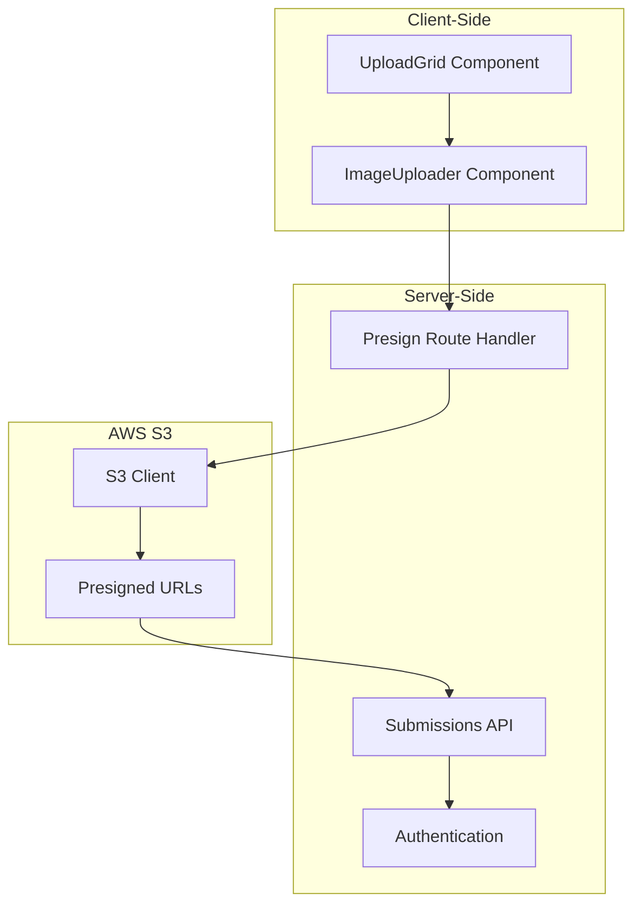
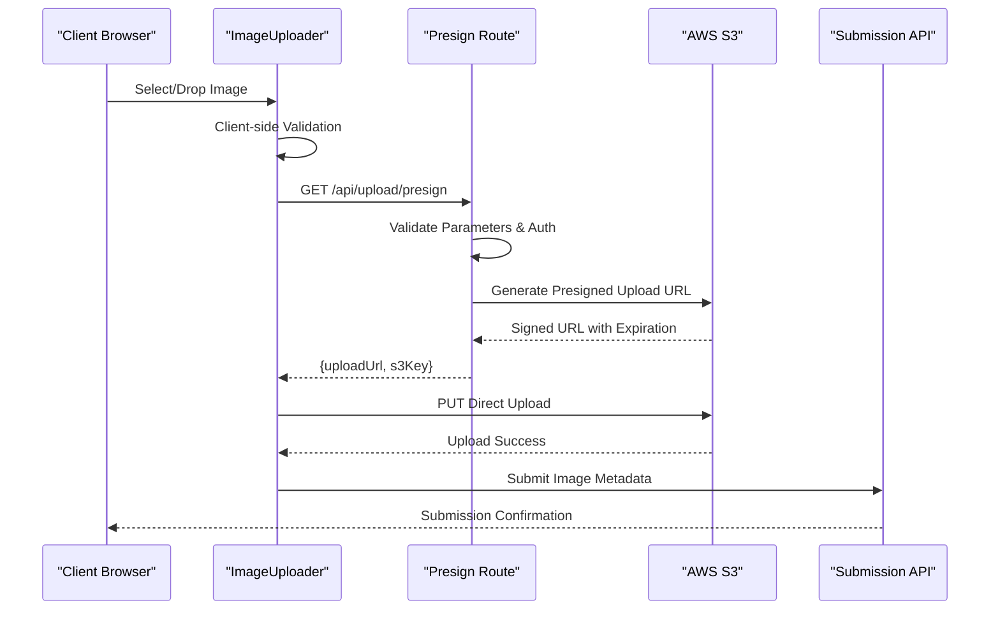
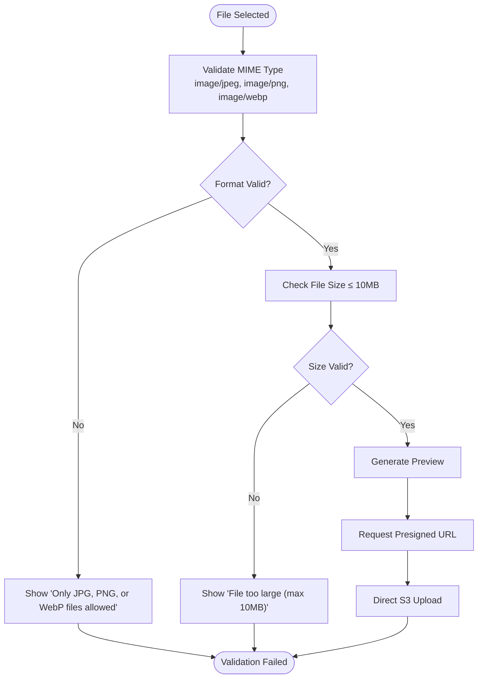
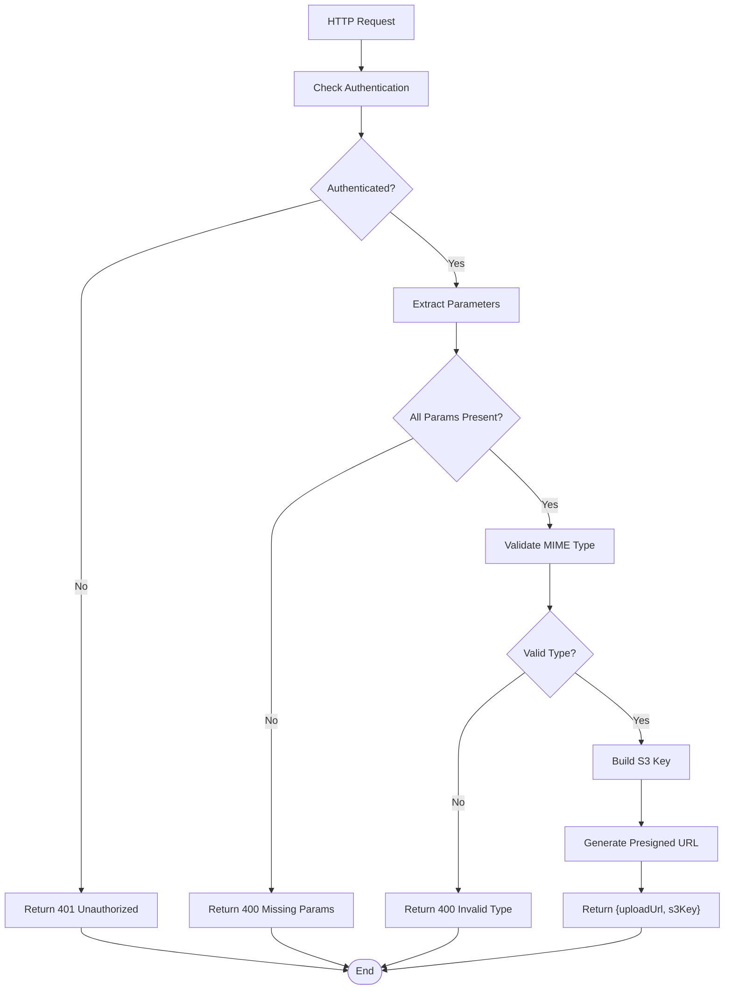
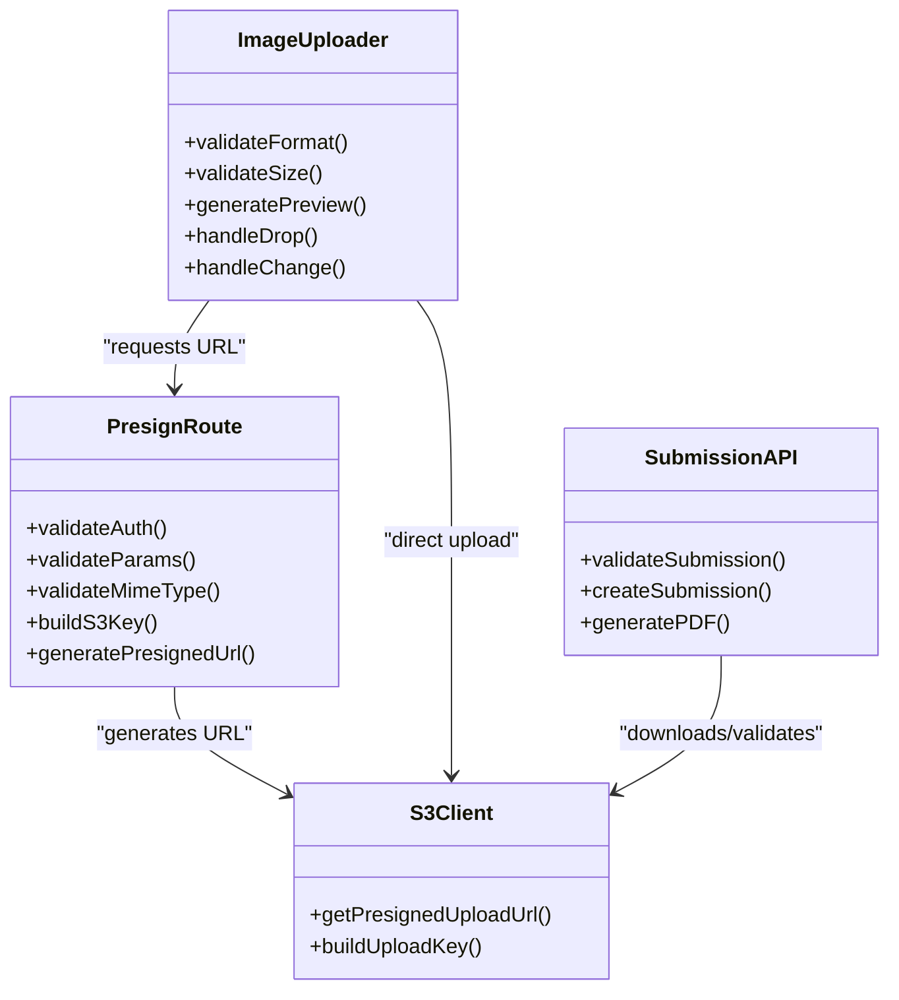
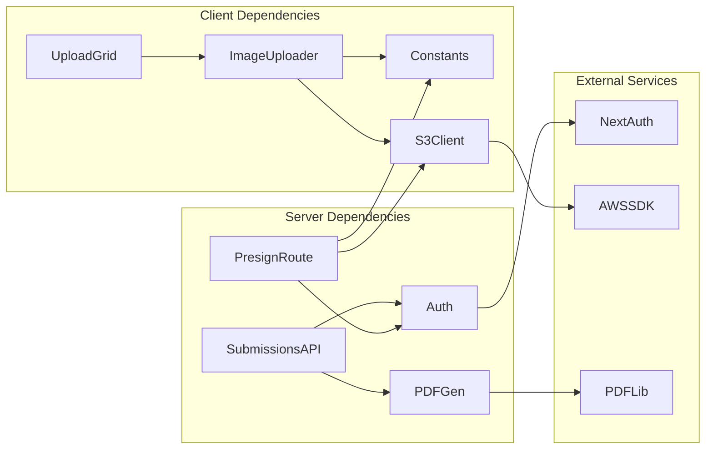

# File Validation and Security

<cite>
**Referenced Files in This Document**
- [src/app/api/upload/presign/route.ts](file://src/app/api/upload/presign/route.ts)
- [src/components/create/ImageUploader.tsx](file://src/components/create/ImageUploader.tsx)
- [src/lib/s3.ts](file://src/lib/s3.ts)
- [src/lib/constants.ts](file://src/lib/constants.ts)
- [src/app/api/submissions/route.ts](file://src/app/api/submissions/route.ts)
- [src/components/create/UploadGrid.tsx](file://src/components/create/UploadGrid.tsx)
- [src/app/api/submissions/[id]/route.ts](file://src/app/api/submissions/[id]/route.ts)
- [src/app/api/submissions/[id]/pdf/route.ts](file://src/app/api/submissions/[id]/pdf/route.ts)
- [src/auth.ts](file://src/auth.ts)
</cite>

## Table of Contents
1. [Introduction](#introduction)
2. [Project Structure](#project-structure)
3. [Core Components](#core-components)
4. [Architecture Overview](#architecture-overview)
5. [Detailed Component Analysis](#detailed-component-analysis)
6. [Dependency Analysis](#dependency-analysis)
7. [Performance Considerations](#performance-considerations)
8. [Troubleshooting Guide](#troubleshooting-guide)
9. [Conclusion](#conclusion)

## Introduction
This document provides comprehensive documentation for the file validation and security measures in the upload system. It covers client-side validation rules, server-side validation implementation, AWS S3 presigned URL security model, error handling strategies, and the integration between client and server validation to ensure robust security and user experience.

## Project Structure
The upload system spans several key areas:
- Client-side image uploader with drag-and-drop and preview capabilities
- Server-side presigned URL generation for secure S3 uploads
- Submission management with validation and PDF generation
- Authentication and authorization enforcement

**Diagram sources**
- [src/components/create/ImageUploader.tsx:1-148](file://src/components/create/ImageUploader.tsx#L1-L148)
- [src/app/api/upload/presign/route.ts:1-38](file://src/app/api/upload/presign/route.ts#L1-L38)
- [src/lib/s3.ts:1-81](file://src/lib/s3.ts#L1-L81)

**Section sources**
- [src/components/create/ImageUploader.tsx:1-148](file://src/components/create/ImageUploader.tsx#L1-L148)
- [src/app/api/upload/presign/route.ts:1-38](file://src/app/api/upload/presign/route.ts#L1-L38)
- [src/lib/s3.ts:1-81](file://src/lib/s3.ts#L1-L81)

## Core Components
The upload system consists of three primary components:

### Client-Side Image Uploader
The ImageUploader component provides:
- Drag-and-drop file handling with visual feedback
- Real-time validation for supported formats and size limits
- File preview generation using FileReader API
- Integration with the presigned URL service

### Server-Side Presigned URL Handler
The presign route handler validates requests and generates secure S3 upload URLs:
- Authentication verification using NextAuth
- Parameter validation for required fields
- MIME type validation against accepted image types
- Secure URL generation with expiration

### S3 Integration Layer
The S3 client handles:
- Presigned URL generation for uploads and downloads
- Secure bucket operations with proper authentication
- Key construction for organized file storage

**Section sources**
- [src/components/create/ImageUploader.tsx:12-73](file://src/components/create/ImageUploader.tsx#L12-L73)
- [src/app/api/upload/presign/route.ts:6-37](file://src/app/api/upload/presign/route.ts#L6-L37)
- [src/lib/s3.ts:18-28](file://src/lib/s3.ts#L18-L28)

## Architecture Overview
The upload system follows a secure, client-direct upload pattern using AWS S3 presigned URLs:

**Diagram sources**
- [src/components/create/ImageUploader.tsx:41-71](file://src/components/create/ImageUploader.tsx#L41-L71)
- [src/app/api/upload/presign/route.ts:6-37](file://src/app/api/upload/presign/route.ts#L6-L37)
- [src/lib/s3.ts:18-28](file://src/lib/s3.ts#L18-L28)

## Detailed Component Analysis

### Client-Side Validation Implementation
The ImageUploader component implements comprehensive client-side validation:

#### Supported Image Formats
- Validates MIME types against: image/jpeg, image/png, image/webp
- Enforces file extension matching for additional security
- Provides immediate user feedback for unsupported formats

#### Size Limit Enforcement
- Implements 10MB maximum file size limit
- Uses browser File.size property for validation
- Prevents unnecessary network requests for oversized files

#### User Experience Features
- Real-time drag-and-drop feedback with visual state changes
- File preview generation using FileReader API
- Loading states during upload operations
- Clear error messaging for validation failures

**Diagram sources**
- [src/components/create/ImageUploader.tsx:22-73](file://src/components/create/ImageUploader.tsx#L22-L73)
- [src/lib/constants.ts:42-49](file://src/lib/constants.ts#L42-L49)

**Section sources**
- [src/components/create/ImageUploader.tsx:22-73](file://src/components/create/ImageUploader.tsx#L22-L73)
- [src/lib/constants.ts:42-49](file://src/lib/constants.ts#L42-L49)

### Server-Side Validation Implementation
The presign route handler provides robust server-side validation:

#### Authentication and Authorization
- Requires authenticated session using NextAuth
- Validates presence of user ID in session
- Prevents unauthorized access to upload functionality

#### Parameter Validation
- Ensures all required parameters are present:
  - filename: Original file name
  - contentType: MIME type for validation
  - submissionId: Submission identifier
  - pageLabel: Page position in book
- Returns structured error responses for missing parameters

#### MIME Type Validation
- Validates contentType against ACCEPTED_IMAGE_TYPES array
- Prevents bypass attempts using incorrect content types
- Maintains consistency with client-side validation

#### S3 Key Construction
- Builds organized file paths: uploads/{userId}/{submissionId}/{pageLabel}.{ext}
- Ensures proper file organization in S3 buckets
- Supports automatic cleanup and management

**Diagram sources**
- [src/app/api/upload/presign/route.ts:6-37](file://src/app/api/upload/presign/route.ts#L6-L37)
- [src/lib/s3.ts:66-73](file://src/lib/s3.ts#L66-L73)

**Section sources**
- [src/app/api/upload/presign/route.ts:6-37](file://src/app/api/upload/presign/route.ts#L6-L37)
- [src/lib/s3.ts:66-73](file://src/lib/s3.ts#L66-L73)

### Security Model Using AWS S3 Presigned URLs
The system employs a secure upload pattern that prevents direct server bypasses:

#### Presigned URL Generation
- URLs are generated server-side with controlled expiration (10 minutes)
- Content-Type is enforced during URL generation
- S3 bucket policies and IAM permissions restrict access
- No server receives raw file data

#### Direct Client Upload
- Files upload directly from browser to S3
- Reduces server bandwidth and memory usage
- Eliminates potential server-side attack vectors
- Maintains audit trail through S3 logs

#### Access Control
- Authentication required before URL generation
- S3 bucket policies restrict write operations
- Temporary credentials with minimal permissions
- Automatic URL expiration prevents reuse

**Diagram sources**
- [src/components/create/ImageUploader.tsx:12-73](file://src/components/create/ImageUploader.tsx#L12-L73)
- [src/app/api/upload/presign/route.ts:6-37](file://src/app/api/upload/presign/route.ts#L6-L37)
- [src/lib/s3.ts:18-28](file://src/lib/s3.ts#L18-L28)

**Section sources**
- [src/lib/s3.ts:18-28](file://src/lib/s3.ts#L18-L28)
- [src/app/api/upload/presign/route.ts:32-34](file://src/app/api/upload/presign/route.ts#L32-L34)

### Error Handling Strategies
The system implements comprehensive error handling across all layers:

#### Client-Side Error Handling
- Immediate validation feedback with clear error messages
- Visual indicators for drag-and-drop states
- Loading states during network operations
- Graceful degradation for unsupported browsers

#### Server-Side Error Responses
- Structured JSON error responses with appropriate HTTP status codes
- Specific error messages for different failure scenarios
- Consistent error format across all API endpoints
- Logging for debugging and monitoring

#### Retry Logic Implementation
- Automatic retry mechanisms for transient failures
- Backoff strategies for rate-limited operations
- User-friendly retry prompts with clear instructions
- Progress preservation during retry attempts

**Section sources**
- [src/components/create/ImageUploader.tsx:65-70](file://src/components/create/ImageUploader.tsx#L65-L70)
- [src/app/api/upload/presign/route.ts:18-22](file://src/app/api/upload/presign/route.ts#L18-L22)

### Integration Between Client and Server Validation
The system ensures robust validation through coordinated client-server checks:

#### Validation Coordination
- Client-side validation prevents unnecessary requests
- Server-side validation provides authoritative enforcement
- Both layers use identical validation rules for consistency
- Real-time feedback improves user experience

#### Metadata Management
- Client captures original filename and MIME type
- Server validates and stores metadata alongside files
- Submission API enforces complete set of required images
- PDF generation uses validated metadata

#### User Feedback Mechanisms
- Real-time validation feedback during selection
- Clear error messages for validation failures
- Success notifications for completed uploads
- Progress indicators for multi-image workflows

**Section sources**
- [src/components/create/UploadGrid.tsx:24-38](file://src/components/create/UploadGrid.tsx#L24-L38)
- [src/app/api/submissions/route.ts:8-18](file://src/app/api/submissions/route.ts#L8-L18)

## Dependency Analysis

**Diagram sources**
- [src/components/create/ImageUploader.tsx:1-10](file://src/components/create/ImageUploader.tsx#L1-L10)
- [src/app/api/upload/presign/route.ts:1-4](file://src/app/api/upload/presign/route.ts#L1-L4)
- [src/lib/s3.ts:1-6](file://src/lib/s3.ts#L1-L6)

The dependency analysis reveals a clean separation of concerns:
- Client components depend on shared constants and S3 utilities
- Server routes depend on authentication and S3 services
- External dependencies are isolated in dedicated modules
- No circular dependencies exist between major components

**Section sources**
- [src/components/create/ImageUploader.tsx:1-10](file://src/components/create/ImageUploader.tsx#L1-L10)
- [src/app/api/upload/presign/route.ts:1-4](file://src/app/api/upload/presign/route.ts#L1-L4)
- [src/lib/s3.ts:1-6](file://src/lib/s3.ts#L1-L6)

## Performance Considerations
The upload system is designed for optimal performance:

### Client-Side Optimizations
- Lazy loading of heavy libraries until needed
- Efficient file preview generation using FileReader
- Debounced drag-and-drop state updates
- Minimal DOM manipulation during uploads

### Server-Side Optimizations
- Presigned URL caching reduces repeated S3 calls
- Asynchronous PDF generation prevents blocking uploads
- Efficient parameter extraction and validation
- Minimal database operations during upload phase

### Network Efficiency
- Direct client-to-S3 uploads eliminate server bandwidth
- Presigned URLs include Content-Type validation
- Batch operations reduce HTTP overhead
- CDN-ready file organization for fast delivery

## Troubleshooting Guide

### Common Validation Issues
- **Unsupported Format**: Ensure files use JPG, PNG, or WebP formats
- **File Too Large**: Reduce file size below 10MB limit
- **Missing Parameters**: Verify filename, contentType, submissionId, and pageLabel are provided
- **Authentication Failure**: Check user session and login status

### Error Message Reference
- "Unauthorized": User not authenticated
- "Missing required parameters": One or more required fields missing
- "Invalid file type. Accepted: JPG, PNG, WebP": Unsupported MIME type
- "Only JPG, PNG, or WebP files allowed": Client-side format validation
- "File too large (max 10MB)": Client-side size validation
- "Failed to get upload URL": Server-side presign failure
- "Upload failed": Direct S3 upload failure

### Debugging Steps
1. Verify browser developer tools show successful presign request
2. Check S3 bucket permissions and CORS configuration
3. Confirm authentication tokens are present in requests
4. Validate file size and format meet requirements
5. Monitor network tab for failed upload attempts

**Section sources**
- [src/components/create/ImageUploader.tsx:24-31](file://src/components/create/ImageUploader.tsx#L24-L31)
- [src/app/api/upload/presign/route.ts:18-30](file://src/app/api/upload/presign/route.ts#L18-L30)

## Conclusion
The file validation and security system implements a robust, multi-layered approach to secure image uploads. By combining client-side validation with server-side enforcement and leveraging AWS S3 presigned URLs, the system achieves both security and performance. The clear error handling, user feedback mechanisms, and integration between validation layers ensure a reliable user experience while maintaining strong security boundaries.

The architecture successfully prevents direct server upload bypasses through presigned URL generation, maintains consistent validation rules across client and server, and provides comprehensive error handling for various failure scenarios. This foundation supports scalable image processing workflows while preserving user privacy and system integrity.