# Image Upload System

<cite>
**Referenced Files in This Document**
- [EditorWorkspace.tsx](file://src/components/editor/EditorWorkspace.tsx)
- [EditorCanvas.tsx](file://src/components/editor/EditorCanvas.tsx)
- [LayerPanel.tsx](file://src/components/editor/LayerPanel.tsx)
- [PropertiesPanel.tsx](file://src/components/editor/PropertiesPanel.tsx)
- [AiChatPanel.tsx](file://src/components/editor/AiChatPanel.tsx)
- [create/page.tsx](file://src/app/(protected)/create/page.tsx)
- [ImageUploader.tsx](file://src/components/create/ImageUploader.tsx)
- [UploadGrid.tsx](file://src/components/create/UploadGrid.tsx)
- [presign/route.ts](file://src/app/api/upload/presign/route.ts)
- [assets/route.ts](file://src/app/api/assets/route.ts)
- [assets/[assetId]/route.ts](file://src/app/api/assets/[assetId]/route.ts)
- [assets/[assetId]/image/route.ts](file://src/app/api/assets/[assetId]/image/route.ts)
- [assets/presign/route.ts](file://src/app/api/assets/presign/route.ts)
- [s3.ts](file://src/lib/s3.ts)
- [constants.ts](file://src/lib/constants.ts)
- [submissions/route.ts](file://src/app/api/submissions/route.ts)
- [generate.ts](file://src/lib/pdf/generate.ts)
- [templates/[id]/elements/route.ts](file://src/app/api/templates/[id]/elements/route.ts)
- [schema.prisma](file://prisma/schema.prisma)
</cite>

## Update Summary
**Changes Made**
- Completely restructured documentation to reflect the transformation from upload-only interface to comprehensive editor workspace with advanced asset management
- Added comprehensive asset management system with CRUD operations, S3 integration, and template asset sharing
- Integrated asset library into editor workspace with upload, preview, and deletion capabilities
- Enhanced presigned URL generation workflow for secure S3 uploads with asset metadata validation
- Added advanced security model with template asset access control and authorization ladder
- Updated architecture diagrams to show the new comprehensive asset management system
- Revised all component analyses to reflect the new asset-centric approach with editor integration

## Table of Contents
1. [Introduction](#introduction)
2. [Project Structure](#project-structure)
3. [Core Components](#core-components)
4. [Architecture Overview](#architecture-overview)
5. [Detailed Component Analysis](#detailed-component-analysis)
6. [Asset Management System](#asset-management-system)
7. [S3 Integration and Security](#s3-integration-and-security)
8. [Template Asset Sharing](#template-asset-sharing)
9. [Legacy Upload System](#legacy-upload-system)
10. [Dependency Analysis](#dependency-analysis)
11. [Performance Considerations](#performance-considerations)
12. [Troubleshooting Guide](#troubleshooting-guide)
13. [Security Considerations](#security-considerations)
14. [Conclusion](#conclusion)

## Introduction
This document provides comprehensive documentation for the Titchybook Creator editor workspace system with integrated asset management. The platform has evolved from a simple upload-only interface to a sophisticated editor workspace featuring comprehensive asset management, template capabilities, and AI-powered assistance. The new system enables users to create interactive Titchybooks with drag-and-drop editing, real-time collaboration, advanced image manipulation, and robust asset lifecycle management.

**Updated** The system now operates as a full-featured editor workspace with comprehensive asset management capabilities, providing users with complete control over their digital assets including upload, preview, organization, and deletion operations.

## Project Structure
The editor workspace system is organized around a comprehensive set of components and services with integrated asset management:

- **Editor Workspace**: Central orchestration component managing state, assets, and template integration
- **Canvas System**: Interactive drawing surface built with Konva.js for element manipulation
- **Panel System**: Modular UI panels for layers, properties, and AI assistance
- **Asset Management**: Comprehensive system for storing, organizing, and accessing user assets with S3 integration
- **Template System**: Advanced template engine supporting both admin templates and user instances
- **AI Integration**: Real-time AI assistance for content generation and editing suggestions
- **Legacy Upload System**: Deprecated but maintained for backward compatibility

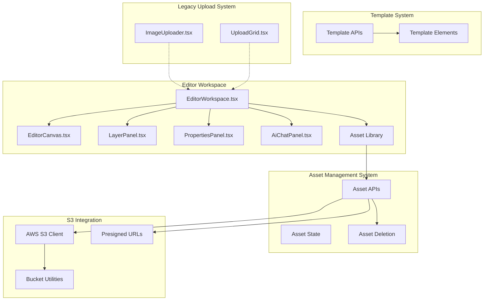

**Diagram sources**
- [EditorWorkspace.tsx:1790-1874](file://src/components/editor/EditorWorkspace.tsx#L1790-L1874)
- [EditorCanvas.tsx:1-800](file://src/components/editor/EditorCanvas.tsx#L1-L800)
- [LayerPanel.tsx:1-212](file://src/components/editor/LayerPanel.tsx#L1-L212)
- [PropertiesPanel.tsx:1-586](file://src/components/editor/PropertiesPanel.tsx#L1-L586)
- [AiChatPanel.tsx:1-569](file://src/components/editor/AiChatPanel.tsx#L1-L569)
- [assets/route.ts:1-88](file://src/app/api/assets/route.ts#L1-L88)
- [assets/[assetId]/route.ts:1-52](file://src/app/api/assets/[assetId]/route.ts#L1-L52)
- [s3.ts:1-97](file://src/lib/s3.ts#L1-L97)
- [ImageUploader.tsx:1-148](file://src/components/create/ImageUploader.tsx#L1-L148)
- [UploadGrid.tsx:1-115](file://src/components/create/UploadGrid.tsx#L1-L115)

**Section sources**
- [EditorWorkspace.tsx:1790-1874](file://src/components/editor/EditorWorkspace.tsx#L1790-L1874)
- [EditorCanvas.tsx:1-800](file://src/components/editor/EditorCanvas.tsx#L1-L800)
- [LayerPanel.tsx:1-212](file://src/components/editor/LayerPanel.tsx#L1-L212)
- [PropertiesPanel.tsx:1-586](file://src/components/editor/PropertiesPanel.tsx#L1-L586)
- [AiChatPanel.tsx:1-569](file://src/components/editor/AiChatPanel.tsx#L1-L569)
- [assets/route.ts:1-88](file://src/app/api/assets/route.ts#L1-L88)
- [assets/[assetId]/route.ts:1-52](file://src/app/api/assets/[assetId]/route.ts#L1-L52)
- [s3.ts:1-97](file://src/lib/s3.ts#L1-L97)
- [ImageUploader.tsx:1-148](file://src/components/create/ImageUploader.tsx#L1-L148)
- [UploadGrid.tsx:1-115](file://src/components/create/UploadGrid.tsx#L1-L115)

## Core Components
The editor workspace consists of several interconnected systems with comprehensive asset management:

### Editor Workspace Core
- **EditorWorkspace**: Central component managing application state, asset loading, template integration, and draft persistence
- **EditorCanvas**: Interactive canvas built with Konva.js for element rendering and manipulation
- **LayerPanel**: Asset management and layer organization interface
- **PropertiesPanel**: Element property editing with real-time preview
- **AiChatPanel**: AI-powered content generation and editing assistance

### Asset Management System
- **Asset State Management**: Local state for managing user assets with preview and download URLs
- **Template Asset Integration**: Seamless integration of template-referenced assets into user workspaces
- **Asset Library**: Grid-based interface for uploading, previewing, and organizing assets
- **Asset Deletion**: Secure deletion with S3 cleanup and database removal
- **Access Control**: Fine-grained access control for template assets and user-owned assets

### Template System
- **Template Loading**: Dynamic loading of template elements and assets
- **Instance Mode**: User instances of templates with editable text overrides
- **Admin Templates**: Full template editing capabilities for administrators

**Section sources**
- [EditorWorkspace.tsx:265-800](file://src/components/editor/EditorWorkspace.tsx#L265-L800)
- [EditorCanvas.tsx:33-800](file://src/components/editor/EditorCanvas.tsx#L33-L800)
- [LayerPanel.tsx:30-212](file://src/components/editor/LayerPanel.tsx#L30-L212)
- [PropertiesPanel.tsx:41-586](file://src/components/editor/PropertiesPanel.tsx#L41-L586)
- [AiChatPanel.tsx:31-569](file://src/components/editor/AiChatPanel.tsx#L31-L569)

## Architecture Overview
The editor workspace follows a modern, component-based architecture with comprehensive state management, real-time collaboration, and integrated asset management:

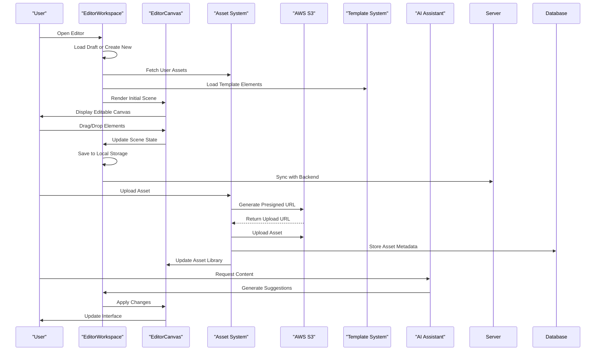

**Diagram sources**
- [EditorWorkspace.tsx:398-712](file://src/components/editor/EditorWorkspace.tsx#L398-L712)
- [EditorCanvas.tsx:1-800](file://src/components/editor/EditorCanvas.tsx#L1-L800)
- [AiChatPanel.tsx:65-186](file://src/components/editor/AiChatPanel.tsx#L65-L186)
- [assets/route.ts:40-88](file://src/app/api/assets/route.ts#L40-L88)
- [s3.ts:19-37](file://src/lib/s3.ts#L19-L37)

## Detailed Component Analysis

### EditorWorkspace Component
The EditorWorkspace serves as the central orchestrator for the entire editor system with integrated asset management:

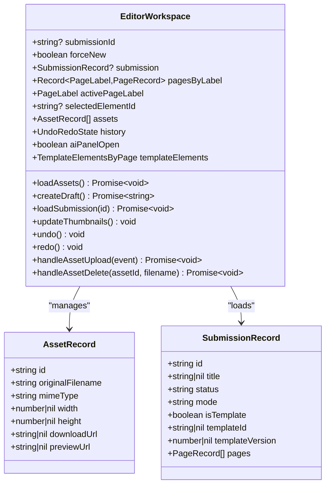

**Diagram sources**
- [EditorWorkspace.tsx:44-82](file://src/components/editor/EditorWorkspace.tsx#L44-L82)
- [EditorWorkspace.tsx:265-331](file://src/components/editor/EditorWorkspace.tsx#L265-L331)

Key features:
- **Draft Management**: Automatic draft creation and persistence with localStorage fallback
- **Template Integration**: Seamless loading and merging of template elements with user modifications
- **Asset Management**: Comprehensive asset loading, caching, and access control with S3 integration
- **State Persistence**: Undo/redo functionality with history snapshots
- **Real-time Updates**: Automatic saving with debounced API calls
- **Asset Library Integration**: Built-in asset upload, preview, and deletion capabilities

**Section sources**
- [EditorWorkspace.tsx:265-800](file://src/components/editor/EditorWorkspace.tsx#L265-L800)

### EditorCanvas Component
The EditorCanvas provides the interactive drawing surface with advanced element manipulation and asset integration:

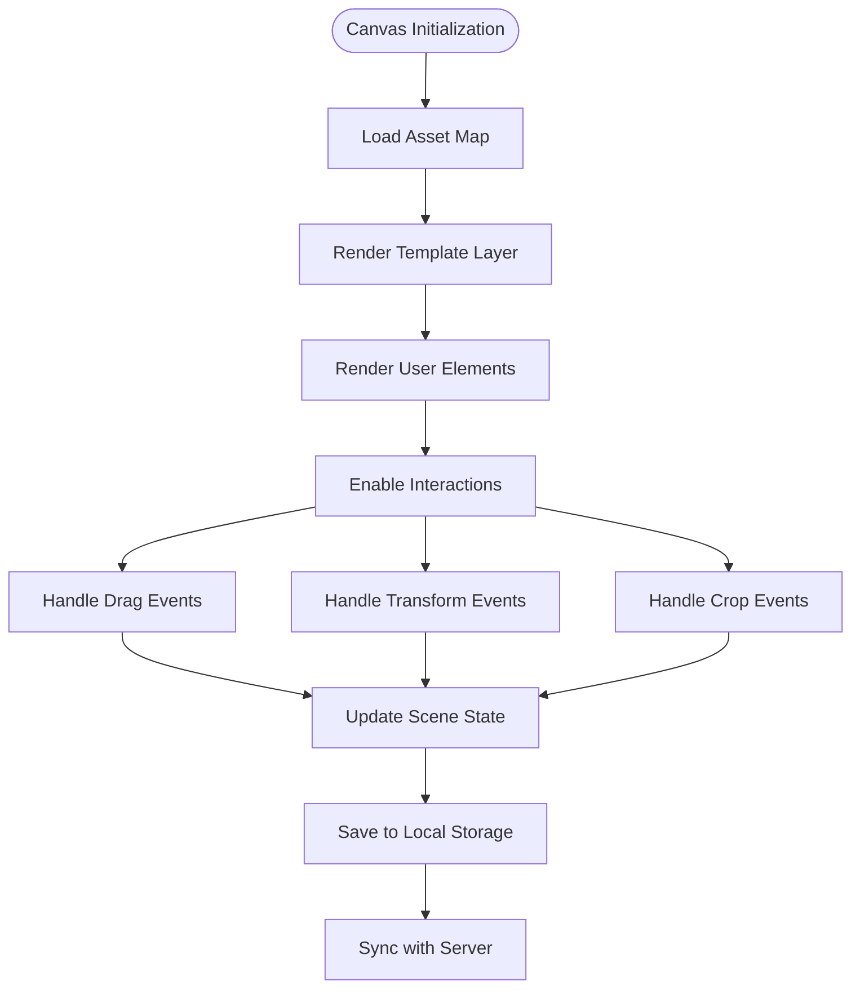

**Diagram sources**
- [EditorCanvas.tsx:69-800](file://src/components/editor/EditorCanvas.tsx#L69-L800)

Advanced features:
- **Element Types**: Support for text, image, and shape elements with specialized rendering
- **Image Cropping**: Advanced crop functionality with zoom and focal point controls
- **Template Layer**: Non-editable template elements with special styling
- **Interactive Editing**: Drag, drop, transform, and crop operations with real-time preview
- **Asset Integration**: Direct asset placement from asset library with preview support
- **Performance Optimization**: Efficient rendering with selective updates

**Section sources**
- [EditorCanvas.tsx:69-800](file://src/components/editor/EditorCanvas.tsx#L69-L800)

### LayerPanel Component
The LayerPanel provides comprehensive asset and element management with template integration:

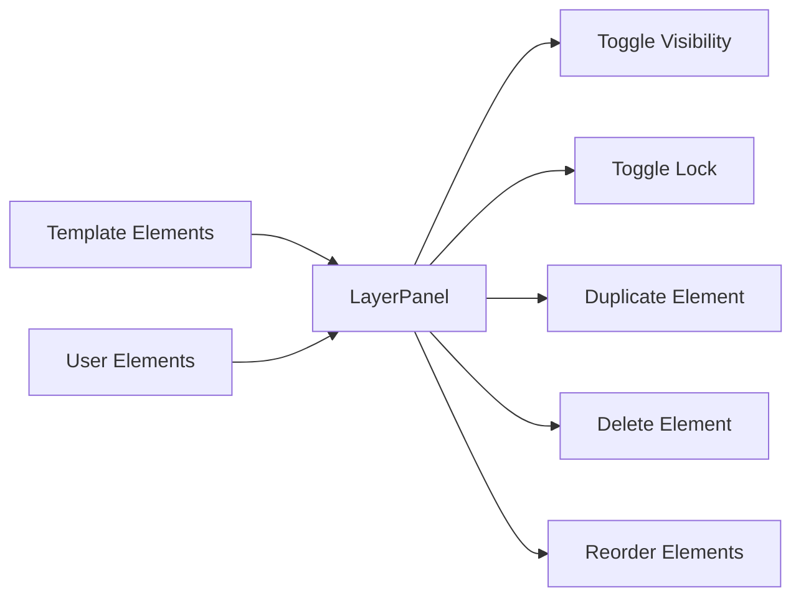

**Diagram sources**
- [LayerPanel.tsx:30-212](file://src/components/editor/LayerPanel.tsx#L30-L212)

Key capabilities:
- **Template Integration**: Special handling of template elements vs user elements
- **Element Operations**: Complete CRUD operations on elements
- **Visual Feedback**: Clear distinction between template and user elements
- **Accessibility**: Keyboard navigation and screen reader support

**Section sources**
- [LayerPanel.tsx:30-212](file://src/components/editor/LayerPanel.tsx#L30-L212)

### PropertiesPanel Component
The PropertiesPanel offers granular control over element properties with asset-specific features:

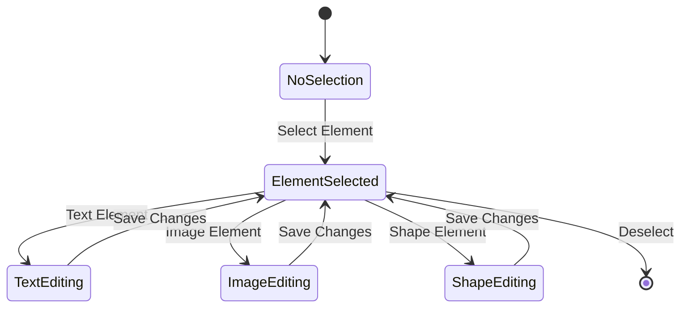

**Diagram sources**
- [PropertiesPanel.tsx:41-586](file://src/components/editor/PropertiesPanel.tsx#L41-L586)

Advanced editing features:
- **Element-specific Controls**: Tailored property editors for each element type
- **Template Text Overrides**: Editable text in template instances with reset capability
- **Real-time Preview**: Immediate visual feedback for property changes
- **Validation**: Input validation and constraints for element properties
- **Asset Properties**: Image-specific properties including dimensions and asset selection

**Section sources**
- [PropertiesPanel.tsx:41-586](file://src/components/editor/PropertiesPanel.tsx#L41-L586)

### AiChatPanel Component
The AIChatPanel provides AI-powered content assistance with asset-aware context:

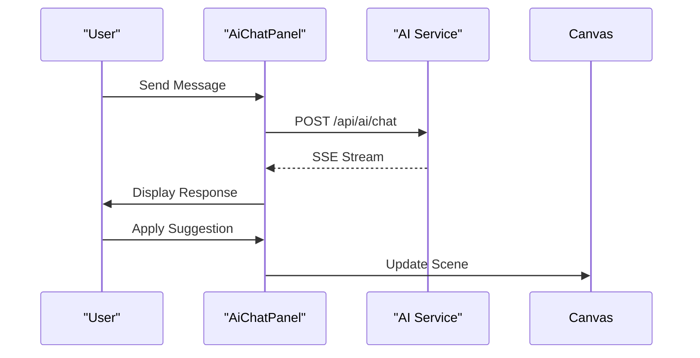

**Diagram sources**
- [AiChatPanel.tsx:65-186](file://src/components/editor/AiChatPanel.tsx#L65-L186)

AI capabilities:
- **Content Generation**: Story writing, captions, titles, and text suggestions
- **Real-time Streaming**: Live AI response with progressive disclosure
- **Suggestion Application**: One-click application of AI-generated content
- **Context Awareness**: Rich context including book title, active page, page content, and available assets

**Section sources**
- [AiChatPanel.tsx:65-186](file://src/components/editor/AiChatPanel.tsx#L65-L186)

## Asset Management System

### Asset Lifecycle Management
The asset management system provides comprehensive lifecycle management for user images:

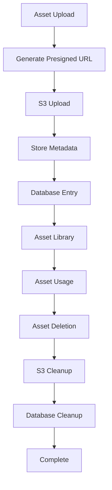

**Diagram sources**
- [assets/presign/route.ts:13-46](file://src/app/api/assets/presign/route.ts#L13-L46)
- [assets/route.ts:40-88](file://src/app/api/assets/route.ts#L40-L88)
- [assets/[assetId]/route.ts:6-51](file://src/app/api/assets/[assetId]/route.ts#L6-L51)

### Asset Library Interface
The asset library provides a comprehensive interface for managing user assets:

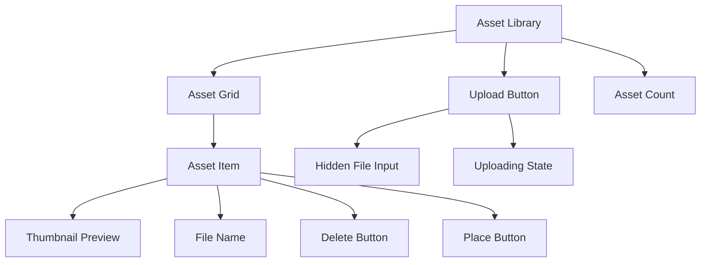

**Diagram sources**
- [EditorWorkspace.tsx:1790-1874](file://src/components/editor/EditorWorkspace.tsx#L1790-L1874)

Key features:
- **Upload Interface**: Drag-and-drop upload with file validation
- **Preview System**: Local preview URLs for immediate feedback
- **Asset Organization**: Grid-based organization with file naming
- **Asset Placement**: One-click placement of assets onto canvas
- **Asset Deletion**: Secure deletion with confirmation and cleanup

**Section sources**
- [EditorWorkspace.tsx:1790-1874](file://src/components/editor/EditorWorkspace.tsx#L1790-L1874)

### Asset Validation and Security
The asset management system implements comprehensive validation and security measures:

- **File Type Validation**: Only accepts JPG, PNG, and WebP formats
- **Size Limits**: Enforces 10MB maximum file size
- **Dimension Tracking**: Records image dimensions for optimal rendering
- **S3 Key Validation**: Ensures assets are stored under user-specific paths
- **Access Control**: Validates asset ownership and template permissions
- **Metadata Validation**: Zod-based schema validation for asset metadata

**Section sources**
- [constants.ts:52-59](file://src/lib/constants.ts#L52-L59)
- [assets/route.ts:8-15](file://src/app/api/assets/route.ts#L8-L15)
- [assets/route.ts:57-62](file://src/app/api/assets/route.ts#L57-L62)

## S3 Integration and Security

### Presigned URL Workflow
The S3 integration uses presigned URLs for secure, direct uploads:

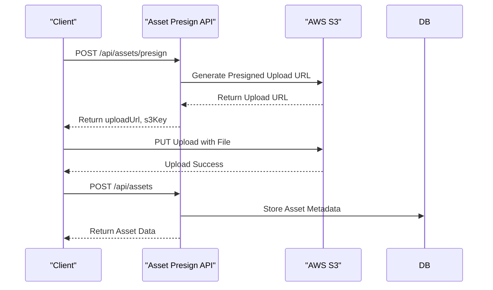

**Diagram sources**
- [assets/presign/route.ts:13-46](file://src/app/api/assets/presign/route.ts#L13-L46)
- [s3.ts:19-29](file://src/lib/s3.ts#L19-L29)

### S3 Key Structure
The system uses structured S3 key organization:

- **Upload Keys**: `uploads/{userId}/{submissionId}/{pageLabel}.{ext}`
- **Asset Keys**: `assets/{userId}/{assetId}.{ext}`
- **PDF Keys**: `pdfs/{userId}/{submissionId}/titchybook.pdf`

### Security Model
The S3 integration implements multiple security layers:

- **Authentication**: All asset operations require authenticated sessions
- **Authorization**: Strict ownership verification for asset access
- **Key Validation**: Prevents directory traversal and unauthorized access
- **Presigned URL Expiration**: 10-minute upload windows with 1-hour download windows
- **CORS Proxy**: All S3 access goes through server-side proxy endpoints

**Section sources**
- [s3.ts:67-89](file://src/lib/s3.ts#L67-L89)
- [assets/presign/route.ts:32-33](file://src/app/api/assets/presign/route.ts#L32-L33)
- [assets/route.ts:57-62](file://src/app/api/assets/route.ts#L57-L62)

## Template Asset Sharing

### Authorization Ladder
The template system implements a sophisticated authorization model for shared assets:

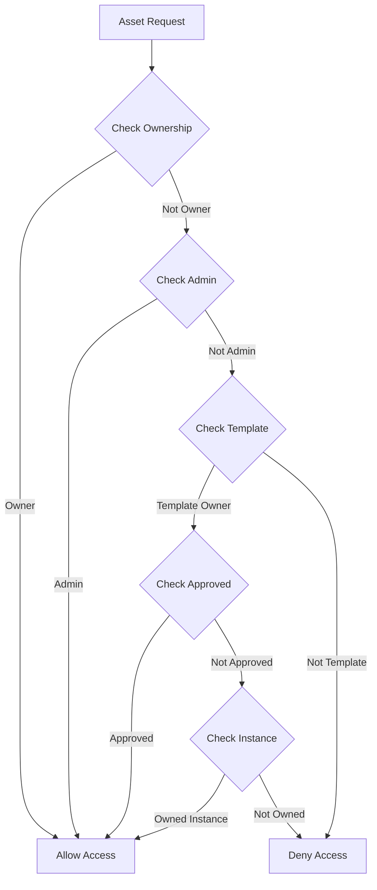

**Diagram sources**
- [assets/[assetId]/image/route.ts:8-53](file://src/app/api/assets/[assetId]/image/route.ts#L8-L53)

### Template Asset Access Control
The system allows template assets to be shared across users through multiple pathways:

1. **Direct Ownership**: Users can access their own assets
2. **Administrative Access**: Admin users can access any asset
3. **Template Sharing**: Assets referenced in approved templates are publicly accessible
4. **Template Instance Access**: Users who own instances of templates can access template assets

### Template Asset Integration
Template assets are seamlessly integrated into user workspaces:

- **Template Elements**: Assets embedded in template elements are automatically available
- **Instance Customization**: Users can replace template assets with their own
- **Asset Resolution**: System resolves asset access based on current context and permissions
- **Template Versioning**: Asset references are preserved across template versions

**Section sources**
- [assets/[assetId]/image/route.ts:8-53](file://src/app/api/assets/[assetId]/image/route.ts#L8-L53)
- [templates/[id]/elements/route.ts:32-49](file://src/app/api/templates/[id]/elements/route.ts#L32-L49)

## Legacy Upload System
The legacy upload system has been deprecated but remains for backward compatibility:

- **ImageUploader**: Single-image upload with drag-and-drop and preview
- **UploadGrid**: 8-image grid management with submission workflow
- **Presigned URL System**: Direct S3 uploads with security controls
- **Submission Processing**: PDF generation and order management

**Section sources**
- [ImageUploader.tsx:12-147](file://src/components/create/ImageUploader.tsx#L12-L147)
- [UploadGrid.tsx:16-114](file://src/components/create/UploadGrid.tsx#L16-L114)
- [presign/route.ts:6-37](file://src/app/api/upload/presign/route.ts#L6-L37)
- [submissions/route.ts:35-95](file://src/app/api/submissions/route.ts#L35-L95)

## Dependency Analysis
The editor workspace exhibits a well-structured dependency hierarchy with clear separation of concerns and comprehensive asset management integration:

```mermaid
graph TB
subgraph "Editor Components"
EW["EditorWorkspace"]
EC["EditorCanvas"]
LP["LayerPanel"]
PP["PropertiesPanel"]
ACP["AiChatPanel"]
AL["Asset Library"]
end
subgraph "Asset System"
AS["Asset State"]
AAPI["Asset APIs"]
ADEL["Asset Deletion"]
end
subgraph "S3 Integration"
S3["AWS S3 Client"]
PS["Presigned URLs"]
BU["Bucket Utilities"]
end
subgraph "Template System"
TA["Template APIs"]
TE["Template Elements"]
end
subgraph "Legacy System"
IU["ImageUploader"]
UG["UploadGrid"]
end
subgraph "External Libraries"
KONVA["Konva.js"]
REACT["React Hooks"]
NEXT["Next.js SSR"]
END
EW --> EC
EW --> LP
EW --> PP
EW --> ACP
EW --> AL
AL --> AS
AS --> AAPI
AAPI --> S3
AAPI --> PS
AAPI --> ADEL
S3 --> BU
EW --> TA
EW --> TE
IU -.-> EW
UG -.-> EW
```

**Diagram sources**
- [EditorWorkspace.tsx:1-800](file://src/components/editor/EditorWorkspace.tsx#L1-L800)
- [EditorCanvas.tsx:1-800](file://src/components/editor/EditorCanvas.tsx#L1-L800)
- [LayerPanel.tsx:1-212](file://src/components/editor/LayerPanel.tsx#L1-L212)
- [PropertiesPanel.tsx:1-586](file://src/components/editor/PropertiesPanel.tsx#L1-L586)
- [AiChatPanel.tsx:1-569](file://src/components/editor/AiChatPanel.tsx#L1-L569)
- [assets/route.ts:1-88](file://src/app/api/assets/route.ts#L1-L88)
- [s3.ts:1-97](file://src/lib/s3.ts#L1-L97)

**Section sources**
- [EditorWorkspace.tsx:1-800](file://src/components/editor/EditorWorkspace.tsx#L1-L800)
- [EditorCanvas.tsx:1-800](file://src/components/editor/EditorCanvas.tsx#L1-L800)
- [LayerPanel.tsx:1-212](file://src/components/editor/LayerPanel.tsx#L1-L212)
- [PropertiesPanel.tsx:1-586](file://src/components/editor/PropertiesPanel.tsx#L1-L586)
- [AiChatPanel.tsx:1-569](file://src/components/editor/AiChatPanel.tsx#L1-L569)
- [assets/route.ts:1-88](file://src/app/api/assets/route.ts#L1-L88)
- [s3.ts:1-97](file://src/lib/s3.ts#L1-L97)

## Performance Considerations
The editor workspace implements several performance optimizations with asset management:

- **Lazy Loading**: Canvas components are dynamically imported to reduce initial bundle size
- **Efficient Rendering**: Canvas uses selective updates and optimized element rendering
- **State Management**: Debounced API calls prevent excessive server requests
- **Asset Caching**: Local asset caching reduces repeated API calls
- **Template Merging**: Efficient template element merging with memoization
- **Memory Management**: Proper cleanup of event listeners and image objects
- **Progressive Enhancement**: Graceful degradation for unsupported features
- **Asset Previews**: Local blob URLs for immediate asset preview without server round-trips
- **Deletion Cleanup**: Automatic S3 cleanup prevents orphaned assets and storage bloat

## Troubleshooting Guide
Common issues and resolutions for the new editor system with asset management:

**Editor fails to load**
- Verify user authentication is established
- Check browser console for asset loading errors
- Ensure localStorage is accessible and not corrupted
- Verify template system availability

**Canvas rendering issues**
- Check browser compatibility with Konva.js
- Verify asset URLs are accessible and not blocked by CORS
- Ensure sufficient memory allocation for large images
- Clear browser cache if experiencing rendering glitches

**Template integration problems**
- Verify template exists and is published
- Check template element JSON format
- Ensure template assets are accessible to current user
- Verify template version compatibility

**AI Assistant errors**
- Check AI service availability and API keys
- Verify context data formatting
- Ensure sufficient quota limits
- Check network connectivity for streaming responses

**Asset upload failures**
- Verify file type is supported (JPG, PNG, WebP)
- Check file size does not exceed 10MB limit
- Ensure S3 bucket permissions are configured correctly
- Verify presigned URL generation is working
- Check asset metadata validation

**Asset deletion errors**
- Verify asset ownership before deletion
- Check S3 object deletion permissions
- Ensure database cleanup completes successfully
- Verify asset is not referenced by active templates

**Section sources**
- [EditorWorkspace.tsx:684-692](file://src/components/editor/EditorWorkspace.tsx#L684-L692)
- [EditorCanvas.tsx:48-67](file://src/components/editor/EditorCanvas.tsx#L48-L67)
- [AiChatPanel.tsx:107-114](file://src/components/editor/AiChatPanel.tsx#L107-L114)
- [assets/[assetId]/route.ts:30-43](file://src/app/api/assets/[assetId]/route.ts#L30-L43)

## Security Considerations
The editor workspace implements comprehensive security measures across all systems:

- **Authentication**: All editor operations require authenticated sessions
- **Authorization**: Fine-grained access control for template assets and user content
- **Asset Access Control**: Template assets can be accessed via template ownership or instance ownership
- **Template Integrity**: Template elements are loaded securely and validated
- **Input Sanitization**: AI responses are sanitized before application
- **State Isolation**: Local storage isolation prevents cross-user data leakage
- **Secure Asset URLs**: Generated URLs with appropriate expiration and permissions
- **S3 Security**: Presigned URLs with limited lifetimes and proper key validation
- **Database Security**: Structured schemas with proper indexing and foreign key constraints

Best practices for deployment:
- Implement rate limiting for AI service calls
- Monitor asset access patterns for abuse detection
- Regular security audits of template systems
- Secure template asset storage and retrieval
- Implement proper error handling to prevent information leakage
- Regular S3 bucket policy reviews and access monitoring

**Section sources**
- [assets/[assetId]/image/route.ts:55-85](file://src/app/api/assets/[assetId]/image/route.ts#L55-L85)
- [templates/[id]/elements/route.ts:32-49](file://src/app/api/templates/[id]/elements/route.ts#L32-L49)
- [EditorWorkspace.tsx:401-417](file://src/components/editor/EditorWorkspace.tsx#L401-L417)
- [s3.ts:91-97](file://src/lib/s3.ts#L91-L97)

## Conclusion
The Titchybook Creator editor workspace represents a significant evolution from a simple upload interface to a comprehensive, feature-rich editing platform with integrated asset management. The new system provides users with powerful design tools, seamless asset management, advanced template capabilities, and AI-powered assistance. The modular architecture ensures maintainability and scalability while the comprehensive state management provides a smooth user experience. The integration of legacy upload functionality into the new system demonstrates backward compatibility while enabling future enhancements. The comprehensive asset management system with S3 integration, template asset sharing, and robust security measures creates a complete solution for professional digital publishing workflows.