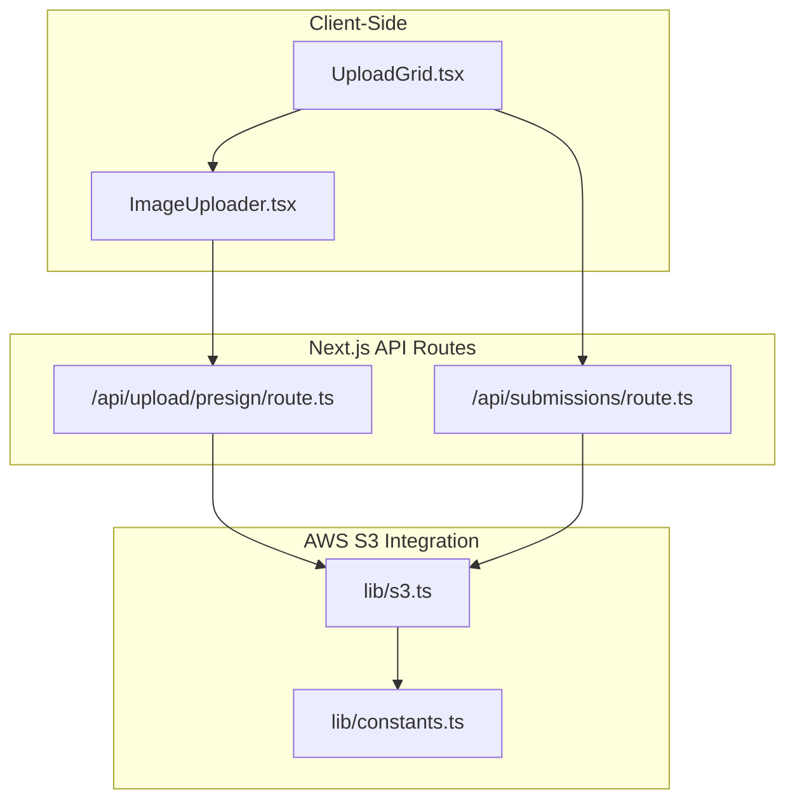
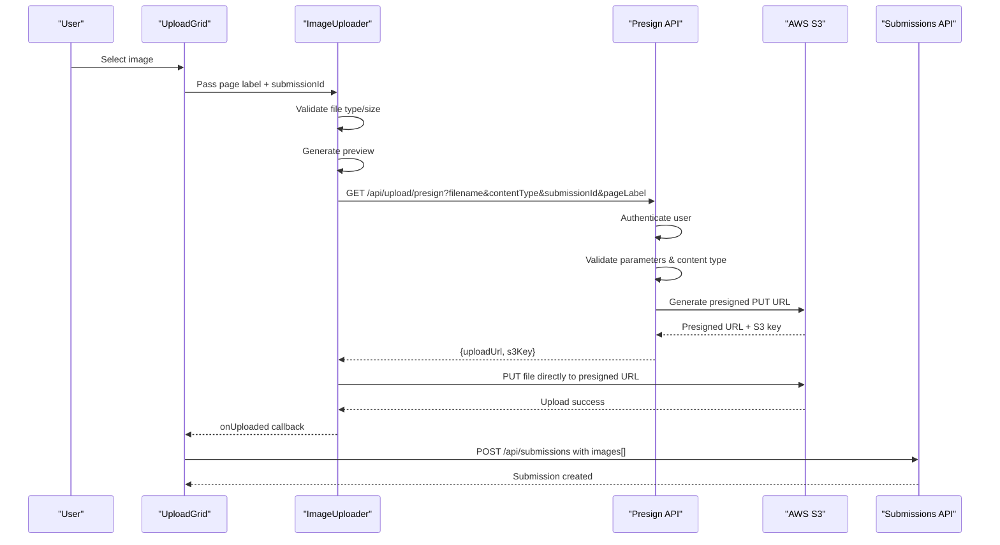
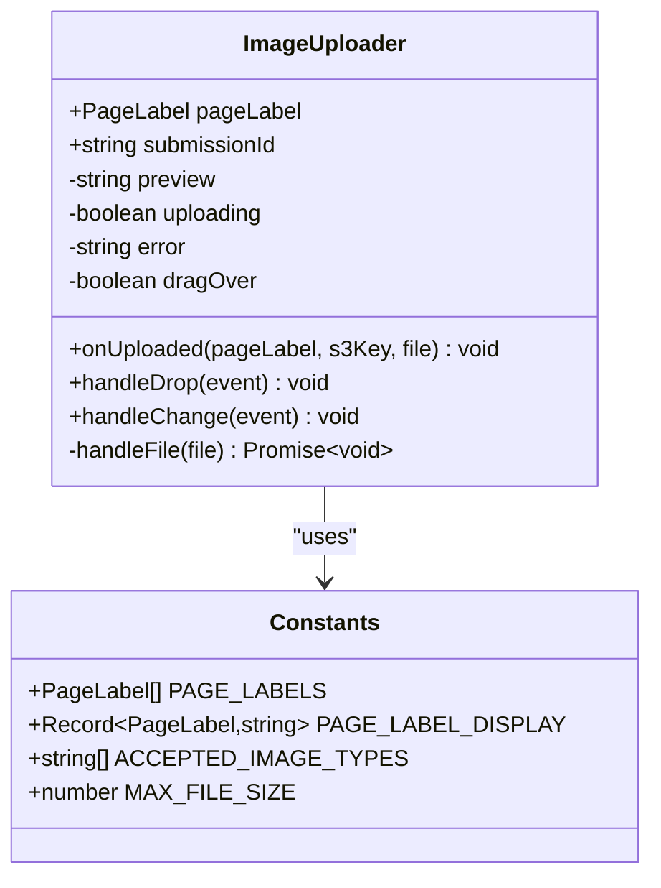
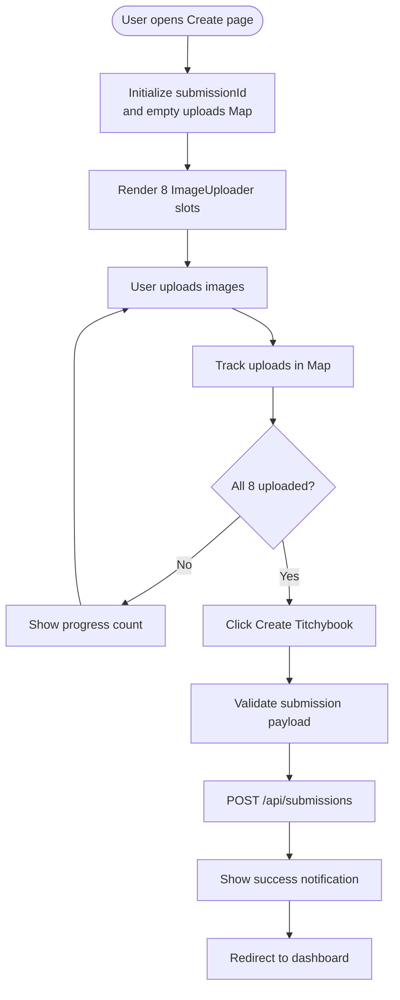
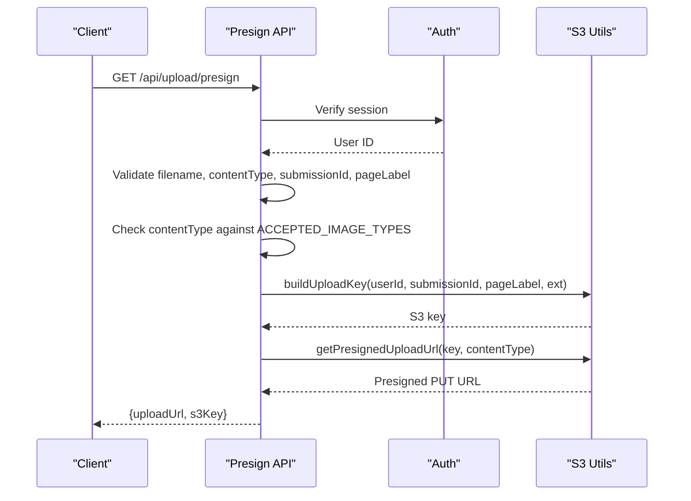
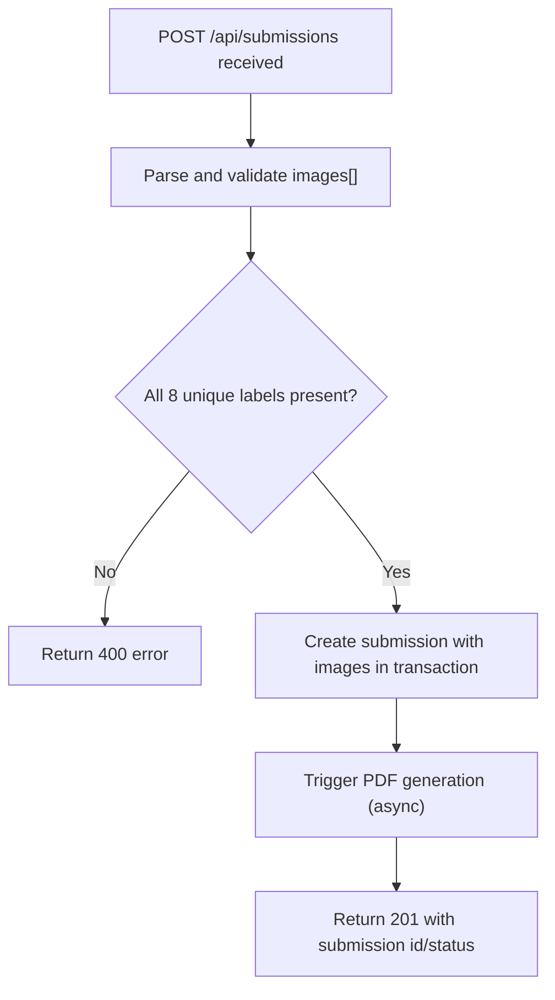
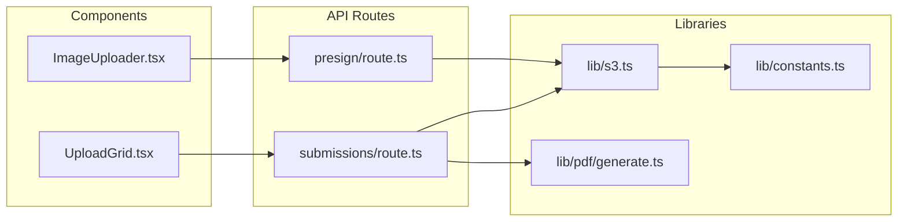

# Image Upload System

<cite>
**Referenced Files in This Document**
- [ImageUploader.tsx](file://src/components/create/ImageUploader.tsx)
- [UploadGrid.tsx](file://src/components/create/UploadGrid.tsx)
- [presign/route.ts](file://src/app/api/upload/presign/route.ts)
- [s3.ts](file://src/lib/s3.ts)
- [constants.ts](file://src/lib/constants.ts)
- [submissions/route.ts](file://src/app/api/submissions/route.ts)
- [create/page.tsx](file://src/app/(protected)/create/page.tsx)
- [generate.ts](file://src/lib/pdf/generate.ts)
</cite>

## Table of Contents
1. [Introduction](#introduction)
2. [Project Structure](#project-structure)
3. [Core Components](#core-components)
4. [Architecture Overview](#architecture-overview)
5. [Detailed Component Analysis](#detailed-component-analysis)
6. [Dependency Analysis](#dependency-analysis)
7. [Performance Considerations](#performance-considerations)
8. [Troubleshooting Guide](#troubleshooting-guide)
9. [Security Considerations](#security-considerations)
10. [Conclusion](#conclusion)

## Introduction
This document provides comprehensive documentation for the image upload system in Titchybook Creator. The system enables users to upload eight images for creating a Titchybook, featuring a drag-and-drop interface, client-side validation, secure S3 uploads via presigned URLs, and a grid-based management interface. The upload pipeline spans client-side React components, Next.js API routes, AWS S3 integration, and server-side PDF generation.

## Project Structure
The upload system is organized around three primary areas:
- Client-side React components for drag-and-drop upload and grid management
- Next.js API routes for authentication, presigned URL generation, and submission handling
- AWS S3 integration utilities for secure uploads and downloads

**Diagram sources**
- [UploadGrid.tsx:16-114](file://src/components/create/UploadGrid.tsx#L16-L114)
- [ImageUploader.tsx:12-147](file://src/components/create/ImageUploader.tsx#L12-L147)
- [presign/route.ts:6-37](file://src/app/api/upload/presign/route.ts#L6-L37)
- [submissions/route.ts:35-95](file://src/app/api/submissions/route.ts#L35-L95)
- [s3.ts:1-81](file://src/lib/s3.ts#L1-L81)
- [constants.ts:1-49](file://src/lib/constants.ts#L1-L49)

**Section sources**
- [UploadGrid.tsx:16-114](file://src/components/create/UploadGrid.tsx#L16-L114)
- [ImageUploader.tsx:12-147](file://src/components/create/ImageUploader.tsx#L12-L147)
- [presign/route.ts:6-37](file://src/app/api/upload/presign/route.ts#L6-L37)
- [submissions/route.ts:35-95](file://src/app/api/submissions/route.ts#L35-L95)
- [s3.ts:1-81](file://src/lib/s3.ts#L1-L81)
- [constants.ts:1-49](file://src/lib/constants.ts#L1-L49)

## Core Components
The upload system consists of two primary React components and supporting utilities:

- **ImageUploader**: Implements the drag-and-drop upload interface with validation, preview, and S3 upload via presigned URLs
- **UploadGrid**: Manages the grid of eight upload slots, tracks completion status, and submits the final collection

Key validation rules enforced:
- Supported formats: JPG, PNG, WebP
- Size limit: 10MB
- Preview generation using FileReader
- Presigned URL expiration: 10 minutes

**Section sources**
- [ImageUploader.tsx:22-73](file://src/components/create/ImageUploader.tsx#L22-L73)
- [UploadGrid.tsx:16-76](file://src/components/create/UploadGrid.tsx#L16-L76)
- [constants.ts:42-49](file://src/lib/constants.ts#L42-L49)

## Architecture Overview
The upload pipeline follows a secure, client-direct upload pattern:

**Diagram sources**
- [ImageUploader.tsx:42-64](file://src/components/create/ImageUploader.tsx#L42-L64)
- [presign/route.ts:12-36](file://src/app/api/upload/presign/route.ts#L12-L36)
- [s3.ts:18-28](file://src/lib/s3.ts#L18-L28)
- [UploadGrid.tsx:42-76](file://src/components/create/UploadGrid.tsx#L42-L76)
- [submissions/route.ts:35-95](file://src/app/api/submissions/route.ts#L35-L95)

## Detailed Component Analysis

### ImageUploader Component
The ImageUploader component provides the drag-and-drop interface for individual image uploads:

**Diagram sources**
- [ImageUploader.tsx:6-16](file://src/components/create/ImageUploader.tsx#L6-L16)
- [constants.ts:18-49](file://src/lib/constants.ts#L18-L49)

Implementation highlights:
- Drag-and-drop event handlers with visual feedback
- Client-side validation for MIME type and file size
- FileReader-based preview generation
- Presigned URL acquisition and direct S3 upload
- Error state management and cleanup

**Section sources**
- [ImageUploader.tsx:12-147](file://src/components/create/ImageUploader.tsx#L12-L147)
- [constants.ts:42-49](file://src/lib/constants.ts#L42-L49)

### UploadGrid Component
The UploadGrid manages the complete 8-image upload workflow:

**Diagram sources**
- [UploadGrid.tsx:16-114](file://src/components/create/UploadGrid.tsx#L16-L114)

Key behaviors:
- Generates a unique submission identifier per session
- Tracks uploaded images in a Map keyed by page label
- Enables submit button only when all 8 images are uploaded
- Submits images to the backend with ordering information

**Section sources**
- [UploadGrid.tsx:16-114](file://src/components/create/UploadGrid.tsx#L16-L114)

### Presigned URL Generation Workflow
The presign endpoint handles secure S3 upload preparation:

**Diagram sources**
- [presign/route.ts:6-37](file://src/app/api/upload/presign/route.ts#L6-L37)
- [s3.ts:66-73](file://src/lib/s3.ts#L66-L73)
- [s3.ts:18-28](file://src/lib/s3.ts#L18-L28)
- [constants.ts:42-46](file://src/lib/constants.ts#L42-L46)

**Section sources**
- [presign/route.ts:6-37](file://src/app/api/upload/presign/route.ts#L6-L37)
- [s3.ts:18-28](file://src/lib/s3.ts#L18-L28)
- [s3.ts:66-73](file://src/lib/s3.ts#L66-L73)
- [constants.ts:42-46](file://src/lib/constants.ts#L42-L46)

### Submission Processing and PDF Generation
After successful uploads, the system creates a submission and triggers PDF generation:

**Diagram sources**
- [submissions/route.ts:35-95](file://src/app/api/submissions/route.ts#L35-L95)
- [generate.ts:23-111](file://src/lib/pdf/generate.ts#L23-L111)

**Section sources**
- [submissions/route.ts:35-95](file://src/app/api/submissions/route.ts#L35-L95)
- [generate.ts:23-111](file://src/lib/pdf/generate.ts#L23-L111)

## Dependency Analysis
The upload system exhibits clear separation of concerns with minimal coupling:

**Diagram sources**
- [ImageUploader.tsx:1-10](file://src/components/create/ImageUploader.tsx#L1-L10)
- [UploadGrid.tsx:1-7](file://src/components/create/UploadGrid.tsx#L1-L7)
- [presign/route.ts:1-4](file://src/app/api/upload/presign/route.ts#L1-L4)
- [submissions/route.ts:1-6](file://src/app/api/submissions/route.ts#L1-L6)
- [s3.ts:1-6](file://src/lib/s3.ts#L1-L6)
- [constants.ts:1-6](file://src/lib/constants.ts#L1-L6)
- [generate.ts:1-5](file://src/lib/pdf/generate.ts#L1-L5)

**Section sources**
- [ImageUploader.tsx:1-10](file://src/components/create/ImageUploader.tsx#L1-L10)
- [UploadGrid.tsx:1-7](file://src/components/create/UploadGrid.tsx#L1-L7)
- [presign/route.ts:1-4](file://src/app/api/upload/presign/route.ts#L1-L4)
- [submissions/route.ts:1-6](file://src/app/api/submissions/route.ts#L1-L6)
- [s3.ts:1-6](file://src/lib/s3.ts#L1-L6)
- [constants.ts:1-6](file://src/lib/constants.ts#L1-L6)
- [generate.ts:1-5](file://src/lib/pdf/generate.ts#L1-L5)

## Performance Considerations
- Direct S3 uploads eliminate server bandwidth bottlenecks
- Presigned URLs expire after 10 minutes, balancing security with usability
- Parallel processing in PDF generation reduces end-to-end latency
- Client-side previews improve user experience without server processing
- ImageProcessor performs resize/crop operations efficiently using sharp

## Troubleshooting Guide
Common issues and resolutions:

**Upload fails immediately**
- Verify file type matches accepted formats (JPG, PNG, WebP)
- Ensure file size does not exceed 10MB limit
- Check browser console for network errors during presign URL acquisition

**Presigned URL errors**
- Confirm user authentication is established
- Verify all required parameters (filename, contentType, submissionId, pageLabel) are present
- Check AWS credentials and bucket permissions

**Upload completes but submission fails**
- Validate that all 8 unique page labels are included
- Ensure images array contains exactly 8 entries with proper ordering
- Review server logs for PDF generation failures

**Section sources**
- [ImageUploader.tsx:22-31](file://src/components/create/ImageUploader.tsx#L22-L31)
- [presign/route.ts:18-30](file://src/app/api/upload/presign/route.ts#L18-L30)
- [submissions/route.ts:54-61](file://src/app/api/submissions/route.ts#L54-L61)

## Security Considerations
The upload system implements several security measures:

- **Authentication**: All API endpoints require authenticated sessions
- **Authorization**: Access control prevents unauthorized uploads
- **Input Validation**: Strict validation of file types and sizes
- **Presigned URLs**: Temporary, scoped URLs with explicit expiration
- **Content Type Enforcement**: Server-side verification of accepted image types
- **Bucket Key Structure**: Organized keys with user and submission scoping
- **Direct Upload Pattern**: Minimizes attack surface by avoiding server intermediation

Best practices for deployment:
- Store AWS credentials as environment variables
- Restrict S3 bucket policies to specific prefixes
- Monitor upload patterns for abuse detection
- Implement rate limiting at the API gateway level

**Section sources**
- [presign/route.ts:7-10](file://src/app/api/upload/presign/route.ts#L7-L10)
- [s3.ts:8-14](file://src/lib/s3.ts#L8-L14)
- [s3.ts:66-73](file://src/lib/s3.ts#L66-L73)

## Conclusion
The Titchybook Creator image upload system provides a robust, secure, and user-friendly solution for batch image uploads. By leveraging presigned URLs, client-side validation, and efficient parallel processing, the system delivers a smooth user experience while maintaining strong security boundaries. The modular architecture ensures maintainability and scalability for future enhancements.