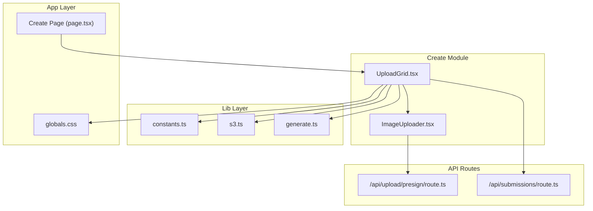
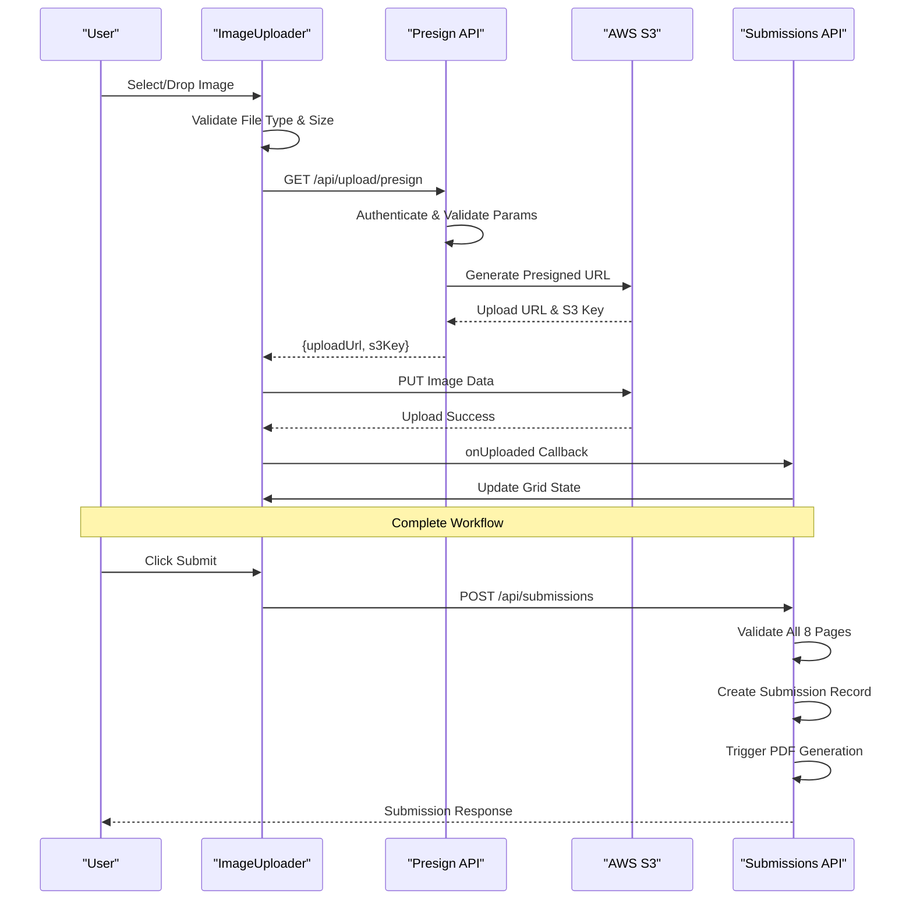
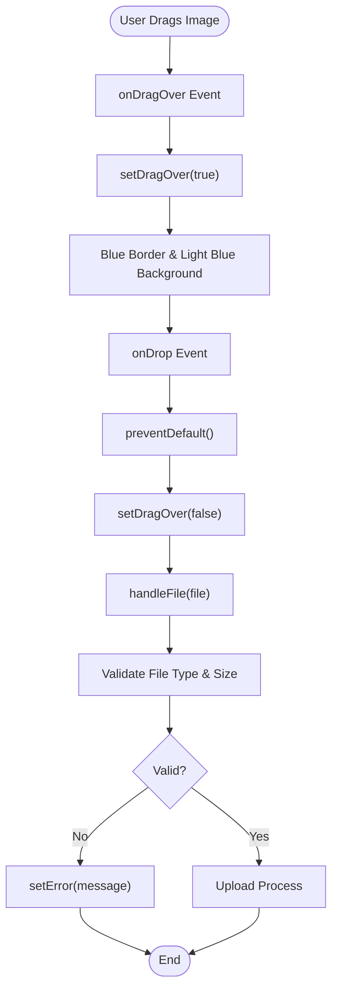
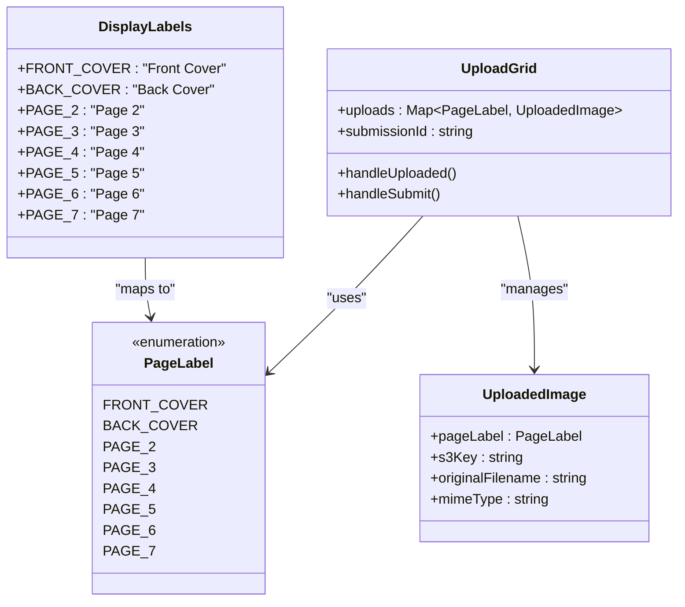
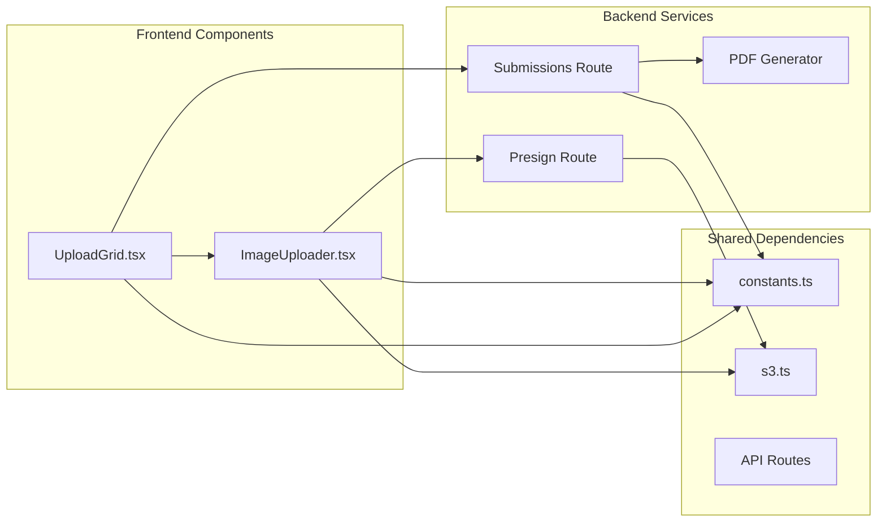

# Upload Interface Components

<cite>
**Referenced Files in This Document**
- [ImageUploader.tsx](file://src/components/create/ImageUploader.tsx)
- [UploadGrid.tsx](file://src/components/create/UploadGrid.tsx)
- [constants.ts](file://src/lib/constants.ts)
- [page.tsx](file://src/app/(protected)/create/page.tsx)
- [presign/route.ts](file://src/app/api/upload/presign/route.ts)
- [submissions/route.ts](file://src/app/api/submissions/route.ts)
- [s3.ts](file://src/lib/s3.ts)
- [generate.ts](file://src/lib/pdf/generate.ts)
- [globals.css](file://src/app/globals.css)
</cite>

## Table of Contents
1. [Introduction](#introduction)
2. [Project Structure](#project-structure)
3. [Core Components](#core-components)
4. [Architecture Overview](#architecture-overview)
5. [Detailed Component Analysis](#detailed-component-analysis)
6. [Dependency Analysis](#dependency-analysis)
7. [Performance Considerations](#performance-considerations)
8. [Troubleshooting Guide](#troubleshooting-guide)
9. [Conclusion](#conclusion)

## Introduction
This document provides comprehensive technical documentation for the upload interface components in Titchybook Creator. It focuses on the ImageUploader component with drag-and-drop functionality and file input handling, the UploadGrid component for managing multiple image uploads and page arrangement, and the page labeling system. The documentation covers component props, event handlers, state management patterns, visual design system using Tailwind CSS classes, and integration patterns with parent form components.

## Project Structure
The upload interface is implemented within the create module and integrates with backend APIs for secure S3 uploads and submission processing.

**Diagram sources**
- [UploadGrid.tsx:1-115](file://src/components/create/UploadGrid.tsx#L1-L115)
- [ImageUploader.tsx:1-148](file://src/components/create/ImageUploader.tsx#L1-L148)
- [constants.ts:1-49](file://src/lib/constants.ts#L1-L49)
- [presign/route.ts:1-38](file://src/app/api/upload/presign/route.ts#L1-L38)
- [submissions/route.ts:1-96](file://src/app/api/submissions/route.ts#L1-L96)
- [s3.ts:1-81](file://src/lib/s3.ts#L1-L81)
- [generate.ts:1-112](file://src/lib/pdf/generate.ts#L1-L112)
- [page.tsx:1-11](file://src/app/(protected)/create/page.tsx#L1-L11)
- [globals.css:1-27](file://src/app/globals.css#L1-L27)

**Section sources**
- [page.tsx:1-11](file://src/app/(protected)/create/page.tsx#L1-L11)
- [UploadGrid.tsx:1-115](file://src/components/create/UploadGrid.tsx#L1-L115)
- [ImageUploader.tsx:1-148](file://src/components/create/ImageUploader.tsx#L1-L148)

## Core Components

### ImageUploader Component
The ImageUploader component handles individual image uploads with comprehensive validation, preview generation, and visual feedback states.

**Component Props:**
- `pageLabel`: Page label identifier (FRONT_COVER, BACK_COVER, PAGE_2-PAGE_7)
- `submissionId`: Unique identifier for the submission session
- `onUploaded`: Callback handler for successful uploads

**State Management:**
- `preview`: Base64 image preview data
- `uploading`: Loading state during upload process
- `error`: Error message display state
- `dragOver`: Drag-and-drop hover state

**Visual Feedback States:**
- Default: Dashed border with hover effects
- Drag-over: Blue border and light blue background
- Preview: Green border and light green background
- Loading: Semi-transparent overlay with spinner
- Error: Red error message display

**Section sources**
- [ImageUploader.tsx:6-16](file://src/components/create/ImageUploader.tsx#L6-L16)
- [ImageUploader.tsx:17-20](file://src/components/create/ImageUploader.tsx#L17-L20)
- [ImageUploader.tsx:87-146](file://src/components/create/ImageUploader.tsx#L87-L146)

### UploadGrid Component
The UploadGrid component orchestrates multiple ImageUploader instances and manages the overall submission workflow.

**Key Features:**
- Grid layout with responsive design (2x4 on mobile, 4x2 on larger screens)
- Real-time upload tracking and progress indication
- Form validation ensuring all 8 pages are uploaded
- Submission button with conditional enabling/disabling

**State Management:**
- `uploads`: Map storing uploaded images keyed by page label
- `submitting`: Submission processing state
- `submissionId`: Generated unique submission identifier

**Section sources**
- [UploadGrid.tsx:16-38](file://src/components/create/UploadGrid.tsx#L16-L38)
- [UploadGrid.tsx:78-112](file://src/components/create/UploadGrid.tsx#L78-L112)

## Architecture Overview

**Diagram sources**
- [ImageUploader.tsx:42-71](file://src/components/create/ImageUploader.tsx#L42-L71)
- [presign/route.ts:6-37](file://src/app/api/upload/presign/route.ts#L6-L37)
- [submissions/route.ts:35-95](file://src/app/api/submissions/route.ts#L35-L95)

## Detailed Component Analysis

### ImageUploader Implementation Details

#### Drag-and-Drop Functionality
The component implements comprehensive drag-and-drop handling with proper event prevention and visual feedback.

**Diagram sources**
- [ImageUploader.tsx:75-85](file://src/components/create/ImageUploader.tsx#L75-L85)
- [ImageUploader.tsx:92-105](file://src/components/create/ImageUploader.tsx#L92-L105)

#### File Validation and Processing
The component enforces strict file validation and implements efficient preview generation.

**Validation Rules:**
- File type: JPEG, PNG, or WebP only
- File size: Maximum 10MB
- Content type validation against accepted types

**Processing Pipeline:**
1. File type verification using MIME type matching
2. Size validation against configured limit
3. Base64 preview generation using FileReader
4. Presigned URL acquisition from backend
5. Direct S3 upload using generated URL
6. Callback invocation on success

**Section sources**
- [ImageUploader.tsx:22-73](file://src/components/create/ImageUploader.tsx#L22-L73)
- [constants.ts:42-49](file://src/lib/constants.ts#L42-L49)

### UploadGrid Orchestration

#### Page Labeling System
The upload grid utilizes a structured page labeling system with display constants.

**Diagram sources**
- [constants.ts:18-40](file://src/lib/constants.ts#L18-L40)
- [UploadGrid.tsx:9-14](file://src/components/create/UploadGrid.tsx#L9-L14)

#### Submission Workflow
The UploadGrid coordinates the complete submission process from individual uploads to final creation.

**Submission Requirements:**
- All 8 page labels must be present
- Each page requires a valid image upload
- Images are validated and processed before submission

**Section sources**
- [UploadGrid.tsx:24-76](file://src/components/create/UploadGrid.tsx#L24-L76)
- [constants.ts:18-27](file://src/lib/constants.ts#L18-L27)

### Visual Design System

#### Tailwind CSS Classes and States
The components utilize a comprehensive Tailwind CSS design system with state-driven styling.

**State Classes:**
- Default: `border-gray-300 hover:border-gray-400`
- Drag-over: `border-blue-500 bg-blue-50`
- Preview: `border-green-400 bg-green-50`
- Loading: Overlay with spinner animation
- Error: Red error message styling

**Layout Classes:**
- Responsive grid: `grid grid-cols-2 sm:grid-cols-4`
- Spacing: `gap-4 justify-items-center`
- Container: `flex flex-col items-center gap-1`

**Section sources**
- [ImageUploader.tsx:99-105](file://src/components/create/ImageUploader.tsx#L99-L105)
- [UploadGrid.tsx:88-97](file://src/components/create/UploadGrid.tsx#L88-L97)

## Dependency Analysis

**Diagram sources**
- [ImageUploader.tsx:3-4](file://src/components/create/ImageUploader.tsx#L3-L4)
- [UploadGrid.tsx:6-7](file://src/components/create/UploadGrid.tsx#L6-L7)
- [constants.ts:1-49](file://src/lib/constants.ts#L1-L49)
- [presign/route.ts:1-38](file://src/app/api/upload/presign/route.ts#L1-L38)
- [submissions/route.ts:1-96](file://src/app/api/submissions/route.ts#L1-L96)
- [s3.ts:1-81](file://src/lib/s3.ts#L1-L81)
- [generate.ts:1-112](file://src/lib/pdf/generate.ts#L1-L112)

**Section sources**
- [ImageUploader.tsx:1-10](file://src/components/create/ImageUploader.tsx#L1-L10)
- [UploadGrid.tsx:1-8](file://src/components/create/UploadGrid.tsx#L1-L8)

## Performance Considerations

### Upload Optimization
- **Direct S3 Upload**: Files bypass the application server, reducing bandwidth and latency
- **Presigned URLs**: Generated with 10-minute expiration for security and performance
- **Parallel Processing**: Multiple upload components operate independently

### Memory Management
- **Base64 Previews**: Efficient memory usage with automatic cleanup on errors
- **State Updates**: Optimized with functional updates to minimize re-renders
- **File Validation**: Early validation prevents unnecessary processing

### Scalability
- **Independent Components**: Each ImageUploader operates independently
- **Backend Validation**: Comprehensive server-side validation ensures data integrity
- **Asynchronous PDF Generation**: Background processing prevents blocking user interactions

## Troubleshooting Guide

### Common Upload Issues
**File Type Errors:**
- Verify file extensions match content types
- Check accepted formats: JPEG, PNG, WebP
- Ensure files are not corrupted

**Size Limit Exceeded:**
- Files must be under 10MB
- Consider compressing images before upload
- Use appropriate image dimensions

**Drag-and-Drop Not Working:**
- Ensure browser supports drag-and-drop API
- Check for JavaScript errors in console
- Verify component event handlers are attached

**Upload Failures:**
- Network connectivity issues
- AWS S3 service availability
- Authentication token expiration

### Debugging Strategies
1. **Console Logging**: Enable detailed logging in development mode
2. **Network Inspection**: Monitor API requests and responses
3. **State Monitoring**: Track component state changes
4. **Error Boundaries**: Implement proper error handling and user feedback

**Section sources**
- [ImageUploader.tsx:24-31](file://src/components/create/ImageUploader.tsx#L24-L31)
- [presign/route.ts:18-30](file://src/app/api/upload/presign/route.ts#L18-L30)
- [submissions/route.ts:45-50](file://src/app/api/submissions/route.ts#L45-L50)

## Conclusion
The Titchybook Creator upload interface components provide a robust, user-friendly solution for managing multiple image uploads with comprehensive validation, real-time feedback, and seamless integration with AWS S3 storage. The modular architecture ensures maintainability while the visual design system delivers intuitive user experiences across different screen sizes. The implementation demonstrates best practices in React component design, state management, and backend integration patterns.