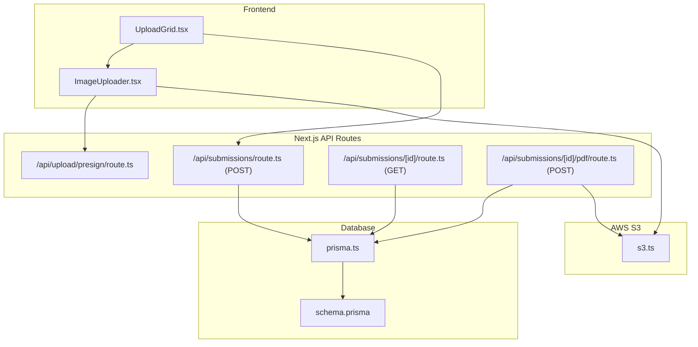
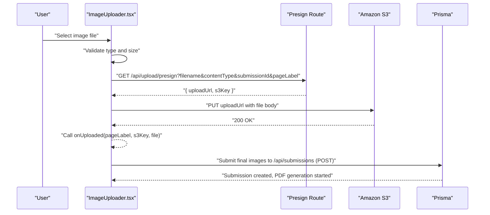
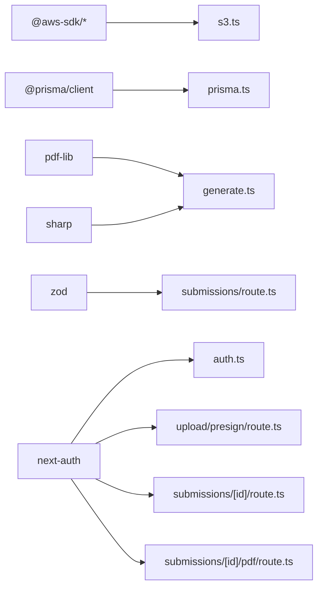
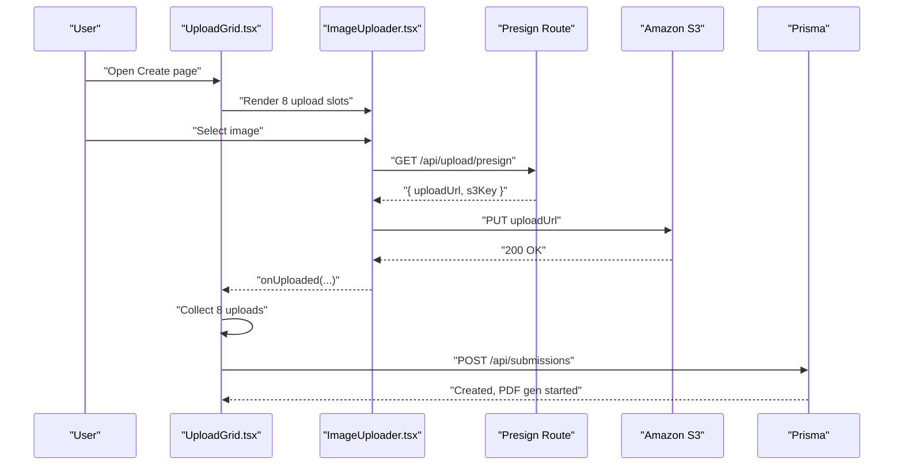

# Upload Workflow and Pipeline

<cite>
**Referenced Files in This Document**
- [route.ts](file://src/app/api/upload/presign/route.ts)
- [s3.ts](file://src/lib/s3.ts)
- [ImageUploader.tsx](file://src/components/create/ImageUploader.tsx)
- [UploadGrid.tsx](file://src/components/create/UploadGrid.tsx)
- [page.tsx](file://src/app/(protected)/create/page.tsx)
- [route.ts](file://src/app/api/submissions/route.ts)
- [route.ts](file://src/app/api/submissions/[id]/route.ts)
- [route.ts](file://src/app/api/submissions/[id]/pdf/route.ts)
- [generate.ts](file://src/lib/pdf/generate.ts)
- [constants.ts](file://src/lib/constants.ts)
- [prisma.ts](file://src/lib/prisma.ts)
- [schema.prisma](file://prisma/schema.prisma)
- [auth.ts](file://src/auth.ts)
- [package.json](file://package.json)
</cite>

## Table of Contents
1. [Introduction](#introduction)
2. [Project Structure](#project-structure)
3. [Core Components](#core-components)
4. [Architecture Overview](#architecture-overview)
5. [Detailed Component Analysis](#detailed-component-analysis)
6. [Dependency Analysis](#dependency-analysis)
7. [Performance Considerations](#performance-considerations)
8. [Troubleshooting Guide](#troubleshooting-guide)
9. [Conclusion](#conclusion)
10. [Appendices](#appendices)

## Introduction
This document explains the complete upload workflow and pipeline for the Titchybook application, from selecting an image in the browser to storing it in Amazon S3 via a presigned URL. It covers:
- Presigned URL generation, parameter validation, S3 bucket configuration, and temporary credential management
- Direct-to-S3 upload using the browser’s fetch API and PUT requests
- Upload completion callback and database tracking of uploaded files
- Error handling, retry strategies, and progress indication
- Integration with the submission system and association of uploaded images to user submissions
- Examples of the end-to-end flow and troubleshooting common issues

## Project Structure
The upload pipeline spans frontend components, API routes, AWS SDK utilities, and the database via Prisma. The main pieces are:
- Frontend upload components that orchestrate file selection, preview, and direct S3 uploads
- API routes that validate parameters, generate presigned URLs, and accept final submissions
- AWS S3 utilities that construct keys, sign upload URLs, and manage downloads/uploads
- Prisma models that persist submission metadata and image associations
- PDF generation that consumes stored images and produces a final PDF artifact

**Diagram sources**
- [UploadGrid.tsx:1-115](file://src/components/create/UploadGrid.tsx#L1-L115)
- [ImageUploader.tsx:1-148](file://src/components/create/ImageUploader.tsx#L1-L148)
- [route.ts:1-38](file://src/app/api/upload/presign/route.ts#L1-L38)
- [route.ts:1-96](file://src/app/api/submissions/route.ts#L1-L96)
- [route.ts:1-37](file://src/app/api/submissions/[id]/route.ts#L1-L37)
- [route.ts:1-27](file://src/app/api/submissions/[id]/pdf/route.ts#L1-L27)
- [s3.ts:1-81](file://src/lib/s3.ts#L1-L81)
- [prisma.ts:1-10](file://src/lib/prisma.ts#L1-L10)
- [schema.prisma:1-48](file://prisma/schema.prisma#L1-L48)

**Section sources**
- [UploadGrid.tsx:1-115](file://src/components/create/UploadGrid.tsx#L1-L115)
- [ImageUploader.tsx:1-148](file://src/components/create/ImageUploader.tsx#L1-L148)
- [route.ts:1-38](file://src/app/api/upload/presign/route.ts#L1-L38)
- [route.ts:1-96](file://src/app/api/submissions/route.ts#L1-L96)
- [route.ts:1-37](file://src/app/api/submissions/[id]/route.ts#L1-L37)
- [route.ts:1-27](file://src/app/api/submissions/[id]/pdf/route.ts#L1-L27)
- [s3.ts:1-81](file://src/lib/s3.ts#L1-L81)
- [prisma.ts:1-10](file://src/lib/prisma.ts#L1-L10)
- [schema.prisma:1-48](file://prisma/schema.prisma#L1-L48)

## Core Components
- Presigned URL endpoint: Validates required parameters, checks accepted image types, builds an S3 key, and returns a short-lived upload URL and S3 key.
- S3 utilities: Configure AWS SDK client with environment credentials, build upload/download URLs, and provide helpers to construct S3 keys for images and PDFs.
- Frontend uploader: Handles drag-and-drop and file input, validates file type and size, previews the selected image, requests a presigned URL, performs a direct PUT to S3, and notifies the parent on success.
- Submission controller: Accepts final submission payload with 8 images, validates uniqueness and ordering, persists them to the database, and triggers asynchronous PDF generation.
- PDF generator: Updates submission status to processing, fetches images from S3, composes a PDF, uploads it to S3, and records the PDF key in the database.
- Authentication: Ensures all protected endpoints require a valid session and enforces ownership or admin privileges.

**Section sources**
- [route.ts:6-37](file://src/app/api/upload/presign/route.ts#L6-L37)
- [s3.ts:8-81](file://src/lib/s3.ts#L8-L81)
- [ImageUploader.tsx:22-73](file://src/components/create/ImageUploader.tsx#L22-L73)
- [UploadGrid.tsx:24-76](file://src/components/create/UploadGrid.tsx#L24-L76)
- [route.ts:35-95](file://src/app/api/submissions/route.ts#L35-L95)
- [generate.ts:23-43](file://src/lib/pdf/generate.ts#L23-L43)
- [auth.ts:27-79](file://src/auth.ts#L27-L79)

## Architecture Overview
The upload pipeline follows a secure, scalable pattern:
- Client requests a presigned URL from the backend after selecting a file.
- Backend validates parameters, checks allowed content types, constructs an S3 key, and returns a signed URL valid for a limited time.
- Client uploads the file directly to S3 using the returned URL, bypassing the origin server.
- On success, the client invokes the submission API with the S3 key and metadata.
- The backend persists the image entries and starts background PDF generation.

**Diagram sources**
- [ImageUploader.tsx:42-64](file://src/components/create/ImageUploader.tsx#L42-L64)
- [route.ts:6-37](file://src/app/api/upload/presign/route.ts#L6-L37)
- [route.ts:35-95](file://src/app/api/submissions/route.ts#L35-L95)
- [s3.ts:18-28](file://src/lib/s3.ts#L18-L28)

## Detailed Component Analysis

### Presigned URL Generation Endpoint
Responsibilities:
- Authenticate the user session
- Validate presence of filename, contentType, submissionId, and pageLabel
- Enforce accepted image MIME types
- Construct an S3 key using a builder function
- Generate a presigned PUT URL with a limited TTL
- Return the upload URL and S3 key to the client

Key validations and behaviors:
- Missing parameters result in a 400 error
- Invalid content type rejected with a 400 error
- S3 key built using user ID, submission ID, page label, and file extension
- Presigned URL configured with a 10-minute expiration

**Section sources**
- [route.ts:6-37](file://src/app/api/upload/presign/route.ts#L6-L37)
- [s3.ts:66-73](file://src/lib/s3.ts#L66-L73)

### S3 Utilities and Configuration
Responsibilities:
- Initialize AWS S3 client with region and credentials from environment variables
- Build presigned upload and download URLs for S3 objects
- Provide helpers to construct S3 keys for images and PDFs
- Offer direct upload and download functions for server-side operations

Security and configuration:
- Credentials and region sourced from environment variables
- Upload URLs expire after 10 minutes; download URLs after 60 minutes
- Keys organized under predictable prefixes for images and PDFs

**Section sources**
- [s3.ts:8-14](file://src/lib/s3.ts#L8-L14)
- [s3.ts:18-36](file://src/lib/s3.ts#L18-L36)
- [s3.ts:66-80](file://src/lib/s3.ts#L66-L80)

### Frontend Image Uploader
Responsibilities:
- Accept drag-and-drop or file input
- Validate file type and size against constants
- Preview the selected image
- Request a presigned URL from the backend
- Perform a direct PUT upload to S3
- Notify parent component on success with page label, S3 key, and original file metadata
- Display uploading state and errors

Progress and UX:
- Visual feedback during upload (spinner overlay)
- Clear error messages for invalid types or sizes
- Preview image after selection

**Section sources**
- [ImageUploader.tsx:22-73](file://src/components/create/ImageUploader.tsx#L22-L73)
- [constants.ts:42-49](file://src/lib/constants.ts#L42-L49)

### Upload Grid and Submission Assembly
Responsibilities:
- Manage a map of uploaded images keyed by page label
- Ensure all 8 page labels are collected before enabling submission
- Build the final submission payload with ordered images and metadata
- Submit the payload to the backend and navigate on success

Integration:
- Generates a per-session submissionId to group uploads
- Uses PAGE_LABELS to enforce completeness and ordering

**Section sources**
- [UploadGrid.tsx:16-76](file://src/components/create/UploadGrid.tsx#L16-L76)
- [constants.ts:18-27](file://src/lib/constants.ts#L18-L27)

### Submission Creation and PDF Generation
Responsibilities:
- Validate incoming submission payload with Zod
- Ensure exactly 8 unique page labels and correct ordering
- Persist submission and images in a single transaction
- Trigger asynchronous PDF generation without blocking the response

PDF Generation:
- Sets submission status to PROCESSING
- Loads images from S3, processes them, composes a PDF, uploads the PDF to S3, and updates the submission with the PDF key

**Section sources**
- [route.ts:35-95](file://src/app/api/submissions/route.ts#L35-L95)
- [generate.ts:23-43](file://src/lib/pdf/generate.ts#L23-L43)

### Database Schema and Relationships
The schema defines:
- User model with submissions
- Submission model with status, optional PDF S3 key, and images
- SubmissionImage model linking to a submission with page label, S3 key, order, and metadata

Indexes and relations:
- Submission indexed by userId
- SubmissionImage indexed by submissionId with cascade delete

**Section sources**
- [schema.prisma:10-48](file://prisma/schema.prisma#L10-L48)
- [prisma.ts:1-10](file://src/lib/prisma.ts#L1-L10)

### Authentication and Authorization
- NextAuth configures JWT-based sessions and custom JWT/session callbacks
- Protected routes check for a valid session and enforce ownership or admin roles
- PDF generation route also requires authentication

**Section sources**
- [auth.ts:27-79](file://src/auth.ts#L27-L79)
- [route.ts:10-28](file://src/app/api/submissions/[id]/route.ts#L10-L28)
- [route.ts:9-12](file://src/app/api/submissions/[id]/pdf/route.ts#L9-L12)

## Dependency Analysis
External libraries and integrations:
- AWS SDK for JavaScript v3: S3 client, presigner, and commands
- Prisma: ORM for SQLite-backed persistence
- pdf-lib and sharp: PDF composition and image processing
- next-auth: Authentication and session management
- zod: Runtime validation for submission payloads

**Diagram sources**
- [package.json:11-24](file://package.json#L11-L24)
- [s3.ts:1-81](file://src/lib/s3.ts#L1-L81)
- [prisma.ts:1-10](file://src/lib/prisma.ts#L1-L10)
- [generate.ts:1-6](file://src/lib/pdf/generate.ts#L1-L6)
- [route.ts:4-6](file://src/app/api/submissions/route.ts#L4-L6)
- [auth.ts:1-2](file://src/auth.ts#L1-L2)

**Section sources**
- [package.json:11-24](file://package.json#L11-L24)

## Performance Considerations
- Direct-to-S3 uploads eliminate origin bandwidth and reduce server load
- Presigned URLs expire quickly to minimize exposure windows
- PDF generation runs asynchronously to avoid blocking submission responses
- Parallel downloads of images during PDF generation improve throughput
- Consider adding client-side retry with exponential backoff for transient network failures

[No sources needed since this section provides general guidance]

## Troubleshooting Guide
Common issues and resolutions:
- Unauthorized access: Ensure the user is logged in; protected routes return 401 if missing a valid session.
- Missing required parameters: The presign endpoint requires filename, contentType, submissionId, and pageLabel; missing any returns 400.
- Invalid content type: Only JPG, PNG, and WebP are accepted; otherwise returns 400.
- File too large: Client-side limit is 10 MB; consider compressing or resizing images.
- Upload failure to S3: Verify AWS credentials and region are set; confirm the bucket name matches the configured value; check that the presigned URL TTL has not expired.
- Submission validation errors: Ensure exactly 8 unique page labels and correct ordering; the backend validates with Zod and rejects incomplete or duplicate sets.
- PDF generation errors: Check logs for processing failures; the route returns 500 on error and logs the issue.

Retry mechanisms:
- Client-side: Implement retries with exponential backoff for presign and upload steps when encountering transient network errors.
- Server-side: PDF generation is fire-and-forget; consider idempotent status updates and re-run triggers if needed.

Progress indication:
- Show a spinner overlay during upload and clear preview on success.
- Display a success toast and redirect after submission.
- Use a counter to show how many of 8 images have been uploaded.

**Section sources**
- [route.ts:8-30](file://src/app/api/upload/presign/route.ts#L8-L30)
- [ImageUploader.tsx:24-31](file://src/components/create/ImageUploader.tsx#L24-L31)
- [route.ts:43-61](file://src/app/api/submissions/route.ts#L43-L61)
- [route.ts:16-25](file://src/app/api/submissions/[id]/pdf/route.ts#L16-L25)

## Conclusion
The upload pipeline leverages presigned URLs to securely and efficiently transfer images directly to S3 while keeping the origin server out of the data path. The frontend components provide a smooth user experience with validation, previews, and progress indicators. The backend enforces strict validation and persists all artifacts to the database, while asynchronous PDF generation completes the submission lifecycle. Robust error handling and retry strategies further improve reliability.

[No sources needed since this section summarizes without analyzing specific files]

## Appendices

### End-to-End Upload Flow Example
- User selects an image in the grid; the component validates type and size and shows a preview.
- The component requests a presigned URL from the backend with filename, contentType, submissionId, and pageLabel.
- The backend validates parameters, checks content type, constructs an S3 key, and returns a presigned upload URL and S3 key.
- The component uploads the file directly to S3 using the returned URL.
- On success, the component notifies the grid, which aggregates all 8 uploads.
- The grid posts the final submission payload to the backend, which persists the images and starts PDF generation.

**Diagram sources**
- [page.tsx:1-11](file://src/app/(protected)/create/page.tsx#L1-L11)
- [UploadGrid.tsx:24-76](file://src/components/create/UploadGrid.tsx#L24-L76)
- [ImageUploader.tsx:42-64](file://src/components/create/ImageUploader.tsx#L42-L64)
- [route.ts:6-37](file://src/app/api/upload/presign/route.ts#L6-L37)
- [route.ts:35-95](file://src/app/api/submissions/route.ts#L35-L95)