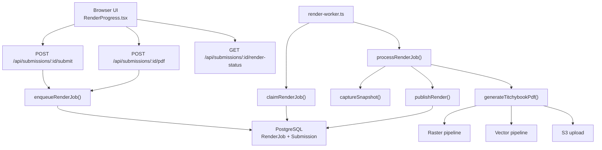
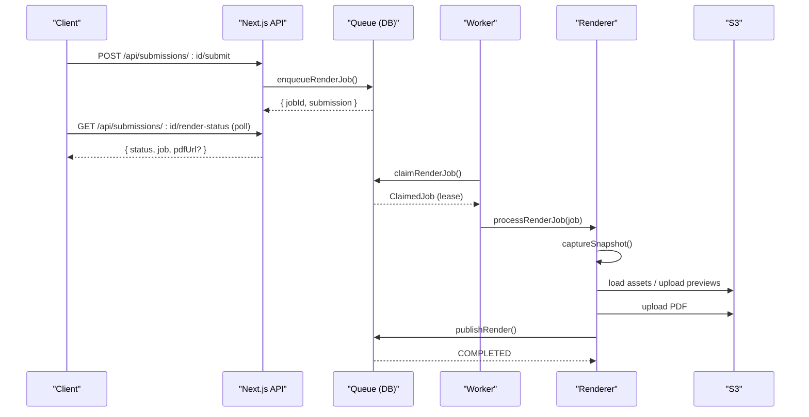
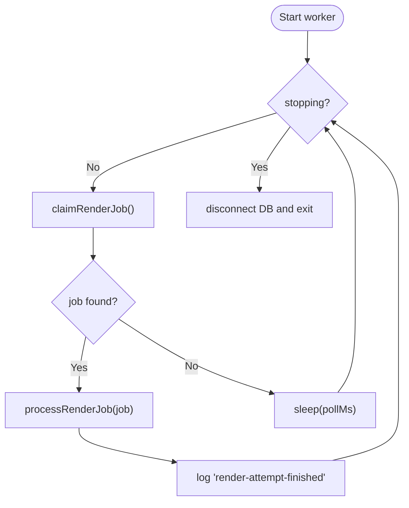
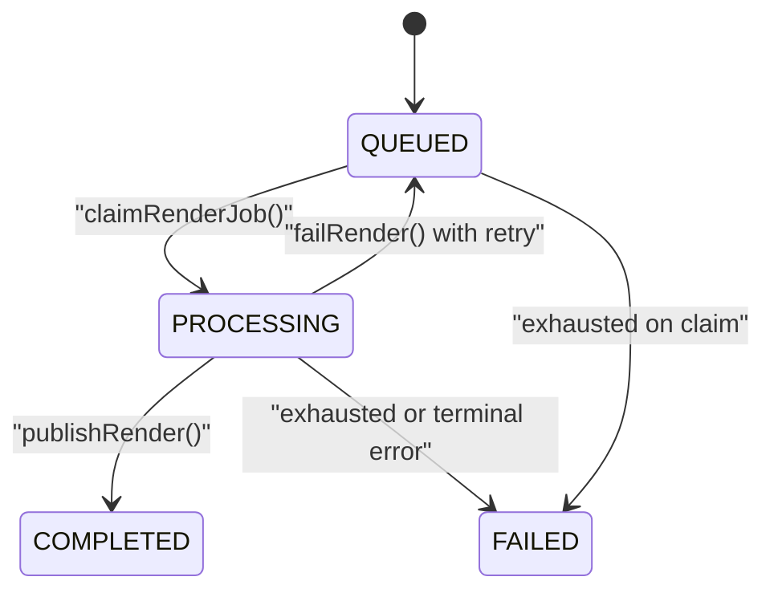
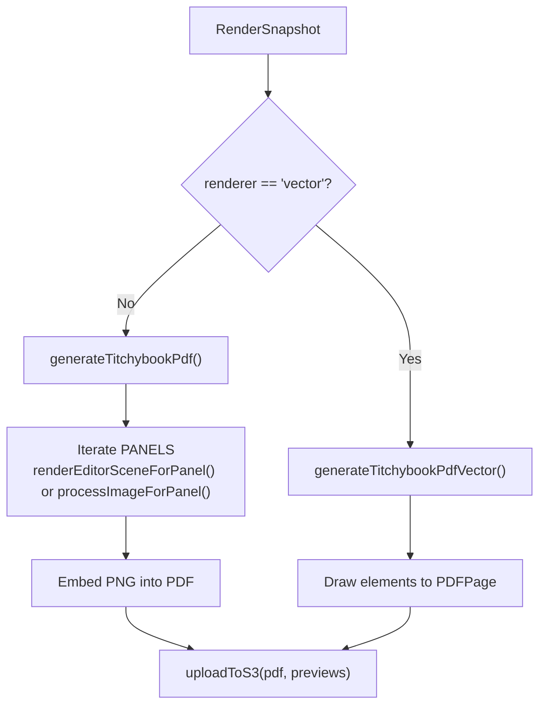
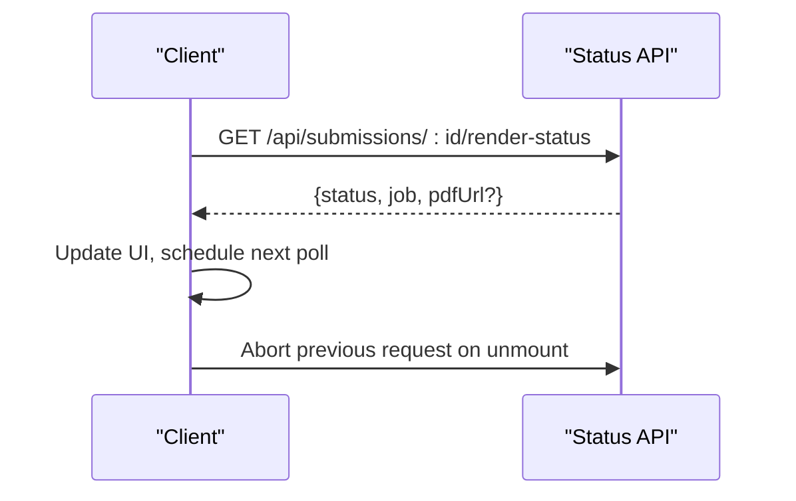
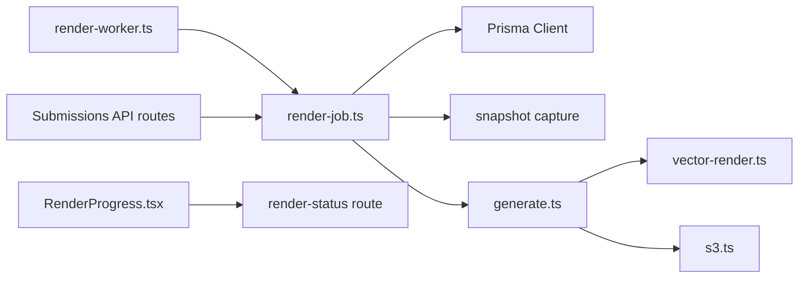

# Distributed Render Worker System

<cite>
**Referenced Files in This Document**
- [render-worker.ts](file://src/workers/render-worker.ts)
- [render-job.ts](file://src/lib/pdf/render-job.ts)
- [schema.prisma](file://prisma/schema.prisma)
- [generate.ts](file://src/lib/pdf/generate.ts)
- [vector-render.ts](file://src/lib/pdf/vector-render.ts)
- [s3.ts](file://src/lib/s3.ts)
- [submission-store.ts](file://src/lib/editor/submission-store.ts)
- [route.ts (submit)](file://src/app/api/submissions/[id]/submit/route.ts)
- [route.ts (pdf retry)](file://src/app/api/submissions/[id]/pdf/route.ts)
- [route.ts (render-status)](file://src/app/api/submissions/[id]/render-status/route.ts)
- [RenderProgress.tsx](file://src/components/submissions/RenderProgress.tsx)
- [worker-process.test.ts](file://tests/integration/worker-process.test.ts)
- [editor-queue.test.ts](file://tests/integration/editor-queue.test.ts)
</cite>

## Table of Contents
1. [Introduction](#introduction)
2. [Project Structure](#project-structure)
3. [Core Components](#core-components)
4. [Architecture Overview](#architecture-overview)
5. [Detailed Component Analysis](#detailed-component-analysis)
6. [Dependency Analysis](#dependency-analysis)
7. [Performance Considerations](#performance-considerations)
8. [Troubleshooting Guide](#troubleshooting-guide)
9. [Conclusion](#conclusion)

## Introduction
This document explains the Distributed Render Worker System that asynchronously generates PDF booklets from editor scenes or uploaded images. It covers how submissions are queued, how workers claim and process jobs with leases and heartbeats, how rendering is performed via raster or vector pipelines, and how clients observe progress through a status API. The system is designed to be resilient: jobs survive worker restarts, concurrent claims are deduplicated, and failures are retried with backoff until a maximum attempt count is reached.

## Project Structure
The render system spans several layers:
- Web API layer: endpoints to enqueue rendering, retry failed jobs, and poll status.
- Job queue layer: durable job table with optimistic locking, leasing, and heartbeat.
- Worker process: long-running Node process that polls for work and executes it.
- Rendering pipeline: snapshot capture, asset loading, PDF generation (raster or vector), and S3 storage.
- Client UI: polling component that displays progress and offers retry.

**Diagram sources**
- [render-worker.ts:17-31](file://src/workers/render-worker.ts#L17-L31)
- [render-job.ts:17-52](file://src/lib/pdf/render-job.ts#L17-L52)
- [generate.ts:10-42](file://src/lib/pdf/generate.ts#L10-L42)
- [vector-render.ts:386-442](file://src/lib/pdf/vector-render.ts#L386-L442)
- [s3.ts:53-65](file://src/lib/s3.ts#L53-L65)
- [route.ts (submit):7-15](file://src/app/api/submissions/[id]/submit/route.ts#L7-L15)
- [route.ts (pdf retry):9-22](file://src/app/api/submissions/[id]/pdf/route.ts#L9-L22)
- [route.ts (render-status):14-101](file://src/app/api/submissions/[id]/render-status/route.ts#L14-L101)

**Section sources**
- [render-worker.ts:1-32](file://src/workers/render-worker.ts#L1-L32)
- [render-job.ts:1-125](file://src/lib/pdf/render-job.ts#L1-L125)
- [schema.prisma:217-239](file://prisma/schema.prisma#L217-L239)

## Core Components
- Durable job model: A RenderJob tracks submission association, status transitions, attempts, lease, and artifacts.
- Queue operations: Enqueue under transactional locks, claim with skip-locked row-level locking, heartbeat to extend lease, publish/fail with fencing.
- Worker loop: Polls for jobs, processes them, logs structured events, and exits gracefully on signals.
- Rendering: Captures a frozen snapshot of input, loads assets, renders to PDF (raster or vector), uploads artifacts, and publishes results.
- Status API: Returns latest job state and optional presigned PDF URL based on permissions.

**Section sources**
- [schema.prisma:217-239](file://prisma/schema.prisma#L217-L239)
- [render-job.ts:17-125](file://src/lib/pdf/render-job.ts#L17-L125)
- [render-worker.ts:17-31](file://src/workers/render-worker.ts#L17-L31)
- [generate.ts:10-42](file://src/lib/pdf/generate.ts#L10-L42)
- [route.ts (render-status):14-101](file://src/app/api/submissions/[id]/render-status/route.ts#L14-L101)

## Architecture Overview
The system separates concerns between request handling, job scheduling, background processing, and output storage.

**Diagram sources**
- [route.ts (submit):7-15](file://src/app/api/submissions/[id]/submit/route.ts#L7-L15)
- [render-job.ts:31-52](file://src/lib/pdf/render-job.ts#L31-L52)
- [render-job.ts:68-94](file://src/lib/pdf/render-job.ts#L68-L94)
- [render-job.ts:107-124](file://src/lib/pdf/render-job.ts#L107-L124)
- [route.ts (render-status):14-101](file://src/app/api/submissions/[id]/render-status/route.ts#L14-L101)

## Detailed Component Analysis

### Worker Loop and Lifecycle
- The worker starts a loop that claims jobs, processes them, and sleeps when idle.
- On SIGINT/SIGTERM, it stops polling and exits after a timeout so leases expire and work is reclaimed.
- Structured logs emit events for claimed and finished attempts.

**Diagram sources**
- [render-worker.ts:6-31](file://src/workers/render-worker.ts#L6-L31)

**Section sources**
- [render-worker.ts:1-32](file://src/workers/render-worker.ts#L1-L32)

### Job Queue Semantics
- Enqueue:
  - Locks the submission row to prevent races.
  - Deduplicates active jobs per submission.
  - Captures a frozen snapshot once; retries reuse previous snapshot if available.
  - Sets submission status to PROCESSING and creates a RenderJob.
- Claim:
  - Uses SQL FOR UPDATE SKIP LOCKED to atomically pick one candidate.
  - Marks job as PROCESSING, increments attempts, sets a 120-second lease and startedAt.
  - Exposes an exhausted flag when maxAttempts reached.
- Heartbeat:
  - Extends lease while processing; fails if token mismatch or lease expired.
- Publish/Fail:
  - Fences by re-checking lease and submission lock before committing final state.
  - Publish updates submission and page previews, marks job COMPLETED.
  - Fail either queues for retry with backoff or marks FAILED when exhausted or invalid input.

**Diagram sources**
- [render-job.ts:17-94](file://src/lib/pdf/render-job.ts#L17-L94)
- [schema.prisma:217-239](file://prisma/schema.prisma#L217-L239)

**Section sources**
- [render-job.ts:17-125](file://src/lib/pdf/render-job.ts#L17-L125)
- [schema.prisma:217-239](file://prisma/schema.prisma#L217-L239)

### Rendering Pipeline
- Snapshot capture freezes editor scene or image list into a versioned structure.
- Generation chooses between raster and vector modes:
  - Raster: Renders each panel sequentially to bound memory, embeds PNGs into a single A4 landscape PDF, uploads previews and final PDF.
  - Vector: Draws shapes, text, and images directly onto PDF pages using vector APIs for crisp text at any scale.
- Artifacts are stored under a unique per-attempt prefix including userId, submissionId, jobId, attempt number, and claim token.

**Diagram sources**
- [generate.ts:10-42](file://src/lib/pdf/generate.ts#L10-L42)
- [vector-render.ts:386-442](file://src/lib/pdf/vector-render.ts#L386-L442)
- [s3.ts:53-65](file://src/lib/s3.ts#L53-L65)

**Section sources**
- [generate.ts:1-43](file://src/lib/pdf/generate.ts#L1-L43)
- [vector-render.ts:163-442](file://src/lib/pdf/vector-render.ts#L163-L442)
- [s3.ts:1-109](file://src/lib/s3.ts#L1-L109)

### Client Interaction and Progress
- Submit endpoint enqueues a job and returns 202 with jobId and submission details.
- Retry endpoint re-enqueues using previous snapshot when possible.
- Status endpoint returns latest job state and a presigned download URL when allowed.
- Frontend component polls the status endpoint with adaptive intervals and abortable requests, shows messages, and exposes a retry button.

**Diagram sources**
- [route.ts (render-status):14-101](file://src/app/api/submissions/[id]/render-status/route.ts#L14-L101)
- [RenderProgress.tsx:17-64](file://src/components/submissions/RenderProgress.tsx#L17-L64)

**Section sources**
- [route.ts (submit):7-15](file://src/app/api/submissions/[id]/submit/route.ts#L7-L15)
- [route.ts (pdf retry):9-22](file://src/app/api/submissions/[id]/pdf/route.ts#L9-L22)
- [route.ts (render-status):14-101](file://src/app/api/submissions/[id]/render-status/route.ts#L14-L101)
- [RenderProgress.tsx:1-91](file://src/components/submissions/RenderProgress.tsx#L1-L91)

### Concurrency and Safety
- Row-level locking prevents duplicate enqueues and concurrent mutations on the same submission.
- Skip-locked claims ensure only one worker processes a job at a time.
- Heartbeat and fenced commits protect against partial updates during crashes.
- Tests verify deduplication, recovery of expired leases, and failure behavior without extra renders.

**Section sources**
- [submission-store.ts:25-28](file://src/lib/editor/submission-store.ts#L25-L28)
- [render-job.ts:36-67](file://src/lib/pdf/render-job.ts#L36-L67)
- [editor-queue.test.ts:184-263](file://tests/integration/editor-queue.test.ts#L184-L263)

## Dependency Analysis
Key dependencies and their roles:
- Prisma client: Transactional access to PostgreSQL for submissions, pages, and render jobs.
- S3 client: Upload/download of assets, previews, and final PDFs; presigned URLs for secure downloads.
- PDF libraries: pdf-lib for PDF creation and manipulation; sharp for image processing in raster mode.
- Editor schemas: Validation and transformation of editor scenes into render snapshots.

**Diagram sources**
- [render-worker.ts:1-31](file://src/workers/render-worker.ts#L1-L31)
- [render-job.ts:1-125](file://src/lib/pdf/render-job.ts#L1-L125)
- [generate.ts:1-43](file://src/lib/pdf/generate.ts#L1-L43)
- [vector-render.ts:386-442](file://src/lib/pdf/vector-render.ts#L386-L442)
- [s3.ts:1-109](file://src/lib/s3.ts#L1-L109)
- [route.ts (render-status):14-101](file://src/app/api/submissions/[id]/render-status/route.ts#L14-L101)

**Section sources**
- [render-job.ts:1-125](file://src/lib/pdf/render-job.ts#L1-L125)
- [generate.ts:1-43](file://src/lib/pdf/generate.ts#L1-L43)
- [s3.ts:1-109](file://src/lib/s3.ts#L1-L109)

## Performance Considerations
- Memory bounds: Raster rendering iterates panels sequentially to limit peak memory usage.
- I/O parallelism: Asset loading and uploads are asynchronous; avoid unnecessary duplication by reusing snapshots on retry.
- Lease tuning: 120-second lease balances responsiveness and safety; heartbeat interval keeps long runs healthy.
- Database indexing: RenderJob indexes on status and timing fields optimize claim queries.
- Network resilience: Client uses abort controllers and adaptive polling to reduce wasted requests.

[No sources needed since this section provides general guidance]

## Troubleshooting Guide
Common issues and diagnostics:
- Job stuck in PROCESSING: Check lease expiration and heartbeat; worker may have crashed. Expired leases are reclaimed automatically.
- Repeated failures: Inspect errorMessage and attempts; invalid snapshots cause terminal failures and stop retries.
- Missing assets: Rendering will fail explicitly when required assets are unavailable; ensure S3 keys exist and are accessible.
- Duplicate enqueues: Enqueue is idempotent per submission; multiple calls return the same jobId.
- Worker not picking up jobs: Verify RENDER_WORKER_POLL_MS and database connectivity; check logs for “render-claimed” events.

**Section sources**
- [render-job.ts:81-124](file://src/lib/pdf/render-job.ts#L81-L124)
- [worker-process.test.ts:8-32](file://tests/integration/worker-process.test.ts#L8-L32)
- [rendering.test.ts:44-65](file://tests/unit/rendering.test.ts#L44-L65)

## Conclusion
The Distributed Render Worker System provides a robust, scalable mechanism for generating PDFs from editor content or images. Through durable queuing, safe concurrency controls, and resilient rendering pipelines, it ensures reliable delivery of outputs even under failures. Clients receive clear progress feedback and can safely retry when needed.

[No sources needed since this section summarizes without analyzing specific files]