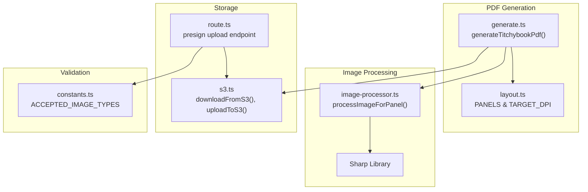
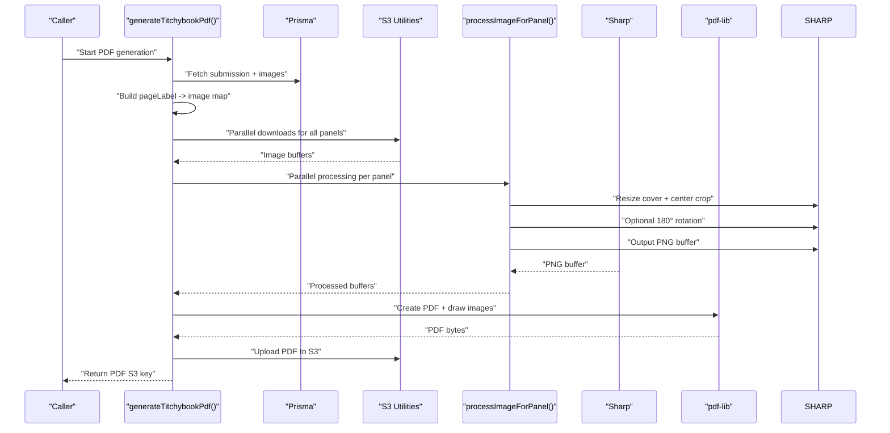
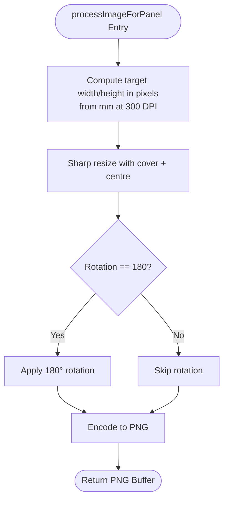
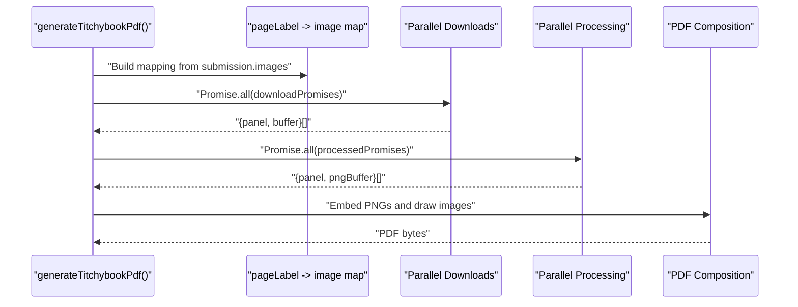
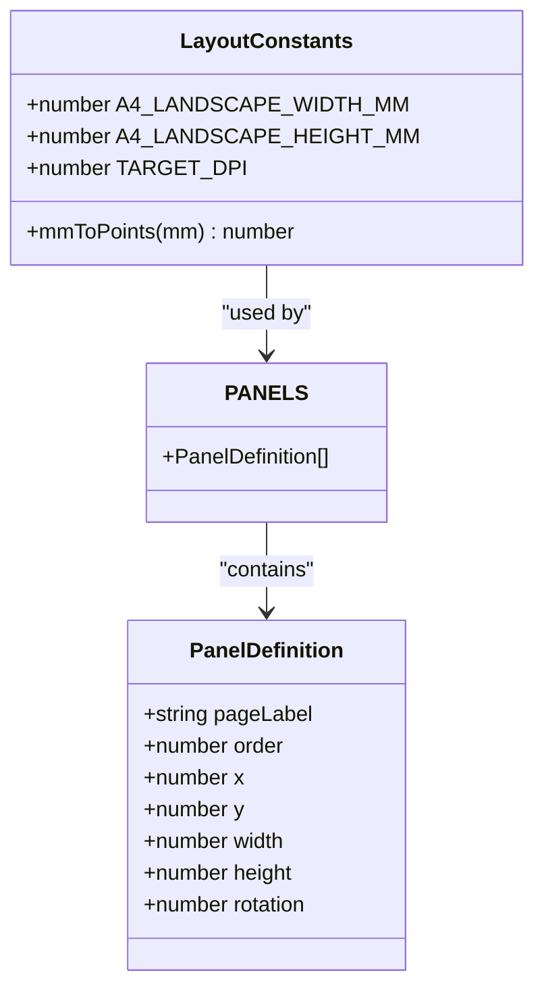
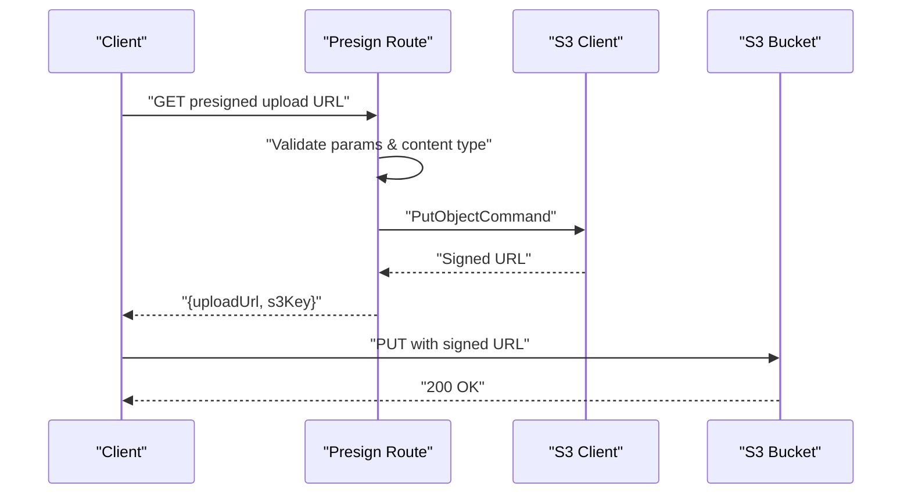
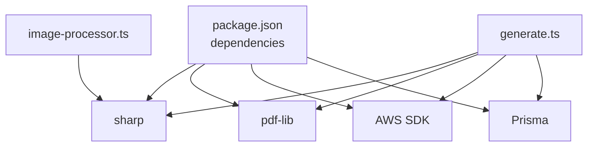

# Image Processing Pipeline

<cite>
**Referenced Files in This Document**
- [image-processor.ts](file://src/lib/pdf/image-processor.ts)
- [generate.ts](file://src/lib/pdf/generate.ts)
- [layout.ts](file://src/lib/pdf/layout.ts)
- [s3.ts](file://src/lib/s3.ts)
- [constants.ts](file://src/lib/constants.ts)
- [route.ts](file://src/app/api/upload/presign/route.ts)
- [package.json](file://package.json)
</cite>

## Table of Contents
1. [Introduction](#introduction)
2. [Project Structure](#project-structure)
3. [Core Components](#core-components)
4. [Architecture Overview](#architecture-overview)
5. [Detailed Component Analysis](#detailed-component-analysis)
6. [Dependency Analysis](#dependency-analysis)
7. [Performance Considerations](#performance-considerations)
8. [Troubleshooting Guide](#troubleshooting-guide)
9. [Conclusion](#conclusion)

## Introduction
This document explains the image processing pipeline that prepares uploaded images for PDF composition. It focuses on the processImageForPanel function responsible for resizing, cropping, and optional rotation of images to match panel specifications. The pipeline integrates Sharp for image manipulation, converts images to PNG for embedding in PDFs, and uses Promise.all for efficient parallel processing of multiple images. It also documents error handling for missing images, invalid formats, and processing failures, along with performance optimization techniques and memory management strategies during bulk image processing.

## Project Structure
The image processing pipeline spans several modules:
- PDF generation orchestrator: fetches image records, downloads assets from S3, processes images in parallel, composes a PDF, and uploads the result.
- Image processor: applies Sharp transformations to align images with panel geometry and resolution targets.
- Layout definitions: specify panel coordinates, sizes, and orientations.
- S3 utilities: handle presigned URLs, downloads, and uploads.
- Constants: define accepted image types and validation rules.
- API routes: provide presigned upload URLs and enforce content-type validation.

**Diagram sources**
- [generate.ts:23-111](file://src/lib/pdf/generate.ts#L23-L111)
- [layout.ts:29-104](file://src/lib/pdf/layout.ts#L29-L104)
- [image-processor.ts:9-29](file://src/lib/pdf/image-processor.ts#L9-L29)
- [s3.ts:38-64](file://src/lib/s3.ts#L38-L64)
- [route.ts:6-37](file://src/app/api/upload/presign/route.ts#L6-L37)
- [constants.ts:42-46](file://src/lib/constants.ts#L42-L46)

**Section sources**
- [generate.ts:23-111](file://src/lib/pdf/generate.ts#L23-L111)
- [image-processor.ts:9-29](file://src/lib/pdf/image-processor.ts#L9-L29)
- [layout.ts:29-104](file://src/lib/pdf/layout.ts#L29-L104)
- [s3.ts:38-64](file://src/lib/s3.ts#L38-L64)
- [route.ts:6-37](file://src/app/api/upload/presign/route.ts#L6-L37)
- [constants.ts:42-46](file://src/lib/constants.ts#L42-L46)

## Core Components
- processImageForPanel: Transforms an image buffer to fit a panel at 300 DPI using cover-fit with center crop, optionally rotates 180° for bottom-row panels, and outputs PNG.
- generateTitchybookPdf: Orchestrates downloading images from S3, processing them in parallel, composing a PDF with pdf-lib, and uploading the result.
- PANELS and TARGET_DPI: Define panel geometry and target resolution in millimeters and DPI.
- S3 utilities: Provide presigned URLs, downloads, and uploads for images and PDFs.
- Validation constants: Enforce accepted image types and file size limits.

**Section sources**
- [image-processor.ts:9-29](file://src/lib/pdf/image-processor.ts#L9-L29)
- [generate.ts:23-111](file://src/lib/pdf/generate.ts#L23-L111)
- [layout.ts:14-20](file://src/lib/pdf/layout.ts#L14-L20)
- [layout.ts:29-104](file://src/lib/pdf/layout.ts#L29-L104)
- [s3.ts:38-64](file://src/lib/s3.ts#L38-L64)
- [constants.ts:42-46](file://src/lib/constants.ts#L42-L46)

## Architecture Overview
The pipeline follows a staged workflow:
1. Fetch submission metadata and image records from the database.
2. Build a mapping from page labels to image records.
3. Parallelize S3 downloads for all panels.
4. Parallelize image processing via Sharp (resize, crop, rotate, PNG).
5. Compose a PDF using pdf-lib and embed processed images.
6. Upload the generated PDF to S3 and update the submission status.

**Diagram sources**
- [generate.ts:23-111](file://src/lib/pdf/generate.ts#L23-L111)
- [image-processor.ts:9-29](file://src/lib/pdf/image-processor.ts#L9-L29)
- [s3.ts:38-64](file://src/lib/s3.ts#L38-L64)

## Detailed Component Analysis

### processImageForPanel Function
Purpose:
- Resize images to fill panel bounds at 300 DPI using a cover-fit strategy with center positioning.
- Apply 180° rotation when required by panel orientation.
- Convert to PNG for embedding compatibility.

Implementation highlights:
- Target pixel calculation uses millimeter-to-pixel conversion at 300 DPI.
- Sharp pipeline applies resize with cover and center positioning.
- Optional rotation step if rotation equals 180.
- Final PNG encoding and buffer extraction.

**Diagram sources**
- [image-processor.ts:15-28](file://src/lib/pdf/image-processor.ts#L15-L28)

**Section sources**
- [image-processor.ts:9-29](file://src/lib/pdf/image-processor.ts#L9-L29)

### PDF Generation Orchestration
Responsibilities:
- Update submission status to PROCESSING to prevent concurrent runs.
- Build a pageLabel → image record map from the submission’s images.
- Parallel downloads of all 8 images from S3.
- Parallel processing of images with processImageForPanel.
- Create an A4 landscape PDF, embed PNG buffers, and draw images at specified positions.
- Upload the PDF to S3 and update the submission with the PDF key and status.

Error handling:
- Throws when an image record is missing for a panel.
- Delegates Sharp errors to callers for upstream handling.

**Diagram sources**
- [generate.ts:37-111](file://src/lib/pdf/generate.ts#L37-L111)

**Section sources**
- [generate.ts:23-111](file://src/lib/pdf/generate.ts#L23-L111)

### Panel Definitions and Target Resolution
- PANELS defines eight panels arranged in two rows with top-row panels upright and bottom-row panels rotated 180°.
- TARGET_DPI is 300, ensuring high-resolution output suitable for print-quality PDFs.
- Coordinates and sizes are specified in millimeters.

**Diagram sources**
- [layout.ts:1-20](file://src/lib/pdf/layout.ts#L1-L20)
- [layout.ts:29-104](file://src/lib/pdf/layout.ts#L29-L104)

**Section sources**
- [layout.ts:14-20](file://src/lib/pdf/layout.ts#L14-L20)
- [layout.ts:29-104](file://src/lib/pdf/layout.ts#L29-L104)

### S3 Integration and Presigned Uploads
- Presigned upload endpoint validates required parameters and accepted content types, constructs an S3 key, and returns a signed URL.
- downloadFromS3 streams S3 objects into a concatenated Buffer.
- uploadToS3 writes PDF buffers to S3 with appropriate content type.
- buildUploadKey and buildPdfKey construct standardized keys for uploads and PDFs.

**Diagram sources**
- [route.ts:6-37](file://src/app/api/upload/presign/route.ts#L6-L37)
- [s3.ts:18-36](file://src/lib/s3.ts#L18-L36)
- [s3.ts:38-64](file://src/lib/s3.ts#L38-L64)

**Section sources**
- [route.ts:6-37](file://src/app/api/upload/presign/route.ts#L6-L37)
- [s3.ts:18-64](file://src/lib/s3.ts#L18-L64)

### Sharp Integration and Quality Settings
- The pipeline uses Sharp for image manipulation.
- Quality and compression settings are not explicitly configured in the current implementation; Sharp defaults apply for PNG encoding.
- The function outputs PNG buffers, which are embedded into the PDF using pdf-lib.

Optimization note:
- To reduce output size, consider configuring Sharp PNG compression options (e.g., compression level) if needed for production workloads.

**Section sources**
- [image-processor.ts:18-28](file://src/lib/pdf/image-processor.ts#L18-L28)
- [package.json:22](file://package.json#L22)

## Dependency Analysis
External libraries and their roles:
- Sharp: Core image processing engine for resizing, cropping, rotation, and PNG encoding.
- pdf-lib: PDF creation and image embedding.
- @aws-sdk/client-s3 and @aws-sdk/s3-request-presigner: S3 operations and presigned URLs.
- Prisma: Database queries for submission and image records.

**Diagram sources**
- [package.json:11-25](file://package.json#L11-L25)
- [generate.ts:1-11](file://src/lib/pdf/generate.ts#L1-L11)
- [image-processor.ts:1](file://src/lib/pdf/image-processor.ts#L1)

**Section sources**
- [package.json:11-25](file://package.json#L11-L25)
- [generate.ts:1-11](file://src/lib/pdf/generate.ts#L1-L11)
- [image-processor.ts:1](file://src/lib/pdf/image-processor.ts#L1)

## Performance Considerations
- Parallelization:
  - Promise.all is used for both S3 downloads and image processing, minimizing total latency for 8 panels.
- Memory management:
  - Images are processed in small batches (8 concurrent operations) to balance throughput and memory usage.
  - Sharp operates on Buffers; ensure buffers are released after embedding to avoid memory retention.
- Resolution targeting:
  - 300 DPI ensures print-quality output; larger panels increase memory and CPU usage proportionally.
- I/O optimization:
  - Presigned URLs eliminate server-side proxying of large image payloads.
- Compression:
  - PNG output prioritizes lossless fidelity; if file size becomes a concern, evaluate Sharp PNG compression options.

[No sources needed since this section provides general guidance]

## Troubleshooting Guide
Common issues and resolutions:
- Missing image for panel:
  - Symptom: Error thrown when an image record is absent for a panel.
  - Action: Verify that all required page labels are present in the submission’s images.
  - Reference: [generate.ts:45-47](file://src/lib/pdf/generate.ts#L45-L47)
- Invalid content type during upload:
  - Symptom: Presign endpoint rejects unsupported content types.
  - Action: Ensure uploads use accepted types (JPG, PNG, WebP).
  - Reference: [route.ts:25-30](file://src/app/api/upload/presign/route.ts#L25-L30), [constants.ts:42-46](file://src/lib/constants.ts#L42-L46)
- Sharp processing failures:
  - Symptom: Exceptions during resize/rotate/PNG encoding.
  - Action: Validate input buffers and ensure images are readable; wrap calls with try/catch and log error context.
  - Reference: [image-processor.ts:18-28](file://src/lib/pdf/image-processor.ts#L18-L28)
- PDF embedding errors:
  - Symptom: Errors when embedding PNG buffers.
  - Action: Confirm buffers are valid PNG and not corrupted; verify panel dimensions and coordinate conversions.
  - Reference: [generate.ts:74-91](file://src/lib/pdf/generate.ts#L74-L91)

**Section sources**
- [generate.ts:45-47](file://src/lib/pdf/generate.ts#L45-L47)
- [route.ts:25-30](file://src/app/api/upload/presign/route.ts#L25-L30)
- [constants.ts:42-46](file://src/lib/constants.ts#L42-L46)
- [image-processor.ts:18-28](file://src/lib/pdf/image-processor.ts#L18-L28)
- [generate.ts:74-91](file://src/lib/pdf/generate.ts#L74-L91)

## Conclusion
The image processing pipeline efficiently transforms uploaded images into a print-ready PDF by leveraging Sharp for precise resizing and cropping, optional rotation for bottom-row panels, and PNG encoding for embedding. Parallel processing minimizes end-to-end latency, while S3 presigned URLs streamline asset transfer. Robust error handling and validation ensure reliable operation, and the modular design supports future enhancements such as configurable compression and advanced quality controls.