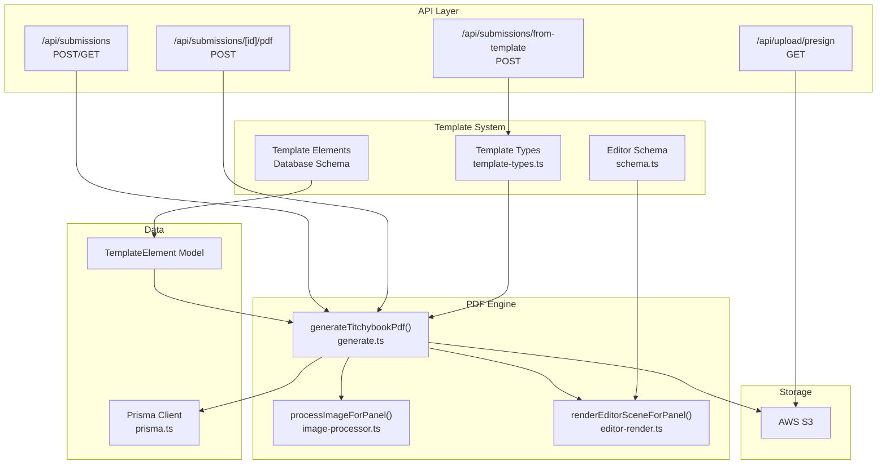
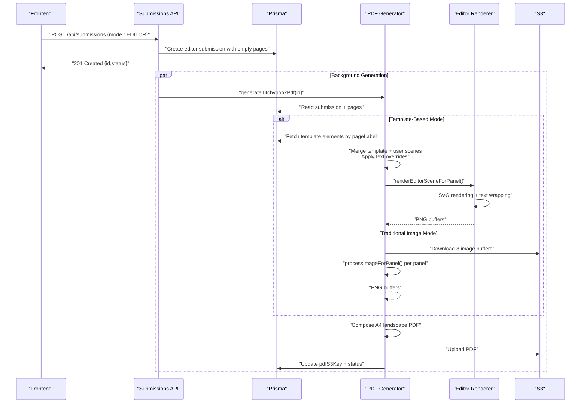
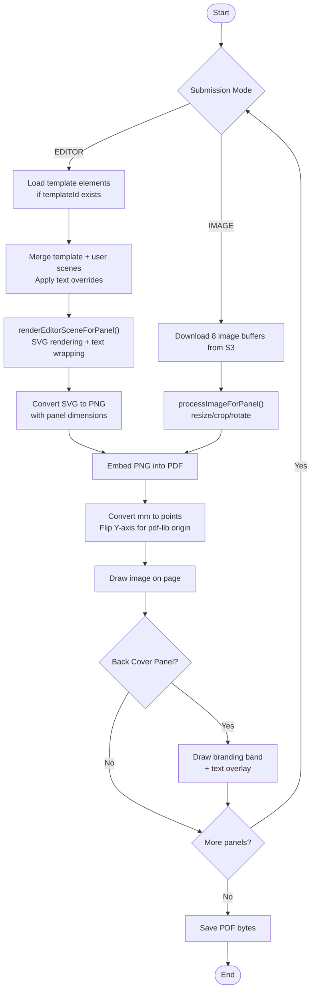
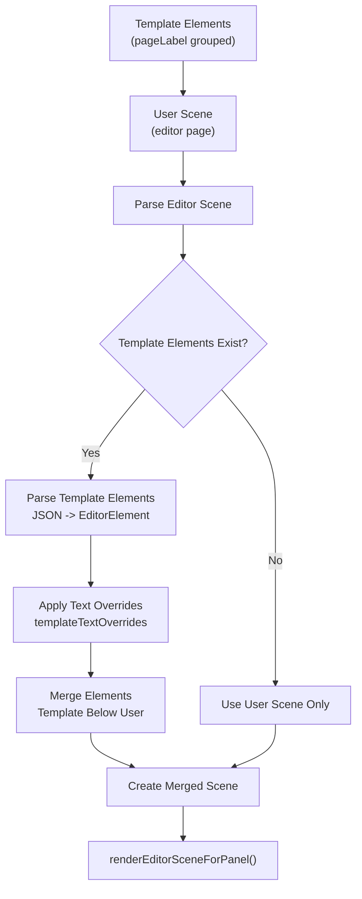
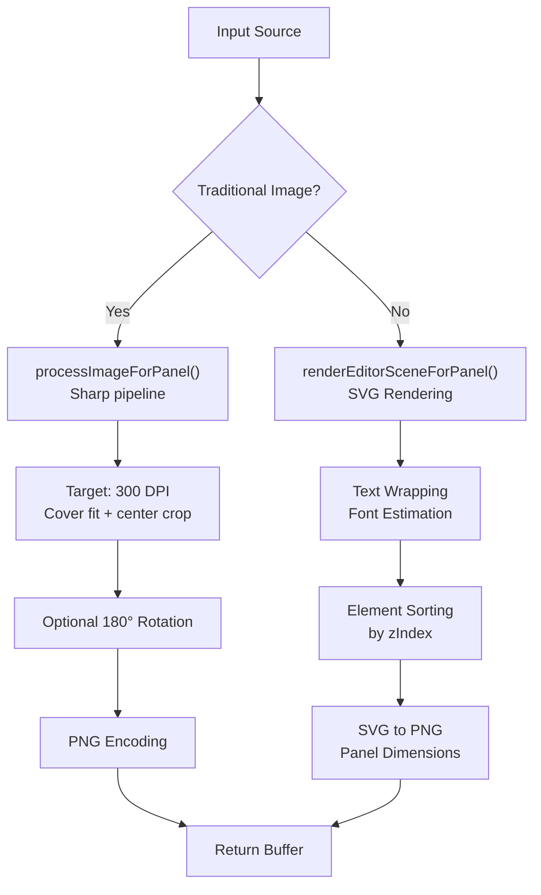
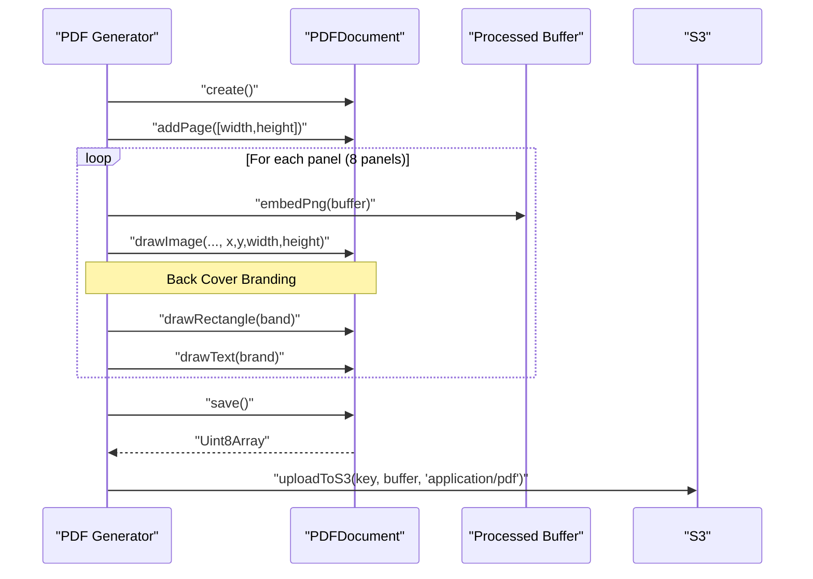
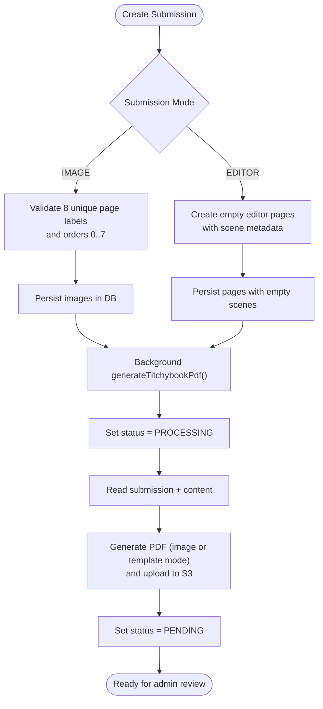
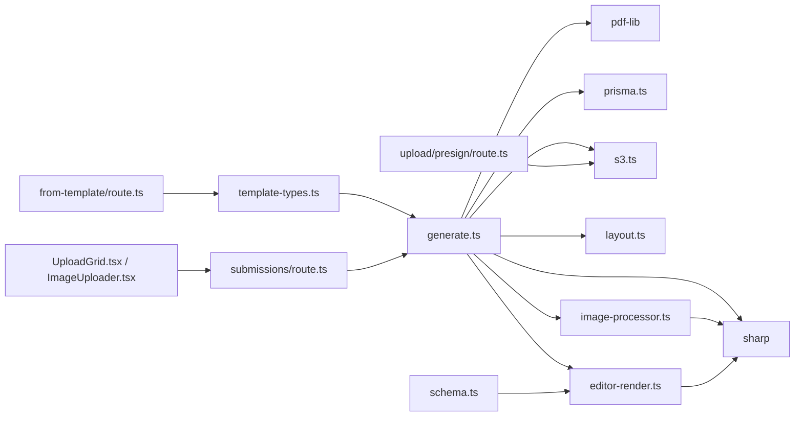

# PDF Generation Engine

<cite>
**Referenced Files in This Document**
- [route.ts](file://src/app/api/submissions/[id]/pdf/route.ts)
- [route.ts](file://src/app/api/submissions/from-template/route.ts)
- [route.ts](file://src/app/api/submissions/route.ts)
- [route.ts](file://src/app/api/upload/presign/route.ts)
- [generate.ts](file://src/lib/pdf/generate.ts)
- [image-processor.ts](file://src/lib/pdf/image-processor.ts)
- [editor-render.ts](file://src/lib/pdf/editor-render.ts)
- [layout.ts](file://src/lib/pdf/layout.ts)
- [constants.ts](file://src/lib/constants.ts)
- [prisma.ts](file://src/lib/prisma.ts)
- [s3.ts](file://src/lib/s3.ts)
- [template-types.ts](file://src/lib/editor/template-types.ts)
- [schema.ts](file://src/lib/editor/schema.ts)
- [constants.ts](file://src/lib/editor/constants.ts)
- [validation.ts](file://src/lib/editor/validation.ts)
- [ImageUploader.tsx](file://src/components/create/ImageUploader.tsx)
- [UploadGrid.tsx](file://src/components/create/UploadGrid.tsx)
- [package.json](file://package.json)
</cite>

## Update Summary
**Changes Made**
- Added comprehensive documentation for the new template merging system that combines template elements with user content
- Documented the text override functionality that allows dynamic customization of template text elements
- Enhanced the PDF generation pipeline to support both traditional image-based and template-based editor workflows
- Updated architecture diagrams to reflect the template-based workflow with merging and text override capabilities
- Added detailed explanation of the template element database schema and template instance management
- Expanded the editor workspace integration to show how template elements are managed and rendered

## Table of Contents
1. [Introduction](#introduction)
2. [Project Structure](#project-structure)
3. [Core Components](#core-components)
4. [Architecture Overview](#architecture-overview)
5. [Detailed Component Analysis](#detailed-component-analysis)
6. [Dependency Analysis](#dependency-analysis)
7. [Performance Considerations](#performance-considerations)
8. [Troubleshooting Guide](#troubleshooting-guide)
9. [Conclusion](#conclusion)
10. [Appendices](#appendices)

## Introduction
This document describes the enhanced PDF generation engine that produces an 8-panel booklet on A4 landscape canvas. The engine now supports sophisticated template-based workflows with automatic template merging and text override capabilities. It covers the complete end-to-end workflow from template creation to final PDF output, including the layout and positioning logic, the image processing pipeline, and the integration with pdf-lib for PDF creation. The system now includes advanced template management, dynamic text customization, and SVG-based rendering for complex editor scenes.

## Project Structure
The PDF generation engine now spans multiple specialized layers with enhanced template support:
- API routes orchestrate both traditional image submissions and template-based editor submissions.
- The PDF generator coordinates database retrieval, S3 image retrieval, image processing, SVG rendering, PDF composition, and S3 upload.
- Dedicated PDF generation components handle image processing and editor scene rendering.
- Template management system enables template creation, merging, text overrides, and instance generation.
- Constants define page labels, accepted image types, sizes, and editor-specific dimensions.
- S3 utilities manage presigned URLs, uploads, downloads, and key construction.
- Frontend components collect images and manage editor scenes for template-based creation.

**Diagram sources**
- [route.ts:1-147](file://src/app/api/submissions/route.ts#L1-L147)
- [route.ts:1-27](file://src/app/api/submissions/[id]/pdf/route.ts#L1-L27)
- [route.ts:1-100](file://src/app/api/submissions/from-template/route.ts#L1-L100)
- [route.ts:1-38](file://src/app/api/upload/presign/route.ts#L1-L38)
- [generate.ts:1-306](file://src/lib/pdf/generate.ts#L1-L306)
- [image-processor.ts:1-30](file://src/lib/pdf/image-processor.ts#L1-L30)
- [editor-render.ts:1-329](file://src/lib/pdf/editor-render.ts#L1-L329)
- [template-types.ts:1-103](file://src/lib/editor/template-types.ts#L1-L103)
- [schema.ts:1-116](file://src/lib/editor/schema.ts#L1-L116)
- [prisma.ts:1-10](file://src/lib/prisma.ts#L1-L10)
- [s3.ts:1-81](file://src/lib/s3.ts#L1-L81)

**Section sources**
- [route.ts:1-147](file://src/app/api/submissions/route.ts#L1-L147)
- [route.ts:1-27](file://src/app/api/submissions/[id]/pdf/route.ts#L1-L27)
- [route.ts:1-100](file://src/app/api/submissions/from-template/route.ts#L1-L100)
- [route.ts:1-38](file://src/app/api/upload/presign/route.ts#L1-L38)
- [generate.ts:1-306](file://src/lib/pdf/generate.ts#L1-L306)
- [image-processor.ts:1-30](file://src/lib/pdf/image-processor.ts#L1-L30)
- [editor-render.ts:1-329](file://src/lib/pdf/editor-render.ts#L1-L329)
- [template-types.ts:1-103](file://src/lib/editor/template-types.ts#L1-L103)
- [schema.ts:1-116](file://src/lib/editor/schema.ts#L1-L116)
- [constants.ts:1-59](file://src/lib/constants.ts#L1-L59)
- [prisma.ts:1-10](file://src/lib/prisma.ts#L1-L10)
- [s3.ts:1-81](file://src/lib/s3.ts#L1-L81)
- [ImageUploader.tsx:1-148](file://src/components/create/ImageUploader.tsx#L1-L148)
- [UploadGrid.tsx:1-115](file://src/components/create/UploadGrid.tsx#L1-L115)

## Core Components
- Submission API: Validates and persists both traditional 8-panel image entries and editor-based submissions, triggers background PDF generation, and lists user submissions.
- PDF Generator: Handles dual workflows - downloads images from S3 for traditional mode or renders SVG scenes for editor mode, processes them, composes an A4 landscape PDF via pdf-lib, uploads the PDF to S3, and updates the submission.
- Image Processor: Uses sharp to resize, crop, and rotate images to fit panels precisely for traditional image-based generation.
- Editor Renderer: Converts editor scenes to SVG, performs text wrapping, applies transformations, and renders to PNG buffers for PDF embedding.
- Template System: Manages template creation, element merging, text overrides, and instance generation from templates with database-backed persistence.
- S3 Utilities: Provides presigned upload/download URLs and manages uploads/downloads.
- Frontend Upload Grid: Collects 8 images with drag-and-drop for traditional mode, or manages editor scenes for template-based creation.

**Section sources**
- [route.ts:1-147](file://src/app/api/submissions/route.ts#L1-L147)
- [generate.ts:1-306](file://src/lib/pdf/generate.ts#L1-L306)
- [image-processor.ts:1-30](file://src/lib/pdf/image-processor.ts#L1-L30)
- [editor-render.ts:1-329](file://src/lib/pdf/editor-render.ts#L1-L329)
- [template-types.ts:1-103](file://src/lib/editor/template-types.ts#L1-L103)
- [constants.ts:1-59](file://src/lib/constants.ts#L1-L59)
- [s3.ts:1-81](file://src/lib/s3.ts#L1-L81)
- [ImageUploader.tsx:1-148](file://src/components/create/ImageUploader.tsx#L1-L148)
- [UploadGrid.tsx:1-115](file://src/components/create/UploadGrid.tsx#L1-L115)

## Architecture Overview
The engine now supports two distinct pipelines with advanced template capabilities:
1. **Traditional Workflow**: User uploads 8 images through the frontend, backend validates and persists entries, background PDF generation processes images, and creates a PDF.
2. **Template-Based Workflow**: User creates submissions in EDITOR mode, optionally from templates, the system merges template elements with user content, applies text overrides, renders SVG scenes, and generates PDFs.

**Diagram sources**
- [route.ts:57-92](file://src/app/api/submissions/route.ts#L57-L92)
- [route.ts:12-92](file://src/app/api/submissions/from-template/route.ts#L12-L92)
- [generate.ts:49-168](file://src/lib/pdf/generate.ts#L49-L168)
- [editor-render.ts:290-329](file://src/lib/pdf/editor-render.ts#L290-L329)
- [prisma.ts:1-10](file://src/lib/prisma.ts#L1-L10)
- [s3.ts:1-81](file://src/lib/s3.ts#L1-L81)

## Detailed Component Analysis

### Enhanced 8-Page Booklet Template Design
The engine now supports sophisticated template-based layouts with automatic merging:
- Canvas: A4 landscape page with precise panel coordinates in millimeters.
- Panels: Eight panels arranged to form a folded 8-page booklet when printed.
- Dimensions and Layout: Panel widths, heights, and positions are defined in the layout module and converted from millimeters to PDF points for pdf-lib.
- Origin: pdf-lib uses bottom-left origin; the generator converts top-left panel coordinates accordingly.
- Back Cover Branding: Special handling for permanent branding band on back cover panels.
- Template Integration: Seamless integration with template system for dynamic content generation.

**Diagram sources**
- [generate.ts:49-278](file://src/lib/pdf/generate.ts#L49-L278)
- [generate.ts:76-96](file://src/lib/pdf/generate.ts#L76-L96)
- [editor-render.ts:290-329](file://src/lib/pdf/editor-render.ts#L290-L329)
- [image-processor.ts:9-29](file://src/lib/pdf/image-processor.ts#L9-L29)

**Section sources**
- [generate.ts:49-278](file://src/lib/pdf/generate.ts#L49-L278)
- [generate.ts:76-96](file://src/lib/pdf/generate.ts#L76-L96)
- [layout.ts:1-105](file://src/lib/pdf/layout.ts#L1-L105)
- [constants.ts:1-59](file://src/lib/constants.ts#L1-L59)

### Template Merging and Text Override System
The template system enables sophisticated content management with dynamic customization:
- Template Elements: Stored separately from user content in the database, allowing reuse across multiple instances.
- Merge Strategy: Template elements are merged with user scenes, with template elements placed below user elements.
- Text Overrides: Per-instance text overrides allow users to customize template text while keeping other properties fixed.
- Instance Tracking: Each submission maintains templateId and templateVersion for auditability.
- Database Integration: Template elements are stored with pageLabel grouping for efficient retrieval and merging.

**Diagram sources**
- [generate.ts:66-103](file://src/lib/pdf/generate.ts#L66-L103)
- [template-types.ts:99-102](file://src/lib/editor/template-types.ts#L99-L102)
- [schema.ts:85-87](file://src/lib/editor/schema.ts#L85-L87)

**Section sources**
- [generate.ts:66-103](file://src/lib/pdf/generate.ts#L66-L103)
- [template-types.ts:95-102](file://src/lib/editor/template-types.ts#L95-L102)
- [schema.ts:85-87](file://src/lib/editor/schema.ts#L85-L87)

### Advanced Image Processing Pipeline
The pipeline now handles both traditional images and template-rendered content:
- **Traditional Images**: Sharp-based processing with 300 DPI target, cover-fit resizing, center-cropping, and optional 180° rotation for bottom panels.
- **Template Scenes**: SVG rendering with precise text wrapping, font estimation, and element sorting by zIndex.
- **Output**: PNG-encoded buffers embedded into the PDF for lossless fidelity.
- **Parallelization**: All assets and panels are processed concurrently to minimize latency.
- **Template Integration**: Template elements are seamlessly integrated into the processing pipeline.

**Diagram sources**
- [image-processor.ts:9-29](file://src/lib/pdf/image-processor.ts#L9-L29)
- [editor-render.ts:290-329](file://src/lib/pdf/editor-render.ts#L290-L329)
- [layout.ts:16](file://src/lib/pdf/layout.ts#L16)

**Section sources**
- [image-processor.ts:9-29](file://src/lib/pdf/image-processor.ts#L9-L29)
- [editor-render.ts:290-329](file://src/lib/pdf/editor-render.ts#L290-L329)
- [layout.ts:16](file://src/lib/pdf/layout.ts#L16)

### PDF Creation with pdf-lib
Enhanced PDF creation supporting both image and template-based content:
- PDF creation: A new PDF document is created and an A4 landscape page is added.
- Embedding: Each processed image (PNG) is embedded into the PDF.
- Positioning: Coordinates are converted from millimeters to points; Y is flipped to match pdf-lib's bottom-left origin.
- Back Cover Branding: Special handling for permanent branding band with color fills and text overlays.
- Template Integration: Template elements contribute to the final PDF through the rendering pipeline.
- Saving: The PDF is saved to bytes and uploaded to S3.

**Diagram sources**
- [generate.ts:196-278](file://src/lib/pdf/generate.ts#L196-L278)

**Section sources**
- [generate.ts:196-278](file://src/lib/pdf/generate.ts#L196-L278)

### Database Retrieval and Enhanced Submission Lifecycle
The enhanced lifecycle supports both traditional and template-based workflows:
- **Traditional Mode**: Validates exactly 8 unique page labels with order indices 0–7, processes images, and generates PDFs.
- **Template Mode**: Creates empty pages with editor scene metadata, supports template merging, applies text overrides, and handles template instances.
- **Template Instances**: Each instance tracks templateId and templateVersion for auditability and template versioning.
- **Status Management**: Initial status set to PROCESSING, then updates to PENDING upon completion.
- **Template Elements**: Stored in database with pageLabel grouping for efficient retrieval and merging.
- **Regeneration**: Users can regenerate PDFs via the dedicated endpoint regardless of mode.

**Diagram sources**
- [route.ts:57-92](file://src/app/api/submissions/route.ts#L57-L92)
- [route.ts:46-80](file://src/app/api/submissions/from-template/route.ts#L46-L80)
- [generate.ts:36-305](file://src/lib/pdf/generate.ts#L36-L305)

**Section sources**
- [route.ts:57-92](file://src/app/api/submissions/route.ts#L57-L92)
- [route.ts:46-80](file://src/app/api/submissions/from-template/route.ts#L46-L80)
- [generate.ts:36-305](file://src/lib/pdf/generate.ts#L36-L305)

### Quality Settings, Compression, and Print-Ready Specifications
Enhanced quality management for both workflows:
- **Traditional Images**:
  - Resize preserves aspect ratio and targets 300 DPI for print quality.
  - Center-cropping ensures pixel-perfect panel coverage.
  - Rotation aligns images according to panel orientation.
- **Template Scenes**:
  - SVG rendering preserves vector quality for scalable elements.
  - Text wrapping uses font estimation for accurate line breaking.
  - Element sorting ensures proper layering.
  - Template elements maintain their original properties while user elements can be customized.
- **PDF Embedding**:
  - Images are embedded as PNG for lossless fidelity.
  - No explicit JPEG compression is applied; PNG ensures print-quality output.
  - Back cover branding uses solid color fills for consistent appearance.
- **Print-ready Canvas**:
  - A4 landscape page size with precise panel coordinates.
  - Target DPI maintained at 300 for professional printing.
- **Template Quality**:
  - Template elements are stored as JSON for consistent rendering.
  - Text overrides preserve template styling while allowing content customization.
- **Recommendations**:
  - For smaller file sizes, consider optional JPEG encoding with controlled quality and embedded ICC profiles for color accuracy.
  - Add DPI checks to ensure images meet minimum resolution requirements for print.
  - Implement template caching for frequently used template elements.

**Section sources**
- [image-processor.ts:9-29](file://src/lib/pdf/image-processor.ts#L9-L29)
- [editor-render.ts:126-170](file://src/lib/pdf/editor-render.ts#L126-L170)
- [generate.ts:223-277](file://src/lib/pdf/generate.ts#L223-L277)
- [layout.ts:16](file://src/lib/pdf/layout.ts#L16)

### Metadata, Security, and Download Management
Enhanced metadata and security features:
- **Metadata**:
  - The current implementation focuses on content generation rather than PDF metadata.
  - Template instances track templateId and templateVersion for auditability.
  - Submission records maintain template association and version information.
- **Security**:
  - S3 uploads use presigned URLs with short expiration windows to reduce exposure.
  - S3 downloads use presigned URLs with longer expiration for PDF retrieval.
  - Authentication enforced on all protected endpoints.
  - Template access controlled by approval status and user permissions.
- **Download Management**:
  - Presigned download URLs are generated for PDFs stored under a structured path.
  - Template previews and editor scenes handled through secure API endpoints.
  - Template elements are securely stored and retrieved with proper authorization.

**Section sources**
- [route.ts:1-38](file://src/app/api/upload/presign/route.ts#L1-L38)
- [route.ts:14-17](file://src/app/api/submissions/from-template/route.ts#L14-L17)
- [s3.ts:18-36](file://src/lib/s3.ts#L18-L36)
- [s3.ts:75-80](file://src/lib/s3.ts#L75-L80)

### Examples: Template Customization and Layout Modifications
Enhanced customization options for both workflows:
- **Template Creation**:
  - Create reusable templates with predefined layouts and elements.
  - Support for text placeholders and customizable content areas.
  - Template approval workflow for quality control.
- **Template Merging**:
  - Automatic merging of template elements with user content.
  - Text override system for dynamic content personalization.
  - Layer separation between template and user elements.
- **Layout Modifications**:
  - Update panel widths, heights, and positions in the layout module.
  - Ensure mm-to-points conversion remains consistent across both workflows.
  - Template elements adapt to different panel configurations.
- **Multi-page Booklets**:
  - Extend the generator to create multiple pages and arrange panels accordingly.
  - Support for complex page arrangements beyond the standard 8-panel layout.
  - Template elements can be reused across different booklet formats.

**Section sources**
- [generate.ts:66-103](file://src/lib/pdf/generate.ts#L66-L103)
- [template-types.ts:95-102](file://src/lib/editor/template-types.ts#L95-L102)
- [layout.ts:29-104](file://src/lib/pdf/layout.ts#L29-L104)

## Dependency Analysis
Enhanced external libraries and their roles:
- **pdf-lib**: PDF creation, embedding images, drawing, and saving.
- **sharp**: Image resizing, cropping, rotation, and SVG rendering.
- **AWS SDK**: S3 operations for uploads, downloads, and presigned URLs.
- **Prisma**: Database access for submissions, images, pages, template elements, and template instances.
- **Zod**: Validation of submission payloads and editor schemas.
- **next-auth**: Authentication enforcement on protected endpoints.
- **Template System**: Editor schema validation, template management utilities, and database integration.

**Diagram sources**
- [generate.ts:1-306](file://src/lib/pdf/generate.ts#L1-L306)
- [image-processor.ts:1-30](file://src/lib/pdf/image-processor.ts#L1-L30)
- [editor-render.ts:1-329](file://src/lib/pdf/editor-render.ts#L1-L329)
- [layout.ts:1-105](file://src/lib/pdf/layout.ts#L1-L105)
- [route.ts:1-147](file://src/app/api/submissions/route.ts#L1-L147)
- [route.ts:1-100](file://src/app/api/submissions/from-template/route.ts#L1-L100)
- [route.ts:1-38](file://src/app/api/upload/presign/route.ts#L1-L38)
- [s3.ts:1-81](file://src/lib/s3.ts#L1-L81)
- [prisma.ts:1-10](file://src/lib/prisma.ts#L1-L10)
- [template-types.ts:1-103](file://src/lib/editor/template-types.ts#L1-L103)
- [schema.ts:1-116](file://src/lib/editor/schema.ts#L1-L116)
- [package.json:11-24](file://package.json#L11-L24)

**Section sources**
- [package.json:11-24](file://package.json#L11-L24)
- [generate.ts:1-306](file://src/lib/pdf/generate.ts#L1-L306)
- [image-processor.ts:1-30](file://src/lib/pdf/image-processor.ts#L1-L30)
- [editor-render.ts:1-329](file://src/lib/pdf/editor-render.ts#L1-L329)
- [layout.ts:1-105](file://src/lib/pdf/layout.ts#L1-L105)
- [route.ts:1-147](file://src/app/api/submissions/route.ts#L1-L147)
- [route.ts:1-100](file://src/app/api/submissions/from-template/route.ts#L1-L100)
- [route.ts:1-38](file://src/app/api/upload/presign/route.ts#L1-L38)
- [s3.ts:1-81](file://src/lib/s3.ts#L1-L81)
- [prisma.ts:1-10](file://src/lib/prisma.ts#L1-L10)
- [template-types.ts:1-103](file://src/lib/editor/template-types.ts#L1-L103)
- [schema.ts:1-116](file://src/lib/editor/schema.ts#L1-L116)

## Performance Considerations
Enhanced performance optimizations for both workflows:
- **Concurrency**:
  - Parallel downloads and processing of images/assets reduce total generation time.
  - Concurrent template element fetching and scene merging improve scalability.
  - Template elements are cached per submission to avoid repeated database queries.
- **Memory Management**:
  - Stream S3 downloads and avoid holding multiple large buffers in memory longer than necessary.
  - Dispose of intermediate image buffers promptly after embedding.
  - SVG rendering optimized with efficient string building and minimal DOM operations.
  - Template element parsing and caching reduces memory footprint.
- **Scaling**:
  - Offload PDF generation to background workers or serverless functions to avoid blocking API responses.
  - Consider pagination for very large batches and incremental processing.
  - Template caching for frequently used template elements.
  - Database indexing on templateId and pageLabel for fast template element retrieval.
- **Caching**:
  - Cache processed images if regeneration frequency is high and inputs are stable.
  - Cache SVG render results for identical scenes to reduce computation.
  - Cache template elements per submission to avoid repeated parsing.
- **I/O Optimization**:
  - Use presigned URLs to shift upload/download off the application server.
  - Batch template element queries to minimize database round trips.
  - Efficient asset loading and caching for template images.
- **Template Efficiency**:
  - Pre-parse template elements once per submission rather than on-demand.
  - Use efficient data structures (Maps) for scene lookups and asset management.
  - Template element ordering preserved for consistent rendering.

## Troubleshooting Guide
Enhanced troubleshooting for dual-mode operation:
- **Unauthorized Access**:
  - Ensure authentication is present on all protected endpoints.
  - Verify user permissions for template access and editing.
  - Check template approval status for template-based submissions.
- **Missing Content**:
  - Traditional mode: Generator throws if any panel lacks an associated image.
  - Editor mode: Generator throws if merged scene is missing for any panel.
  - Template mode: Verify template elements exist and are properly ordered.
  - Template instances: Ensure templateId references valid approved templates.
- **Large Files**:
  - Enforce client-side size limits and server-side validation.
  - Images exceeding the limit are rejected in traditional mode.
  - Monitor SVG complexity in editor mode to prevent excessive memory usage.
  - Template elements should be validated to prevent oversized JSON payloads.
- **PDF Generation Failures**:
  - Inspect logs for errors during S3 operations, image processing, or PDF save.
  - Confirm AWS credentials and bucket permissions.
  - Check template parsing errors and scene validation failures.
  - Verify template element JSON integrity and editor schema compliance.
- **Template Issues**:
  - Verify template status is APPROVED and accessible.
  - Ensure template elements are properly ordered and formatted.
  - Check text override compatibility with template element types.
  - Validate template element JSON structure and element schemas.
- **Editor Scene Problems**:
  - Validate scene JSON structure and element schemas.
  - Check asset availability and accessibility for image elements.
  - Monitor font rendering and text wrapping calculations.
  - Ensure templateTextOverrides keys match template element IDs.

**Section sources**
- [route.ts:9-12](file://src/app/api/submissions/[id]/pdf/route.ts#L9-L12)
- [route.ts:14-17](file://src/app/api/submissions/from-template/route.ts#L14-L17)
- [generate.ts:155-163](file://src/lib/pdf/generate.ts#L155-L163)
- [generate.ts:295-304](file://src/lib/pdf/generate.ts#L295-L304)
- [schema.ts:112-115](file://src/lib/editor/schema.ts#L112-L115)

## Conclusion
The enhanced PDF generation engine now provides a comprehensive solution supporting both traditional image-based and advanced template-based workflows. The addition of sophisticated template merging, text override capabilities, and SVG rendering significantly expands the system's flexibility and power. By leveraging concurrency, strict validation, efficient template management, and S3 presigned URLs, it scales effectively while maintaining high-quality output suitable for professional printing. The dual-mode architecture allows users to choose between simple image uploads and sophisticated template-based design, making the system adaptable to various use cases and skill levels. The template system enables content reusability, dynamic customization, and professional-quality output generation.

## Appendices

### Appendix A: End-to-End Workflow Summary
Enhanced workflow covering both traditional and template-based modes:
- **Traditional Mode**: Frontend uploads 8 images with drag-and-drop, backend validates and persists entries, triggers background PDF generation, generator processes images, composes PDF, uploads to S3, and updates submission.
- **Template Mode**: Frontend creates submissions in EDITOR mode, backend validates and persists empty pages, template merging occurs if applicable, text overrides are applied, SVG scenes are rendered, PDF generation completes, and submission status updates.
- **Template Instance Creation**: Users can create instances from approved templates, with automatic merging of template elements and user content, supporting text overrides and customizations.
- **Template Management**: Templates are stored with pageLabel grouping, approval workflow, and versioning for auditability.

**Section sources**
- [UploadGrid.tsx:42-76](file://src/components/create/UploadGrid.tsx#L42-L76)
- [route.ts:57-92](file://src/app/api/submissions/route.ts#L57-L92)
- [route.ts:46-80](file://src/app/api/submissions/from-template/route.ts#L46-L80)
- [generate.ts:49-278](file://src/lib/pdf/generate.ts#L49-L278)