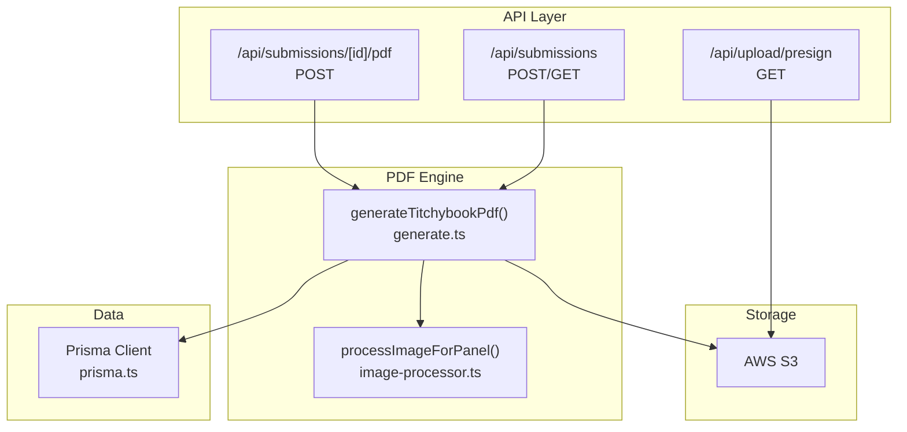
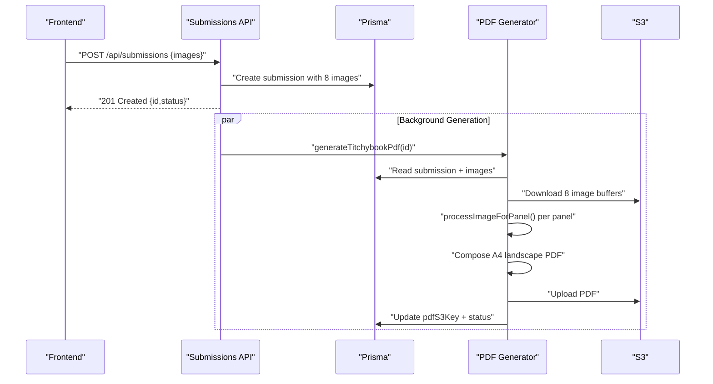
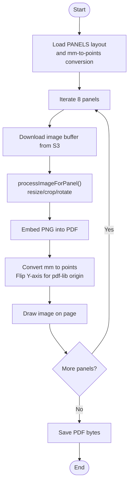
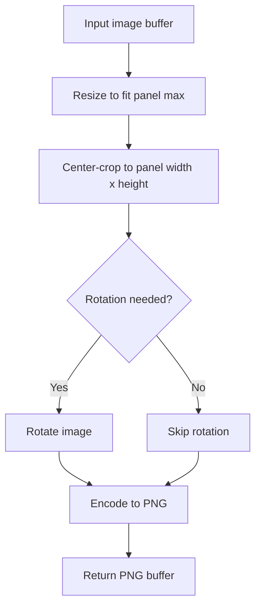
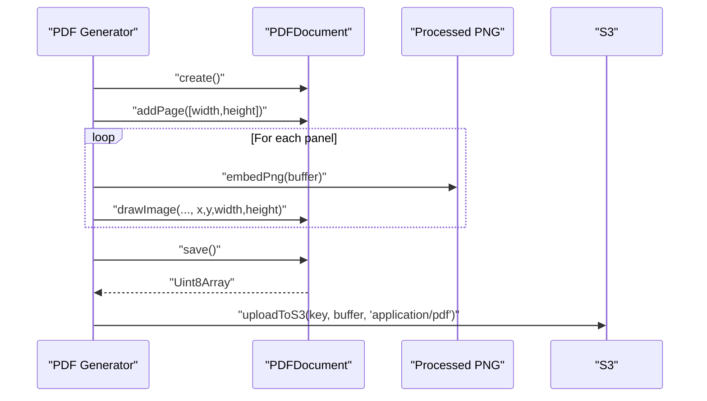
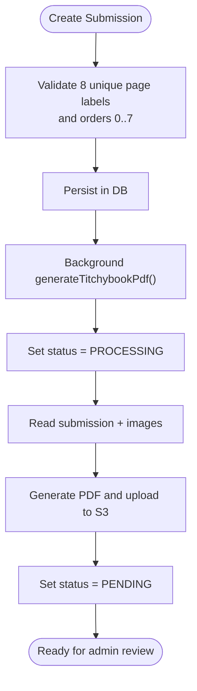
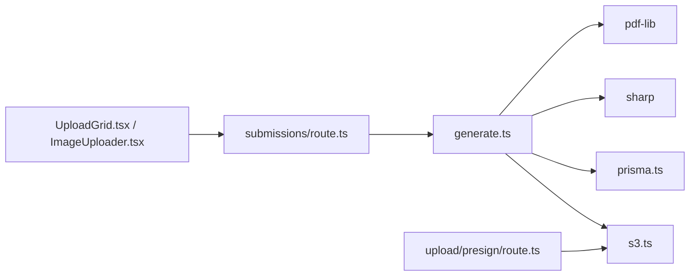

# PDF Generation Engine

<cite>
**Referenced Files in This Document**
- [route.ts](file://src/app/api/submissions/[id]/pdf/route.ts)
- [route.ts](file://src/app/api/submissions/route.ts)
- [route.ts](file://src/app/api/upload/presign/route.ts)
- [generate.ts](file://src/lib/pdf/generate.ts)
- [constants.ts](file://src/lib/constants.ts)
- [prisma.ts](file://src/lib/prisma.ts)
- [s3.ts](file://src/lib/s3.ts)
- [ImageUploader.tsx](file://src/components/create/ImageUploader.tsx)
- [UploadGrid.tsx](file://src/components/create/UploadGrid.tsx)
- [package.json](file://package.json)
</cite>

## Table of Contents
1. [Introduction](#introduction)
2. [Project Structure](#project-structure)
3. [Core Components](#core-components)
4. [Architecture Overview](#architecture-overview)
5. [Detailed Component Analysis](#detailed-component-analysis)
6. [Dependency Analysis](#dependency-analysis)
7. [Performance Considerations](#performance-considerations)
8. [Troubleshooting Guide](#troubleshooting-guide)
9. [Conclusion](#conclusion)
10. [Appendices](#appendices)

## Introduction
This document describes the PDF generation engine that produces an 8-panel booklet on A4 landscape canvas. It covers the end-to-end workflow from image uploads to final PDF storage, the layout and positioning logic, the image processing pipeline, and the integration with pdf-lib for PDF creation. It also documents quality settings, compression strategies, print-ready specifications, metadata and security considerations, and performance optimization techniques for large-scale generation.

## Project Structure
The PDF generation engine spans several layers:
- API routes orchestrate submission creation and PDF generation requests.
- The PDF generator coordinates database retrieval, S3 image retrieval, image processing, PDF composition, and S3 upload.
- Constants define page labels, accepted image types, and sizes.
- S3 utilities manage presigned URLs, uploads, downloads, and key construction.
- Frontend components collect images and submit them for processing.

**Diagram sources**
- [route.ts:1-96](file://src/app/api/submissions/route.ts#L1-L96)
- [route.ts:1-27](file://src/app/api/submissions/[id]/pdf/route.ts#L1-L27)
- [route.ts:1-38](file://src/app/api/upload/presign/route.ts#L1-L38)
- [generate.ts:1-112](file://src/lib/pdf/generate.ts#L1-L112)
- [prisma.ts:1-10](file://src/lib/prisma.ts#L1-L10)
- [s3.ts:1-81](file://src/lib/s3.ts#L1-L81)

**Section sources**
- [route.ts:1-96](file://src/app/api/submissions/route.ts#L1-L96)
- [route.ts:1-27](file://src/app/api/submissions/[id]/pdf/route.ts#L1-L27)
- [route.ts:1-38](file://src/app/api/upload/presign/route.ts#L1-L38)
- [generate.ts:1-112](file://src/lib/pdf/generate.ts#L1-L112)
- [constants.ts:1-49](file://src/lib/constants.ts#L1-L49)
- [prisma.ts:1-10](file://src/lib/prisma.ts#L1-L10)
- [s3.ts:1-81](file://src/lib/s3.ts#L1-L81)
- [ImageUploader.tsx:1-148](file://src/components/create/ImageUploader.tsx#L1-L148)
- [UploadGrid.tsx:1-115](file://src/components/create/UploadGrid.tsx#L1-L115)

## Core Components
- Submission API: Validates and persists 8-panel image entries, triggers background PDF generation, and lists user submissions.
- PDF Generator: Downloads images from S3, processes them, composes an A4 landscape PDF via pdf-lib, uploads the PDF to S3, and updates the submission.
- Image Processor: Uses sharp to resize, crop, and rotate images to fit panels precisely.
- S3 Utilities: Provides presigned upload/download URLs and manages uploads/downloads.
- Frontend Upload Grid: Collects 8 images with drag-and-drop, validates types and sizes, and submits structured image entries.

**Section sources**
- [route.ts:1-96](file://src/app/api/submissions/route.ts#L1-L96)
- [generate.ts:1-112](file://src/lib/pdf/generate.ts#L1-L112)
- [constants.ts:1-49](file://src/lib/constants.ts#L1-L49)
- [s3.ts:1-81](file://src/lib/s3.ts#L1-L81)
- [ImageUploader.tsx:1-148](file://src/components/create/ImageUploader.tsx#L1-L148)
- [UploadGrid.tsx:1-115](file://src/components/create/UploadGrid.tsx#L1-L115)

## Architecture Overview
The engine follows a pipeline:
1. User uploads 8 images through the frontend.
2. Backend validates and persists entries; background PDF generation is triggered.
3. PDF generator fetches images from S3, processes them, embeds them into a single A4 landscape page, saves and uploads the PDF, and updates the submission status.
4. Admin can approve submissions and trigger re-generation if needed.

**Diagram sources**
- [route.ts:35-95](file://src/app/api/submissions/route.ts#L35-L95)
- [generate.ts:23-112](file://src/lib/pdf/generate.ts#L23-L112)
- [prisma.ts:1-10](file://src/lib/prisma.ts#L1-L10)
- [s3.ts:1-81](file://src/lib/s3.ts#L1-L81)

## Detailed Component Analysis

### 8-Page Booklet Template Design
- Canvas: A4 landscape page.
- Panels: Eight panels arranged to form a folded 8-page booklet when printed.
- Dimensions and Layout: Panel widths, heights, and positions are defined in the layout module and converted from millimeters to PDF points for pdf-lib.
- Origin: pdf-lib uses bottom-left origin; the generator converts top-left panel coordinates accordingly.

**Diagram sources**
- [generate.ts:67-91](file://src/lib/pdf/generate.ts#L67-L91)
- [generate.ts:7-11](file://src/lib/pdf/generate.ts#L7-L11)

**Section sources**
- [generate.ts:67-91](file://src/lib/pdf/generate.ts#L67-L91)
- [generate.ts:7-11](file://src/lib/pdf/generate.ts#L7-L11)

### Image Processing Pipeline
- Sharp-based processing:
  - Resize to fit within panel bounds while preserving aspect ratio.
  - Center-crop to exact panel dimensions.
  - Apply any required rotation.
- Output: PNG-encoded buffers embedded into the PDF.
- Parallelization: All 8 images are downloaded and processed concurrently to minimize latency.

**Diagram sources**
- [generate.ts:54-65](file://src/lib/pdf/generate.ts#L54-L65)

**Section sources**
- [generate.ts:54-65](file://src/lib/pdf/generate.ts#L54-L65)

### PDF Creation with pdf-lib
- PDF creation: A new PDF document is created and an A4 landscape page is added.
- Embedding: Each processed image is embedded as PNG.
- Positioning: Coordinates are converted from millimeters to points; Y is flipped to match pdf-lib’s bottom-left origin.
- Saving: The PDF is saved to bytes and uploaded to S3.

**Diagram sources**
- [generate.ts:67-99](file://src/lib/pdf/generate.ts#L67-L99)

**Section sources**
- [generate.ts:67-99](file://src/lib/pdf/generate.ts#L67-L99)

### Database Retrieval and Submission Lifecycle
- Submission creation enforces:
  - Exactly 8 unique page labels.
  - Valid order indices 0–7.
  - Image entries include S3 key, MIME type, and original filename.
- PDF generation sets status to PROCESSING initially, then updates to PENDING upon completion.
- Users can regenerate PDFs via the dedicated endpoint.

**Diagram sources**
- [route.ts:35-95](file://src/app/api/submissions/route.ts#L35-L95)
- [generate.ts:26-30](file://src/lib/pdf/generate.ts#L26-L30)
- [generate.ts:100-108](file://src/lib/pdf/generate.ts#L100-L108)

**Section sources**
- [route.ts:35-95](file://src/app/api/submissions/route.ts#L35-L95)
- [generate.ts:26-30](file://src/lib/pdf/generate.ts#L26-L30)
- [generate.ts:100-108](file://src/lib/pdf/generate.ts#L100-L108)

### Quality Settings, Compression, and Print-Ready Specifications
- Image processing:
  - Resize preserves aspect ratio and fits within panel bounds.
  - Center-cropping ensures pixel-perfect panel coverage.
  - Rotation aligns images according to panel orientation.
- PDF embedding:
  - Images are embedded as PNG for lossless fidelity.
  - No explicit JPEG compression is applied in the pipeline; PNG ensures print-quality output.
- Print-ready canvas:
  - A4 landscape page size is used, ensuring standard print compatibility.
- Recommendations:
  - For smaller file sizes, consider optional JPEG encoding with controlled quality and embedded ICC profiles for color accuracy.
  - Add DPI checks to ensure images meet minimum resolution requirements for print.

**Section sources**
- [generate.ts:54-65](file://src/lib/pdf/generate.ts#L54-L65)
- [generate.ts:67-91](file://src/lib/pdf/generate.ts#L67-L91)

### Metadata, Security, and Download Management
- Metadata:
  - The current implementation does not set PDF metadata (title, author, keywords). To add metadata, integrate with pdf-lib’s catalog dictionary after document creation.
- Security:
  - S3 uploads use presigned URLs with short expiration windows to reduce exposure.
  - S3 downloads use presigned URLs with longer expiration for PDF retrieval.
- Download management:
  - Presigned download URLs are generated for PDFs stored under a structured path.

**Section sources**
- [route.ts:1-38](file://src/app/api/upload/presign/route.ts#L1-L38)
- [s3.ts:18-36](file://src/lib/s3.ts#L18-L36)
- [s3.ts:75-80](file://src/lib/s3.ts#L75-L80)

### Examples: Template Customization and Layout Modifications
- Changing canvas size:
  - Modify A4 landscape dimensions and convert them to points.
- Adjusting panel geometry:
  - Update panel widths, heights, and positions in the layout module; ensure mm-to-points conversion remains consistent.
- Adding gutters or bleed:
  - Increase panel sizes slightly and adjust crop offsets to incorporate safe margins.
- Multi-page booklets:
  - Extend the generator to create multiple pages and arrange panels accordingly.

**Section sources**
- [generate.ts:67-91](file://src/lib/pdf/generate.ts#L67-L91)
- [generate.ts:7-11](file://src/lib/pdf/generate.ts#L7-L11)

## Dependency Analysis
External libraries and their roles:
- pdf-lib: PDF creation, embedding images, drawing, and saving.
- sharp: Image resizing, cropping, and rotation.
- AWS SDK: S3 operations for uploads, downloads, and presigned URLs.
- Prisma: Database access for submissions and images.
- Zod: Validation of submission payloads.
- next-auth: Authentication enforcement on protected endpoints.

**Diagram sources**
- [generate.ts:1-112](file://src/lib/pdf/generate.ts#L1-L112)
- [route.ts:1-96](file://src/app/api/submissions/route.ts#L1-L96)
- [route.ts:1-38](file://src/app/api/upload/presign/route.ts#L1-L38)
- [s3.ts:1-81](file://src/lib/s3.ts#L1-L81)
- [prisma.ts:1-10](file://src/lib/prisma.ts#L1-L10)
- [package.json:11-24](file://package.json#L11-L24)

**Section sources**
- [package.json:11-24](file://package.json#L11-L24)
- [generate.ts:1-112](file://src/lib/pdf/generate.ts#L1-L112)
- [route.ts:1-96](file://src/app/api/submissions/route.ts#L1-L96)
- [route.ts:1-38](file://src/app/api/upload/presign/route.ts#L1-L38)
- [s3.ts:1-81](file://src/lib/s3.ts#L1-L81)
- [prisma.ts:1-10](file://src/lib/prisma.ts#L1-L10)

## Performance Considerations
- Concurrency:
  - Parallel downloads and processing of images reduce total generation time.
- Memory management:
  - Stream S3 downloads and avoid holding multiple large buffers in memory longer than necessary.
  - Dispose of intermediate image buffers promptly after embedding.
- Scaling:
  - Offload PDF generation to background workers or serverless functions to avoid blocking API responses.
  - Consider pagination for very large batches and incremental processing.
- Caching:
  - Cache processed images if regeneration frequency is high and inputs are stable.
- I/O:
  - Use presigned URLs to shift upload/download off the application server.

[No sources needed since this section provides general guidance]

## Troubleshooting Guide
- Unauthorized access:
  - Ensure authentication is present on all protected endpoints.
- Missing images:
  - The generator throws if any panel lacks an associated image; verify submission includes all 8 page labels.
- Large files:
  - Enforce client-side size limits and server-side validation; images exceeding the limit are rejected.
- PDF generation failures:
  - Inspect logs for errors during S3 operations, image processing, or PDF save; confirm AWS credentials and bucket permissions.

**Section sources**
- [route.ts:9-12](file://src/app/api/submissions/[id]/pdf/route.ts#L9-L12)
- [route.ts:36-40](file://src/app/api/submissions/route.ts#L36-L40)
- [generate.ts:45-47](file://src/lib/pdf/generate.ts#L45-L47)
- [ImageUploader.tsx:24-31](file://src/components/create/ImageUploader.tsx#L24-L31)

## Conclusion
The PDF generation engine integrates robust validation, efficient image processing, and reliable PDF composition to produce print-ready booklets. By leveraging concurrency, strict validation, and S3 presigned URLs, it scales effectively while maintaining quality. Extending the layout, adding metadata, and optimizing compression can further tailor the engine to specific print and distribution needs.

[No sources needed since this section summarizes without analyzing specific files]

## Appendices

### Appendix A: End-to-End Workflow Summary
- Frontend uploads 8 images with drag-and-drop.
- Backend validates and persists entries; triggers background PDF generation.
- Generator downloads images, processes them, composes a PDF, uploads it to S3, and updates the submission.
- Admin can approve and regenerate as needed.

**Section sources**
- [UploadGrid.tsx:42-76](file://src/components/create/UploadGrid.tsx#L42-L76)
- [route.ts:35-95](file://src/app/api/submissions/route.ts#L35-L95)
- [generate.ts:23-112](file://src/lib/pdf/generate.ts#L23-L112)