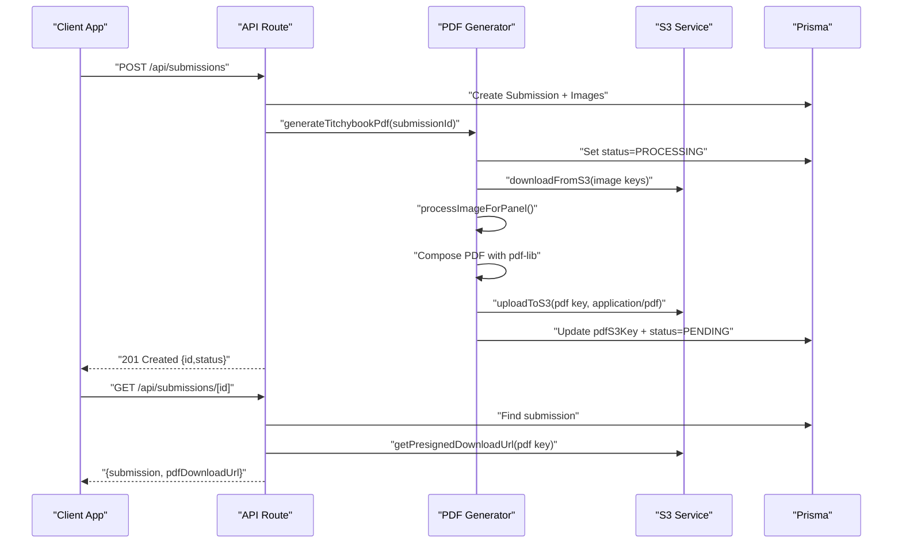
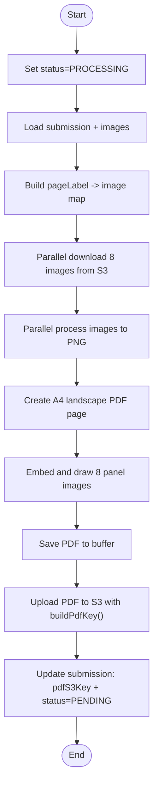
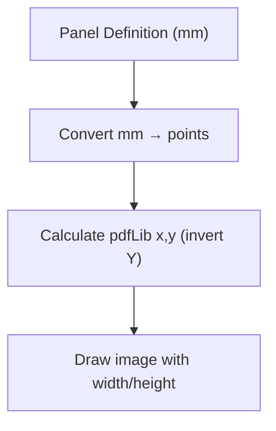
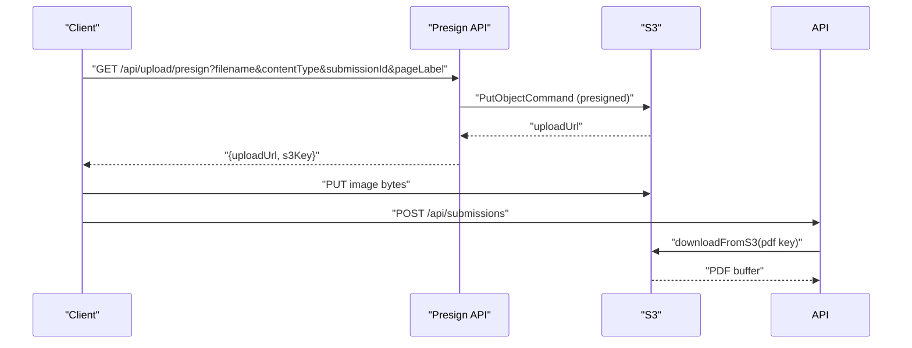
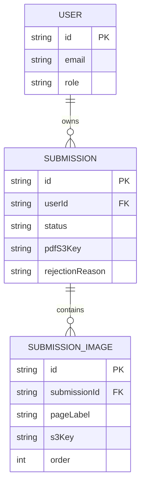
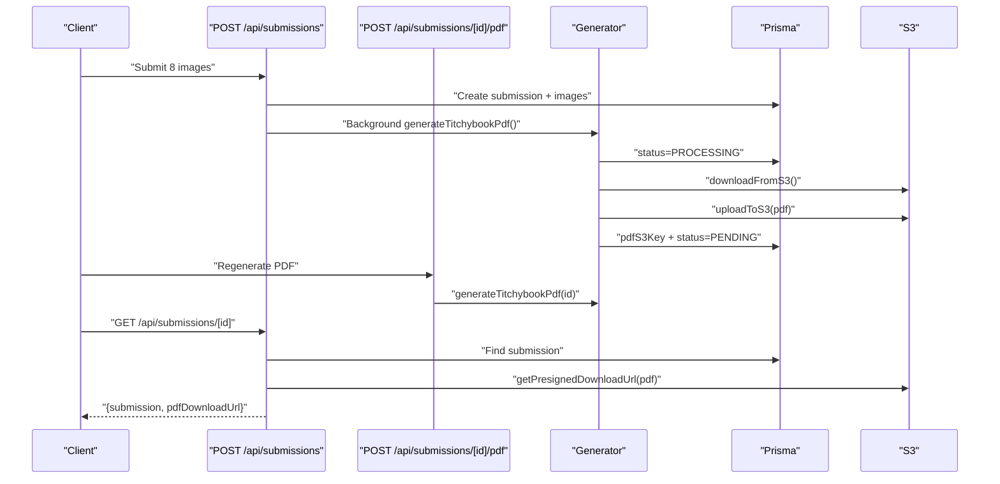
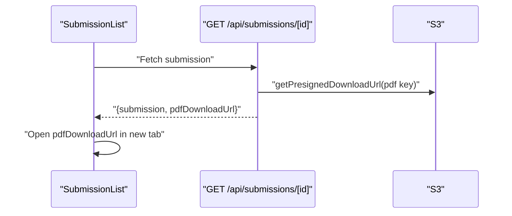
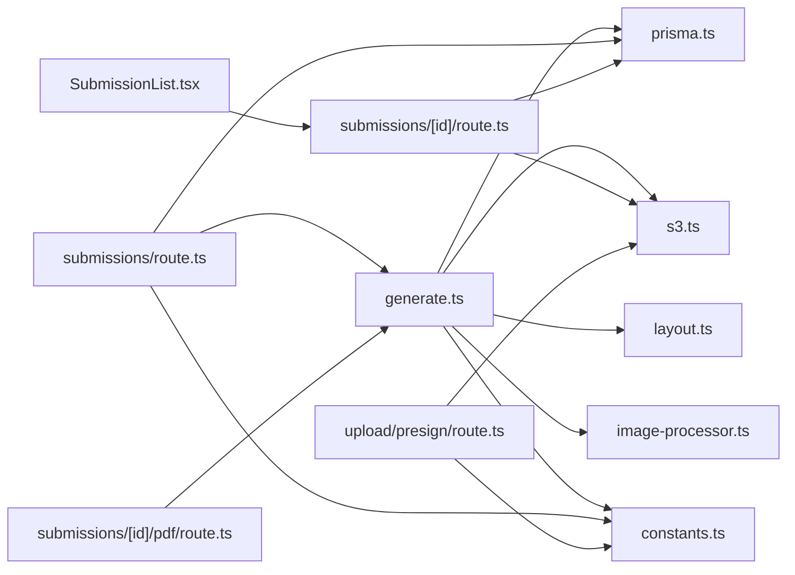

# PDF Output Management

<cite>
**Referenced Files in This Document**
- [generate.ts](file://src/lib/pdf/generate.ts)
- [layout.ts](file://src/lib/pdf/layout.ts)
- [image-processor.ts](file://src/lib/pdf/image-processor.ts)
- [s3.ts](file://src/lib/s3.ts)
- [route.ts](file://src/app/api/submissions/route.ts)
- [route.ts](file://src/app/api/submissions/[id]/route.ts)
- [route.ts](file://src/app/api/submissions/[id]/pdf/route.ts)
- [route.ts](file://src/app/api/upload/presign/route.ts)
- [SubmissionList.tsx](file://src/components/submissions/SubmissionList.tsx)
- [constants.ts](file://src/lib/constants.ts)
- [prisma.ts](file://src/lib/prisma.ts)
- [schema.prisma](file://prisma/schema.prisma)
- [auth.ts](file://src/auth.ts)
- [middleware.ts](file://src/middleware.ts)
</cite>

## Table of Contents
1. [Introduction](#introduction)
2. [Project Structure](#project-structure)
3. [Core Components](#core-components)
4. [Architecture Overview](#architecture-overview)
5. [Detailed Component Analysis](#detailed-component-analysis)
6. [Dependency Analysis](#dependency-analysis)
7. [Performance Considerations](#performance-considerations)
8. [Troubleshooting Guide](#troubleshooting-guide)
9. [Security Considerations](#security-considerations)
10. [Conclusion](#conclusion)

## Introduction
This document explains the complete PDF output management workflow for generating, storing, and delivering print-ready A4 landscape PDFs from user-uploaded images. It covers the PDF creation process using pdf-lib, page setup with precise dimensions, image embedding with accurate positioning, S3 integration for secure storage, database updates for retrieval, and API endpoints that trigger generation and handle downloads. It also documents error handling, retry strategies, status tracking, and security controls for access and download management.

## Project Structure
The PDF output system spans several layers:
- API routes for submission creation, retrieval, and manual PDF generation
- PDF generation library that orchestrates image fetching, processing, composition, and upload
- S3 integration for signed uploads and downloads
- Prisma ORM for persistence and status tracking
- Frontend components that trigger downloads via presigned URLs

```mermaid
graph TB
subgraph "API Layer"
A1["POST /api/submissions<br/>Create Submission"]
A2["GET /api/submissions/[id]<br/>Get Submission & Presigned Download"]
A3["POST /api/submissions/[id]/pdf<br/>Generate PDF"]
A4["GET /api/upload/presign<br/>Presigned Upload URL"]
end
subgraph "PDF Generation"
G1["generateTitchybookPdf()<br/>Fetch images → Process → Compose → Upload → Update DB"]
L1["layout.ts<br/>Panel definitions & conversions"]
IP["image-processor.ts<br/>Resize/Crop/Rotate → PNG"]
end
subgraph "Storage & Identity"
S3["s3.ts<br/>Presigned Upload/Download, Upload/Download, Key Builders"]
PRISMA["Prisma ORM<br/>Submission model"]
AUTH["NextAuth<br/>Session & Role"]
end
subgraph "UI"
UI["SubmissionList.tsx<br/>Download Button"]
end
A1 --> G1
A3 --> G1
A2 --> S3
A4 --> S3
G1 --> L1
G1 --> IP
G1 --> S3
G1 --> PRISMA
A2 --> PRISMA
A1 --> PRISMA
UI --> A2
AUTH --> A1
AUTH --> A2
AUTH --> A3
AUTH --> A4
```

**Diagram sources**
- [route.ts:35-95](file://src/app/api/submissions/route.ts#L35-L95)
- [route.ts:6-36](file://src/app/api/submissions/[id]/route.ts#L6-L36)
- [route.ts:5-26](file://src/app/api/submissions/[id]/pdf/route.ts#L5-L26)
- [route.ts:6-37](file://src/app/api/upload/presign/route.ts#L6-L37)
- [generate.ts:23-111](file://src/lib/pdf/generate.ts#L23-L111)
- [layout.ts:29-104](file://src/lib/pdf/layout.ts#L29-L104)
- [image-processor.ts:9-29](file://src/lib/pdf/image-processor.ts#L9-L29)
- [s3.ts:18-80](file://src/lib/s3.ts#L18-L80)
- [prisma.ts:1-10](file://src/lib/prisma.ts#L1-L10)
- [SubmissionList.tsx:62-118](file://src/components/submissions/SubmissionList.tsx#L62-L118)
- [auth.ts:27-79](file://src/auth.ts#L27-L79)

**Section sources**
- [route.ts:1-96](file://src/app/api/submissions/route.ts#L1-L96)
- [route.ts:1-37](file://src/app/api/submissions/[id]/route.ts#L1-L37)
- [route.ts:1-27](file://src/app/api/submissions/[id]/pdf/route.ts#L1-L27)
- [route.ts:1-38](file://src/app/api/upload/presign/route.ts#L1-L38)
- [generate.ts:1-112](file://src/lib/pdf/generate.ts#L1-L112)
- [layout.ts:1-105](file://src/lib/pdf/layout.ts#L1-L105)
- [image-processor.ts:1-30](file://src/lib/pdf/image-processor.ts#L1-L30)
- [s3.ts:1-81](file://src/lib/s3.ts#L1-L81)
- [prisma.ts:1-10](file://src/lib/prisma.ts#L1-L10)
- [SubmissionList.tsx:1-119](file://src/components/submissions/SubmissionList.tsx#L1-L119)
- [auth.ts:1-80](file://src/auth.ts#L1-L80)

## Core Components
- PDF Generation Orchestrator: Generates a single A4 landscape PDF by downloading 8 images, processing them, composing onto a page, uploading to S3, and updating the database.
- Layout Definitions: Provides panel coordinates, sizes, rotations, and unit conversions for precise placement.
- Image Processor: Resizes/crops to fill panels at 300 DPI, optionally rotates 180° for bottom-row panels, and outputs PNG buffers for embedding.
- S3 Integration: Handles presigned upload URLs, presigned download URLs, direct upload/download, and key builders for uploads and PDFs.
- API Endpoints: Submission creation (with background PDF generation), submission retrieval with presigned download, manual PDF generation, and presigned upload URL generation.
- Persistence: Submission model tracks status, optional PDF S3 key, and rejection reason.
- Authentication/Middleware: Protects routes and enforces user identity and roles.

**Section sources**
- [generate.ts:23-111](file://src/lib/pdf/generate.ts#L23-L111)
- [layout.ts:29-104](file://src/lib/pdf/layout.ts#L29-L104)
- [image-processor.ts:9-29](file://src/lib/pdf/image-processor.ts#L9-L29)
- [s3.ts:18-80](file://src/lib/s3.ts#L18-L80)
- [route.ts:35-95](file://src/app/api/submissions/route.ts#L35-L95)
- [route.ts:6-36](file://src/app/api/submissions/[id]/route.ts#L6-L36)
- [route.ts:5-26](file://src/app/api/submissions/[id]/pdf/route.ts#L5-L26)
- [route.ts:6-37](file://src/app/api/upload/presign/route.ts#L6-L37)
- [schema.prisma:21-33](file://prisma/schema.prisma#L21-L33)
- [auth.ts:27-79](file://src/auth.ts#L27-L79)
- [middleware.ts:3-5](file://src/middleware.ts#L3-L5)

## Architecture Overview
The system follows a layered architecture:
- Presentation: Next.js App Router API routes and React components
- Application: PDF generation orchestration and S3 operations
- Persistence: Prisma-managed SQLite database
- Infrastructure: AWS S3 for object storage and NextAuth for authentication



**Diagram sources**
- [route.ts:35-95](file://src/app/api/submissions/route.ts#L35-L95)
- [generate.ts:23-111](file://src/lib/pdf/generate.ts#L23-L111)
- [s3.ts:38-64](file://src/lib/s3.ts#L38-L64)
- [route.ts:6-36](file://src/app/api/submissions/[id]/route.ts#L6-L36)

## Detailed Component Analysis

### PDF Generation Orchestration
The generator coordinates the entire pipeline:
- Sets status to PROCESSING to prevent concurrent runs
- Loads submission and builds a pageLabel-to-image map
- Downloads all 8 images in parallel from S3
- Processes images in parallel (resize/crop/rotate) to PNG buffers
- Creates an A4 landscape PDF page and draws each panel image at precise positions
- Saves the PDF to a buffer and uploads to S3 under a PDF key
- Updates the submission with the PDF S3 key and resets status to PENDING



**Diagram sources**
- [generate.ts:23-111](file://src/lib/pdf/generate.ts#L23-L111)
- [layout.ts:14-20](file://src/lib/pdf/layout.ts#L14-L20)
- [layout.ts:29-104](file://src/lib/pdf/layout.ts#L29-L104)
- [image-processor.ts:9-29](file://src/lib/pdf/image-processor.ts#L9-L29)
- [s3.ts:75-80](file://src/lib/s3.ts#L75-L80)

**Section sources**
- [generate.ts:23-111](file://src/lib/pdf/generate.ts#L23-L111)

### Page Setup and Image Embedding
- Page dimensions: A4 landscape with millimeter-based layout definitions converted to PDF points
- Panel definitions: Specify x/y offsets, width/height, and rotation per panel
- Coordinate system: Origin at top-left; Y-axis inverted for pdf-lib bottom-left origin
- Image embedding: Each processed PNG is embedded and drawn with calculated x/y/width/height



**Diagram sources**
- [layout.ts:14-20](file://src/lib/pdf/layout.ts#L14-L20)
- [layout.ts:29-104](file://src/lib/pdf/layout.ts#L29-L104)
- [generate.ts:68-91](file://src/lib/pdf/generate.ts#L68-L91)

**Section sources**
- [layout.ts:14-20](file://src/lib/pdf/layout.ts#L14-L20)
- [layout.ts:29-104](file://src/lib/pdf/layout.ts#L29-L104)
- [generate.ts:68-91](file://src/lib/pdf/generate.ts#L68-L91)

### S3 Integration and Key Management
- Presigned Upload: Generates a short-lived upload URL for direct browser-to-S3 uploads
- Presigned Download: Generates a short-lived download URL for authorized clients
- Direct Upload/Download: Used for PDF generation and retrieval
- Key Builders:
  - buildUploadKey(userId, submissionId, pageLabel, ext) for image uploads
  - buildPdfKey(userId, submissionId) for PDF storage



**Diagram sources**
- [route.ts:6-37](file://src/app/api/upload/presign/route.ts#L6-L37)
- [s3.ts:18-28](file://src/lib/s3.ts#L18-L28)
- [s3.ts:38-50](file://src/lib/s3.ts#L38-L50)
- [s3.ts:66-80](file://src/lib/s3.ts#L66-L80)

**Section sources**
- [s3.ts:18-80](file://src/lib/s3.ts#L18-L80)
- [route.ts:6-37](file://src/app/api/upload/presign/route.ts#L6-L37)

### Database Schema and Status Tracking
- Submission model includes status, optional pdfS3Key, and rejectionReason
- Status transitions:
  - Creation: PENDING
  - Background generation: PROCESSING
  - Completion: PENDING (awaiting admin approval)
  - Optional rejection: REJECTED with reason



**Diagram sources**
- [schema.prisma:21-47](file://prisma/schema.prisma#L21-L47)
- [prisma.ts:1-10](file://src/lib/prisma.ts#L1-L10)

**Section sources**
- [schema.prisma:21-33](file://prisma/schema.prisma#L21-L33)
- [generate.ts:27-30](file://src/lib/pdf/generate.ts#L27-L30)
- [generate.ts:102-108](file://src/lib/pdf/generate.ts#L102-L108)

### API Endpoint Implementation
- POST /api/submissions
  - Validates payload shape and ensures all 8 page labels are present
  - Creates submission and images in a transaction
  - Triggers background PDF generation and ignores errors to avoid blocking
- GET /api/submissions/[id]
  - Returns submission with ordered images
  - If pdfS3Key exists, returns a presigned download URL
- POST /api/submissions/[id]/pdf
  - Manually triggers PDF generation for a given submission ID
- GET /api/upload/presign
  - Validates required parameters and accepted content types
  - Builds upload key and returns presigned upload URL



**Diagram sources**
- [route.ts:35-95](file://src/app/api/submissions/route.ts#L35-L95)
- [route.ts:5-26](file://src/app/api/submissions/[id]/pdf/route.ts#L5-L26)
- [route.ts:6-36](file://src/app/api/submissions/[id]/route.ts#L6-L36)
- [generate.ts:23-111](file://src/lib/pdf/generate.ts#L23-L111)

**Section sources**
- [route.ts:35-95](file://src/app/api/submissions/route.ts#L35-L95)
- [route.ts:6-36](file://src/app/api/submissions/[id]/route.ts#L6-L36)
- [route.ts:5-26](file://src/app/api/submissions/[id]/pdf/route.ts#L5-L26)
- [route.ts:6-37](file://src/app/api/upload/presign/route.ts#L6-L37)

### Frontend Download Flow
- SubmissionList displays approved submissions with a Download button
- Clicking opens a new tab to the presigned download URL returned by the backend



**Diagram sources**
- [SubmissionList.tsx:62-118](file://src/components/submissions/SubmissionList.tsx#L62-L118)
- [route.ts:30-33](file://src/app/api/submissions/[id]/route.ts#L30-L33)

**Section sources**
- [SubmissionList.tsx:62-118](file://src/components/submissions/SubmissionList.tsx#L62-L118)
- [route.ts:30-33](file://src/app/api/submissions/[id]/route.ts#L30-L33)

## Dependency Analysis
- PDF Generation depends on:
  - Prisma for submission and image lookup
  - S3 service for downloads/uploads and key builders
  - pdf-lib for PDF creation and image embedding
  - sharp for image processing
  - Constants for page labels and validations
- API routes depend on:
  - Authentication for user/session checks
  - Prisma for database operations
  - S3 for presigned URLs and PDF retrieval
  - PDF generation for background processing



**Diagram sources**
- [generate.ts:1-112](file://src/lib/pdf/generate.ts#L1-L112)
- [layout.ts:1-105](file://src/lib/pdf/layout.ts#L1-L105)
- [image-processor.ts:1-30](file://src/lib/pdf/image-processor.ts#L1-L30)
- [s3.ts:1-81](file://src/lib/s3.ts#L1-L81)
- [route.ts:1-96](file://src/app/api/submissions/route.ts#L1-L96)
- [route.ts:1-37](file://src/app/api/submissions/[id]/route.ts#L1-L37)
- [route.ts:1-27](file://src/app/api/submissions/[id]/pdf/route.ts#L1-L27)
- [route.ts:1-38](file://src/app/api/upload/presign/route.ts#L1-L38)
- [SubmissionList.tsx:1-119](file://src/components/submissions/SubmissionList.tsx#L1-L119)
- [constants.ts:1-49](file://src/lib/constants.ts#L1-L49)
- [prisma.ts:1-10](file://src/lib/prisma.ts#L1-L10)

**Section sources**
- [generate.ts:1-112](file://src/lib/pdf/generate.ts#L1-L112)
- [route.ts:1-96](file://src/app/api/submissions/route.ts#L1-L96)
- [route.ts:1-37](file://src/app/api/submissions/[id]/route.ts#L1-L37)
- [route.ts:1-27](file://src/app/api/submissions/[id]/pdf/route.ts#L1-L27)
- [route.ts:1-38](file://src/app/api/upload/presign/route.ts#L1-L38)
- [SubmissionList.tsx:1-119](file://src/components/submissions/SubmissionList.tsx#L1-L119)

## Performance Considerations
- Parallelization:
  - Downloads and image processing are executed concurrently for all 8 panels
  - PDF composition is single-threaded but benefits from preprocessed PNG buffers
- Memory:
  - Large image buffers are processed and embedded as needed; consider streaming for very large assets
- Network:
  - Presigned uploads bypass the server for image uploads, reducing bandwidth
- Database:
  - Transactional creation prevents partial submissions
- Background generation:
  - Submission creation does not block on PDF generation; failures are logged and ignored

[No sources needed since this section provides general guidance]

## Troubleshooting Guide
Common issues and remedies:
- Missing images for panels:
  - The generator throws if any panel lacks an associated image; ensure all 8 page labels are submitted
- Unauthorized or forbidden access:
  - API routes check session presence and ownership; admins can access others' submissions
- PDF generation failures:
  - The background generation is fire-and-forget; inspect logs for errors and use manual regeneration endpoint
- Invalid presigned parameters:
  - Ensure filename, contentType, submissionId, and pageLabel are provided and contentType is accepted
- Status stuck in PROCESSING:
  - Implement a scheduled job or admin action to reset stuck submissions

**Section sources**
- [generate.ts:44-47](file://src/lib/pdf/generate.ts#L44-L47)
- [route.ts:26-28](file://src/app/api/submissions/[id]/route.ts#L26-L28)
- [route.ts:18-30](file://src/app/api/upload/presign/route.ts#L18-L30)
- [route.ts:80-83](file://src/app/api/submissions/route.ts#L80-L83)

## Security Considerations
- Access control:
  - All protected routes require a valid session; ownership checks ensure users can only access their own submissions
  - Admin role allows broader access as enforced by middleware and route guards
- Download security:
  - Presigned download URLs expire after one hour, limiting exposure windows
- Upload security:
  - Presigned upload URLs expire after ten minutes and are bound to specific S3 keys and content types
- Data integrity:
  - Strict validation of page labels and image metadata prevents malformed submissions
- Least privilege:
  - S3 bucket policies and IAM credentials should restrict permissions to only required actions

**Section sources**
- [auth.ts:27-79](file://src/auth.ts#L27-L79)
- [middleware.ts:3-5](file://src/middleware.ts#L3-L5)
- [route.ts:26-28](file://src/app/api/submissions/[id]/route.ts#L26-L28)
- [s3.ts:18-36](file://src/lib/s3.ts#L18-L36)
- [route.ts:18-30](file://src/app/api/upload/presign/route.ts#L18-L30)

## Conclusion
The PDF output management system integrates robust PDF generation, precise layout control, efficient S3 operations, and secure access patterns. It supports both automatic background generation upon submission and manual regeneration, while preserving user privacy through session-based access control and time-limited presigned URLs. The modular design enables maintainability and scalability, with clear separation between orchestration, processing, persistence, and presentation layers.