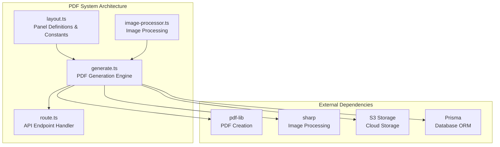
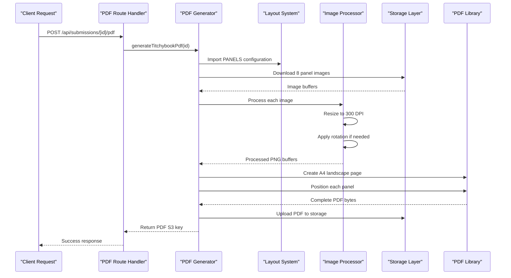
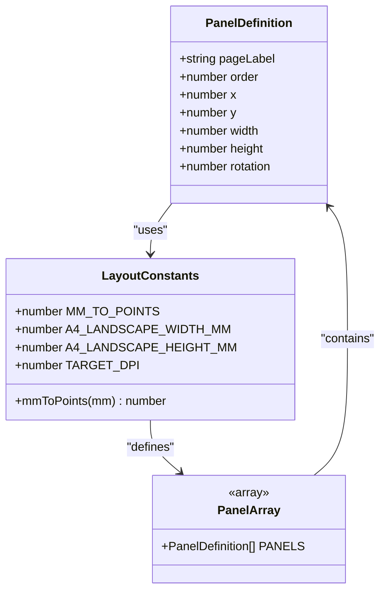
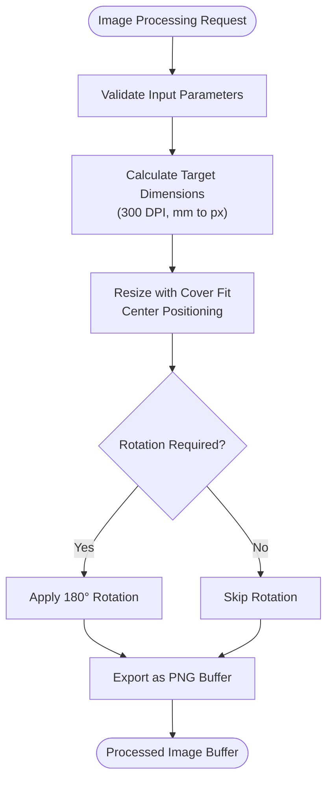
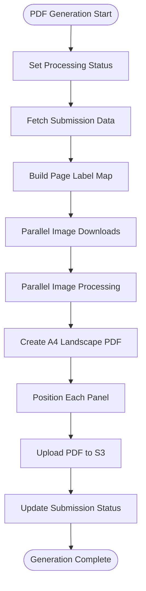
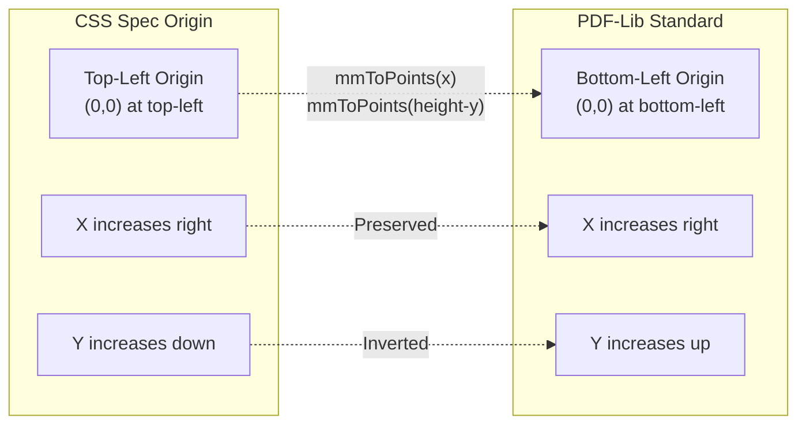

# Template Design and Layout

<cite>
**Referenced Files in This Document**
- [layout.ts](file://src/lib/pdf/layout.ts)
- [generate.ts](file://src/lib/pdf/generate.ts)
- [image-processor.ts](file://src/lib/pdf/image-processor.ts)
- [route.ts](file://src/app/api/submissions/[id]/pdf/route.ts)
- [constants.ts](file://src/lib/constants.ts)
</cite>

## Table of Contents
1. [Introduction](#introduction)
2. [Project Structure](#project-structure)
3. [Core Components](#core-components)
4. [Architecture Overview](#architecture-overview)
5. [Detailed Component Analysis](#detailed-component-analysis)
6. [Coordinate System and Conversions](#coordinate-system-and-conversions)
7. [Panel Layout Configuration](#panel-layout-configuration)
8. [Customization Options](#customization-options)
9. [Performance Considerations](#performance-considerations)
10. [Troubleshooting Guide](#troubleshooting-guide)
11. [Conclusion](#conclusion)

## Introduction

The Titchybook PDF template design and layout system creates professional booklets using A4 landscape pages with a sophisticated 8-panel layout. This system transforms individual page images into a cohesive PDF booklet by applying precise geometric positioning, image processing, and coordinate system conversions.

The layout system is built around millimeter-based measurements that translate to PDF points, ensuring print-ready precision at 300 DPI. The design accommodates different image orientations through rotation transformations while maintaining consistent positioning logic across all panels.

## Project Structure

The PDF template system is organized into focused modules within the `src/lib/pdf/` directory:

**Diagram sources**
- [layout.ts:1-105](file://src/lib/pdf/layout.ts#L1-L105)
- [generate.ts:1-112](file://src/lib/pdf/generate.ts#L1-L112)
- [image-processor.ts:1-30](file://src/lib/pdf/image-processor.ts#L1-L30)

**Section sources**
- [layout.ts:1-105](file://src/lib/pdf/layout.ts#L1-L105)
- [generate.ts:1-112](file://src/lib/pdf/generate.ts#L1-L112)
- [image-processor.ts:1-30](file://src/lib/pdf/image-processor.ts#L1-L30)

## Core Components

The PDF template system consists of four primary components that work together to create the final booklet:

### Layout Definition Module
Defines the geometric specifications and coordinate system for all panels, including A4 landscape dimensions and panel positioning arrays.

### Image Processing Module  
Handles image resizing, cropping, and rotation transformations to match panel specifications and DPI requirements.

### PDF Generation Engine
Coordinates the entire PDF creation process, from image acquisition to final document assembly.

### API Integration Layer
Provides HTTP endpoints for PDF generation requests and integrates with the broader application ecosystem.

**Section sources**
- [layout.ts:1-105](file://src/lib/pdf/layout.ts#L1-L105)
- [generate.ts:1-112](file://src/lib/pdf/generate.ts#L1-L112)
- [image-processor.ts:1-30](file://src/lib/pdf/image-processor.ts#L1-L30)

## Architecture Overview

The PDF generation process follows a structured pipeline that ensures consistent quality and performance:

**Diagram sources**
- [route.ts:1-27](file://src/app/api/submissions/[id]/pdf/route.ts#L1-L27)
- [generate.ts:23-112](file://src/lib/pdf/generate.ts#L23-L112)
- [layout.ts:29-104](file://src/lib/pdf/layout.ts#L29-L104)
- [image-processor.ts:9-29](file://src/lib/pdf/image-processor.ts#L9-L29)

## Detailed Component Analysis

### Layout Definition System

The layout system establishes the foundation for all PDF positioning through carefully defined constants and panel configurations:

**Diagram sources**
- [layout.ts:1-105](file://src/lib/pdf/layout.ts#L1-L105)

The PANELS configuration defines eight distinct panels arranged in two rows:

**Top Row Panels (Upright, Rotation 0)**:
- BACK_COVER: Positioned at (3.9mm, 3.6mm) with dimensions 67.5mm × 91.3mm
- FRONT_COVER: Positioned at (77.4mm, 3.6mm) with dimensions 69.3mm × 98mm
- PAGE_2: Positioned at (151.5mm, 3.6mm) with dimensions 69.6mm × 98.2mm
- PAGE_3: Positioned at (225.5mm, 3.7mm) with dimensions 68.4mm × 98.2mm

**Bottom Row Panels (Rotated 180°)**:
- PAGE_4: Positioned at (224.8mm, 108.5mm) with dimensions 68.3mm × 98mm
- PAGE_5: Positioned at (151.6mm, 108.5mm) with dimensions 68.5mm × 98mm
- PAGE_6: Positioned at (77.4mm, 108.5mm) with dimensions 69mm × 97.9mm
- PAGE_7: Positioned at (3.9mm, 108.5mm) with dimensions 66.6mm × 98.1mm

**Section sources**
- [layout.ts:29-104](file://src/lib/pdf/layout.ts#L29-L104)

### Image Processing Pipeline

The image processing system ensures all uploaded images meet the required specifications for optimal PDF output:

**Diagram sources**
- [image-processor.ts:9-29](file://src/lib/pdf/image-processor.ts#L9-L29)

The processing pipeline applies:
- **DPI Targeting**: Images are resized to 300 DPI for print-quality output
- **Aspect Ratio Preservation**: Uses "cover" fit with center positioning to eliminate letterboxing
- **Rotation Handling**: Automatically applies 180° rotation for bottom-row panels
- **Format Optimization**: Converts to PNG for efficient PDF embedding

**Section sources**
- [image-processor.ts:1-30](file://src/lib/pdf/image-processor.ts#L1-L30)

### PDF Generation Engine

The PDF generation engine orchestrates the complete workflow from image acquisition to final document creation:

**Diagram sources**
- [generate.ts:23-112](file://src/lib/pdf/generate.ts#L23-L112)

**Section sources**
- [generate.ts:1-112](file://src/lib/pdf/generate.ts#L1-L112)

## Coordinate System and Conversions

### A4 Landscape Specifications

The system uses A4 landscape orientation as the base canvas with precise dimensional specifications:

- **Page Dimensions**: 297mm × 210mm (landscape)
- **Target DPI**: 300 DPI for print-quality output
- **Point Conversion**: 1 mm = 72/25.4 points (approximately 2.8346 points per mm)

### Coordinate System Transformation

The layout system implements a crucial coordinate system conversion between two different standards:

**Diagram sources**
- [layout.ts:11-20](file://src/lib/pdf/layout.ts#L11-L20)
- [generate.ts:77-81](file://src/lib/pdf/generate.ts#L77-L81)

The conversion formula used is:
- **X Position**: Direct millimeter-to-point conversion
- **Y Position**: `mmToPoints(A4_LANDSCAPE_HEIGHT_MM - panel.y - panel.height)`

This transformation ensures that panels positioned according to the CSS-like coordinate system appear correctly aligned in the PDF document.

**Section sources**
- [layout.ts:11-20](file://src/lib/pdf/layout.ts#L11-L20)
- [generate.ts:77-81](file://src/lib/pdf/generate.ts#L77-L81)

## Panel Layout Configuration

### Panel Definition Structure

Each panel in the layout system is defined by a comprehensive set of properties:

| Property | Type | Description | Example Value |
|----------|------|-------------|---------------|
| `pageLabel` | string | Unique identifier for the panel | "FRONT_COVER" |
| `order` | number | Rendering order (0-7) | 0 |
| `x` | number | X-coordinate in millimeters | 3.9 |
| `y` | number | Y-coordinate in millimeters | 3.6 |
| `width` | number | Width in millimeters | 67.5 |
| `height` | number | Height in millimeters | 91.3 |
| `rotation` | number | Rotation angle (0 or 180) | 0 |

### Layout Arrangement Pattern

The panels are arranged in a strategic two-row configuration:

**Row 1 (Top Row - Upright)**: BACK_COVER → FRONT_COVER → PAGE_2 → PAGE_3
**Row 2 (Bottom Row - Rotated)**: PAGE_4 → PAGE_5 → PAGE_6 → PAGE_7

This arrangement creates a natural reading flow that mirrors traditional book binding, where the front cover appears first, followed by the main content pages, and concluding with the back cover.

### Spacing and Alignment Logic

The layout system maintains consistent spacing and alignment through:

- **Horizontal Spacing**: Panels are positioned with minimal gaps to maximize page utilization
- **Vertical Alignment**: Both rows align along their top edges (y-coordinates)
- **Proportional Scaling**: All dimensions maintain consistent aspect ratios for optimal image fitting

**Section sources**
- [layout.ts:29-104](file://src/lib/pdf/layout.ts#L29-L104)

## Customization Options

### Modifying Panel Positions and Sizes

The layout system provides several customization points for adapting the template to different requirements:

#### Dimension Adjustments
- **Individual Panel Size**: Modify width and height values in the PANELS array
- **Page Margins**: Adjust x and y coordinates to change outer spacing
- **Internal Spacing**: Modify distances between panels for different layouts

#### Orientation Changes
- **Rotation Values**: Change rotation from 0 to 180 for different panel orientations
- **Layout Reordering**: Modify the order property to change rendering sequence
- **Coordinate System**: Adjust the coordinate transformation for different origin requirements

#### Quality Settings
- **DPI Target**: Modify TARGET_DPI constant for different print quality requirements
- **Image Processing**: Adjust sharp pipeline settings for different compression levels
- **Aspect Ratio**: Change fit mode from "cover" to "contain" for different image handling

### Implementation Guidelines

When customizing the layout system:

1. **Maintain Aspect Ratios**: Preserve the original proportions to avoid image distortion
2. **Test Coordinate Transformations**: Verify that all coordinate conversions remain accurate
3. **Validate Panel Coverage**: Ensure panels fit within A4 landscape boundaries
4. **Consider Print Requirements**: Account for bleed and margin specifications for professional printing

**Section sources**
- [layout.ts:14-20](file://src/lib/pdf/layout.ts#L14-L20)
- [layout.ts:29-104](file://src/lib/pdf/layout.ts#L29-L104)

## Performance Considerations

### Parallel Processing Architecture

The PDF generation system employs parallel processing to optimize performance:

- **Concurrent Image Downloads**: All 8 panel images are downloaded simultaneously
- **Parallel Image Processing**: Each image is processed independently using Sharp
- **Asynchronous Operations**: PDF generation runs as a background task to avoid blocking requests

### Memory Management

The system implements efficient memory usage patterns:

- **Buffer Processing**: Images are processed as buffers rather than stored in memory
- **Streaming Operations**: Large files are handled through streaming rather than loading entirely
- **Garbage Collection**: Processed images are eligible for garbage collection after embedding

### Scalability Factors

Performance considerations for scaling the system:

- **Image Size Limits**: Current implementation supports up to 10MB per image
- **Processing Time**: Total generation time scales linearly with image count
- **Storage Costs**: PDF generation requires temporary storage for intermediate buffers

## Troubleshooting Guide

### Common Issues and Solutions

#### Missing Image Files
**Problem**: Panel images not found during generation
**Solution**: Verify that all 8 page labels are present in the submission data
**Prevention**: Implement validation checks before PDF generation begins

#### Coordinate System Errors
**Problem**: Panels appearing in incorrect positions
**Solution**: Review the coordinate transformation logic for bottom-row panels
**Prevention**: Test coordinate calculations with known panel dimensions

#### Image Quality Issues
**Problem**: Blurry or pixelated output images
**Solution**: Verify that TARGET_DPI setting matches intended print quality
**Prevention**: Monitor image processing logs for dimension calculation errors

#### Memory Limitations
**Problem**: Generation failures with large images
**Solution**: Implement image size validation and compression strategies
**Prevention**: Add monitoring for memory usage during processing

### Debugging Tools

The system includes built-in error handling and logging mechanisms:

- **Error Propagation**: Specific error messages indicate missing panels or processing failures
- **Status Tracking**: Submission status updates prevent concurrent generation conflicts
- **Logging Integration**: Console output provides visibility into generation progress

**Section sources**
- [generate.ts:42-50](file://src/lib/pdf/generate.ts#L42-L50)
- [generate.ts:77-81](file://src/lib/pdf/generate.ts#L77-L81)

## Conclusion

The Titchybook PDF template design and layout system provides a robust foundation for creating professional booklets with precise geometric control and efficient processing capabilities. The system successfully bridges the gap between web-based coordinate systems and print-ready PDF specifications through careful mathematical transformations and parallel processing architecture.

Key strengths of the system include:

- **Precision Geometry**: Millimeter-based measurements ensure consistent print quality
- **Flexible Layout**: Configurable panel arrangements accommodate various booklet designs
- **Optimized Performance**: Parallel processing enables efficient handling of multiple images
- **Professional Standards**: 300 DPI targeting meets commercial printing requirements

The modular architecture allows for easy customization while maintaining the integrity of the core layout system. Future enhancements could include additional panel configurations, advanced image processing options, and expanded print specification support.