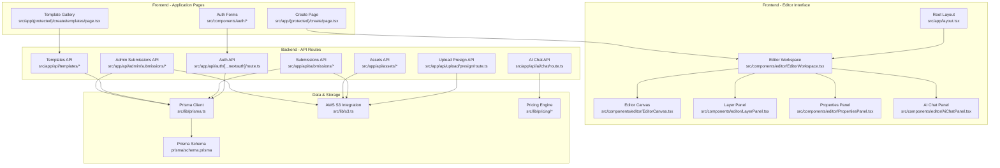
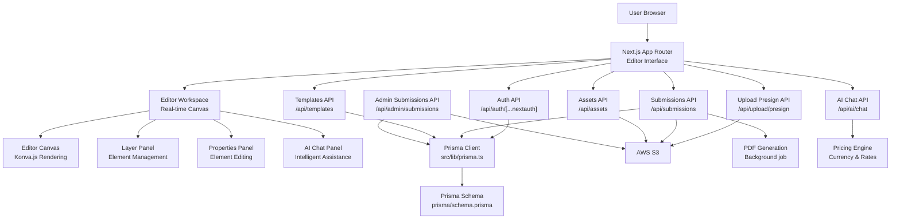
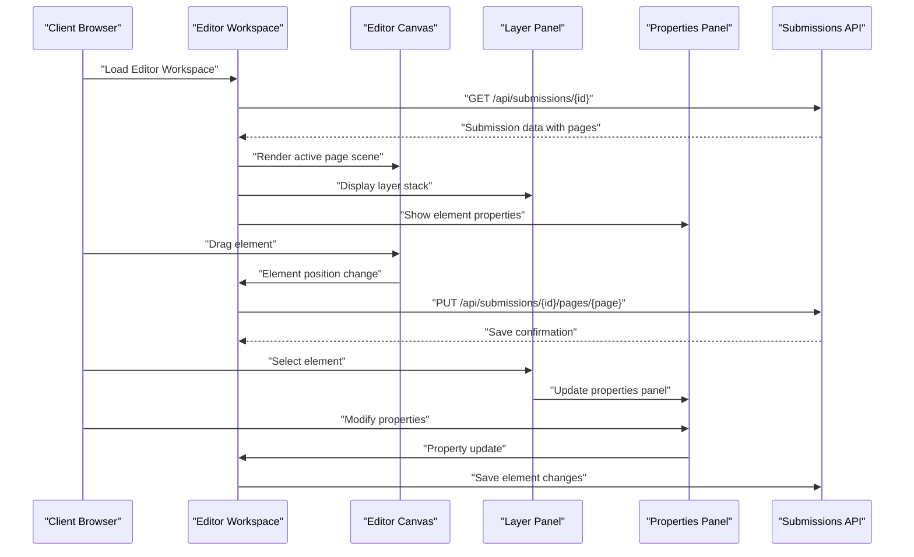
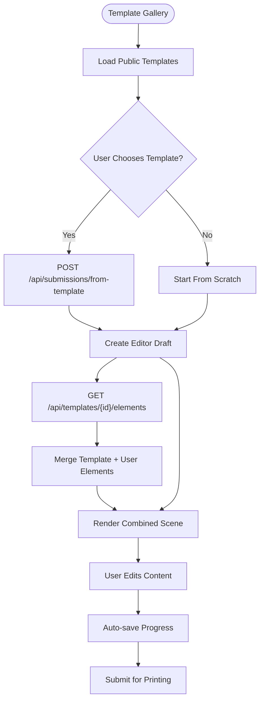
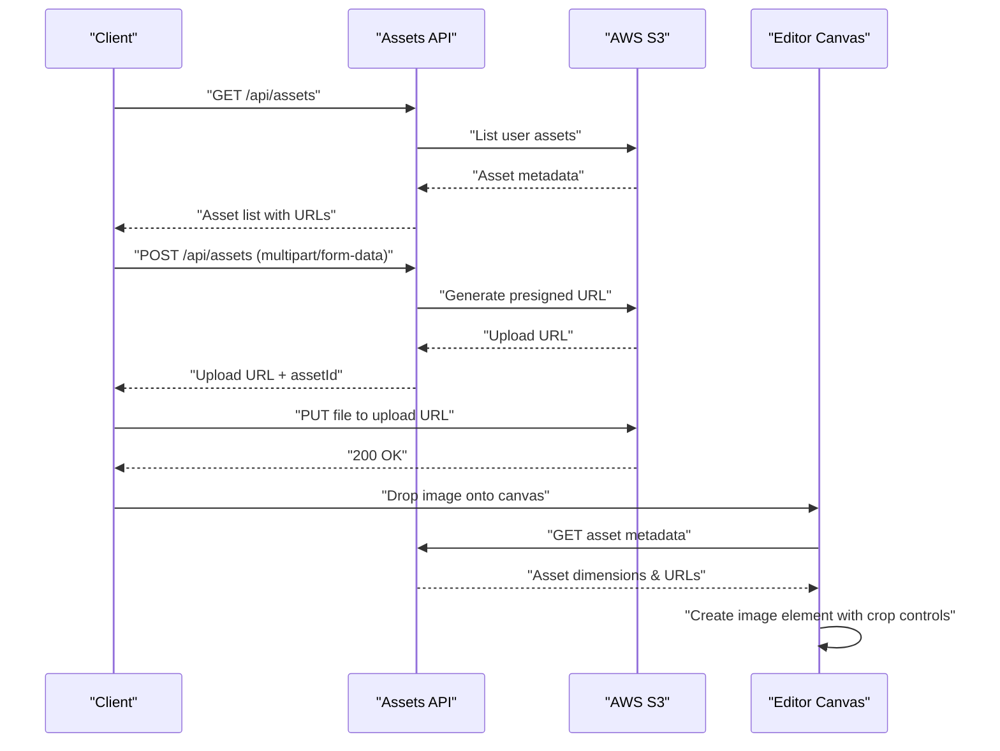
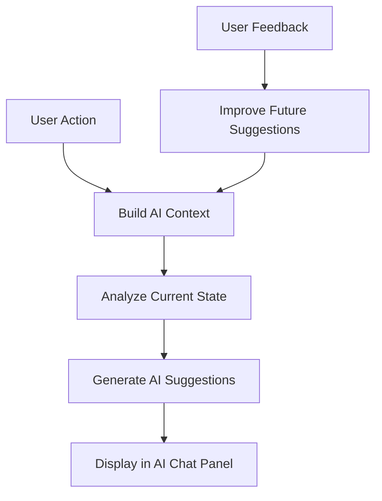
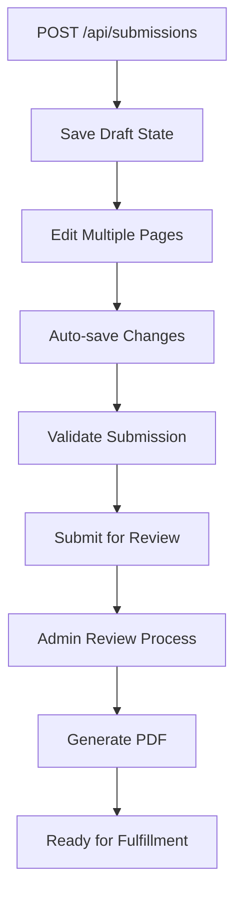
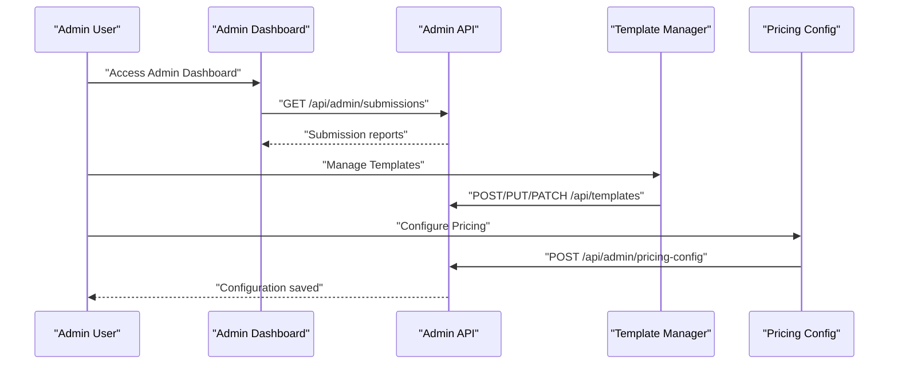
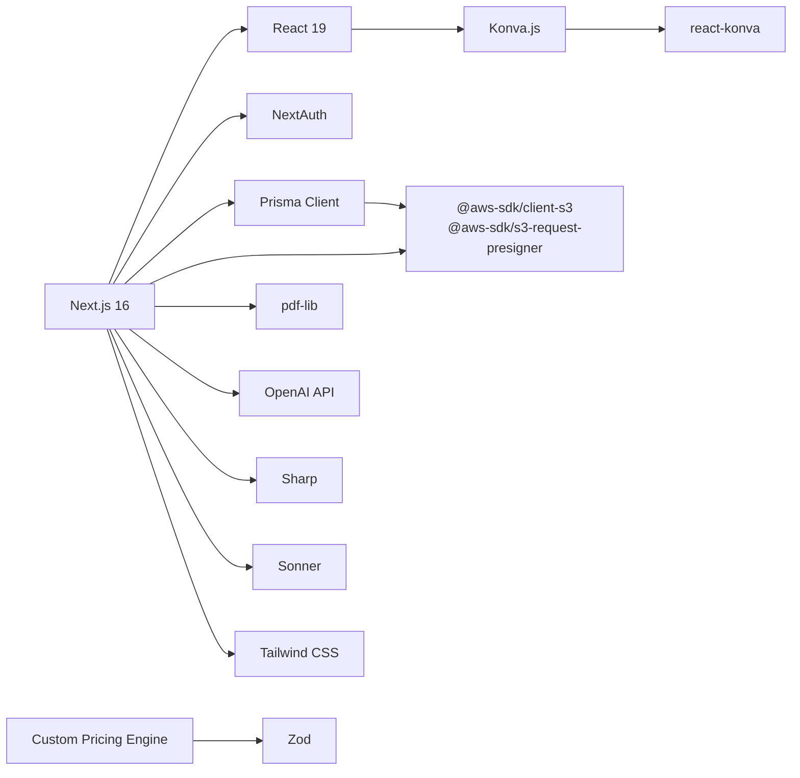

# Project Overview

<cite>
**Referenced Files in This Document**
- [README.md](file://README.md)
- [package.json](file://package.json)
- [src/app/layout.tsx](file://src/app/layout.tsx)
- [prisma/schema.prisma](file://prisma/schema.prisma)
- [src/lib/prisma.ts](file://src/lib/prisma.ts)
- [src/auth.ts](file://src/auth.ts)
- [src/components/auth/LoginForm.tsx](file://src/components/auth/LoginForm.tsx)
- [src/components/create/ImageUploader.tsx](file://src/components/create/ImageUploader.tsx)
- [src/app/(protected)/create/page.tsx](file://src/app/(protected)/create/page.tsx)
- [src/app/(protected)/create/templates/page.tsx](file://src/app/(protected)/create/templates/page.tsx)
- [src/components/editor/EditorWorkspace.tsx](file://src/components/editor/EditorWorkspace.tsx)
- [src/components/editor/EditorCanvas.tsx](file://src/components/editor/EditorCanvas.tsx)
- [src/components/editor/LayerPanel.tsx](file://src/components/editor/LayerPanel.tsx)
- [src/components/editor/PropertiesPanel.tsx](file://src/components/editor/PropertiesPanel.tsx)
- [src/lib/s3.ts](file://src/lib/s3.ts)
- [src/app/api/upload/presign/route.ts](file://src/app/api/upload/presign/route.ts)
- [src/app/api/submissions/route.ts](file://src/app/api/submissions/route.ts)
- [src/app/api/submissions/[id]/route.ts](file://src/app/api/submissions/[id]/route.ts)
- [src/app/api/submissions/pages/[pageLabel]/route.ts](file://src/app/api/submissions/pages/[pageLabel]/route.ts)
- [src/app/api/submissions/submit/route.ts](file://src/app/api/submissions/submit/route.ts)
- [src/app/api/submissions/pdf/route.ts](file://src/app/api/submissions/pdf/route.ts)
- [src/app/api/submissions/from-template/route.ts](file://src/app/api/submissions/from-template/route.ts)
- [src/app/api/admin/submissions/route.ts](file://src/app/api/admin/submissions/route.ts)
- [src/app/api/templates/[id]/elements/route.ts](file://src/app/api/templates/[id]/elements/route.ts)
- [src/app/api/templates/public/route.ts](file://src/app/api/templates/public/route.ts)
- [src/app/api/assets/route.ts](file://src/app/api/assets/route.ts)
- [src/app/api/ai/chat/route.ts](file://src/app/api/ai/chat/route.ts)
- [src/components/admin/AdminDashboard.tsx](file://src/components/admin/AdminDashboard.tsx)
- [src/lib/constants.ts](file://src/lib/constants.ts)
- [src/lib/pricing/index.ts](file://src/lib/pricing/index.ts)
</cite>

## Update Summary
**Changes Made**
- Complete transformation from simple upload system to comprehensive editor-based workflow
- Added sophisticated editor components with canvas rendering, layer management, and property editing
- Integrated asset management system with upload and preview capabilities
- Implemented template system with instance mode and template editing
- Added AI-powered chat assistance and intelligent suggestions
- Enhanced pricing engine with configurable rates and currency support
- Expanded administrative features with template management and pricing configuration

## Table of Contents
1. [Introduction](#introduction)
2. [Project Structure](#project-structure)
3. [Core Components](#core-components)
4. [Architecture Overview](#architecture-overview)
5. [Detailed Component Analysis](#detailed-component-analysis)
6. [Dependency Analysis](#dependency-analysis)
7. [Performance Considerations](#performance-considerations)
8. [Troubleshooting Guide](#troubleshooting-guide)
9. [Conclusion](#conclusion)

## Introduction
Titchybook Creator is a comprehensive micro booklets creation platform that transforms user-uploaded images and creative content into printable 8-page micro booklets with professional PDF generation. The platform has evolved from a simple image upload system to a sophisticated editor-based workflow featuring real-time canvas editing, asset management, template systems, and AI-powered assistance.

The platform serves as both a consumer-facing design tool and an administrative system for managing templates, pricing, and order fulfillment. Users can create personalized micro booklets through an intuitive drag-and-drop editor, while administrators can manage templates, configure pricing, and oversee the production workflow.

Target audience:
- Hobbyists and small creators who want to produce professional, personalized printed booklets
- Educators and event organizers needing customizable promotional materials
- Small businesses distributing branded mini-booklets for marketing purposes
- Template designers and administrators managing content libraries

Core benefits:
- Professional-grade editor with canvas-based design interface
- Comprehensive template system supporting both template creation and instance editing
- Intelligent asset management with upload, preview, and cropping capabilities
- AI-powered design assistance and content suggestions
- Flexible pricing engine with configurable rates and currency support
- Streamlined administrative workflow for template management and order processing
- Scalable architecture supporting complex editorial workflows

## Project Structure
The project follows a Next.js App Router structure with a comprehensive separation of frontend UI, backend API routes, database modeling, and cloud storage integration. The architecture now supports complex editor workflows with real-time collaboration and asset management.

**Diagram sources**
- [src/app/layout.tsx:1-42](file://src/app/layout.tsx#L1-L42)
- [src/components/editor/EditorWorkspace.tsx:1-800](file://src/components/editor/EditorWorkspace.tsx#L1-L800)
- [src/components/editor/EditorCanvas.tsx:1-800](file://src/components/editor/EditorCanvas.tsx#L1-L800)
- [src/components/editor/LayerPanel.tsx:1-212](file://src/components/editor/LayerPanel.tsx#L1-L212)
- [src/components/editor/PropertiesPanel.tsx:1-586](file://src/components/editor/PropertiesPanel.tsx#L1-L586)
- [src/app/(protected)/create/page.tsx:1-25](file://src/app/(protected)/create/page.tsx#L1-L25)
- [src/app/(protected)/create/templates/page.tsx:1-176](file://src/app/(protected)/create/templates/page.tsx#L1-L176)
- [src/app/api/auth/[...nextauth]/route.ts](file://src/app/api/auth/[...nextauth]/route.ts)
- [src/app/api/upload/presign/route.ts:1-38](file://src/app/api/upload/presign/route.ts#L1-L38)
- [src/app/api/submissions/route.ts:1-96](file://src/app/api/submissions/route.ts#L1-L96)
- [src/app/api/templates/[id]/elements/route.ts](file://src/app/api/templates/[id]/elements/route.ts)
- [src/app/api/assets/route.ts:1-81](file://src/app/api/assets/route.ts#L1-L81)
- [src/app/api/ai/chat/route.ts:1-81](file://src/app/api/ai/chat/route.ts#L1-L81)
- [src/app/api/admin/submissions/route.ts:1-38](file://src/app/api/admin/submissions/route.ts#L1-L38)
- [prisma/schema.prisma:1-48](file://prisma/schema.prisma#L1-L48)
- [src/lib/prisma.ts:1-10](file://src/lib/prisma.ts#L1-L10)
- [src/lib/s3.ts:1-81](file://src/lib/s3.ts#L1-L81)
- [src/lib/pricing/index.ts:1-5](file://src/lib/pricing/index.ts#L1-L5)

**Section sources**
- [README.md:1-37](file://README.md#L1-L37)
- [package.json:1-48](file://package.json#L1-L48)
- [src/app/layout.tsx:1-42](file://src/app/layout.tsx#L1-L42)

## Core Components
- **Advanced Editor System**
  - Real-time canvas-based editing with Konva.js integration
  - Layer management with template and user layers
  - Property panels for precise element manipulation
  - Undo/redo functionality with history tracking
  - Drag-and-drop element positioning and resizing

- **Template Management System**
  - Template creation and editing interface
  - Instance mode for template customization
  - Locked template elements with editable text overrides
  - Template publishing and version management
  - Template gallery for user selection

- **Asset Management**
  - Comprehensive asset upload and preview system
  - Image cropping and zoom controls
  - Asset metadata management (dimensions, MIME types)
  - Presigned URL generation for secure uploads
  - Asset library with filtering and search capabilities

- **AI-Powered Assistance**
  - Intelligent design suggestions and improvements
  - Context-aware content recommendations
  - Automated layout optimization
  - Content generation based on user preferences

- **Enhanced Submission Workflow**
  - Draft management with auto-save functionality
  - Multi-page submission handling
  - Template-based submission creation
  - Submission status tracking and management
  - PDF generation with advanced layout options

- **Administrative Features**
  - Template management dashboard
  - Pricing configuration and currency management
  - Order moderation and fulfillment tracking
  - User management and role-based access control
  - Analytics and reporting capabilities

**Section sources**
- [src/components/editor/EditorWorkspace.tsx:1-800](file://src/components/editor/EditorWorkspace.tsx#L1-L800)
- [src/components/editor/EditorCanvas.tsx:1-800](file://src/components/editor/EditorCanvas.tsx#L1-L800)
- [src/components/editor/LayerPanel.tsx:1-212](file://src/components/editor/LayerPanel.tsx#L1-L212)
- [src/components/editor/PropertiesPanel.tsx:1-586](file://src/components/editor/PropertiesPanel.tsx#L1-L586)
- [src/app/(protected)/create/templates/page.tsx:1-176](file://src/app/(protected)/create/templates/page.tsx#L1-L176)
- [src/app/api/assets/route.ts:1-81](file://src/app/api/assets/route.ts#L1-L81)
- [src/app/api/ai/chat/route.ts:1-81](file://src/app/api/ai/chat/route.ts#L1-L81)
- [src/lib/pricing/index.ts:1-5](file://src/lib/pricing/index.ts#L1-L5)

## Architecture Overview
High-level architecture showing the evolution from simple uploads to comprehensive editor-based workflow with real-time collaboration and asset management.

**Diagram sources**
- [src/components/editor/EditorWorkspace.tsx:265-800](file://src/components/editor/EditorWorkspace.tsx#L265-L800)
- [src/components/editor/EditorCanvas.tsx:1-800](file://src/components/editor/EditorCanvas.tsx#L1-L800)
- [src/components/editor/LayerPanel.tsx:1-212](file://src/components/editor/LayerPanel.tsx#L1-L212)
- [src/components/editor/PropertiesPanel.tsx:1-586](file://src/components/editor/PropertiesPanel.tsx#L1-L586)
- [src/app/api/auth/[...nextauth]/route.ts:1-81](file://src/app/api/auth/[...nextauth]/route.ts#L1-L81)
- [src/app/api/upload/presign/route.ts:1-38](file://src/app/api/upload/presign/route.ts#L1-L38)
- [src/app/api/submissions/route.ts:1-96](file://src/app/api/submissions/route.ts#L1-L96)
- [src/app/api/templates/[id]/elements/route.ts](file://src/app/api/templates/[id]/elements/route.ts)
- [src/app/api/assets/route.ts:1-81](file://src/app/api/assets/route.ts#L1-L81)
- [src/app/api/ai/chat/route.ts:1-81](file://src/app/api/ai/chat/route.ts#L1-L81)
- [src/app/api/admin/submissions/route.ts:1-38](file://src/app/api/admin/submissions/route.ts#L1-L38)
- [src/lib/prisma.ts:1-10](file://src/lib/prisma.ts#L1-L10)
- [prisma/schema.prisma:10-47](file://prisma/schema.prisma#L10-L47)
- [src/lib/s3.ts:8-80](file://src/lib/s3.ts#L8-L80)
- [src/lib/pricing/index.ts:1-5](file://src/lib/pricing/index.ts#L1-L5)

## Detailed Component Analysis

### Advanced Editor System
The editor system represents the core innovation of the platform, providing a professional-grade design interface with real-time collaboration capabilities.

**Diagram sources**
- [src/components/editor/EditorWorkspace.tsx:420-800](file://src/components/editor/EditorWorkspace.tsx#L420-L800)
- [src/components/editor/EditorCanvas.tsx:1-800](file://src/components/editor/EditorCanvas.tsx#L1-L800)
- [src/components/editor/LayerPanel.tsx:1-212](file://src/components/editor/LayerPanel.tsx#L1-L212)
- [src/components/editor/PropertiesPanel.tsx:1-586](file://src/components/editor/PropertiesPanel.tsx#L1-L586)

**Section sources**
- [src/components/editor/EditorWorkspace.tsx:1-800](file://src/components/editor/EditorWorkspace.tsx#L1-L800)
- [src/components/editor/EditorCanvas.tsx:1-800](file://src/components/editor/EditorCanvas.tsx#L1-L800)
- [src/components/editor/LayerPanel.tsx:1-212](file://src/components/editor/LayerPanel.tsx#L1-L212)
- [src/components/editor/PropertiesPanel.tsx:1-586](file://src/components/editor/PropertiesPanel.tsx#L1-L586)

### Template Management System
The template system enables both template creation and instance editing, providing flexibility for different user needs.

**Diagram sources**
- [src/app/(protected)/create/templates/page.tsx:35-60](file://src/app/(protected)/create/templates/page.tsx#L35-L60)
- [src/app/api/submissions/from-template/route.ts](file://src/app/api/submissions/from-template/route.ts)
- [src/app/api/templates/[id]/elements/route.ts](file://src/app/api/templates/[id]/elements/route.ts)

**Section sources**
- [src/app/(protected)/create/templates/page.tsx:1-176](file://src/app/(protected)/create/templates/page.tsx#L1-L176)
- [src/app/api/submissions/from-template/route.ts](file://src/app/api/submissions/from-template/route.ts)
- [src/app/api/templates/[id]/elements/route.ts](file://src/app/api/templates/[id]/elements/route.ts)

### Asset Management System
The asset management system provides comprehensive image handling with upload, preview, and editing capabilities.

**Diagram sources**
- [src/app/api/assets/route.ts:1-81](file://src/app/api/assets/route.ts#L1-L81)
- [src/app/api/upload/presign/route.ts:1-38](file://src/app/api/upload/presign/route.ts#L1-L38)
- [src/components/editor/EditorCanvas.tsx:69-187](file://src/components/editor/EditorCanvas.tsx#L69-L187)

**Section sources**
- [src/app/api/assets/route.ts:1-81](file://src/app/api/assets/route.ts#L1-L81)
- [src/app/api/upload/presign/route.ts:1-38](file://src/app/api/upload/presign/route.ts#L1-L38)
- [src/components/editor/EditorCanvas.tsx:1-800](file://src/components/editor/EditorCanvas.tsx#L1-L800)

### AI-Powered Design Assistance
The AI system provides intelligent design suggestions and content recommendations based on the current editor state.

**Diagram sources**
- [src/components/editor/EditorWorkspace.tsx:372-396](file://src/components/editor/EditorWorkspace.tsx#L372-L396)
- [src/app/api/ai/chat/route.ts:1-81](file://src/app/api/ai/chat/route.ts#L1-L81)

**Section sources**
- [src/components/editor/EditorWorkspace.tsx:1-800](file://src/components/editor/EditorWorkspace.tsx#L1-L800)
- [src/app/api/ai/chat/route.ts:1-81](file://src/app/api/ai/chat/route.ts#L1-L81)

### Enhanced Submission Workflow
The submission system now handles complex editor states with draft management and multi-page support.

**Diagram sources**
- [src/app/api/submissions/route.ts:35-95](file://src/app/api/submissions/route.ts#L35-L95)
- [src/app/api/submissions/[id]/route.ts](file://src/app/api/submissions/[id]/route.ts)
- [src/app/api/submissions/pages/[pageLabel]/route.ts](file://src/app/api/submissions/pages/[pageLabel]/route.ts)

**Section sources**
- [src/app/api/submissions/route.ts:1-96](file://src/app/api/submissions/route.ts#L1-L96)
- [src/app/api/submissions/[id]/route.ts](file://src/app/api/submissions/[id]/route.ts)
- [src/app/api/submissions/pages/[pageLabel]/route.ts](file://src/app/api/submissions/pages/[pageLabel]/route.ts)

### Administrative Features
Administrative capabilities have been significantly expanded to support template management and pricing configuration.

**Diagram sources**
- [src/components/admin/AdminDashboard.tsx:1-168](file://src/components/admin/AdminDashboard.tsx#L1-L168)
- [src/app/api/admin/submissions/route.ts:1-38](file://src/app/api/admin/submissions/route.ts#L1-L38)
- [src/app/api/admin/pricing-config/route.ts](file://src/app/api/admin/pricing-config/route.ts)

**Section sources**
- [src/components/admin/AdminDashboard.tsx:1-168](file://src/components/admin/AdminDashboard.tsx#L1-L168)
- [src/app/api/admin/submissions/route.ts:1-38](file://src/app/api/admin/submissions/route.ts#L1-L38)

## Dependency Analysis
The technology stack has been significantly enhanced to support the comprehensive editor workflow and advanced features.

- **Frontend Framework**: Next.js 16 with App Router, React 19 with concurrent features
- **Editor Framework**: Konva.js for canvas rendering, react-konva for React integration
- **UI Components**: Tailwind CSS for styling, Sonner for notifications
- **Authentication**: NextAuth with JWT strategy and credential provider
- **Data Management**: Prisma ORM with PostgreSQL/SQLite support
- **Cloud Services**: AWS S3 for asset storage and presigned URL generation
- **PDF Generation**: pdf-lib for programmatic PDF assembly
- **AI Integration**: OpenAI API for intelligent design assistance
- **Image Processing**: Sharp for image optimization and format conversion
- **Validation**: Zod for runtime type safety and form validation
- **Pricing Engine**: Custom pricing module with currency and rate management

**Diagram sources**
- [package.json:12-29](file://package.json#L12-L29)
- [src/lib/prisma.ts:1](file://src/lib/prisma.ts#L1)
- [src/lib/s3.ts:1-6](file://src/lib/s3.ts#L1-L6)
- [src/auth.ts:1-4](file://src/auth.ts#L1-L4)
- [src/lib/pricing/index.ts:1-5](file://src/lib/pricing/index.ts#L1-L5)

**Section sources**
- [package.json:1-48](file://package.json#L1-L48)
- [prisma/schema.prisma:1-8](file://prisma/schema.prisma#L1-L8)

## Performance Considerations
The enhanced platform requires careful consideration of performance bottlenecks in the editor system and asset management.

- **Canvas Rendering Optimization**: Use Konva's built-in optimization features and implement virtual scrolling for large element counts
- **Asset Loading Strategies**: Implement lazy loading for images and progressive enhancement for asset previews
- **State Management**: Optimize editor state updates to minimize re-renders and maintain responsive interactions
- **Memory Management**: Implement proper cleanup for image objects and canvas resources
- **Background Processing**: Offload heavy operations like PDF generation and image processing to background workers
- **Caching Strategy**: Cache template elements and frequently accessed assets to reduce API calls
- **Image Optimization**: Use Sharp for efficient image processing and implement appropriate compression strategies
- **Database Queries**: Optimize Prisma queries for editor state and implement proper indexing for template and asset lookups

## Troubleshooting Guide
Enhanced troubleshooting guidance for the comprehensive editor system and new features.

**Editor System Issues**
- Canvas rendering problems: Verify Konva stage initialization and element positioning calculations
- Layer management conflicts: Check z-index sorting and element selection logic
- Property panel synchronization: Ensure proper prop drilling and state updates
- Undo/redo functionality: Validate history state management and snapshot creation

**Template System Problems**
- Template loading failures: Verify template element merging logic and asset resolution
- Instance mode issues: Check template text override handling and locked element restrictions
- Template publishing: Validate template versioning and element serialization

**Asset Management Errors**
- Upload failures: Verify presigned URL generation and S3 bucket permissions
- Image processing: Check Sharp installation and supported format handling
- Asset preview: Ensure proper URL generation and CORS configuration

**AI Integration Issues**
- API connectivity: Verify OpenAI API key configuration and network access
- Context building: Check editor state serialization and context payload construction
- Response handling: Validate AI suggestion parsing and display logic

**Pricing Engine Problems**
- Currency conversion: Verify exchange rate updates and calculation accuracy
- Pricing configuration: Check rate validation and configuration persistence
- Calculation errors: Validate pricing formula implementation and edge case handling

**Section sources**
- [src/components/editor/EditorWorkspace.tsx:1-800](file://src/components/editor/EditorWorkspace.tsx#L1-L800)
- [src/components/editor/EditorCanvas.tsx:1-800](file://src/components/editor/EditorCanvas.tsx#L1-L800)
- [src/app/(protected)/create/templates/page.tsx:1-176](file://src/app/(protected)/create/templates/page.tsx#L1-L176)
- [src/app/api/assets/route.ts:1-81](file://src/app/api/assets/route.ts#L1-L81)
- [src/app/api/ai/chat/route.ts:1-81](file://src/app/api/ai/chat/route.ts#L1-L81)
- [src/lib/pricing/index.ts:1-5](file://src/lib/pricing/index.ts#L1-L5)

## Conclusion
Titchybook Creator has evolved from a simple image upload platform to a comprehensive micro booklets creation ecosystem. The transformation includes sophisticated editor components with real-time canvas editing, comprehensive template management, intelligent asset handling, and AI-powered design assistance.

The platform now provides professional-grade tools for both casual users and template designers, while maintaining scalability and performance through modern architecture patterns. The integration of AI assistance, advanced pricing engines, and comprehensive administrative tools creates a complete solution for micro booklet production and distribution.

The modular architecture built on Next.js, Prisma, AWS S3, and specialized libraries like Konva.js provides a solid foundation for continued innovation and feature expansion. Future enhancements could include collaborative editing features, advanced print preparation tools, and expanded template customization options.