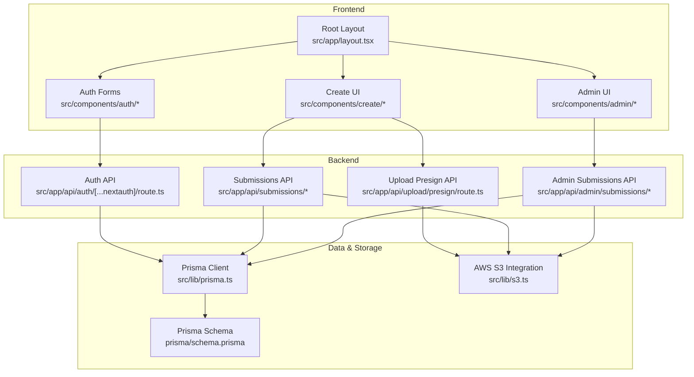
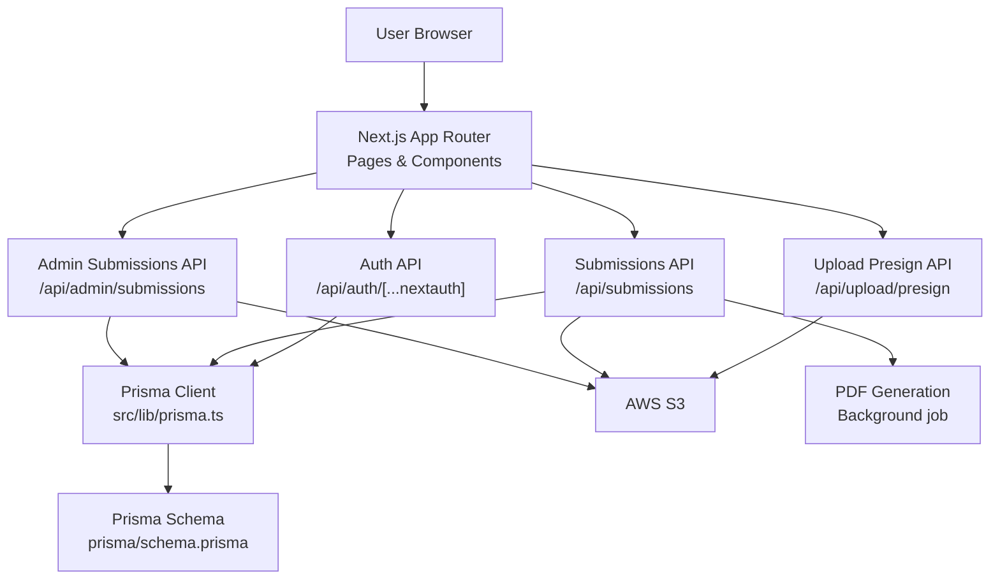
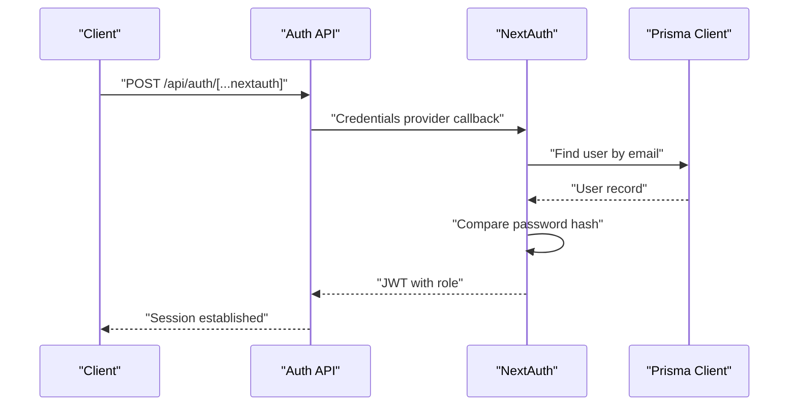
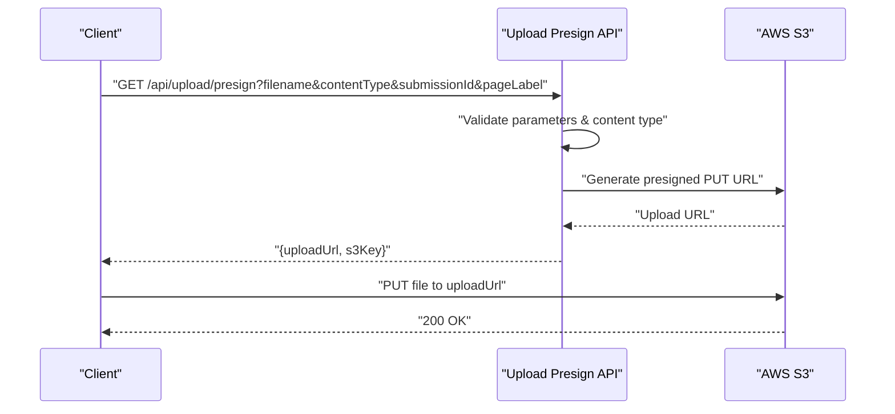
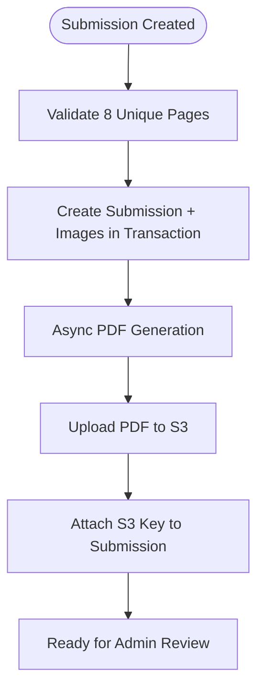
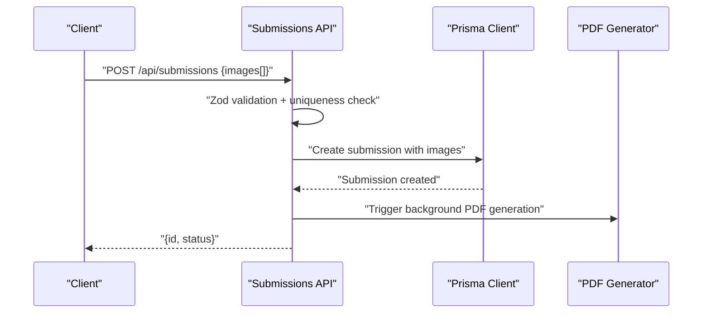
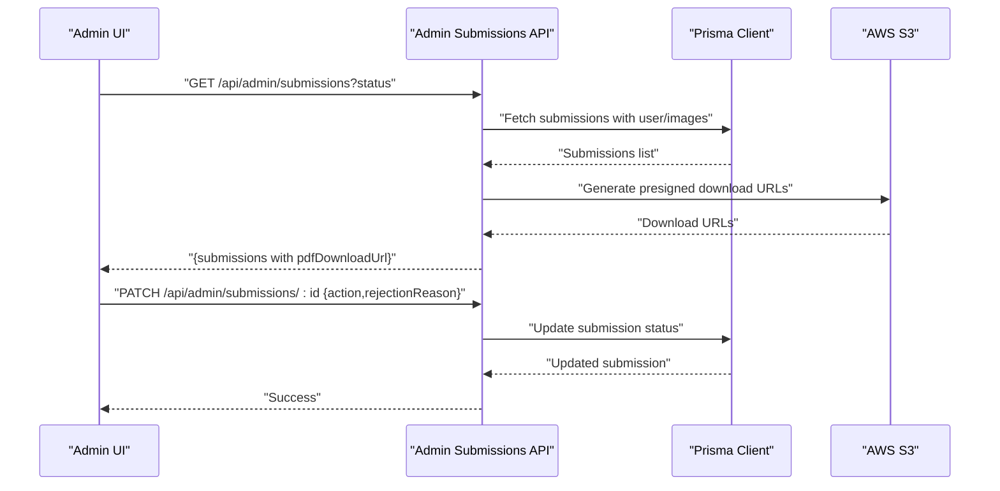
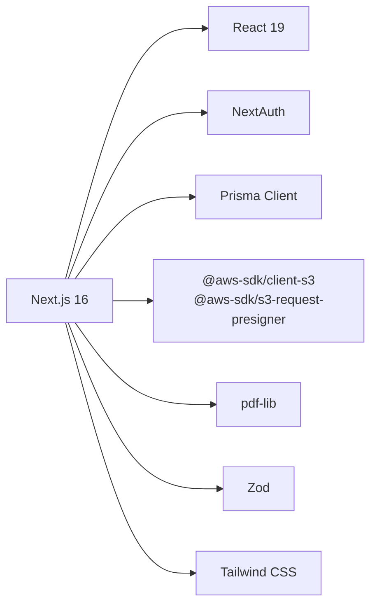

# Project Overview

<cite>
**Referenced Files in This Document**
- [README.md](file://README.md)
- [package.json](file://package.json)
- [src/app/layout.tsx](file://src/app/layout.tsx)
- [prisma/schema.prisma](file://prisma/schema.prisma)
- [src/lib/prisma.ts](file://src/lib/prisma.ts)
- [src/auth.ts](file://src/auth.ts)
- [src/components/auth/LoginForm.tsx](file://src/components/auth/LoginForm.tsx)
- [src/components/create/ImageUploader.tsx](file://src/components/create/ImageUploader.tsx)
- [src/lib/s3.ts](file://src/lib/s3.ts)
- [src/app/api/upload/presign/route.ts](file://src/app/api/upload/presign/route.ts)
- [src/app/api/submissions/route.ts](file://src/app/api/submissions/route.ts)
- [src/app/api/admin/submissions/route.ts](file://src/app/api/admin/submissions/route.ts)
- [src/components/admin/AdminDashboard.tsx](file://src/components/admin/AdminDashboard.tsx)
- [src/lib/constants.ts](file://src/lib/constants.ts)
</cite>

## Table of Contents
1. [Introduction](#introduction)
2. [Project Structure](#project-structure)
3. [Core Components](#core-components)
4. [Architecture Overview](#architecture-overview)
5. [Detailed Component Analysis](#detailed-component-analysis)
6. [Dependency Analysis](#dependency-analysis)
7. [Performance Considerations](#performance-considerations)
8. [Troubleshooting Guide](#troubleshooting-guide)
9. [Conclusion](#conclusion)

## Introduction
Titchybook Creator is a micro booklets platform that enables users to transform their uploaded images into printable 8-page micro booklets and export them as professional PDFs. The platform focuses on simplicity and accessibility: users authenticate, upload validated images via signed URLs, and receive a downloadable PDF after asynchronous processing. Administrators can review, approve, or reject submissions and download generated PDFs for fulfillment.

Target audience:
- Hobbyists and small creators who want to produce personalized, low-cost printed booklets.
- Educators and event organizers needing quick-print materials.
- Small businesses distributing branded mini-booklets.

Core benefits:
- Fast, secure uploads using signed URLs.
- Automated PDF generation pipeline.
- Role-based administration for quality control.
- Scalable architecture leveraging modern web technologies.

## Project Structure
The project follows a Next.js App Router structure with a clear separation of frontend UI, backend API routes, database modeling, and cloud storage integration.

**Diagram sources**
- [src/app/layout.tsx:1-42](file://src/app/layout.tsx#L1-L42)
- [src/app/api/auth/[...nextauth]/route.ts](file://src/app/api/auth/[...nextauth]/route.ts)
- [src/app/api/upload/presign/route.ts:1-38](file://src/app/api/upload/presign/route.ts#L1-L38)
- [src/app/api/submissions/route.ts:1-96](file://src/app/api/submissions/route.ts#L1-L96)
- [src/app/api/admin/submissions/route.ts:1-38](file://src/app/api/admin/submissions/route.ts#L1-L38)
- [prisma/schema.prisma:1-48](file://prisma/schema.prisma#L1-L48)
- [src/lib/prisma.ts:1-10](file://src/lib/prisma.ts#L1-L10)
- [src/lib/s3.ts:1-81](file://src/lib/s3.ts#L1-L81)

**Section sources**
- [README.md:1-37](file://README.md#L1-L37)
- [package.json:1-43](file://package.json#L1-L43)
- [src/app/layout.tsx:1-42](file://src/app/layout.tsx#L1-L42)

## Core Components
- Authentication and Authorization
  - NextAuth integration with JWT strategy and credential provider.
  - Protected routes enforced via auth middleware and API guards.
  - Role-aware admin endpoints.

- Image Upload and Validation
  - Client-side validation for file type and size.
  - Signed URL generation for secure, direct-to-S3 uploads.
  - Per-page upload keys organized under user-specific paths.

- PDF Generation Pipeline
  - Asynchronous PDF generation triggered upon submission creation.
  - Uses pdf-lib to assemble 8-page layouts and store the result in S3.
  - Admin dashboard surfaces generated PDFs via signed download URLs.

- Submission Management
  - CRUD-like submission lifecycle with status tracking.
  - Zod-based validation for submission payloads.
  - Pagination and filtering for admin dashboards.

- Administrative Features
  - Admin-only access to submissions with status filters.
  - Approve/reject actions with optional rejection reasons.
  - Bulk-signed-download links for generated PDFs.

**Section sources**
- [src/auth.ts:1-80](file://src/auth.ts#L1-L80)
- [src/components/auth/LoginForm.tsx:1-86](file://src/components/auth/LoginForm.tsx#L1-L86)
- [src/components/create/ImageUploader.tsx:1-148](file://src/components/create/ImageUploader.tsx#L1-L148)
- [src/app/api/upload/presign/route.ts:1-38](file://src/app/api/upload/presign/route.ts#L1-L38)
- [src/lib/s3.ts:1-81](file://src/lib/s3.ts#L1-L81)
- [src/app/api/submissions/route.ts:1-96](file://src/app/api/submissions/route.ts#L1-L96)
- [src/app/api/admin/submissions/route.ts:1-38](file://src/app/api/admin/submissions/route.ts#L1-L38)
- [src/components/admin/AdminDashboard.tsx:1-168](file://src/components/admin/AdminDashboard.tsx#L1-L168)
- [src/lib/constants.ts:1-49](file://src/lib/constants.ts#L1-L49)

## Architecture Overview
High-level architecture showing the flow from user uploads to PDF generation and admin review.

**Diagram sources**
- [src/auth.ts:27-79](file://src/auth.ts#L27-L79)
- [src/app/api/upload/presign/route.ts:6-37](file://src/app/api/upload/presign/route.ts#L6-L37)
- [src/app/api/submissions/route.ts:35-95](file://src/app/api/submissions/route.ts#L35-L95)
- [src/app/api/admin/submissions/route.ts:6-37](file://src/app/api/admin/submissions/route.ts#L6-L37)
- [src/lib/prisma.ts:1-10](file://src/lib/prisma.ts#L1-L10)
- [prisma/schema.prisma:10-47](file://prisma/schema.prisma#L10-L47)
- [src/lib/s3.ts:8-80](file://src/lib/s3.ts#L8-L80)

## Detailed Component Analysis

### Authentication and Authorization
- NextAuth configuration with credentials provider and JWT session strategy.
- Type-safe user/session/JWT extensions for role propagation.
- Protected routes enforced by API guards checking session presence and role.

**Diagram sources**
- [src/auth.ts:27-79](file://src/auth.ts#L27-L79)
- [src/lib/prisma.ts:1-10](file://src/lib/prisma.ts#L1-L10)

**Section sources**
- [src/auth.ts:1-80](file://src/auth.ts#L1-L80)
- [src/components/auth/LoginForm.tsx:14-33](file://src/components/auth/LoginForm.tsx#L14-L33)

### Image Upload and Validation
- Client-side validation ensures accepted image types and size limits.
- Frontend requests a presigned upload URL from the backend.
- Direct upload to S3 using the signed URL with appropriate content type.
- Per-page S3 keys organized under user-specific paths for easy retrieval.

**Diagram sources**
- [src/components/create/ImageUploader.tsx:42-64](file://src/components/create/ImageUploader.tsx#L42-L64)
- [src/app/api/upload/presign/route.ts:6-37](file://src/app/api/upload/presign/route.ts#L6-L37)
- [src/lib/s3.ts:18-28](file://src/lib/s3.ts#L18-L28)

**Section sources**
- [src/components/create/ImageUploader.tsx:24-31](file://src/components/create/ImageUploader.tsx#L24-L31)
- [src/app/api/upload/presign/route.ts:18-30](file://src/app/api/upload/presign/route.ts#L18-L30)
- [src/lib/s3.ts:66-80](file://src/lib/s3.ts#L66-L80)

### PDF Generation Pipeline
- On successful submission creation, the system asynchronously generates a PDF.
- The PDF is stored in S3 under a user-specific path and linked to the submission.
- Admins can preview generated PDFs via signed download URLs.

**Diagram sources**
- [src/app/api/submissions/route.ts:64-83](file://src/app/api/submissions/route.ts#L64-L83)
- [src/lib/s3.ts:52-64](file://src/lib/s3.ts#L52-L64)

**Section sources**
- [src/app/api/submissions/route.ts:35-95](file://src/app/api/submissions/route.ts#L35-L95)
- [src/lib/s3.ts:75-80](file://src/lib/s3.ts#L75-L80)

### Submission Management
- Users can list their own submissions and submit image sets for PDF generation.
- Zod schemas validate the structure and completeness of submissions.
- Admins can filter submissions by status and approve/reject them.

**Diagram sources**
- [src/app/api/submissions/route.ts:35-95](file://src/app/api/submissions/route.ts#L35-L95)
- [src/lib/constants.ts:18-27](file://src/lib/constants.ts#L18-L27)

**Section sources**
- [src/app/api/submissions/route.ts:20-33](file://src/app/api/submissions/route.ts#L20-L33)
- [src/app/api/submissions/route.ts:41-61](file://src/app/api/submissions/route.ts#L41-L61)

### Administrative Features
- Admin-only endpoint lists submissions with optional status filtering.
- Generates signed download URLs for PDFs when available.
- Provides approve/reject actions with optional rejection reasons.

**Diagram sources**
- [src/components/admin/AdminDashboard.tsx:30-62](file://src/components/admin/AdminDashboard.tsx#L30-L62)
- [src/app/api/admin/submissions/route.ts:6-37](file://src/app/api/admin/submissions/route.ts#L6-L37)
- [src/lib/s3.ts:30-36](file://src/lib/s3.ts#L30-L36)

**Section sources**
- [src/components/admin/AdminDashboard.tsx:21-168](file://src/components/admin/AdminDashboard.tsx#L21-L168)
- [src/app/api/admin/submissions/route.ts:12-24](file://src/app/api/admin/submissions/route.ts#L12-L24)

## Dependency Analysis
Technology stack and external integrations:
- Frontend: Next.js 16, React 19, Tailwind CSS, Sonner notifications.
- Backend: Next.js App Router API routes, NextAuth for auth, Zod for validation.
- Data: Prisma ORM with SQLite for local/dev, client generation.
- Cloud: AWS S3 SDK for uploads/downloads and pre-signing.
- PDF: pdf-lib for programmatic PDF assembly.

**Diagram sources**
- [package.json:11-25](file://package.json#L11-L25)
- [src/lib/prisma.ts:1](file://src/lib/prisma.ts#L1)
- [src/lib/s3.ts:1-6](file://src/lib/s3.ts#L1-L6)
- [src/auth.ts:1-4](file://src/auth.ts#L1-L4)

**Section sources**
- [package.json:11-25](file://package.json#L11-L25)
- [prisma/schema.prisma:1-8](file://prisma/schema.prisma#L1-L8)

## Performance Considerations
- Asynchronous PDF generation prevents blocking user requests; ensure background workers or serverless timeouts accommodate long-running jobs.
- Use presigned URLs to offload bandwidth from the application server to S3.
- Batch operations for admin listings and signed URL generation reduce round trips.
- Optimize image sizes client-side to minimize upload times and storage costs.
- Consider caching frequently accessed admin filters and paginated submission lists.

## Troubleshooting Guide
Common issues and resolutions:
- Authentication failures
  - Verify environment variables for NextAuth and bcrypt comparison.
  - Confirm user exists and password hash matches credentials.

- Upload errors
  - Check accepted content types and file size limits.
  - Ensure presigned URL generation succeeds and S3 bucket permissions are configured.

- PDF generation failures
  - Inspect background job logs for errors during assembly or S3 upload.
  - Validate that all 8 page labels are present and unique.

- Admin access denied
  - Confirm user role is ADMIN and session is properly established.

**Section sources**
- [src/auth.ts:35-58](file://src/auth.ts#L35-L58)
- [src/components/create/ImageUploader.tsx:24-31](file://src/components/create/ImageUploader.tsx#L24-L31)
- [src/app/api/upload/presign/route.ts:25-30](file://src/app/api/upload/presign/route.ts#L25-L30)
- [src/app/api/submissions/route.ts:80-83](file://src/app/api/submissions/route.ts#L80-L83)
- [src/app/api/admin/submissions/route.ts:8-10](file://src/app/api/admin/submissions/route.ts#L8-L10)

## Conclusion
Titchybook Creator delivers a streamlined solution for transforming user-uploaded images into professional 8-page micro booklets. By combining secure, direct S3 uploads, robust validation, asynchronous PDF generation, and an admin workflow, the platform balances ease-of-use with scalability. The modular architecture built on Next.js, Prisma, and AWS S3 provides a solid foundation for future enhancements such as batch processing, advanced PDF templates, and expanded distribution channels.