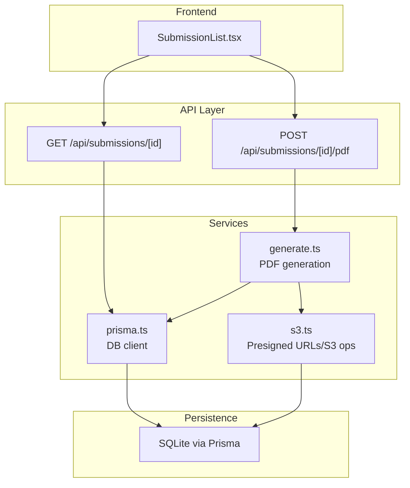
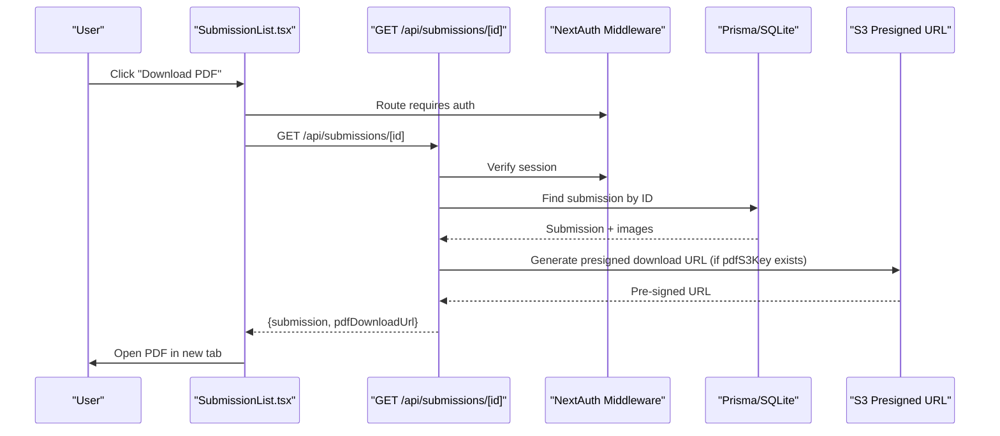
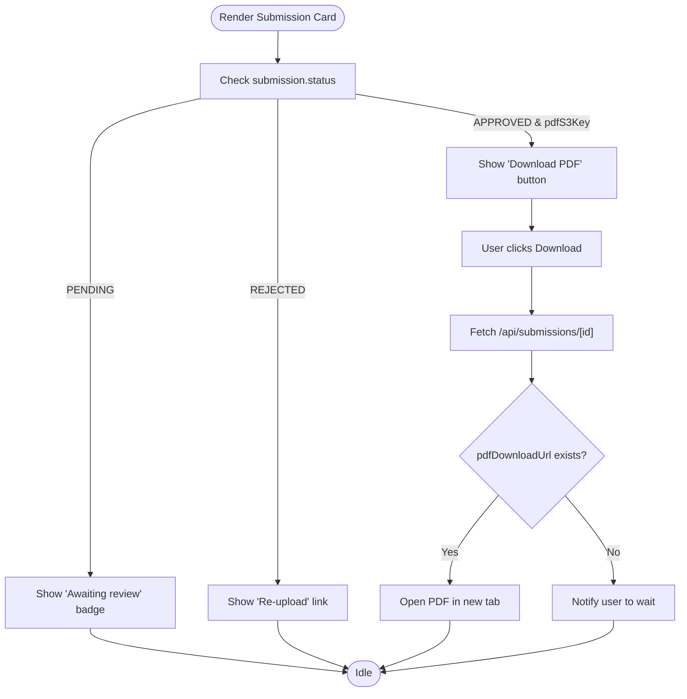
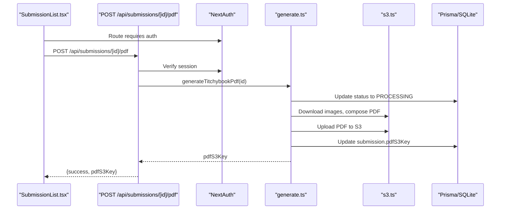
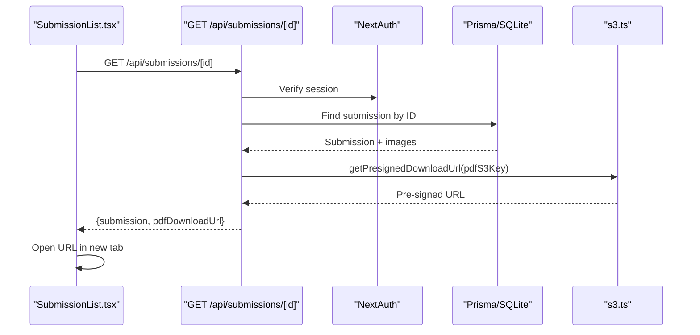
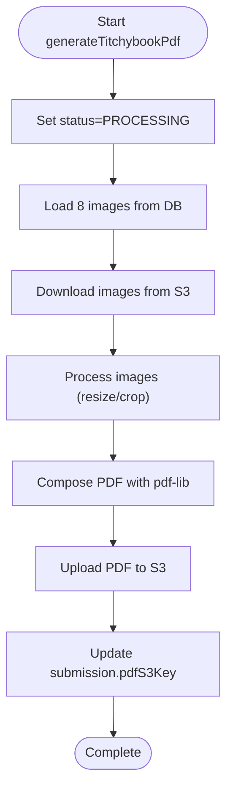
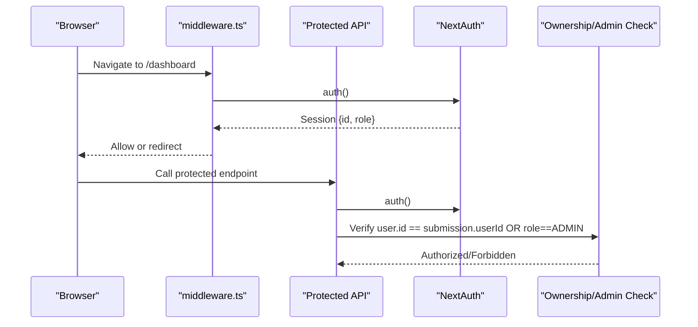
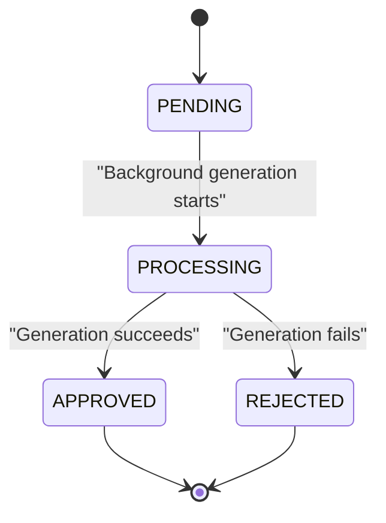
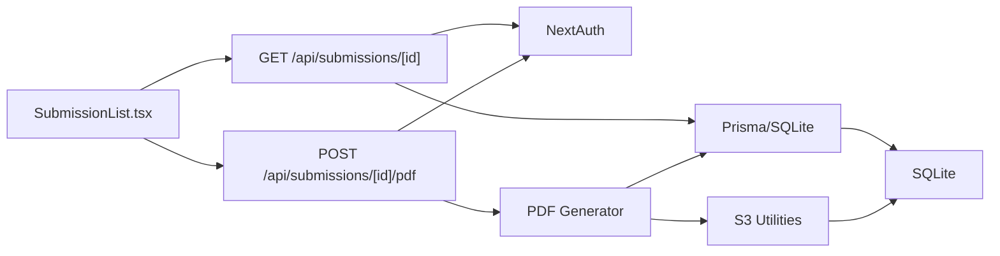

# Download Access and PDF Generation Integration

<cite>
**Referenced Files in This Document**
- [src/app/api/submissions/[id]/pdf/route.ts](file://src/app/api/submissions/[id]/pdf/route.ts)
- [src/app/api/submissions/[id]/route.ts](file://src/app/api/submissions/[id]/route.ts)
- [src/app/api/submissions/route.ts](file://src/app/api/submissions/route.ts)
- [src/components/submissions/SubmissionList.tsx](file://src/components/submissions/SubmissionList.tsx)
- [src/lib/pdf/generate.ts](file://src/lib/pdf/generate.ts)
- [src/lib/s3.ts](file://src/lib/s3.ts)
- [src/lib/constants.ts](file://src/lib/constants.ts)
- [src/lib/prisma.ts](file://src/lib/prisma.ts)
- [src/auth.ts](file://src/auth.ts)
- [src/middleware.ts](file://src/middleware.ts)
- [prisma/schema.prisma](file://prisma/schema.prisma)
- [src/app/(protected)/dashboard/page.tsx](file://src/app/(protected)/dashboard/page.tsx)
</cite>

## Table of Contents
1. [Introduction](#introduction)
2. [Project Structure](#project-structure)
3. [Core Components](#core-components)
4. [Architecture Overview](#architecture-overview)
5. [Detailed Component Analysis](#detailed-component-analysis)
6. [Dependency Analysis](#dependency-analysis)
7. [Performance Considerations](#performance-considerations)
8. [Troubleshooting Guide](#troubleshooting-guide)
9. [Conclusion](#conclusion)

## Introduction
This document explains the download access and PDF generation integration within the user dashboard. It covers the end-to-end workflow from selecting a submission to generating and delivering a PDF, the relationship between submission status and download availability, the API endpoints involved, security controls for authorized access, and user-facing behaviors such as button states, error handling, retry mechanisms, and notifications for processing delays.

## Project Structure
The download and PDF generation flow spans frontend components, API routes, backend services, and persistence/storage layers:
- Frontend: Submission list and card components render submission statuses and download actions.
- Backend APIs: Submission retrieval and PDF generation endpoints.
- Services: PDF generation pipeline and S3 presigned URL utilities.
- Persistence: Prisma-managed SQLite database schema.
- Security: NextAuth-based authentication and middleware protection.

**Diagram sources**
- [src/components/submissions/SubmissionList.tsx:15-118](file://src/components/submissions/SubmissionList.tsx#L15-L118)
- [src/app/api/submissions/[id]/route.ts:6-36](file://src/app/api/submissions/[id]/route.ts#L6-L36)
- [src/app/api/submissions/[id]/pdf/route.ts:5-26](file://src/app/api/submissions/[id]/pdf/route.ts#L5-L26)
- [src/lib/pdf/generate.ts:23-43](file://src/lib/pdf/generate.ts#L23-L43)
- [src/lib/s3.ts:30-36](file://src/lib/s3.ts#L30-L36)
- [src/lib/prisma.ts:1-10](file://src/lib/prisma.ts#L1-L10)
- [prisma/schema.prisma:21-47](file://prisma/schema.prisma#L21-L47)

**Section sources**
- [src/app/(protected)/dashboard/page.tsx:1-20](file://src/app/(protected)/dashboard/page.tsx#L1-L20)
- [src/components/submissions/SubmissionList.tsx:15-118](file://src/components/submissions/SubmissionList.tsx#L15-L118)
- [src/app/api/submissions/[id]/route.ts:6-36](file://src/app/api/submissions/[id]/route.ts#L6-L36)
- [src/app/api/submissions/[id]/pdf/route.ts:5-26](file://src/app/api/submissions/[id]/pdf/route.ts#L5-L26)
- [src/lib/pdf/generate.ts:23-43](file://src/lib/pdf/generate.ts#L23-L43)
- [src/lib/s3.ts:30-36](file://src/lib/s3.ts#L30-L36)
- [src/lib/prisma.ts:1-10](file://src/lib/prisma.ts#L1-L10)
- [prisma/schema.prisma:21-47](file://prisma/schema.prisma#L21-L47)

## Core Components
- SubmissionList renders the user's submissions and controls download actions.
- Submission detail API returns submission metadata and a presigned PDF download URL when available.
- PDF generation endpoint triggers PDF creation and returns the generated S3 key.
- PDF generator orchestrates fetching images, processing, composing, uploading, and updating the submission.
- S3 utilities provide presigned URLs for secure access and direct downloads.
- Authentication ensures only logged-in users can access protected routes and download PDFs.

**Section sources**
- [src/components/submissions/SubmissionList.tsx:62-118](file://src/components/submissions/SubmissionList.tsx#L62-L118)
- [src/app/api/submissions/[id]/route.ts:30-35](file://src/app/api/submissions/[id]/route.ts#L30-L35)
- [src/app/api/submissions/[id]/pdf/route.ts:16-25](file://src/app/api/submissions/[id]/pdf/route.ts#L16-L25)
- [src/lib/pdf/generate.ts:23-43](file://src/lib/pdf/generate.ts#L23-L43)
- [src/lib/s3.ts:30-36](file://src/lib/s3.ts#L30-L36)
- [src/auth.ts:27-79](file://src/auth.ts#L27-L79)

## Architecture Overview
The system enforces authentication at the middleware level and protects sensitive endpoints. The frontend requests submission details and handles download availability based on status and stored S3 keys. PDF generation runs asynchronously after submission creation and can also be triggered manually via the PDF endpoint.

**Diagram sources**
- [src/components/submissions/SubmissionList.tsx:65-76](file://src/components/submissions/SubmissionList.tsx#L65-L76)
- [src/app/api/submissions/[id]/route.ts:6-36](file://src/app/api/submissions/[id]/route.ts#L6-L36)
- [src/middleware.ts:1-6](file://src/middleware.ts#L1-L6)
- [src/lib/s3.ts:30-36](file://src/lib/s3.ts#L30-L36)
- [prisma/schema.prisma:21-47](file://prisma/schema.prisma#L21-L47)

## Detailed Component Analysis

### Submission List and Download Button States
- The list displays submissions with status badges and contextual actions.
- Download button appears only when status is APPROVED and a PDF S3 key exists.
- Pending submissions show an informational badge; rejected submissions offer a re-upload action.
- The button is disabled during loading to prevent duplicate requests.

**Diagram sources**
- [src/components/submissions/SubmissionList.tsx:95-114](file://src/components/submissions/SubmissionList.tsx#L95-L114)
- [src/app/api/submissions/[id]/route.ts:30-35](file://src/app/api/submissions/[id]/route.ts#L30-L35)

**Section sources**
- [src/components/submissions/SubmissionList.tsx:62-118](file://src/components/submissions/SubmissionList.tsx#L62-L118)
- [src/app/api/submissions/[id]/route.ts:30-35](file://src/app/api/submissions/[id]/route.ts#L30-L35)

### PDF Generation Endpoint
- POST /api/submissions/[id]/pdf validates authentication, then triggers PDF generation.
- On success, returns the generated S3 key; on failure, returns a 500 error with a generic message.

**Diagram sources**
- [src/app/api/submissions/[id]/pdf/route.ts:5-26](file://src/app/api/submissions/[id]/pdf/route.ts#L5-L26)
- [src/lib/pdf/generate.ts:23-43](file://src/lib/pdf/generate.ts#L23-L43)
- [src/lib/s3.ts:30-36](file://src/lib/s3.ts#L30-L36)
- [prisma/schema.prisma:25-26](file://prisma/schema.prisma#L25-L26)

**Section sources**
- [src/app/api/submissions/[id]/pdf/route.ts:5-26](file://src/app/api/submissions/[id]/pdf/route.ts#L5-L26)
- [src/lib/pdf/generate.ts:23-43](file://src/lib/pdf/generate.ts#L23-L43)

### Submission Retrieval and Download Availability
- GET /api/submissions/[id] enforces authentication and ownership/admin checks.
- Returns submission data and a presigned download URL if a PDF S3 key exists.
- The frontend uses this URL to open the PDF in a new browser tab.

**Diagram sources**
- [src/app/api/submissions/[id]/route.ts:6-36](file://src/app/api/submissions/[id]/route.ts#L6-L36)
- [src/lib/s3.ts:30-36](file://src/lib/s3.ts#L30-L36)

**Section sources**
- [src/app/api/submissions/[id]/route.ts:6-36](file://src/app/api/submissions/[id]/route.ts#L6-L36)
- [src/lib/s3.ts:30-36](file://src/lib/s3.ts#L30-L36)

### PDF Generation Pipeline
- Sets submission status to PROCESSING to prevent concurrent generation.
- Loads submission images from the database and downloads them from S3.
- Processes images and composes them into a single A4 landscape PDF.
- Uploads the PDF to S3 and updates the submission with the S3 key.
- Asynchronous background generation is initiated upon submission creation.

**Diagram sources**
- [src/lib/pdf/generate.ts:23-43](file://src/lib/pdf/generate.ts#L23-L43)
- [src/lib/s3.ts:38-50](file://src/lib/s3.ts#L38-L50)
- [prisma/schema.prisma:25-26](file://prisma/schema.prisma#L25-L26)

**Section sources**
- [src/lib/pdf/generate.ts:23-43](file://src/lib/pdf/generate.ts#L23-L43)
- [src/lib/s3.ts:38-50](file://src/lib/s3.ts#L38-L50)

### Security and Authorization
- Authentication: NextAuth with JWT strategy provides session access in API routes.
- Middleware: Protects routes under /dashboard, /create, and /admin.
- Ownership checks: Submission retrieval enforces that the requesting user owns the submission or is an admin.
- Unauthorized responses: 401 for missing/invalid sessions, 403 for forbidden access.

**Diagram sources**
- [src/middleware.ts:1-6](file://src/middleware.ts#L1-L6)
- [src/auth.ts:27-79](file://src/auth.ts#L27-L79)
- [src/app/api/submissions/[id]/route.ts:26-28](file://src/app/api/submissions/[id]/route.ts#L26-L28)

**Section sources**
- [src/middleware.ts:1-6](file://src/middleware.ts#L1-L6)
- [src/auth.ts:27-79](file://src/auth.ts#L27-L79)
- [src/app/api/submissions/[id]/route.ts:26-28](file://src/app/api/submissions/[id]/route.ts#L26-L28)

### Submission Lifecycle and PDF Availability
- Status transitions: PENDING → APPROVED or REJECTED; PROCESSING is used internally during generation.
- PDF availability: Only APPROVED submissions with a stored pdfS3Key allow download.
- Retry mechanism: Users can trigger PDF generation via the PDF endpoint; the backend returns the S3 key on success.
- Notifications: The frontend informs users to wait while PDFs are being processed.

**Diagram sources**
- [src/lib/constants.ts:6-11](file://src/lib/constants.ts#L6-L11)
- [src/lib/pdf/generate.ts:27-30](file://src/lib/pdf/generate.ts#L27-L30)
- [src/app/api/submissions/[id]/route.ts:95-103](file://src/app/api/submissions/[id]/route.ts#L95-L103)

**Section sources**
- [src/lib/constants.ts:6-11](file://src/lib/constants.ts#L6-L11)
- [src/lib/pdf/generate.ts:27-30](file://src/lib/pdf/generate.ts#L27-L30)
- [src/app/api/submissions/[id]/route.ts:95-103](file://src/app/api/submissions/[id]/route.ts#L95-L103)

## Dependency Analysis
- Frontend depends on API routes for data and actions.
- API routes depend on authentication, Prisma, and S3 utilities.
- PDF generation depends on image processing, PDF composition, and S3 upload/download.
- Database schema defines submission status and optional PDF key fields.

**Diagram sources**
- [src/components/submissions/SubmissionList.tsx:62-118](file://src/components/submissions/SubmissionList.tsx#L62-L118)
- [src/app/api/submissions/[id]/route.ts:6-36](file://src/app/api/submissions/[id]/route.ts#L6-L36)
- [src/app/api/submissions/[id]/pdf/route.ts:5-26](file://src/app/api/submissions/[id]/pdf/route.ts#L5-L26)
- [src/lib/pdf/generate.ts:23-43](file://src/lib/pdf/generate.ts#L23-L43)
- [src/lib/s3.ts:30-36](file://src/lib/s3.ts#L30-L36)
- [src/lib/prisma.ts:1-10](file://src/lib/prisma.ts#L1-L10)
- [prisma/schema.prisma:21-47](file://prisma/schema.prisma#L21-L47)

**Section sources**
- [src/components/submissions/SubmissionList.tsx:62-118](file://src/components/submissions/SubmissionList.tsx#L62-L118)
- [src/app/api/submissions/[id]/route.ts:6-36](file://src/app/api/submissions/[id]/route.ts#L6-L36)
- [src/app/api/submissions/[id]/pdf/route.ts:5-26](file://src/app/api/submissions/[id]/pdf/route.ts#L5-L26)
- [src/lib/pdf/generate.ts:23-43](file://src/lib/pdf/generate.ts#L23-L43)
- [src/lib/s3.ts:30-36](file://src/lib/s3.ts#L30-L36)
- [src/lib/prisma.ts:1-10](file://src/lib/prisma.ts#L1-L10)
- [prisma/schema.prisma:21-47](file://prisma/schema.prisma#L21-L47)

## Performance Considerations
- Background generation: PDF generation is started asynchronously after submission creation to avoid blocking the initial response.
- Parallel image downloads: The generator downloads all images concurrently to reduce total latency.
- Presigned URLs: Using signed URLs avoids proxying large PDFs through the application server.
- Caching and retries: The frontend can poll or refresh the submission endpoint to detect when a PDF becomes available after processing.

[No sources needed since this section provides general guidance]

## Troubleshooting Guide
- Unauthorized access errors: Ensure the user is logged in and that the middleware is protecting the route.
- Forbidden access errors: Verify the requesting user owns the submission or has admin privileges.
- Not found errors: Confirm the submission ID exists and belongs to the current user.
- PDF generation failures: The PDF endpoint returns a 500 error on failure; check server logs for details.
- Download URL not available: The submission must be APPROVED and have a stored pdfS3Key; otherwise, the frontend hides the download button.

**Section sources**
- [src/app/api/submissions/[id]/route.ts:10-28](file://src/app/api/submissions/[id]/route.ts#L10-L28)
- [src/app/api/submissions/[id]/pdf/route.ts:10-12](file://src/app/api/submissions/[id]/pdf/route.ts#L10-L12)
- [src/app/api/submissions/[id]/pdf/route.ts:19-25](file://src/app/api/submissions/[id]/pdf/route.ts#L19-L25)
- [src/components/submissions/SubmissionList.tsx:95-103](file://src/components/submissions/SubmissionList.tsx#L95-L103)

## Conclusion
The download access and PDF generation integration is designed around strict authentication, clear submission status-driven UI, and asynchronous PDF generation. Users can trigger generation manually or rely on background processing, with presigned URLs enabling secure, efficient PDF delivery. The system’s architecture balances user experience with robust security and maintainable service boundaries.