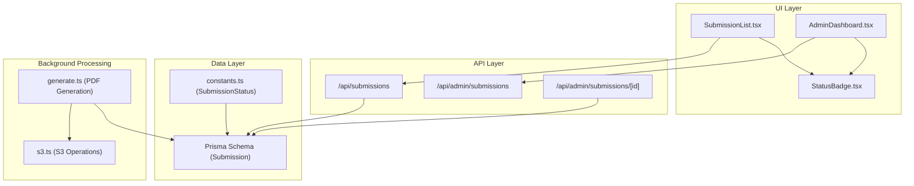
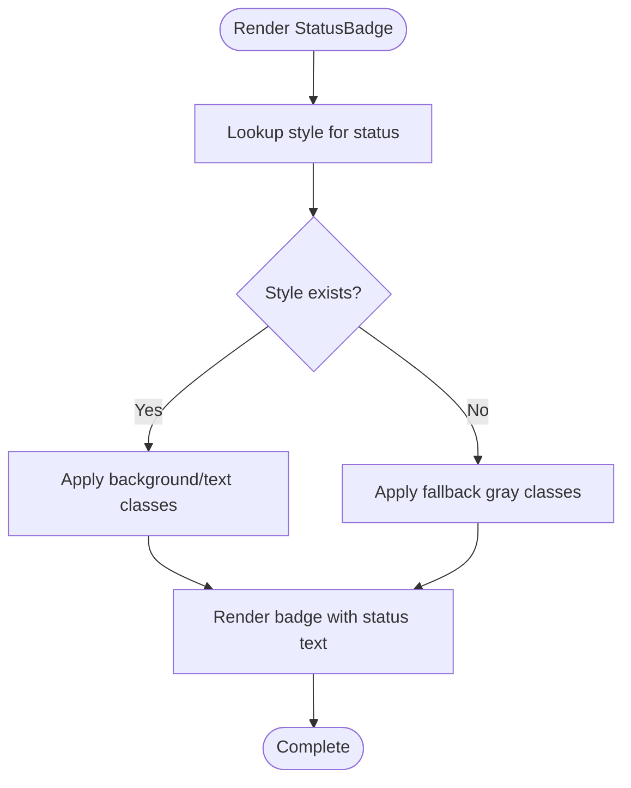
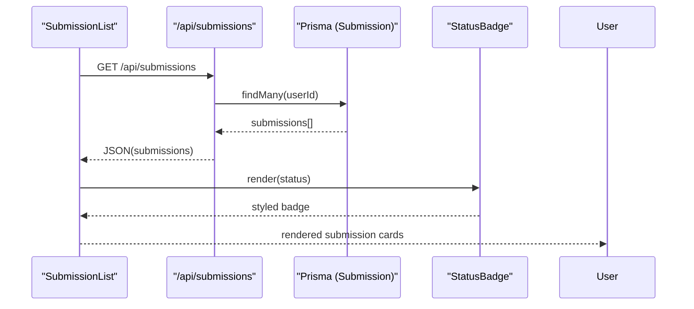
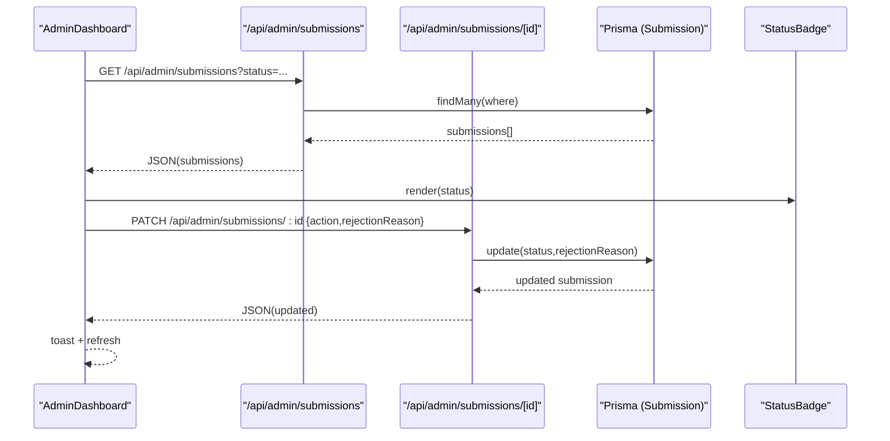
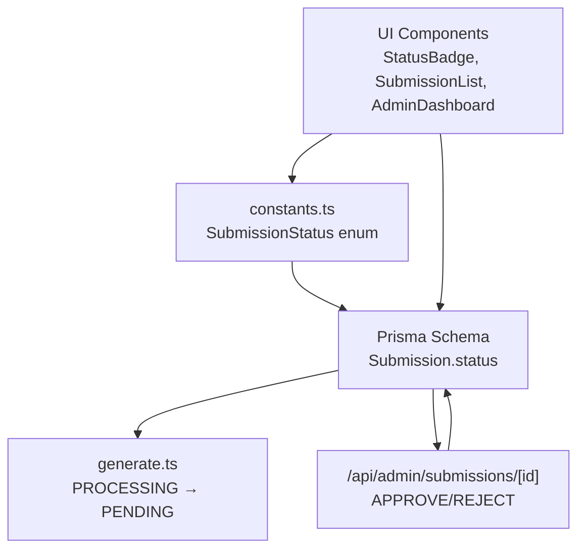
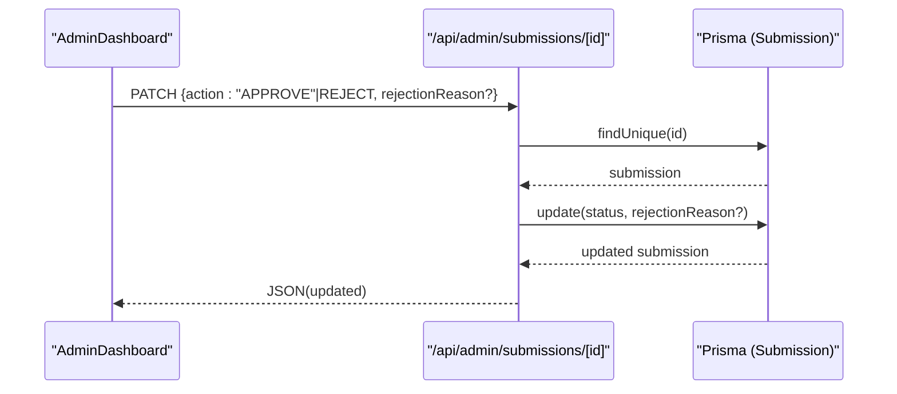
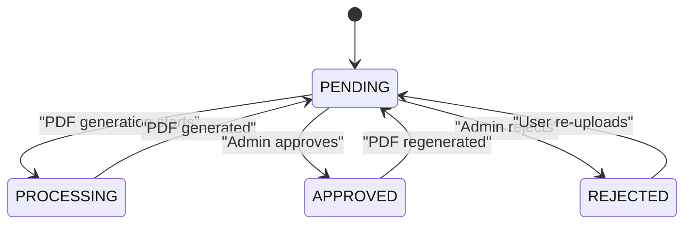
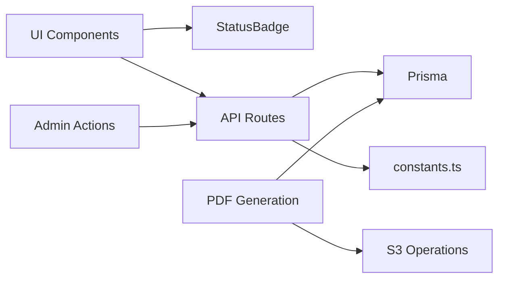

# Status Monitoring and Visual Indicators

<cite>
**Referenced Files in This Document**
- [StatusBadge.tsx](file://src/components/submissions/StatusBadge.tsx)
- [SubmissionList.tsx](file://src/components/submissions/SubmissionList.tsx)
- [AdminDashboard.tsx](file://src/components/admin/AdminDashboard.tsx)
- [schema.prisma](file://prisma/schema.prisma)
- [constants.ts](file://src/lib/constants.ts)
- [generate.ts](file://src/lib/pdf/generate.ts)
- [s3.ts](file://src/lib/s3.ts)
- [route.ts](file://src/app/api/admin/submissions/[id]/route.ts)
- [route.ts](file://src/app/api/admin/submissions/route.ts)
- [route.ts](file://src/app/api/submissions/route.ts)
</cite>

## Table of Contents
1. [Introduction](#introduction)
2. [Project Structure](#project-structure)
3. [Core Components](#core-components)
4. [Architecture Overview](#architecture-overview)
5. [Detailed Component Analysis](#detailed-component-analysis)
6. [Dependency Analysis](#dependency-analysis)
7. [Performance Considerations](#performance-considerations)
8. [Troubleshooting Guide](#troubleshooting-guide)
9. [Accessibility Guidelines](#accessibility-guidelines)
10. [Conclusion](#conclusion)

## Introduction
This document provides comprehensive guidance for the status monitoring and visual indicator system used throughout the Titchybook application. It focuses on the StatusBadge component, which displays color-coded status indicators for submissions, and explains how status values flow from the database to the user interface. The document covers status definitions, visual treatments, integration points, status transitions during the submission lifecycle, and accessibility considerations for consistent status messaging across the application.

## Project Structure
The status monitoring system spans several layers:
- UI components: StatusBadge and SubmissionList display submission statuses to users.
- Admin dashboard: AdminDashboard allows administrators to update submission statuses.
- API routes: Server-side endpoints manage status updates and data retrieval.
- Database schema: Prisma defines the Submission model and its status field.
- Constants: Type-safe status definitions and validation helpers.

**Diagram sources**
- [StatusBadge.tsx:1-18](file://src/components/submissions/StatusBadge.tsx#L1-L18)
- [SubmissionList.tsx:1-119](file://src/components/submissions/SubmissionList.tsx#L1-L119)
- [AdminDashboard.tsx:1-168](file://src/components/admin/AdminDashboard.tsx#L1-L168)
- [route.ts:1-96](file://src/app/api/submissions/route.ts#L1-L96)
- [route.ts:1-38](file://src/app/api/admin/submissions/route.ts#L1-L38)
- [route.ts:1-62](file://src/app/api/admin/submissions/[id]/route.ts#L1-L62)
- [schema.prisma:21-33](file://prisma/schema.prisma#L21-L33)
- [constants.ts:6-11](file://src/lib/constants.ts#L6-L11)
- [generate.ts:23-111](file://src/lib/pdf/generate.ts#L23-L111)
- [s3.ts:1-81](file://src/lib/s3.ts#L1-L81)

**Section sources**
- [StatusBadge.tsx:1-18](file://src/components/submissions/StatusBadge.tsx#L1-L18)
- [SubmissionList.tsx:1-119](file://src/components/submissions/SubmissionList.tsx#L1-L119)
- [AdminDashboard.tsx:1-168](file://src/components/admin/AdminDashboard.tsx#L1-L168)
- [schema.prisma:21-33](file://prisma/schema.prisma#L21-L33)
- [constants.ts:6-11](file://src/lib/constants.ts#L6-L11)
- [generate.ts:23-111](file://src/lib/pdf/generate.ts#L23-L111)
- [s3.ts:1-81](file://src/lib/s3.ts#L1-L81)
- [route.ts:1-96](file://src/app/api/submissions/route.ts#L1-L96)
- [route.ts:1-38](file://src/app/api/admin/submissions/route.ts#L1-L38)
- [route.ts:1-62](file://src/app/api/admin/submissions/[id]/route.ts#L1-L62)

## Core Components
This section documents the StatusBadge component and its integration with the broader system.

### StatusBadge Component
The StatusBadge component renders a small, rounded badge displaying the current status with color-coded styling. It accepts a status string and applies predefined styles based on the value.

- Props:
  - status: string representing the submission status.
- Behavior:
  - Uses a style mapping to apply background and text colors for PENDING, APPROVED, and REJECTED.
  - Falls back to neutral gray styling for unknown status values.
  - Renders the status text inside a compact inline element.

**Diagram sources**
- [StatusBadge.tsx:1-18](file://src/components/submissions/StatusBadge.tsx#L1-L18)

**Section sources**
- [StatusBadge.tsx:1-18](file://src/components/submissions/StatusBadge.tsx#L1-L18)

### SubmissionList Integration
SubmissionList fetches user submissions and renders each submission card with a StatusBadge. It also displays contextual actions and messages based on the current status.

- Data fetching:
  - Retrieves submissions via the submissions API endpoint.
- Rendering:
  - Displays StatusBadge alongside submission metadata.
  - Shows rejection reason when status is REJECTED.
  - Provides action buttons based on status (download PDF for APPROVED, re-upload for REJECTED, awaiting review message for PENDING).

**Diagram sources**
- [SubmissionList.tsx:19-24](file://src/components/submissions/SubmissionList.tsx#L19-L24)
- [SubmissionList.tsx:55-57](file://src/components/submissions/SubmissionList.tsx#L55-L57)
- [route.ts:20-33](file://src/app/api/submissions/route.ts#L20-L33)
- [schema.prisma:21-33](file://prisma/schema.prisma#L21-L33)
- [StatusBadge.tsx:1-18](file://src/components/submissions/StatusBadge.tsx#L1-L18)

**Section sources**
- [SubmissionList.tsx:1-119](file://src/components/submissions/SubmissionList.tsx#L1-L119)
- [route.ts:20-33](file://src/app/api/submissions/route.ts#L20-L33)
- [schema.prisma:21-33](file://prisma/schema.prisma#L21-L33)

### AdminDashboard Integration
AdminDashboard displays submissions for administrators with filtering and status controls. It renders StatusBadge in the table and enables status updates.

- Filtering:
  - Filters submissions by status via query parameters.
- Actions:
  - Approve or reject submissions, prompting for a rejection reason when rejecting.
- Refresh:
  - Triggers a refresh after successful actions to reflect updated statuses.

**Diagram sources**
- [AdminDashboard.tsx:27-41](file://src/components/admin/AdminDashboard.tsx#L27-L41)
- [AdminDashboard.tsx:43-62](file://src/components/admin/AdminDashboard.tsx#L43-L62)
- [route.ts:6-24](file://src/app/api/admin/submissions/route.ts#L6-L24)
- [route.ts:12-55](file://src/app/api/admin/submissions/[id]/route.ts#L12-L55)
- [schema.prisma:21-33](file://prisma/schema.prisma#L21-L33)
- [StatusBadge.tsx:1-18](file://src/components/submissions/StatusBadge.tsx#L1-L18)

**Section sources**
- [AdminDashboard.tsx:1-168](file://src/components/admin/AdminDashboard.tsx#L1-L168)
- [route.ts:6-24](file://src/app/api/admin/submissions/route.ts#L6-L24)
- [route.ts:12-55](file://src/app/api/admin/submissions/[id]/route.ts#L12-L55)

## Architecture Overview
The status system integrates UI rendering, API endpoints, database persistence, and background processing:

- Status definitions:
  - Defined as an enum in constants for type safety.
- Database storage:
  - Submission model stores status as a string with a default value.
- Background processing:
  - PDF generation sets status to PROCESSING while generating, then resets to PENDING upon completion.
- Admin workflow:
  - Administrators can approve or reject submissions, updating status accordingly.

**Diagram sources**
- [constants.ts:6-11](file://src/lib/constants.ts#L6-L11)
- [schema.prisma:21-33](file://prisma/schema.prisma#L21-L33)
- [generate.ts:23-111](file://src/lib/pdf/generate.ts#L23-L111)
- [route.ts:12-55](file://src/app/api/admin/submissions/[id]/route.ts#L12-L55)
- [StatusBadge.tsx:1-18](file://src/components/submissions/StatusBadge.tsx#L1-L18)
- [SubmissionList.tsx:1-119](file://src/components/submissions/SubmissionList.tsx#L1-L119)
- [AdminDashboard.tsx:1-168](file://src/components/admin/AdminDashboard.tsx#L1-L168)

**Section sources**
- [constants.ts:6-11](file://src/lib/constants.ts#L6-L11)
- [schema.prisma:21-33](file://prisma/schema.prisma#L21-L33)
- [generate.ts:23-111](file://src/lib/pdf/generate.ts#L23-L111)
- [route.ts:12-55](file://src/app/api/admin/submissions/[id]/route.ts#L12-L55)

## Detailed Component Analysis

### Status Value Definitions and Visual Treatments
The system defines four status values:
- PENDING: Default status for new submissions.
- APPROVED: Approved by administrators; enables PDF download.
- REJECTED: Rejected by administrators; provides re-upload option.
- PROCESSING: Internal state during PDF generation.

Visual treatments:
- PENDING: Yellow background and text.
- APPROVED: Green background and text.
- REJECTED: Red background and text.
- Unknown: Gray background and text.

Integration points:
- UI rendering via StatusBadge.
- Database persistence in the Submission model.
- Admin actions via API endpoints.
- Background processing updates status to PENDING after generation.

**Section sources**
- [constants.ts:6-11](file://src/lib/constants.ts#L6-L11)
- [schema.prisma:25-25](file://prisma/schema.prisma#L25-L25)
- [StatusBadge.tsx:2-6](file://src/components/submissions/StatusBadge.tsx#L2-L6)
- [SubmissionList.tsx:88-92](file://src/components/submissions/SubmissionList.tsx#L88-L92)
- [SubmissionList.tsx:112-114](file://src/components/submissions/SubmissionList.tsx#L112-L114)
- [AdminDashboard.tsx:139-157](file://src/components/admin/AdminDashboard.tsx#L139-L157)
- [generate.ts:26-30](file://src/lib/pdf/generate.ts#L26-L30)
- [generate.ts:102-108](file://src/lib/pdf/generate.ts#L102-L108)

### Database Integration and Status Persistence
The Submission model stores status as a string with a default value of PENDING. Administrators can update status via PATCH requests to the admin submissions endpoint, which validates actions and updates the database accordingly.

**Diagram sources**
- [AdminDashboard.tsx:43-62](file://src/components/admin/AdminDashboard.tsx#L43-L62)
- [route.ts:12-55](file://src/app/api/admin/submissions/[id]/route.ts#L12-L55)
- [schema.prisma:21-33](file://prisma/schema.prisma#L21-L33)

**Section sources**
- [schema.prisma:21-33](file://prisma/schema.prisma#L21-L33)
- [route.ts:12-55](file://src/app/api/admin/submissions/[id]/route.ts#L12-L55)

### Status Transitions Throughout the Lifecycle
The submission lifecycle includes the following transitions:

- Creation:
  - New submissions are created with status PENDING.
- Background processing:
  - PDF generation sets status to PROCESSING while generating.
  - Upon completion, status resets to PENDING for admin review.
- Administrator review:
  - APPROVE updates status to APPROVED and enables PDF download.
  - REJECT updates status to REJECTED and optionally records a rejection reason.
- User actions:
  - REJECTED submissions show a re-upload option.
  - APPROVED submissions enable PDF download.

**Diagram sources**
- [constants.ts:6-11](file://src/lib/constants.ts#L6-L11)
- [generate.ts:26-30](file://src/lib/pdf/generate.ts#L26-L30)
- [generate.ts:102-108](file://src/lib/pdf/generate.ts#L102-L108)
- [route.ts:44-53](file://src/app/api/admin/submissions/[id]/route.ts#L44-L53)
- [SubmissionList.tsx:95-111](file://src/components/submissions/SubmissionList.tsx#L95-L111)

**Section sources**
- [generate.ts:26-30](file://src/lib/pdf/generate.ts#L26-L30)
- [generate.ts:102-108](file://src/lib/pdf/generate.ts#L102-L108)
- [route.ts:44-53](file://src/app/api/admin/submissions/[id]/route.ts#L44-L53)
- [SubmissionList.tsx:95-111](file://src/components/submissions/SubmissionList.tsx#L95-L111)

### Tooltip Enhancements
While the current StatusBadge does not include tooltips, adding accessible tooltips can improve clarity. Recommended approach:
- Use aria-label on the badge element to provide a descriptive label.
- Consider adding a visually hidden tooltip that appears on focus or hover for additional context.

**Section sources**
- [StatusBadge.tsx:8-16](file://src/components/submissions/StatusBadge.tsx#L8-L16)

## Dependency Analysis
The status system exhibits clear separation of concerns:
- UI components depend on StatusBadge for rendering.
- API routes depend on Prisma for data access and constants for validation.
- Background processing depends on S3 operations and Prisma updates.
- Admin actions depend on user roles and status validation.

**Diagram sources**
- [StatusBadge.tsx:1-18](file://src/components/submissions/StatusBadge.tsx#L1-L18)
- [SubmissionList.tsx:1-119](file://src/components/submissions/SubmissionList.tsx#L1-L119)
- [AdminDashboard.tsx:1-168](file://src/components/admin/AdminDashboard.tsx#L1-L168)
- [route.ts:1-96](file://src/app/api/submissions/route.ts#L1-L96)
- [route.ts:1-38](file://src/app/api/admin/submissions/route.ts#L1-L38)
- [route.ts:1-62](file://src/app/api/admin/submissions/[id]/route.ts#L1-L62)
- [constants.ts:6-11](file://src/lib/constants.ts#L6-L11)
- [schema.prisma:21-33](file://prisma/schema.prisma#L21-L33)
- [generate.ts:23-111](file://src/lib/pdf/generate.ts#L23-L111)
- [s3.ts:1-81](file://src/lib/s3.ts#L1-L81)

**Section sources**
- [StatusBadge.tsx:1-18](file://src/components/submissions/StatusBadge.tsx#L1-L18)
- [SubmissionList.tsx:1-119](file://src/components/submissions/SubmissionList.tsx#L1-L119)
- [AdminDashboard.tsx:1-168](file://src/components/admin/AdminDashboard.tsx#L1-L168)
- [route.ts:1-96](file://src/app/api/submissions/route.ts#L1-L96)
- [route.ts:1-38](file://src/app/api/admin/submissions/route.ts#L1-L38)
- [route.ts:1-62](file://src/app/api/admin/submissions/[id]/route.ts#L1-L62)
- [constants.ts:6-11](file://src/lib/constants.ts#L6-L11)
- [schema.prisma:21-33](file://prisma/schema.prisma#L21-L33)
- [generate.ts:23-111](file://src/lib/pdf/generate.ts#L23-L111)
- [s3.ts:1-81](file://src/lib/s3.ts#L1-L81)

## Performance Considerations
- Asynchronous PDF generation:
  - PDF generation runs in the background to avoid blocking submission creation.
  - Status transitions to PROCESSING prevent concurrent generation attempts.
- Efficient UI updates:
  - AdminDashboard uses a refresh key to force re-fetch after actions, ensuring immediate UI consistency.
- Network efficiency:
  - Presigned URLs for PDF downloads reduce server bandwidth and latency.

[No sources needed since this section provides general guidance]

## Troubleshooting Guide
Common issues and resolutions:
- Status not updating:
  - Verify admin role and permissions for the admin submissions endpoint.
  - Confirm rejection reason is optional when rejecting submissions.
- PDF not downloadable:
  - Ensure pdfS3Key is present and accessible via presigned URLs.
  - Check S3 bucket configuration and credentials.
- Unexpected status values:
  - Validate status values against the SubmissionStatus enum.
  - Ensure database defaults align with expected initial status.

**Section sources**
- [route.ts:16-19](file://src/app/api/admin/submissions/[id]/route.ts#L16-L19)
- [route.ts:24-32](file://src/app/api/admin/submissions/[id]/route.ts#L24-L32)
- [s3.ts:30-36](file://src/lib/s3.ts#L30-L36)
- [constants.ts:6-11](file://src/lib/constants.ts#L6-L11)
- [schema.prisma:25-25](file://prisma/schema.prisma#L25-L25)

## Accessibility Guidelines
To ensure consistent and accessible status messaging:
- Color contrast:
  - Maintain sufficient contrast between background and text colors for PENDING, APPROVED, and REJECTED states.
- Text alternatives:
  - Use aria-label on status badges to provide descriptive labels for screen readers.
- Keyboard navigation:
  - Ensure status badges are focusable and actionable where applicable.
- Consistent messaging:
  - Use standardized status labels and tooltips to avoid ambiguity.
- Dynamic updates:
  - Announce status changes to assistive technologies when statuses are updated via admin actions.

[No sources needed since this section provides general guidance]

## Conclusion
The status monitoring and visual indicator system provides clear, color-coded feedback for submission states across the Titchybook application. The StatusBadge component, combined with robust API endpoints and database persistence, ensures reliable status tracking from submission creation through administrator review and user actions. By following the guidelines outlined here, developers can maintain consistency, accessibility, and clarity in status communication throughout the application.