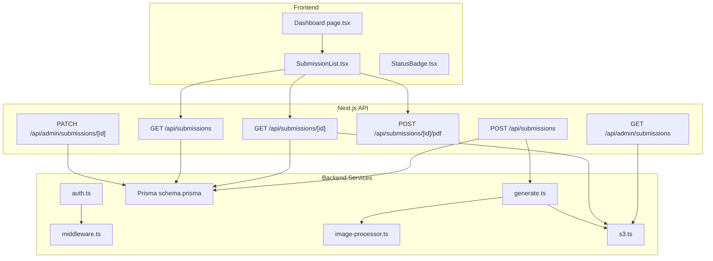
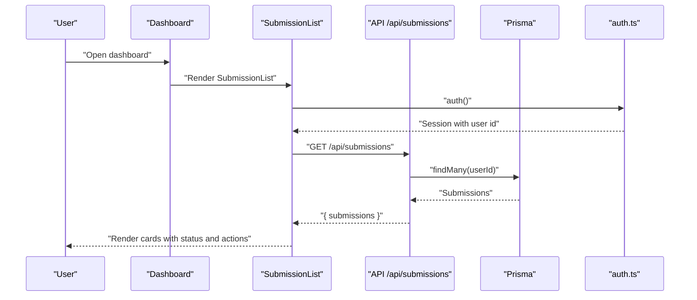
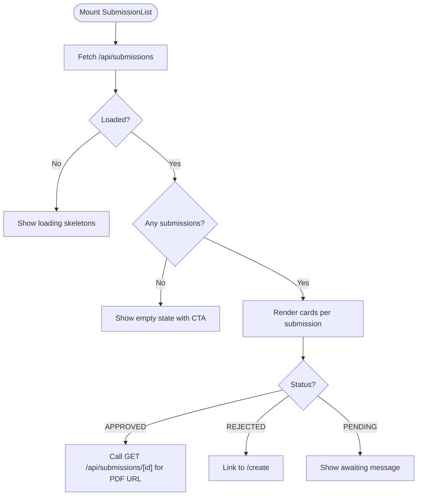
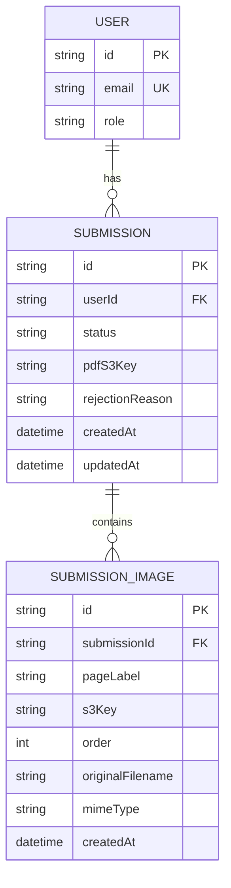
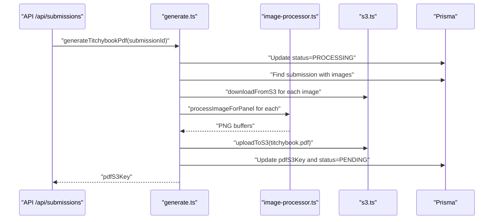
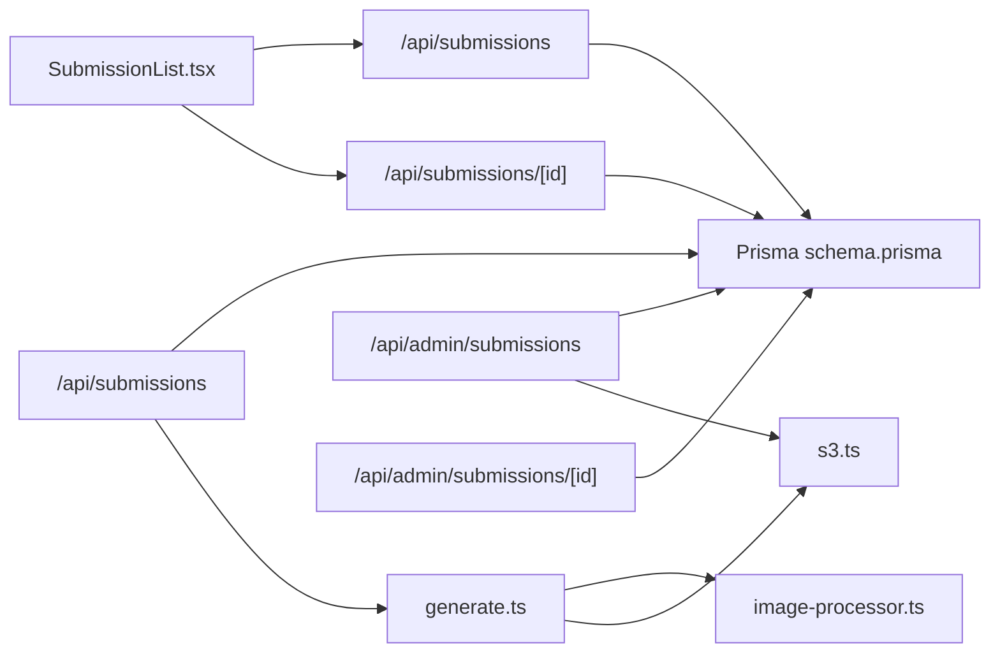

# Submission Tracking and Management

<cite>
**Referenced Files in This Document**
- [SubmissionList.tsx](file://src/components/submissions/SubmissionList.tsx)
- [StatusBadge.tsx](file://src/components/submissions/StatusBadge.tsx)
- [route.ts](file://src/app/api/submissions/route.ts)
- [route.ts](file://src/app/api/submissions/[id]/route.ts)
- [route.ts](file://src/app/api/admin/submissions/route.ts)
- [route.ts](file://src/app/api/submissions/[id]/pdf/route.ts)
- [generate.ts](file://src/lib/pdf/generate.ts)
- [image-processor.ts](file://src/lib/pdf/image-processor.ts)
- [s3.ts](file://src/lib/s3.ts)
- [constants.ts](file://src/lib/constants.ts)
- [schema.prisma](file://prisma/schema.prisma)
- [page.tsx](file://src/app/(protected)/dashboard/page.tsx)
- [auth.ts](file://src/auth.ts)
- [middleware.ts](file://src/middleware.ts)
</cite>

## Table of Contents
1. [Introduction](#introduction)
2. [Project Structure](#project-structure)
3. [Core Components](#core-components)
4. [Architecture Overview](#architecture-overview)
5. [Detailed Component Analysis](#detailed-component-analysis)
6. [Dependency Analysis](#dependency-analysis)
7. [Performance Considerations](#performance-considerations)
8. [Troubleshooting Guide](#troubleshooting-guide)
9. [Conclusion](#conclusion)

## Introduction
This document explains the submission tracking and management system for Titchybook. It focuses on how users view their submission history, create new submissions, and manage them via the SubmissionList component and backend APIs. It also documents the submission data model, status lifecycle, PDF generation, and permission controls ensuring users can only access and modify their own submissions.

## Project Structure
The submission system spans frontend React components, Next.js App Router API handlers, Prisma ORM models, and AWS S3 integration for uploads/downloads. The protected dashboard page renders the SubmissionList component, which fetches and displays the current user’s submissions.

**Diagram sources**
- [SubmissionList.tsx:15-60](file://src/components/submissions/SubmissionList.tsx#L15-L60)
- [StatusBadge.tsx:1-18](file://src/components/submissions/StatusBadge.tsx#L1-L18)
- [page.tsx](file://src/app/(protected)/dashboard/page.tsx#L1-L20)
- [route.ts:20-33](file://src/app/api/submissions/route.ts#L20-L33)
- [route.ts:6-36](file://src/app/api/submissions/[id]/route.ts#L6-L36)
- [route.ts:5-26](file://src/app/api/submissions/[id]/pdf/route.ts#L5-L26)
- [route.ts:6-37](file://src/app/api/admin/submissions/route.ts#L6-L37)
- [route.ts:12-62](file://src/app/api/admin/submissions/[id]/route.ts#L12-L62)
- [generate.ts:23-111](file://src/lib/pdf/generate.ts#L23-L111)
- [image-processor.ts:9-29](file://src/lib/pdf/image-processor.ts#L9-L29)
- [s3.ts:1-81](file://src/lib/s3.ts#L1-L81)
- [schema.prisma:21-47](file://prisma/schema.prisma#L21-L47)
- [auth.ts:27-79](file://src/auth.ts#L27-L79)
- [middleware.ts:1-6](file://src/middleware.ts#L1-L6)

**Section sources**
- [SubmissionList.tsx:15-60](file://src/components/submissions/SubmissionList.tsx#L15-L60)
- [page.tsx](file://src/app/(protected)/dashboard/page.tsx#L1-L20)
- [route.ts:20-33](file://src/app/api/submissions/route.ts#L20-L33)
- [route.ts:6-36](file://src/app/api/submissions/[id]/route.ts#L6-L36)
- [route.ts:6-37](file://src/app/api/admin/submissions/route.ts#L6-L37)
- [route.ts:5-26](file://src/app/api/submissions/[id]/pdf/route.ts#L5-L26)
- [generate.ts:23-111](file://src/lib/pdf/generate.ts#L23-L111)
- [s3.ts:1-81](file://src/lib/s3.ts#L1-L81)
- [schema.prisma:21-47](file://prisma/schema.prisma#L21-L47)
- [auth.ts:27-79](file://src/auth.ts#L27-L79)
- [middleware.ts:1-6](file://src/middleware.ts#L1-L6)

## Core Components
- SubmissionList: Fetches and renders the current user’s submissions, shows status badges, and provides actions like downloading approved PDFs or re-uploading rejected ones.
- StatusBadge: Renders a colored badge based on submission status.
- Backend API handlers: Provide GET (list), POST (create), GET by ID (details and PDF URL), and admin-only endpoints for filtering and approval/rejection.

Key behaviors:
- Listing: GET /api/submissions returns only submissions owned by the authenticated user, ordered by creation date descending.
- Creation: POST /api/submissions validates image entries, ensures all 8 page labels are present, creates the submission and associated images, and triggers asynchronous PDF generation.
- Retrieval: GET /api/submissions/[id] returns submission details and a pre-signed URL for the PDF if available, enforcing ownership or admin privileges.
- Regeneration: POST /api/submissions/[id]/pdf triggers PDF regeneration for an existing submission.
- Admin: GET /api/admin/submissions supports filtering by status and returns pre-signed PDF URLs; PATCH updates status and rejection reason.

**Section sources**
- [SubmissionList.tsx:15-119](file://src/components/submissions/SubmissionList.tsx#L15-L119)
- [StatusBadge.tsx:1-18](file://src/components/submissions/StatusBadge.tsx#L1-L18)
- [route.ts:20-95](file://src/app/api/submissions/route.ts#L20-L95)
- [route.ts:6-36](file://src/app/api/submissions/[id]/route.ts#L6-L36)
- [route.ts:5-26](file://src/app/api/submissions/[id]/pdf/route.ts#L5-L26)
- [route.ts:6-37](file://src/app/api/admin/submissions/route.ts#L6-L37)
- [route.ts:12-62](file://src/app/api/admin/submissions/[id]/route.ts#L12-L62)

## Architecture Overview
The system enforces user isolation and admin oversight. Authentication is handled centrally; middleware protects routes. Frontend components call API endpoints secured by the auth callback. Prisma models define the submission and image relations. PDF generation runs asynchronously and updates the submission with a pre-signed download URL when ready.

**Diagram sources**
- [page.tsx](file://src/app/(protected)/dashboard/page.tsx#L1-L20)
- [SubmissionList.tsx:19-24](file://src/components/submissions/SubmissionList.tsx#L19-L24)
- [route.ts:20-33](file://src/app/api/submissions/route.ts#L20-L33)
- [auth.ts:27-79](file://src/auth.ts#L27-L79)
- [schema.prisma:21-33](file://prisma/schema.prisma#L21-L33)

## Detailed Component Analysis

### SubmissionList Component
Responsibilities:
- Fetch submissions for the current user on mount.
- Render loading skeletons while fetching.
- Display empty state with a CTA to create a new submission.
- Render a card per submission with status, creation date, optional rejection reason, and action buttons.

Actions:
- Download PDF: Calls GET /api/submissions/[id] to obtain a pre-signed URL and opens it in a new tab.
- Re-upload: Links to the creation page when status is REJECTED.
- Pending indicator: Shows a message when status is PENDING.

**Diagram sources**
- [SubmissionList.tsx:19-118](file://src/components/submissions/SubmissionList.tsx#L19-L118)
- [route.ts:6-36](file://src/app/api/submissions/[id]/route.ts#L6-L36)

**Section sources**
- [SubmissionList.tsx:15-119](file://src/components/submissions/SubmissionList.tsx#L15-L119)

### Submission Data Model
The Prisma schema defines:
- Submission: belongs to a user, has status, optional PDF S3 key, optional rejection reason, timestamps, and an index on userId.
- SubmissionImage: belongs to a submission, stores pageLabel, S3 key, order, filenames, MIME type, and timestamps.

**Diagram sources**
- [schema.prisma:10-47](file://prisma/schema.prisma#L10-L47)

**Section sources**
- [schema.prisma:21-47](file://prisma/schema.prisma#L21-L47)

### Backend API Endpoints

#### GET /api/submissions
- Purpose: List current user’s submissions.
- Security: Requires authentication; filters by session user id.
- Behavior: Returns submissions ordered by createdAt desc, including images sorted by order asc.

**Section sources**
- [route.ts:20-33](file://src/app/api/submissions/route.ts#L20-L33)

#### POST /api/submissions
- Purpose: Create a new submission with 8 validated image entries.
- Validation: Ensures array length is exactly 8 and all page labels are unique.
- Persistence: Creates submission and associated images in a single transaction.
- Asynchronous PDF: Triggers PDF generation without blocking the response.

**Section sources**
- [route.ts:35-95](file://src/app/api/submissions/route.ts#L35-L95)
- [constants.ts:18-27](file://src/lib/constants.ts#L18-L27)

#### GET /api/submissions/[id]
- Purpose: Retrieve a single submission and a pre-signed PDF URL if available.
- Security: Requires authentication; enforces ownership or ADMIN role.
- Output: Includes submission and pdfDownloadUrl.

**Section sources**
- [route.ts:6-36](file://src/app/api/submissions/[id]/route.ts#L6-L36)

#### POST /api/submissions/[id]/pdf
- Purpose: Force regenerate the PDF for an existing submission.
- Security: Requires authentication.
- Behavior: Calls PDF generation and returns the new S3 key.

**Section sources**
- [route.ts:5-26](file://src/app/api/submissions/[id]/pdf/route.ts#L5-L26)

#### GET /api/admin/submissions
- Purpose: Admin endpoint to list submissions with optional status filter.
- Security: Requires ADMIN role.
- Behavior: Returns submissions with user info and pre-signed PDF URLs.

**Section sources**
- [route.ts:6-37](file://src/app/api/admin/submissions/route.ts#L6-L37)

#### PATCH /api/admin/submissions/[id]
- Purpose: Approve or reject a submission and optionally set a rejection reason.
- Security: Requires ADMIN role.
- Behavior: Updates status and rejection reason atomically.

**Section sources**
- [route.ts:12-62](file://src/app/api/admin/submissions/[id]/route.ts#L12-L62)

### PDF Generation and S3 Integration
- Generation flow: Sets status to PROCESSING, fetches images, downloads from S3, processes with sharp, composes PDF with pdf-lib, uploads to S3, and updates submission with pdfS3Key and resets status to PENDING.
- Pre-signed URLs: Used for secure, temporary access to PDFs and uploads.
- Image processing: Resizes to cover target panel at 300 DPI, centers and crops, optionally rotates, outputs PNG.

**Diagram sources**
- [generate.ts:23-111](file://src/lib/pdf/generate.ts#L23-L111)
- [image-processor.ts:9-29](file://src/lib/pdf/image-processor.ts#L9-L29)
- [s3.ts:38-64](file://src/lib/s3.ts#L38-L64)
- [route.ts:80-83](file://src/app/api/submissions/route.ts#L80-L83)

**Section sources**
- [generate.ts:13-111](file://src/lib/pdf/generate.ts#L13-L111)
- [image-processor.ts:3-29](file://src/lib/pdf/image-processor.ts#L3-L29)
- [s3.ts:18-81](file://src/lib/s3.ts#L18-L81)

### Status Indicators and Filtering
- StatusBadge: Renders PENDING, APPROVED, REJECTED with distinct styles.
- Filtering by status: Admin endpoint accepts a status query parameter to filter submissions.
- Sorting by date: Backend endpoints sort by createdAt desc.
- Pagination: Not implemented in current endpoints; clients can implement client-side pagination if needed.

**Section sources**
- [StatusBadge.tsx:1-18](file://src/components/submissions/StatusBadge.tsx#L1-L18)
- [route.ts:12-24](file://src/app/api/admin/submissions/route.ts#L12-L24)

### Permissions and Access Control
- Ownership: Users can only access submissions where userId matches the session.
- Admin: Admins can view all submissions and update statuses.
- Middleware: Protects protected routes and applies auth to API handlers.

**Section sources**
- [route.ts:26-28](file://src/app/api/submissions/[id]/route.ts#L26-L28)
- [route.ts:8-10](file://src/app/api/admin/submissions/route.ts#L8-L10)
- [auth.ts:65-79](file://src/auth.ts#L65-L79)
- [middleware.ts:3-5](file://src/middleware.ts#L3-L5)

## Dependency Analysis
- Frontend depends on NextAuth session for user identity and calls API endpoints.
- API handlers depend on Prisma for persistence and on S3 for media storage.
- PDF generation depends on image processing and S3 upload/download.
- Admin endpoints depend on status constants and S3 pre-signed URLs.

**Diagram sources**
- [SubmissionList.tsx:19-24](file://src/components/submissions/SubmissionList.tsx#L19-L24)
- [route.ts:20-95](file://src/app/api/submissions/route.ts#L20-L95)
- [route.ts:6-36](file://src/app/api/submissions/[id]/route.ts#L6-L36)
- [route.ts:6-37](file://src/app/api/admin/submissions/route.ts#L6-L37)
- [route.ts:12-62](file://src/app/api/admin/submissions/[id]/route.ts#L12-L62)
- [generate.ts:23-111](file://src/lib/pdf/generate.ts#L23-L111)
- [image-processor.ts:9-29](file://src/lib/pdf/image-processor.ts#L9-L29)
- [s3.ts:1-81](file://src/lib/s3.ts#L1-L81)
- [schema.prisma:21-47](file://prisma/schema.prisma#L21-L47)

**Section sources**
- [SubmissionList.tsx:15-119](file://src/components/submissions/SubmissionList.tsx#L15-L119)
- [route.ts:20-95](file://src/app/api/submissions/route.ts#L20-L95)
- [route.ts:6-36](file://src/app/api/submissions/[id]/route.ts#L6-L36)
- [route.ts:6-37](file://src/app/api/admin/submissions/route.ts#L6-L37)
- [route.ts:12-62](file://src/app/api/admin/submissions/[id]/route.ts#L12-L62)
- [generate.ts:23-111](file://src/lib/pdf/generate.ts#L23-L111)
- [image-processor.ts:9-29](file://src/lib/pdf/image-processor.ts#L9-L29)
- [s3.ts:1-81](file://src/lib/s3.ts#L1-L81)
- [schema.prisma:21-47](file://prisma/schema.prisma#L21-L47)

## Performance Considerations
- Asynchronous PDF generation: Prevents blocking the submission creation response; PDF availability is signaled by status transitions.
- Parallel image processing: Downloads and processing are performed concurrently to reduce latency.
- Pre-signed URLs: Reduce server bandwidth by offloading PDF delivery to S3.
- Client-side pagination: If lists grow large, implement pagination at the API level or client-side slicing.

## Troubleshooting Guide
Common issues and resolutions:
- Unauthorized access: Ensure the user is authenticated; API handlers return 401 if missing session.
- Forbidden access: Non-admin users attempting admin endpoints receive 403; verify role.
- Not found: Requests for non-existent submissions return 404.
- Validation errors: Creation requires exactly 8 images with unique page labels; errors return 400 with details.
- PDF generation failures: Errors are caught and logged; retry via POST /api/submissions/[id]/pdf.
- Ownership checks: GET /api/submissions/[id] denies access if userId does not match session and user is not ADMIN.

**Section sources**
- [route.ts:45-50](file://src/app/api/submissions/route.ts#L45-L50)
- [route.ts:22-28](file://src/app/api/submissions/[id]/route.ts#L22-L28)
- [route.ts:36-42](file://src/app/api/admin/submissions/[id]/route.ts#L36-L42)
- [route.ts:19-25](file://src/app/api/submissions/[id]/pdf/route.ts#L19-L25)

## Conclusion
The submission tracking and management system provides a secure, user-centric workflow for viewing, creating, and managing Titchybook submissions. It enforces strict ownership and admin oversight, leverages asynchronous PDF generation, and integrates with S3 for scalable media handling. The frontend components render status-rich lists with intuitive actions, while backend APIs ensure data integrity and permission compliance.