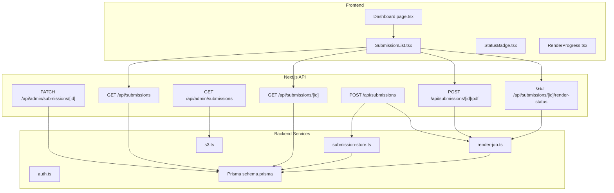
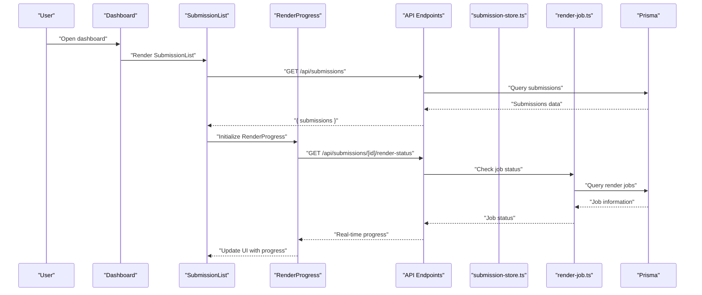
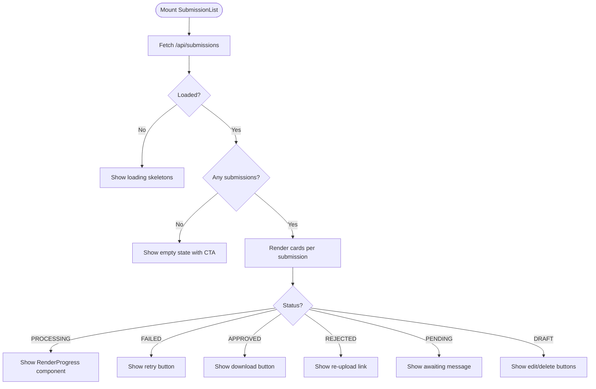
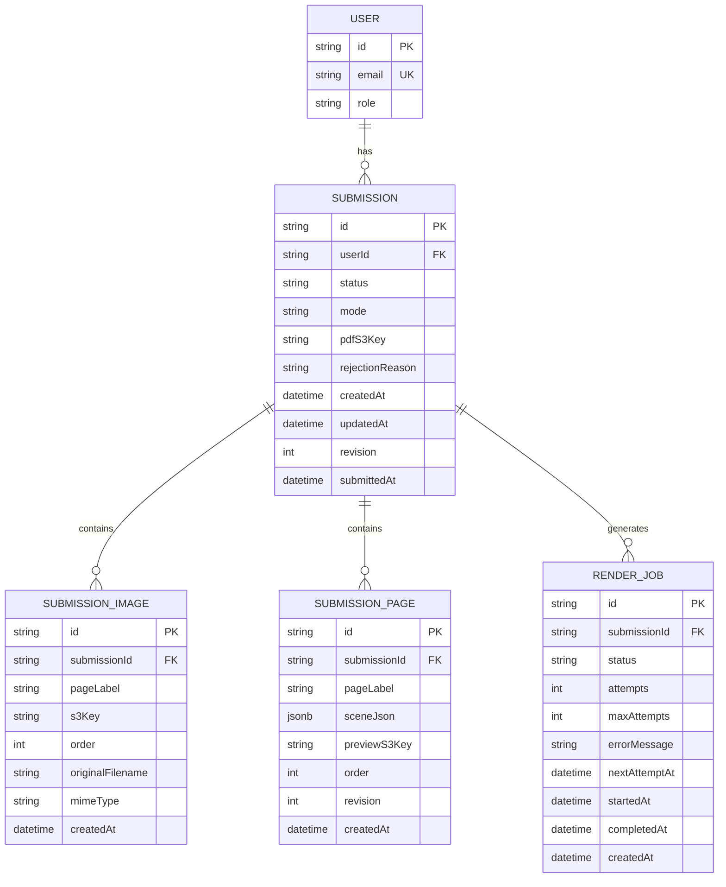
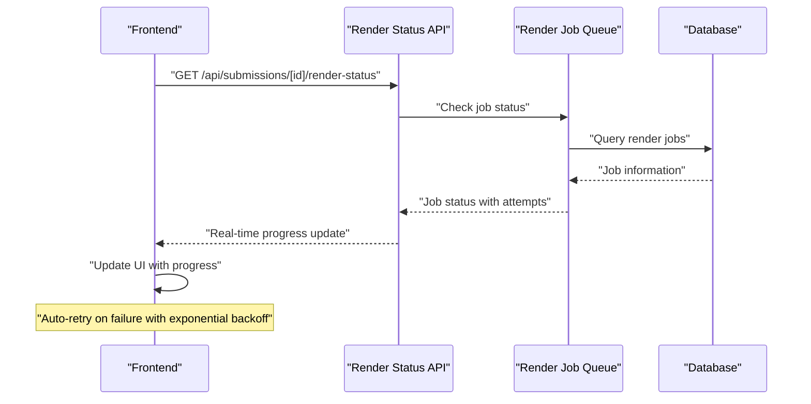
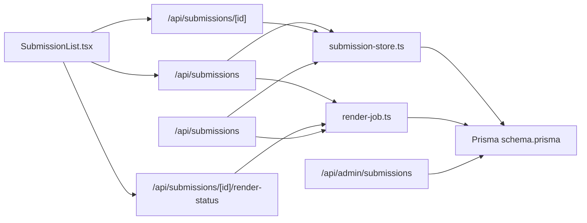

# Submission Tracking and Management

<cite>
**Referenced Files in This Document**
- [SubmissionList.tsx](file://src/components/submissions/SubmissionList.tsx)
- [StatusBadge.tsx](file://src/components/submissions/StatusBadge.tsx)
- [RenderProgress.tsx](file://src/components/submissions/RenderProgress.tsx)
- [route.ts](file://src/app/api/submissions/route.ts)
- [route.ts](file://src/app/api/submissions/[id]/route.ts)
- [route.ts](file://src/app/api/admin/submissions/route.ts)
- [route.ts](file://src/app/api/submissions/[id]/pdf/route.ts)
- [route.ts](file://src/app/api/submissions/[id]/render-status/route.ts)
- [submission-store.ts](file://src/lib/editor/submission-store.ts)
- [render-job.ts](file://src/lib/pdf/render-job.ts)
- [constants.ts](file://src/lib/constants.ts)
- [schema.prisma](file://prisma/schema.prisma)
</cite>

## Update Summary
**Changes Made**
- Enhanced error handling system with structured error responses and retry mechanisms
- Improved state management with transaction-based operations and optimistic locking
- Better status reporting for long-running PDF generation operations with real-time progress tracking
- Added comprehensive render job queue system with automatic retries and lease management
- Enhanced frontend components with improved user feedback and error states

## Table of Contents
1. [Introduction](#introduction)
2. [Project Structure](#project-structure)
3. [Core Components](#core-components)
4. [Architecture Overview](#architecture-overview)
5. [Detailed Component Analysis](#detailed-component-analysis)
6. [Enhanced Error Handling and State Management](#enhanced-error-handling-and-state-management)
7. [Long-Running Operation Status Reporting](#long-running-operation-status-reporting)
8. [Dependency Analysis](#dependency-analysis)
9. [Performance Considerations](#performance-considerations)
10. [Troubleshooting Guide](#troubleshooting-guide)
11. [Conclusion](#conclusion)

## Introduction
This document explains the enhanced submission tracking and management system for Titchybook. The system now features improved error handling, robust state management, and comprehensive status reporting for long-running operations like PDF generation. Users can view their submission history through the SubmissionList component, create new submissions, and monitor processing status with real-time updates. The backend provides secure API endpoints with proper authentication, validation, and transactional integrity.

## Project Structure
The submission system spans enhanced frontend React components, Next.js App Router API handlers, Prisma ORM models, and a sophisticated render job queue system. The protected dashboard page renders the SubmissionList component, which fetches and displays the current user's submissions with real-time status updates.

```mermaid
graph TB
subgraph "Frontend"
UI["SubmissionList.tsx"]
Badge["StatusBadge.tsx"]
Progress["RenderProgress.tsx"]
Dash["Dashboard page.tsx"]
end
subgraph "Next.js API"
APIList["GET /api/submissions"]
APISingle["GET /api/submissions/[id]"]
APICreate["POST /api/submissions"]
APIRegenerate["POST /api/submissions/[id]/pdf"]
APIStatus["GET /api/submissions/[id]/render-status"]
AdminList["GET /api/admin/submissions"]
AdminAction["PATCH /api/admin/submissions/[id]"]
end
subgraph "Backend Services"
Auth["auth.ts"]
Store["submission-store.ts"]
Queue["render-job.ts"]
Prisma["Prisma schema.prisma"]
S3["s3.ts"]
end
Dash --> UI
UI --> APIList
UI --> APISingle
UI --> APIStatus
UI --> APIRegenerate
APICreate --> Store
APICreate --> Queue
APIRegenerate --> Queue
APIStatus --> Queue
AdminList --> S3
AdminAction --> Prisma
APIList --> Prisma
APISingle --> Prisma
Store --> Prisma
Queue --> Prisma
```

**Diagram sources**
- [SubmissionList.tsx:19-149](file://src/components/submissions/SubmissionList.tsx#L19-L149)
- [RenderProgress.tsx:9-91](file://src/components/submissions/RenderProgress.tsx#L9-L91)
- [route.ts:34-147](file://src/app/api/submissions/route.ts#L34-L147)
- [route.ts:18-160](file://src/app/api/submissions/[id]/route.ts#L18-L160)
- [route.ts:9-103](file://src/app/api/submissions/[id]/render-status/route.ts#L9-L103)
- [submission-store.ts:1-147](file://src/lib/editor/submission-store.ts#L1-L147)
- [render-job.ts:1-125](file://src/lib/pdf/render-job.ts#L1-L125)

**Section sources**
- [SubmissionList.tsx:19-149](file://src/components/submissions/SubmissionList.tsx#L19-L149)
- [RenderProgress.tsx:9-91](file://src/components/submissions/RenderProgress.tsx#L9-L91)
- [route.ts:34-147](file://src/app/api/submissions/route.ts#L34-L147)
- [route.ts:18-160](file://src/app/api/submissions/[id]/route.ts#L18-L160)
- [route.ts:9-103](file://src/app/api/submissions/[id]/render-status/route.ts#L9-L103)
- [submission-store.ts:1-147](file://src/lib/editor/submission-store.ts#L1-L147)
- [render-job.ts:1-125](file://src/lib/pdf/render-job.ts#L1-L125)

## Core Components
- **SubmissionList**: Enhanced component that fetches and renders the current user's submissions with improved loading states, error handling, and real-time status updates.
- **StatusBadge**: Renders colored badges based on submission status with support for new states like PROCESSING and FAILED.
- **RenderProgress**: New component providing real-time progress tracking for long-running PDF generation operations with automatic retry logic.
- **Enhanced Backend API handlers**: Provide GET (list), POST (create), GET by ID (details and PDF URL), DELETE (draft removal), and admin-only endpoints with improved error handling and transactional integrity.

Key behaviors:
- **Listing**: GET /api/submissions returns only submissions owned by the authenticated user, ordered by creation date descending, with enhanced error handling.
- **Creation**: POST /api/submissions validates input using Zod schemas, ensures all 8 page labels are present, creates the submission and associated images in a transaction, and enqueues PDF generation asynchronously.
- **Retrieval**: GET /api/submissions/[id] returns submission details and a pre-signed URL for the PDF if available, enforcing ownership or admin privileges with proper error responses.
- **Deletion**: DELETE /api/submissions/[id] allows deletion of draft submissions only, with transactional integrity and proper authorization checks.
- **Status Monitoring**: GET /api/submissions/[id]/render-status provides real-time progress updates for long-running PDF generation operations.
- **Admin Operations**: GET /api/admin/submissions supports filtering by status and returns pre-signed PDF URLs; PATCH updates status and rejection reason with enhanced validation.

**Section sources**
- [SubmissionList.tsx:19-149](file://src/components/submissions/SubmissionList.tsx#L19-L149)
- [StatusBadge.tsx:1-17](file://src/components/submissions/StatusBadge.tsx#L1-L17)
- [RenderProgress.tsx:9-91](file://src/components/submissions/RenderProgress.tsx#L9-L91)
- [route.ts:34-147](file://src/app/api/submissions/route.ts#L34-L147)
- [route.ts:18-160](file://src/app/api/submissions/[id]/route.ts#L18-L160)
- [route.ts:9-103](file://src/app/api/submissions/[id]/render-status/route.ts#L9-L103)
- [route.ts:9-57](file://src/app/api/admin/submissions/route.ts#L9-L57)

## Architecture Overview
The enhanced system enforces user isolation and admin oversight with improved error handling and state management. Authentication is handled centrally; middleware protects routes. Frontend components call API endpoints secured by the auth callback. Prisma models define the submission and image relations with enhanced validation. PDF generation runs asynchronously through a sophisticated job queue system with automatic retries, lease management, and heartbeat monitoring.

```mermaid
sequenceDiagram
participant U as "User"
participant D as "Dashboard"
participant L as "SubmissionList"
participant R as "RenderProgress"
participant API as "API Endpoints"
participant STORE as "submission-store.ts"
participant QUEUE as "render-job.ts"
participant DB as "Prisma"
U->>D : "Open dashboard"
D->>L : "Render SubmissionList"
L->>API : "GET /api/submissions"
API->>DB : "Query submissions"
DB-->>API : "Submissions data"
API-->>L : "{ submissions }"
L->>R : "Initialize RenderProgress"
R->>API : "GET /api/submissions/[id]/render-status"
API->>QUEUE : "Check job status"
QUEUE->>DB : "Query render jobs"
DB-->>QUEUE : "Job information"
QUEUE-->>API : "Job status"
API-->>R : "Real-time progress"
R-->>L : "Update UI with progress"
```

**Diagram sources**
- [SubmissionList.tsx:19-149](file://src/components/submissions/SubmissionList.tsx#L19-L149)
- [RenderProgress.tsx:17-64](file://src/components/submissions/RenderProgress.tsx#L17-L64)
- [route.ts:34-49](file://src/app/api/submissions/route.ts#L34-L49)
- [route.ts:9-103](file://src/app/api/submissions/[id]/render-status/route.ts#L9-L103)
- [render-job.ts:36-52](file://src/lib/pdf/render-job.ts#L36-L52)

## Detailed Component Analysis

### Enhanced SubmissionList Component
Responsibilities:
- Fetch submissions for the current user on mount with improved error handling.
- Render loading skeletons while fetching with better visual feedback.
- Display empty state with a CTA to create a new submission.
- Render a card per submission with enhanced status indicators, creation date, optional rejection reason, and action buttons.
- Integrate with RenderProgress for real-time status updates during PDF generation.

Enhanced Actions:
- Download PDF: Calls GET /api/submissions/[id] to obtain a pre-signed URL and opens it in a new tab with loading states.
- Delete Draft: Calls DELETE /api/submissions/[id] with confirmation dialog and proper error handling.
- Re-upload: Links to the creation page when status is REJECTED.
- Real-time Updates: Uses RenderProgress component to show processing status and retry options.

```mermaid
flowchart TD
Start(["Mount SubmissionList"]) --> Fetch["Fetch /api/submissions"]
Fetch --> Loaded{"Loaded?"}
Loaded --> |No| ShowSkeletons["Show loading skeletons"]
Loaded --> |Yes| Empty{"Any submissions?"}
Empty --> |No| EmptyState["Show empty state with CTA"]
Empty --> |Yes| RenderCards["Render cards per submission"]
RenderCards --> CheckStatus{"Status?"}
CheckStatus --> |PROCESSING| ShowProgress["Show RenderProgress component"]
CheckStatus --> |FAILED| ShowRetry["Show retry button"]
CheckStatus --> |APPROVED| ShowDownload["Show download button"]
CheckStatus --> |REJECTED| ShowReupload["Show re-upload link"]
CheckStatus --> |PENDING| ShowPending["Show awaiting message"]
CheckStatus --> |DRAFT| ShowEdit["Show edit/delete buttons"]
```

**Diagram sources**
- [SubmissionList.tsx:23-35](file://src/components/submissions/SubmissionList.tsx#L23-L35)
- [SubmissionList.tsx:152-329](file://src/components/submissions/SubmissionList.tsx#L152-L329)
- [RenderProgress.tsx:17-64](file://src/components/submissions/RenderProgress.tsx#L17-L64)

**Section sources**
- [SubmissionList.tsx:19-329](file://src/components/submissions/SubmissionList.tsx#L19-L329)

### Enhanced Submission Data Model
The Prisma schema defines enhanced relationships:
- **Submission**: belongs to a user, has status, mode, optional PDF S3 key, optional rejection reason, timestamps, revision tracking, and indexes for efficient querying.
- **SubmissionImage**: belongs to a submission, stores pageLabel, S3 key, order, filenames, MIME type, and timestamps.
- **SubmissionPage**: belongs to a submission, stores page content, scene JSON, preview S3 keys, and revision tracking.
- **RenderJob**: tracks individual PDF generation attempts with status, attempts, lease management, and error information.

```mermaid
erDiagram
USER {
string id PK
string email UK
string role
}
SUBMISSION {
string id PK
string userId FK
string status
string mode
string pdfS3Key
string rejectionReason
datetime createdAt
datetime updatedAt
int revision
datetime submittedAt
}
SUBMISSION_IMAGE {
string id PK
string submissionId FK
string pageLabel
string s3Key
int order
string originalFilename
string mimeType
datetime createdAt
}
SUBMISSION_PAGE {
string id PK
string submissionId FK
string pageLabel
jsonb sceneJson
string previewS3Key
int order
int revision
datetime createdAt
}
RENDER_JOB {
string id PK
string submissionId FK
string status
int attempts
int maxAttempts
string errorMessage
datetime nextAttemptAt
datetime startedAt
datetime completedAt
datetime createdAt
}
USER ||--o{ SUBMISSION : "has"
SUBMISSION ||--o{ SUBMISSION_IMAGE : "contains"
SUBMISSION ||--o{ SUBMISSION_PAGE : "contains"
SUBMISSION ||--o{ RENDER_JOB : "generates"
```

**Diagram sources**
- [schema.prisma:10-47](file://prisma/schema.prisma#L10-L47)

**Section sources**
- [schema.prisma:21-47](file://prisma/schema.prisma#L21-L47)

### Enhanced Backend API Endpoints

#### GET /api/submissions
- Purpose: List current user's submissions with enhanced error handling.
- Security: Requires authentication; filters by session user id.
- Behavior: Returns submissions ordered by createdAt desc, including images and pages sorted by order asc.

**Section sources**
- [route.ts:34-49](file://src/app/api/submissions/route.ts#L34-L49)

#### POST /api/submissions
- Purpose: Create a new submission with enhanced validation using Zod schemas.
- Validation: Ensures array length is exactly 8 and all page labels are unique using structured validation.
- Persistence: Creates submission and associated images in a single transaction with improved error handling.
- Asynchronous Processing: Enqueues PDF generation through the render job queue without blocking the response.

**Section sources**
- [route.ts:52-147](file://src/app/api/submissions/route.ts#L52-L147)

#### GET /api/submissions/[id]
- Purpose: Retrieve a single submission and a pre-signed PDF URL if available.
- Security: Requires authentication; enforces ownership or ADMIN role.
- Output: Includes submission and pdfDownloadUrl with enhanced error responses.

**Section sources**
- [route.ts:18-65](file://src/app/api/submissions/[id]/route.ts#L18-L65)

#### DELETE /api/submissions/[id]
- Purpose: Delete draft submissions with transactional integrity.
- Security: Requires authentication; enforces ownership or ADMIN role.
- Behavior: Only allows deletion of DRAFT submissions with proper locking and error handling.

**Section sources**
- [route.ts:113-160](file://src/app/api/submissions/[id]/route.ts#L113-L160)

#### POST /api/submissions/[id]/pdf
- Purpose: Force regenerate the PDF for an existing submission with retry support.
- Security: Requires authentication.
- Behavior: Enqueues render job with retry capabilities and returns immediate acknowledgment.

**Section sources**
- [route.ts:9-27](file://src/app/api/submissions/[id]/pdf/route.ts#L9-L27)

#### GET /api/submissions/[id]/render-status
- Purpose: Get real-time status of render jobs for long-running operations.
- Security: Requires authentication; enforces ownership or ADMIN role.
- Behavior: Returns detailed job information including attempts, errors, and retry scheduling.

**Section sources**
- [route.ts:14-103](file://src/app/api/submissions/[id]/render-status/route.ts#L14-L103)

#### GET /api/admin/submissions
- Purpose: Admin endpoint to list submissions with optional status filter and enhanced data.
- Security: Requires ADMIN role.
- Behavior: Returns submissions with user info, pre-signed PDF URLs, and page previews.

**Section sources**
- [route.ts:9-57](file://src/app/api/admin/submissions/route.ts#L9-L57)

### Enhanced Error Handling System
The system now features a comprehensive error handling framework:

- **Structured Errors**: Custom `SubmissionError` class with HTTP status codes and detailed error information.
- **Validation Errors**: Zod-based validation with descriptive error messages for client-side feedback.
- **Transaction Safety**: All database operations use transactions to ensure data consistency.
- **Graceful Degradation**: Components handle network errors, timeouts, and partial failures gracefully.
- **Retry Logic**: Automatic retry mechanisms for transient failures with exponential backoff.

**Section sources**
- [submission-store.ts:9-23](file://src/lib/editor/submission-store.ts#L9-L23)
- [route.ts:144-147](file://src/app/api/submissions/route.ts#L144-L147)

### Long-Running Operation Status Reporting
The enhanced system provides comprehensive status reporting for long-running PDF generation operations:

- **Real-time Progress**: Polling endpoint `/api/submissions/[id]/render-status` provides live updates on job progress.
- **Job Queue Management**: Sophisticated queue system with automatic retries, lease management, and heartbeat monitoring.
- **User Feedback**: RenderProgress component shows detailed status messages and retry options.
- **Error Recovery**: Automatic retry logic with configurable delays and maximum attempt limits.

```mermaid
sequenceDiagram
participant FE as "Frontend"
participant API as "Render Status API"
participant QUEUE as "Render Job Queue"
participant DB as "Database"
FE->>API : "GET /api/submissions/[id]/render-status"
API->>QUEUE : "Check job status"
QUEUE->>DB : "Query render jobs"
DB-->>QUEUE : "Job information"
QUEUE-->>API : "Job status with attempts"
API-->>FE : "Real-time progress update"
FE->>FE : "Update UI with progress"
Note over FE : "Auto-retry on failure with exponential backoff"
```

**Diagram sources**
- [RenderProgress.tsx:17-64](file://src/components/submissions/RenderProgress.tsx#L17-L64)
- [route.ts:14-103](file://src/app/api/submissions/[id]/render-status/route.ts#L14-L103)
- [render-job.ts:36-52](file://src/lib/pdf/render-job.ts#L36-L52)

**Section sources**
- [RenderProgress.tsx:9-91](file://src/components/submissions/RenderProgress.tsx#L9-L91)
- [route.ts:14-103](file://src/app/api/submissions/[id]/render-status/route.ts#L14-L103)
- [render-job.ts:1-125](file://src/lib/pdf/render-job.ts#L1-L125)

### Permissions and Access Control
- **Ownership**: Users can only access submissions where userId matches the session.
- **Admin**: Admins can view all submissions and update statuses with enhanced validation.
- **Middleware**: Protects protected routes and applies auth to API handlers with improved error handling.
- **Transaction Locking**: Database-level locking prevents concurrent modifications to the same submission.

**Section sources**
- [route.ts:41-43](file://src/app/api/submissions/[id]/route.ts#L41-L43)
- [route.ts:11-13](file://src/app/api/admin/submissions/route.ts#L11-L13)
- [submission-store.ts:26-34](file://src/lib/editor/submission-store.ts#L26-L34)

## Dependency Analysis
- Frontend depends on NextAuth session for user identity and calls API endpoints with enhanced error handling.
- API handlers depend on Prisma for persistence, submission-store for transactional operations, and render-job for async processing.
- Render job system depends on database locking, S3 for media storage, and automatic retry mechanisms.
- Admin endpoints depend on status constants and S3 pre-signed URLs with improved validation.

```mermaid
graph LR
UI["SubmissionList.tsx"] --> API_SUB["/api/submissions"]
UI --> API_SINGLE["/api/submissions/[id]"]
UI --> API_STATUS["/api/submissions/[id]/render-status"]
API_SUB --> STORE["submission-store.ts"]
API_SUB --> QUEUE["render-job.ts"]
API_SINGLE --> STORE
API_STATUS --> QUEUE
API_CREATE["/api/submissions"] --> STORE
API_CREATE --> QUEUE
STORE --> PRISMA["Prisma schema.prisma"]
QUEUE --> PRISMA
ADMIN_LIST["/api/admin/submissions"] --> PRISMA
```

**Diagram sources**
- [SubmissionList.tsx:19-149](file://src/components/submissions/SubmissionList.tsx#L19-L149)
- [route.ts:34-147](file://src/app/api/submissions/route.ts#L34-L147)
- [route.ts:18-160](file://src/app/api/submissions/[id]/route.ts#L18-L160)
- [route.ts:14-103](file://src/app/api/submissions/[id]/render-status/route.ts#L14-L103)
- [submission-store.ts:1-147](file://src/lib/editor/submission-store.ts#L1-L147)
- [render-job.ts:1-125](file://src/lib/pdf/render-job.ts#L1-L125)

**Section sources**
- [SubmissionList.tsx:19-149](file://src/components/submissions/SubmissionList.tsx#L19-L149)
- [route.ts:34-147](file://src/app/api/submissions/route.ts#L34-L147)
- [route.ts:18-160](file://src/app/api/submissions/[id]/route.ts#L18-L160)
- [route.ts:14-103](file://src/app/api/submissions/[id]/render-status/route.ts#L14-L103)
- [submission-store.ts:1-147](file://src/lib/editor/submission-store.ts#L1-L147)
- [render-job.ts:1-125](file://src/lib/pdf/render-job.ts#L1-L125)

## Performance Considerations
- **Asynchronous Processing**: PDF generation runs through a sophisticated job queue system preventing blocking operations.
- **Optimistic Locking**: Database-level locking with revision numbers prevents concurrent modification conflicts.
- **Efficient Polling**: Render status polling uses intelligent retry logic with exponential backoff.
- **Pre-signed URLs**: Reduce server bandwidth by offloading PDF delivery to S3.
- **Transaction Batching**: Database operations use transactions to minimize round trips and ensure consistency.
- **Memory Management**: Proper cleanup of event listeners and timers in React components.

## Troubleshooting Guide
Enhanced troubleshooting with improved error messages and recovery options:

Common issues and resolutions:
- **Unauthorized Access**: Ensure the user is authenticated; API handlers return structured 401 errors with clear messaging.
- **Forbidden Access**: Non-admin users attempting admin endpoints receive 403 with descriptive error messages; verify role.
- **Not Found**: Requests for non-existent submissions return 404 with consistent error format.
- **Validation Errors**: Creation requires exactly 8 images with unique page labels; errors return 400 with specific validation details.
- **Render Failures**: Enhanced error handling with automatic retry logic; users can manually retry failed operations.
- **Network Issues**: Components handle connection drops with automatic reconnection and graceful degradation.
- **Concurrency Conflicts**: Optimistic locking detects conflicting edits and prompts users to reload for reconciliation.

**Section sources**
- [route.ts:144-147](file://src/app/api/submissions/route.ts#L144-L147)
- [route.ts:108-110](file://src/app/api/submissions/[id]/route.ts#L108-L110)
- [route.ts:156-158](file://src/app/api/submissions/[id]/route.ts#L156-L158)
- [submission-store.ts:14-23](file://src/lib/editor/submission-store.ts#L14-L23)
- [RenderProgress.tsx:66-76](file://src/components/submissions/RenderProgress.tsx#L66-L76)

## Conclusion
The enhanced submission tracking and management system provides a robust, user-centric workflow for viewing, creating, and managing Titchybook submissions with significantly improved reliability and user experience. The system now features comprehensive error handling, transactional integrity, and sophisticated status reporting for long-running operations. Users benefit from real-time progress updates, automatic retry mechanisms, and clear error messaging. The backend ensures data consistency through transactional operations and optimistic locking, while the frontend provides intuitive interfaces for managing submissions and monitoring processing status. The enhanced architecture scales effectively for high-volume operations while maintaining responsive user interactions.