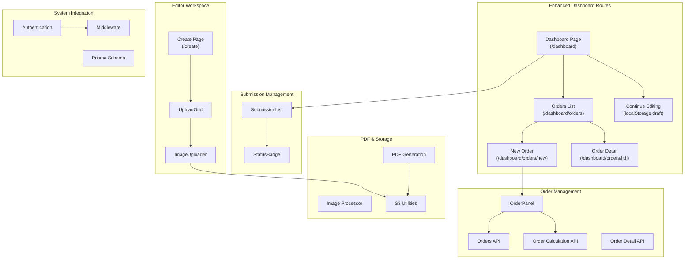
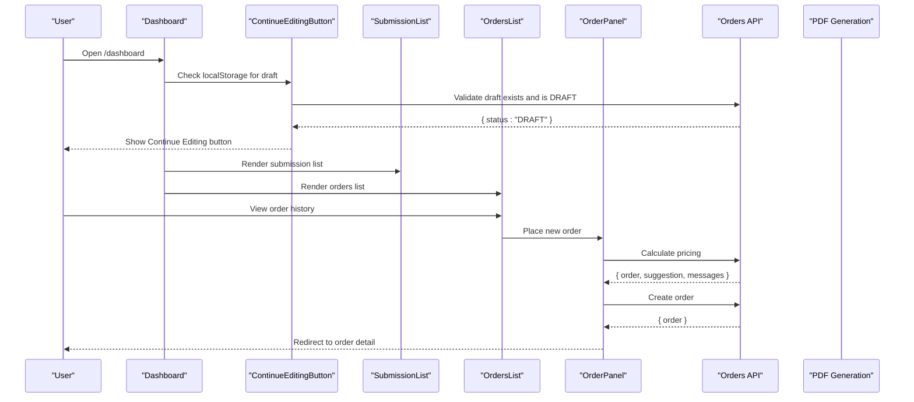
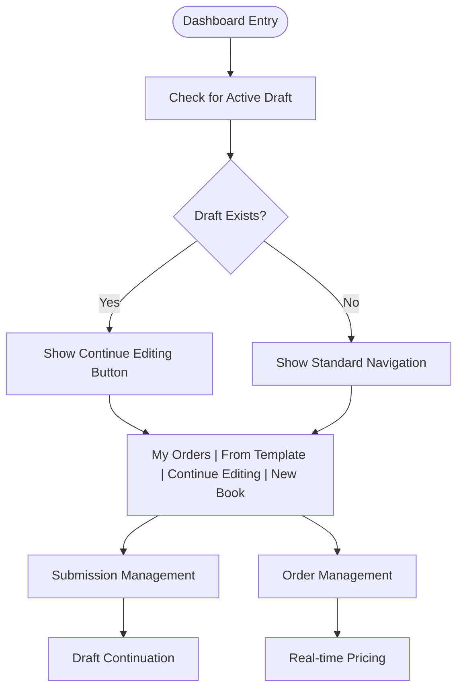
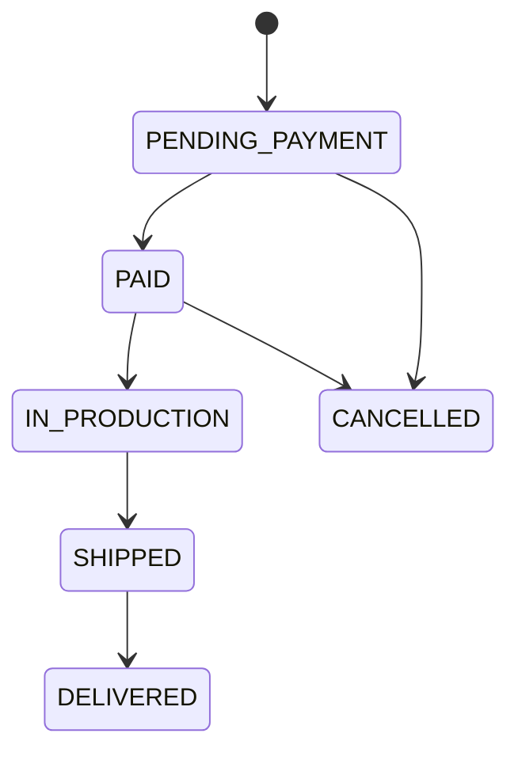
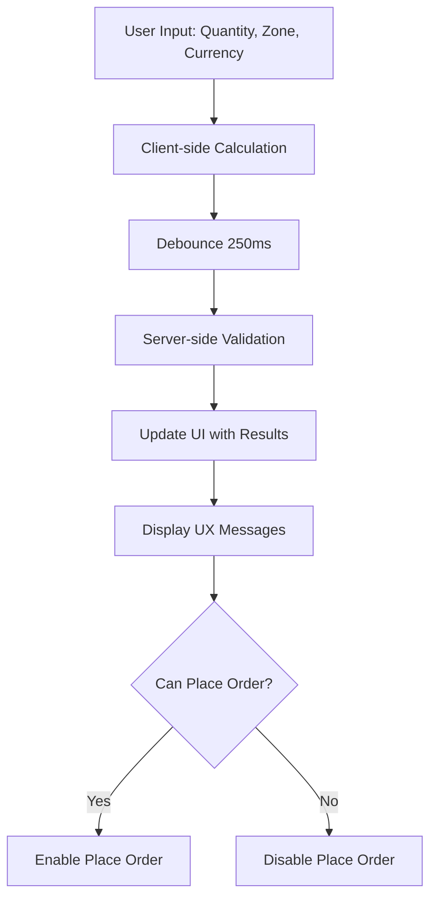
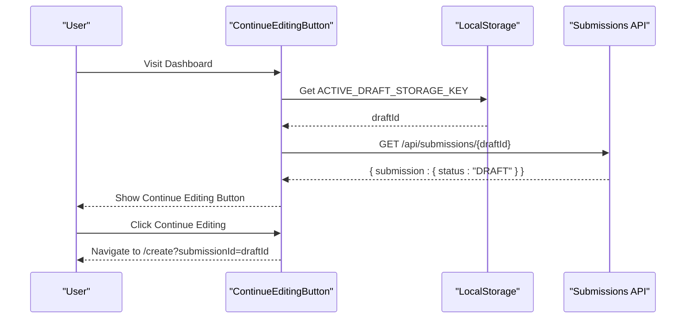
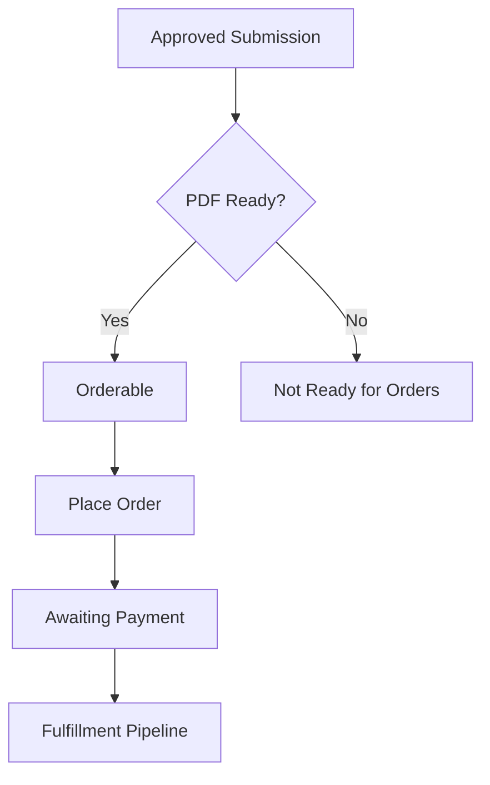
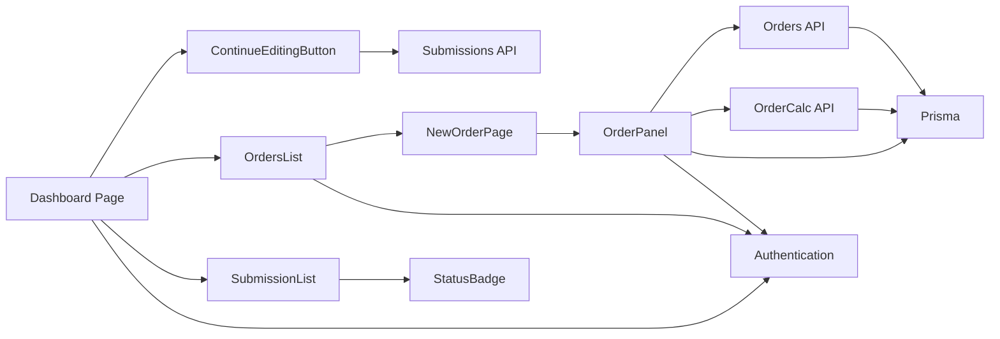

# User Dashboard

<cite>
**Referenced Files in This Document**
- [Dashboard Page](file://src/app/(protected)/dashboard/page.tsx)
- [Submission List Component](file://src/components/submissions/SubmissionList.tsx)
- [Status Badge Component](file://src/components/submissions/StatusBadge.tsx)
- [Continue Editing Button](file://src/components/dashboard/ContinueEditingButton.tsx)
- [Orders List Page](file://src/app/(protected)/dashboard/orders/page.tsx)
- [New Order Page](file://src/app/(protected)/dashboard/orders/new/page.tsx)
- [Order Detail Page](file://src/app/(protected)/dashboard/orders/[id]/page.tsx)
- [Order Panel Component](file://src/components/orders/OrderPanel.tsx)
- [Orders API](file://src/app/api/orders/route.ts)
- [Order Calculation API](file://src/app/api/orders/calculate/route.ts)
- [Order Detail API](file://src/app/api/orders/[id]/route.ts)
- [Submissions API](file://src/app/api/submissions/route.ts)
- [Submission Detail API](file://src/app/api/submissions/[id]/route.ts)
- [Upload Presigned URL API](file://src/app/api/upload/presign/route.ts)
- [Create Page](file://src/app/(protected)/create/page.tsx)
- [Upload Grid Component](file://src/components/create/UploadGrid.tsx)
- [Image Uploader Component](file://src/components/create/ImageUploader.tsx)
- [PDF Generation](file://src/lib/pdf/generate.ts)
- [PDF Image Processor](file://src/lib/pdf/image-processor.ts)
- [S3 Utilities](file://src/lib/s3.ts)
- [Prisma Schema](file://prisma/schema.prisma)
- [Authentication](file://src/auth.ts)
- [Middleware](file://src/middleware.ts)
- [Constants](file://src/lib/constants.ts)
</cite>

## Update Summary
**Changes Made**
- Added comprehensive order management functionality with dedicated order pages and panels
- Integrated editor workspace access through Continue Editing button for draft submissions
- Enhanced dashboard navigation with My Orders, From Template, and Continue Editing buttons
- Implemented full order lifecycle tracking from creation to fulfillment
- Added sophisticated pricing calculation and currency conversion system
- Expanded submission tracking to include order associations and status monitoring

## Table of Contents
1. [Introduction](#introduction)
2. [Project Structure](#project-structure)
3. [Core Components](#core-components)
4. [Architecture Overview](#architecture-overview)
5. [Detailed Component Analysis](#detailed-component-analysis)
6. [Dependency Analysis](#dependency-analysis)
7. [Performance Considerations](#performance-considerations)
8. [Troubleshooting Guide](#troubleshooting-guide)
9. [Conclusion](#conclusion)

## Introduction
This document describes the enhanced user dashboard functionality for managing Titchybook submissions with comprehensive order management capabilities. The dashboard now provides submission tracking, order management, editor workspace access, and integrated PDF generation workflows. Users can monitor their booklet creation history, track order status through the fulfillment pipeline, continue editing drafts, and access template-based creation workflows.

## Project Structure
The dashboard has evolved into a comprehensive platform featuring submission tracking, order management, and editor workspace integration. The structure now includes dedicated routes for orders, pricing calculations, and template-based creation, along with enhanced submission management and draft continuation capabilities.



**Diagram sources**
- [Dashboard Page](file://src/app/(protected)/dashboard/page.tsx#L1-L36)
- [Orders List Page](file://src/app/(protected)/dashboard/orders/page.tsx#L1-L99)
- [New Order Page](file://src/app/(protected)/dashboard/orders/new/page.tsx#L1-L77)
- [Order Detail Page](file://src/app/(protected)/dashboard/orders/[id]/page.tsx#L1-L154)
- [Continue Editing Button:1-62](file://src/components/dashboard/ContinueEditingButton.tsx#L1-L62)
- [Order Panel Component:1-730](file://src/components/orders/OrderPanel.tsx#L1-L730)
- [Orders API:1-131](file://src/app/api/orders/route.ts#L1-L131)
- [Order Calculation API:1-90](file://src/app/api/orders/calculate/route.ts#L1-L90)
- [Order Detail API:1-33](file://src/app/api/orders/[id]/route.ts#L1-L33)

**Section sources**
- [Dashboard Page](file://src/app/(protected)/dashboard/page.tsx#L1-L36)
- [Orders List Page](file://src/app/(protected)/dashboard/orders/page.tsx#L1-L99)
- [New Order Page](file://src/app/(protected)/dashboard/orders/new/page.tsx#L1-L77)
- [Order Detail Page](file://src/app/(protected)/dashboard/orders/[id]/page.tsx#L1-L154)
- [Continue Editing Button:1-62](file://src/components/dashboard/ContinueEditingButton.tsx#L1-L62)
- [Order Panel Component:1-730](file://src/components/orders/OrderPanel.tsx#L1-L730)

## Core Components
- **Enhanced Dashboard Page**: Now features navigation to My Orders, From Template, Continue Editing, and New Book creation with improved layout and workflow integration.
- **SubmissionList**: Displays user's booklet creation history with status badges and action buttons for download/re-upload.
- **ContinueEditingButton**: Smart draft continuation that detects active editor drafts and provides seamless access to the editor workspace.
- **Orders Management System**: Complete order lifecycle from creation to fulfillment with real-time pricing calculation and status tracking.
- **OrderPanel**: Sophisticated pricing calculator with quantity optimization, currency conversion, and shipping destination selection.
- **OrderListPage**: Comprehensive order history display with status badges, pricing summaries, and quick access to order details.
- **OrderDetailPage**: Detailed order view showing pricing breakdown, shipping information, and status progression through the fulfillment pipeline.
- **Enhanced Submission Workflow**: Integration between submission creation and order placement with approval gating and PDF readiness validation.

**Section sources**
- [Dashboard Page](file://src/app/(protected)/dashboard/page.tsx#L1-L36)
- [Continue Editing Button:1-62](file://src/components/dashboard/ContinueEditingButton.tsx#L1-L62)
- [Orders List Page](file://src/app/(protected)/dashboard/orders/page.tsx#L1-L99)
- [Order Panel Component:1-730](file://src/components/orders/OrderPanel.tsx#L1-L730)

## Architecture Overview
The enhanced dashboard implements a comprehensive submission-to-order workflow with real-time pricing integration and draft management. The system now supports bidirectional flows between submission creation and order placement, with intelligent draft detection and preservation.



**Diagram sources**
- [Dashboard Page](file://src/app/(protected)/dashboard/page.tsx#L1-L36)
- [Continue Editing Button:1-62](file://src/components/dashboard/ContinueEditingButton.tsx#L1-L62)
- [Orders List Page](file://src/app/(protected)/dashboard/orders/page.tsx#L1-L99)
- [Order Panel Component:1-730](file://src/components/orders/OrderPanel.tsx#L1-L730)
- [Orders API:1-131](file://src/app/api/orders/route.ts#L1-L131)

## Detailed Component Analysis

### Enhanced Dashboard Navigation and Workflow
The dashboard now provides comprehensive navigation between submission management and order fulfillment workflows, with intelligent draft detection and template-based creation options.



**Diagram sources**
- [Dashboard Page](file://src/app/(protected)/dashboard/page.tsx#L1-L36)
- [Continue Editing Button:1-62](file://src/components/dashboard/ContinueEditingButton.tsx#L1-L62)

**Section sources**
- [Dashboard Page](file://src/app/(protected)/dashboard/page.tsx#L1-L36)
- [Continue Editing Button:1-62](file://src/components/dashboard/ContinueEditingButton.tsx#L1-L62)

### Order Management System
The order management system provides complete lifecycle tracking from initial creation to fulfillment, with sophisticated pricing calculation and status monitoring.



**Diagram sources**
- [Orders List Page](file://src/app/(protected)/dashboard/orders/page.tsx#L6-L13)
- [Order Detail Page](file://src/app/(protected)/dashboard/orders/[id]/page.tsx#L47-L89)

**Section sources**
- [Orders List Page](file://src/app/(protected)/dashboard/orders/page.tsx#L6-L13)
- [Order Detail Page](file://src/app/(protected)/dashboard/orders/[id]/page.tsx#L47-L89)

### Order Panel Pricing Engine
The OrderPanel implements a sophisticated pricing calculation system with real-time updates, optimal quantity suggestions, and currency conversion capabilities.



**Diagram sources**
- [Order Panel Component:199-260](file://src/components/orders/OrderPanel.tsx#L199-L260)
- [Order Calculation API:13-89](file://src/app/api/orders/calculate/route.ts#L13-L89)

**Section sources**
- [Order Panel Component:199-260](file://src/components/orders/OrderPanel.tsx#L199-L260)
- [Order Calculation API:13-89](file://src/app/api/orders/calculate/route.ts#L13-L89)

### Draft Continuation and Editor Workspace Access
The ContinueEditingButton component provides seamless access to the editor workspace for active drafts, with automatic validation and localStorage integration.



**Diagram sources**
- [Continue Editing Button:13-47](file://src/components/dashboard/ContinueEditingButton.tsx#L13-L47)
- [Submission Detail API:1-37](file://src/app/api/submissions/[id]/route.ts#L1-L37)

**Section sources**
- [Continue Editing Button:1-62](file://src/components/dashboard/ContinueEditingButton.tsx#L1-L62)
- [Submission Detail API:1-37](file://src/app/api/submissions/[id]/route.ts#L1-L37)

### Enhanced Submission-Order Integration
The system now integrates submission creation with order placement, ensuring that only approved submissions can be ordered and that PDF readiness is validated before order creation.



**Diagram sources**
- [Order Panel Component:266-275](file://src/components/orders/OrderPanel.tsx#L266-L275)
- [Orders API:67-77](file://src/app/api/orders/route.ts#L67-L77)

**Section sources**
- [Order Panel Component:266-275](file://src/components/orders/OrderPanel.tsx#L266-L275)
- [Orders API:67-77](file://src/app/api/orders/route.ts#L67-L77)

### Order Detail and Status Tracking
The order detail page provides comprehensive visibility into the order fulfillment process, with detailed pricing breakdowns and status progression tracking.

```mermaid
classDiagram
class OrderDetailPage {
+props params : { id : string }
+render() JSX.Element
}
class Order {
+id : string
+status : string
+quantity : number
+zone : string
+totalHuf : number
+createdAt : Date
}
class PricingBreakdown {
+unitPriceHuf : number
+printCostHuf : number
+shippingCostHuf : number
+discountHuf : number
+handlingCostHuf : number
}
Order --> PricingBreakdown : "includes"
```

**Diagram sources**
- [Order Detail Page](file://src/app/(protected)/dashboard/orders/[id]/page.tsx#L7-L23)
- [Order Detail Page](file://src/app/(protected)/dashboard/orders/[id]/page.tsx#L68-L89)

**Section sources**
- [Order Detail Page](file://src/app/(protected)/dashboard/orders/[id]/page.tsx#L1-L154)

## Dependency Analysis
The enhanced dashboard maintains clear separation of concerns while adding sophisticated order management capabilities and draft continuation features.



**Diagram sources**
- [Dashboard Page](file://src/app/(protected)/dashboard/page.tsx#L1-L36)
- [Continue Editing Button:1-62](file://src/components/dashboard/ContinueEditingButton.tsx#L1-L62)
- [Orders List Page](file://src/app/(protected)/dashboard/orders/page.tsx#L1-L99)
- [Order Panel Component:1-730](file://src/components/orders/OrderPanel.tsx#L1-L730)
- [Orders API:1-131](file://src/app/api/orders/route.ts#L1-L131)

**Section sources**
- [Dashboard Page](file://src/app/(protected)/dashboard/page.tsx#L1-L36)
- [Continue Editing Button:1-62](file://src/components/dashboard/ContinueEditingButton.tsx#L1-L62)
- [Orders List Page](file://src/app/(protected)/dashboard/orders/page.tsx#L1-L99)
- [Order Panel Component:1-730](file://src/components/orders/OrderPanel.tsx#L1-L730)

## Performance Considerations
- **Debounced Pricing Calculations**: OrderPanel implements 250ms debouncing to optimize network requests during rapid parameter changes
- **Client-Server Calculation Reconciliation**: Immediate client-side calculations provide instant feedback while authoritative server calculations ensure accuracy
- **Draft Validation Optimization**: Single API call to validate draft existence and status prevents unnecessary navigation attempts
- **Local Storage Caching**: Persistent storage of user preferences (zones, currencies) reduces API calls and improves user experience
- **Conditional Rendering**: ContinueEditingButton uses conditional rendering to avoid unnecessary API calls when no draft exists

## Troubleshooting Guide
- **Draft Continuation Issues**:
  - Ensure localStorage contains valid draft ID with ACTIVE_DRAFT_STORAGE_KEY
  - Verify draft submission exists and status is "DRAFT"
  - Check that user has access to the draft submission
- **Order Placement Failures**:
  - Verify submission status is "APPROVED"
  - Confirm PDF is ready (pdfS3Key exists)
  - Ensure shipping zone is enabled in pricing configuration
  - Validate shipping address completeness
- **Pricing Calculation Errors**:
  - Check network connectivity for server-side calculations
  - Verify quantity is within supported range (1-333)
  - Ensure selected currency is supported
- **Navigation Issues**:
  - Confirm user authentication status
  - Verify proper route parameters for order detail pages
  - Check admin role requirements for certain operations

**Section sources**
- [Continue Editing Button:23-46](file://src/components/dashboard/ContinueEditingButton.tsx#L23-L46)
- [Order Panel Component:277-293](file://src/components/orders/OrderPanel.tsx#L277-L293)
- [Orders API:67-77](file://src/app/api/orders/route.ts#L67-L77)

## Conclusion
The enhanced user dashboard provides a comprehensive platform for managing Titchybook submissions and orders, with sophisticated workflow integration between creation, approval, and fulfillment processes. The addition of order management capabilities, draft continuation features, and real-time pricing calculations creates a seamless user experience from initial submission to final product delivery. The system maintains strong security practices through proper authentication, authorization, and data privacy protections while providing intuitive interfaces for both submission tracking and order management.