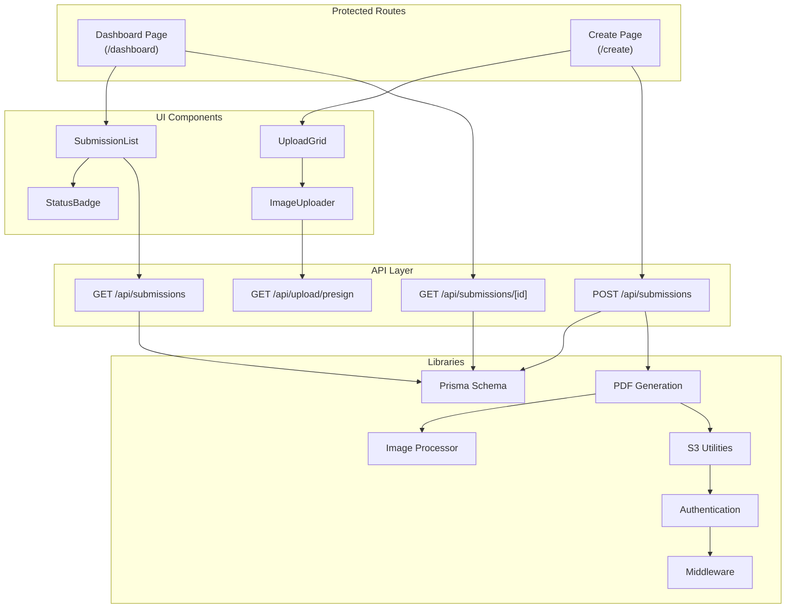
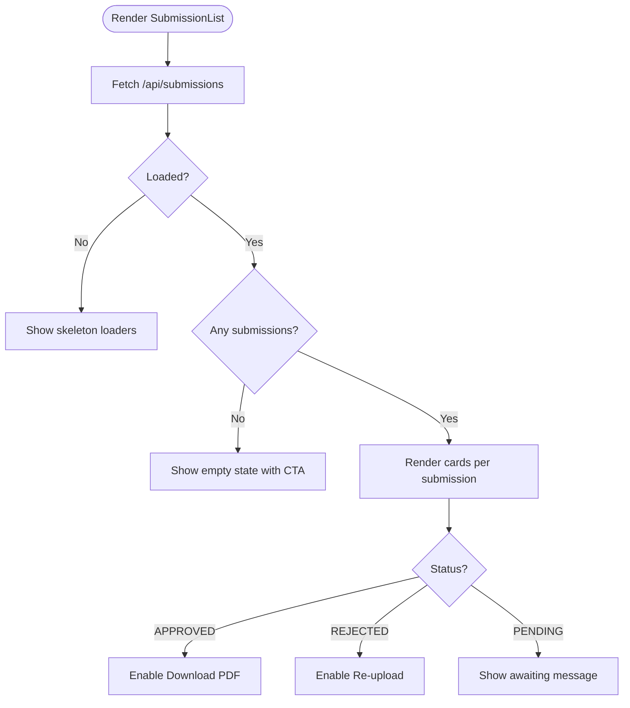
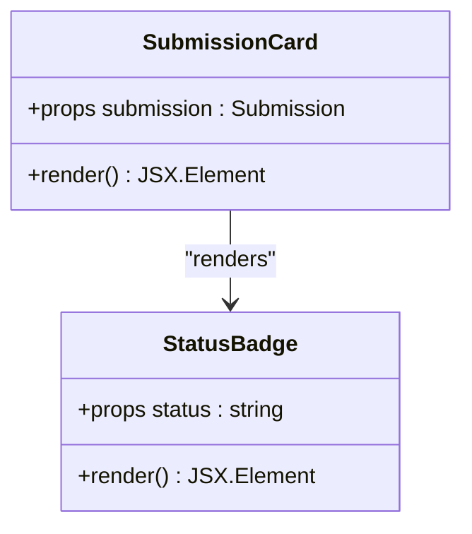
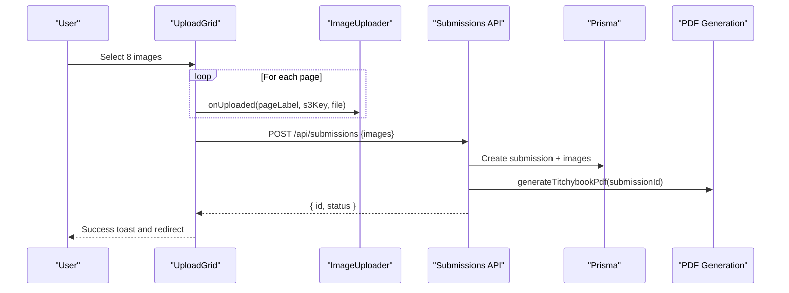
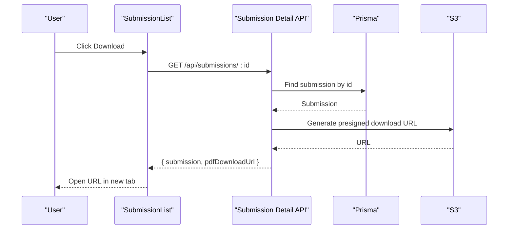
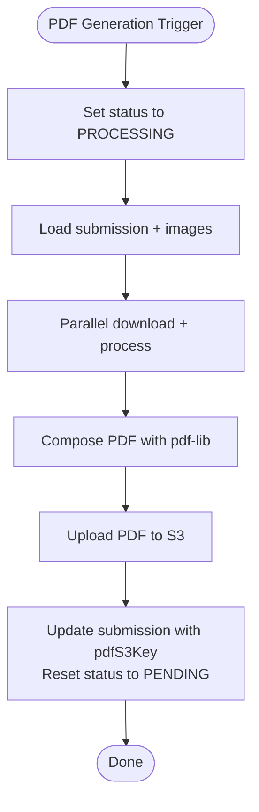
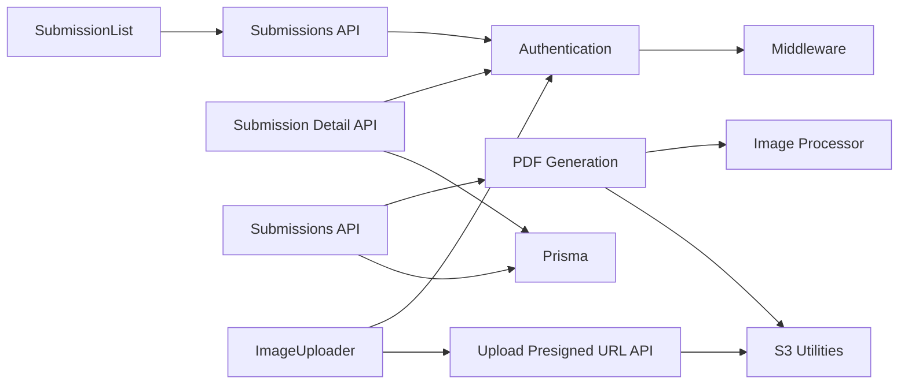

# User Dashboard

<cite>
**Referenced Files in This Document**
- [Dashboard Page](file://src/app/(protected)/dashboard/page.tsx)
- [Submission List Component](file://src/components/submissions/SubmissionList.tsx)
- [Status Badge Component](file://src/components/submissions/StatusBadge.tsx)
- [Submissions API](file://src/app/api/submissions/route.ts)
- [Submission Detail API](file://src/app/api/submissions/[id]/route.ts)
- [Upload Presigned URL API](file://src/app/api/upload/presign/route.ts)
- [Create Page](file://src/app/(protected)/create/page.tsx)
- [Upload Grid Component](file://src/components/create/UploadGrid.tsx)
- [Image Uploader Component](file://src/components/create/ImageUploader.tsx)
- [PDF Generation](file://src/lib/pdf/generate.ts)
- [PDF Image Processor](file://src/lib/pdf/image-processor.ts)
- [S3 Utilities](file://src/lib/s3.ts)
- [Prisma Schema](file://prisma/schema.prisma)
- [Authentication](file://src/auth.ts)
- [Middleware](file://src/middleware.ts)
- [Constants](file://src/lib/constants.ts)
</cite>

## Table of Contents
1. [Introduction](#introduction)
2. [Project Structure](#project-structure)
3. [Core Components](#core-components)
4. [Architecture Overview](#architecture-overview)
5. [Detailed Component Analysis](#detailed-component-analysis)
6. [Dependency Analysis](#dependency-analysis)
7. [Performance Considerations](#performance-considerations)
8. [Troubleshooting Guide](#troubleshooting-guide)
9. [Conclusion](#conclusion)

## Introduction
This document describes the user dashboard functionality for managing Titchybook submissions. It covers the submission tracking interface, submission list rendering, status badges, CRUD operations, download access management, lifecycle tracking, permissions, data privacy, ownership, customization examples, and integration with PDF generation and download workflows.

## Project Structure
The dashboard is organized around a protected route that renders a submission list, which in turn renders individual submission cards. Users can navigate to a creation page to submit new booklets, which are persisted via API endpoints and later processed into downloadable PDFs.



**Diagram sources**
- [Dashboard Page](file://src/app/(protected)/dashboard/page.tsx#L1-L20)
- [Submission List Component:1-119](file://src/components/submissions/SubmissionList.tsx#L1-L119)
- [Status Badge Component:1-18](file://src/components/submissions/StatusBadge.tsx#L1-L18)
- [Create Page](file://src/app/(protected)/create/page.tsx#L1-L11)
- [Upload Grid Component:1-115](file://src/components/create/UploadGrid.tsx#L1-L115)
- [Image Uploader Component:1-148](file://src/components/create/ImageUploader.tsx#L1-L148)
- [Submissions API:1-96](file://src/app/api/submissions/route.ts#L1-L96)
- [Submission Detail API:1-37](file://src/app/api/submissions/[id]/route.ts#L1-L37)
- [Upload Presigned URL API:1-38](file://src/app/api/upload/presign/route.ts#L1-L38)
- [PDF Generation:1-112](file://src/lib/pdf/generate.ts#L1-L112)
- [PDF Image Processor:1-30](file://src/lib/pdf/image-processor.ts#L1-L30)
- [S3 Utilities:1-81](file://src/lib/s3.ts#L1-L81)
- [Authentication:1-80](file://src/auth.ts#L1-L80)
- [Middleware:1-6](file://src/middleware.ts#L1-L6)
- [Prisma Schema:1-48](file://prisma/schema.prisma#L1-L48)

**Section sources**
- [Dashboard Page](file://src/app/(protected)/dashboard/page.tsx#L1-L20)
- [Submission List Component:1-119](file://src/components/submissions/SubmissionList.tsx#L1-L119)
- [Create Page](file://src/app/(protected)/create/page.tsx#L1-L11)
- [Upload Grid Component:1-115](file://src/components/create/UploadGrid.tsx#L1-L115)
- [Submissions API:1-96](file://src/app/api/submissions/route.ts#L1-L96)
- [Submission Detail API:1-37](file://src/app/api/submissions/[id]/route.ts#L1-L37)
- [Upload Presigned URL API:1-38](file://src/app/api/upload/presign/route.ts#L1-L38)
- [PDF Generation:1-112](file://src/lib/pdf/generate.ts#L1-L112)
- [S3 Utilities:1-81](file://src/lib/s3.ts#L1-L81)
- [Prisma Schema:1-48](file://prisma/schema.prisma#L1-L48)
- [Authentication:1-80](file://src/auth.ts#L1-L80)
- [Middleware:1-6](file://src/middleware.ts#L1-L6)

## Core Components
- Dashboard Page: Renders the header, "New Book" button, and the SubmissionList component.
- SubmissionList: Fetches and displays the current user's submissions, shows loading states, empty state, and per-submission cards.
- Submission Card: Displays status badge, creation date, optional rejection reason, and action buttons (download or re-upload).
- StatusBadge: Visual indicator for submission statuses (PENDING, APPROVED, REJECTED).
- UploadGrid: Collects 8 page images, validates completeness, and submits to the backend.
- ImageUploader: Handles drag-and-drop/file selection, previews, validation, and direct S3 uploads via presigned URLs.
- Submissions API: Lists submissions for the authenticated user and creates new submissions.
- Submission Detail API: Retrieves a specific submission and generates a presigned PDF download URL when available.
- Upload Presigned URL API: Generates signed URLs for direct S3 uploads with validation.
- PDF Generation: Asynchronously builds a PDF from validated images and stores it in S3, updating submission metadata.
- S3 Utilities: Provides helpers for presigned URLs, uploads/downloads, and key construction.
- Authentication & Middleware: Protects routes and enforces user roles.

**Section sources**
- [Dashboard Page](file://src/app/(protected)/dashboard/page.tsx#L1-L20)
- [Submission List Component:1-119](file://src/components/submissions/SubmissionList.tsx#L1-L119)
- [Status Badge Component:1-18](file://src/components/submissions/StatusBadge.tsx#L1-L18)
- [Upload Grid Component:1-115](file://src/components/create/UploadGrid.tsx#L1-L115)
- [Image Uploader Component:1-148](file://src/components/create/ImageUploader.tsx#L1-L148)
- [Submissions API:1-96](file://src/app/api/submissions/route.ts#L1-L96)
- [Submission Detail API:1-37](file://src/app/api/submissions/[id]/route.ts#L1-L37)
- [Upload Presigned URL API:1-38](file://src/app/api/upload/presign/route.ts#L1-L38)
- [PDF Generation:1-112](file://src/lib/pdf/generate.ts#L1-L112)
- [S3 Utilities:1-81](file://src/lib/s3.ts#L1-L81)
- [Authentication:1-80](file://src/auth.ts#L1-L80)
- [Middleware:1-6](file://src/middleware.ts#L1-L6)

## Architecture Overview
The dashboard follows a client-rendered list pattern with server-side APIs for persistence and PDF generation. The frontend interacts with:
- Submission listing and creation endpoints
- Individual submission retrieval with presigned PDF download URLs
- Direct S3 uploads for images during creation
- Background PDF generation triggered upon submission

```mermaid
sequenceDiagram
participant U as "User"
participant D as "Dashboard Page"
participant L as "SubmissionList"
participant API as "Submissions API"
participant DB as "Prisma"
participant PDF as "PDF Generation"
participant S3 as "S3"
U->>D : Open /dashboard
D->>L : Render SubmissionList
L->>API : GET /api/submissions
API->>DB : Find submissions by userId
DB-->>API : Submissions
API-->>L : JSON { submissions }
L-->>U : Render cards with status badges
U->>D : Click "New Book"
D-->>U : Navigate to /create
U->>Create : Upload 8 images
Create->>API : POST /api/submissions
API->>DB : Create submission + images
API->>PDF : Trigger background PDF generation
PDF->>S3 : Upload PDF
PDF->>DB : Update submission with pdfS3Key
API-->>Create : { id, status }
Create-->>U : Success toast and redirect
```

**Diagram sources**
- [Dashboard Page](file://src/app/(protected)/dashboard/page.tsx#L1-L20)
- [Submission List Component:1-119](file://src/components/submissions/SubmissionList.tsx#L1-L119)
- [Submissions API:1-96](file://src/app/api/submissions/route.ts#L1-L96)
- [PDF Generation:1-112](file://src/lib/pdf/generate.ts#L1-L112)
- [S3 Utilities:1-81](file://src/lib/s3.ts#L1-L81)
- [Prisma Schema:1-48](file://prisma/schema.prisma#L1-L48)

## Detailed Component Analysis

### Submission Tracking Interface
- Purpose: Display user's booklet creation history and current status.
- Data model: Submission with status, optional rejection reason, associated images, and timestamps.
- Ownership: Submissions are scoped to the authenticated user via userId.
- Rendering: SubmissionList fetches data client-side and renders cards with status badges and actions.



**Diagram sources**
- [Submission List Component:1-119](file://src/components/submissions/SubmissionList.tsx#L1-L119)
- [Submissions API:1-96](file://src/app/api/submissions/route.ts#L1-L96)

**Section sources**
- [Submission List Component:1-119](file://src/components/submissions/SubmissionList.tsx#L1-L119)
- [Prisma Schema:21-33](file://prisma/schema.prisma#L21-L33)

### Submission List Component
- Responsibilities:
  - Fetch submissions for the current user
  - Render loading skeletons
  - Handle empty state
  - Render individual submission cards
- Filtering, Sorting, Pagination:
  - Filtering: None in the current implementation
  - Sorting: Server-side ordering by creation time descending
  - Pagination: Not implemented; consider adding offset/limit for large histories
- Access Control:
  - Protected by middleware and authenticated session checks in API

**Section sources**
- [Submission List Component:1-119](file://src/components/submissions/SubmissionList.tsx#L1-L119)
- [Submissions API:20-33](file://src/app/api/submissions/route.ts#L20-L33)
- [Middleware:1-6](file://src/middleware.ts#L1-L6)

### Status Badge System
- Visual representation:
  - PENDING: yellow badge
  - APPROVED: green badge
  - REJECTED: red badge
- Usage: Displayed alongside each submission card for quick status recognition.



**Diagram sources**
- [Status Badge Component:1-18](file://src/components/submissions/StatusBadge.tsx#L1-L18)
- [Submission List Component:62-118](file://src/components/submissions/SubmissionList.tsx#L62-L118)

**Section sources**
- [Status Badge Component:1-18](file://src/components/submissions/StatusBadge.tsx#L1-L18)
- [Submission List Component:82-83](file://src/components/submissions/SubmissionList.tsx#L82-L83)

### Submission CRUD Operations
- Creation:
  - Frontend collects 8 validated images and posts to /api/submissions
  - Backend validates payload, ensures all 8 unique page labels are present, persists submission and images, and triggers asynchronous PDF generation
- Updates:
  - Not implemented in the current codebase
- Deletion:
  - Not implemented in the current codebase
- Ownership and Permissions:
  - Only the owning user can access their submissions
  - Admins can access submissions via the admin API surface (not covered here)



**Diagram sources**
- [Upload Grid Component:1-115](file://src/components/create/UploadGrid.tsx#L1-L115)
- [Image Uploader Component:1-148](file://src/components/create/ImageUploader.tsx#L1-L148)
- [Submissions API:35-95](file://src/app/api/submissions/route.ts#L35-L95)
- [PDF Generation:1-112](file://src/lib/pdf/generate.ts#L1-L112)

**Section sources**
- [Upload Grid Component:42-76](file://src/components/create/UploadGrid.tsx#L42-L76)
- [Image Uploader Component:22-73](file://src/components/create/ImageUploader.tsx#L22-L73)
- [Submissions API:35-95](file://src/app/api/submissions/route.ts#L35-L95)
- [PDF Generation:23-83](file://src/lib/pdf/generate.ts#L23-L83)

### Download Access Management and Lifecycle Tracking
- Lifecycle stages:
  - PENDING: Initial state after submission
  - PROCESSING: During background PDF generation
  - APPROVED: PDF ready for download
  - REJECTED: Optional rejection reason shown; user can re-upload
- Download flow:
  - SubmissionDetail API checks ownership or admin role, then generates a presigned download URL for the PDF stored in S3
  - The frontend opens the URL in a new tab to trigger download
- Ownership:
  - Each submission belongs to a single user; unauthorized access returns forbidden



**Diagram sources**
- [Submission List Component:65-76](file://src/components/submissions/SubmissionList.tsx#L65-L76)
- [Submission Detail API:6-36](file://src/app/api/submissions/[id]/route.ts#L6-L36)
- [S3 Utilities:30-36](file://src/lib/s3.ts#L30-L36)

**Section sources**
- [Submission List Component:65-103](file://src/components/submissions/SubmissionList.tsx#L65-L103)
- [Submission Detail API:15-35](file://src/app/api/submissions/[id]/route.ts#L15-L35)
- [S3 Utilities:30-36](file://src/lib/s3.ts#L30-L36)

### PDF Generation and Download Workflows
- Generation steps:
  - Mark submission as PROCESSING
  - Fetch images from DB and download from S3
  - Process images (resize, crop, rotate) in parallel
  - Compose PDF with pdf-lib and upload to S3
  - Update submission with pdfS3Key and reset status to PENDING
- Download workflow:
  - Presigned URL expires in 1 hour
  - Only the owner or admins can access the PDF



**Diagram sources**
- [PDF Generation:23-111](file://src/lib/pdf/generate.ts#L23-L111)
- [PDF Image Processor:9-29](file://src/lib/pdf/image-processor.ts#L9-L29)
- [S3 Utilities:52-64](file://src/lib/s3.ts#L52-L64)

**Section sources**
- [PDF Generation:13-111](file://src/lib/pdf/generate.ts#L13-L111)
- [PDF Image Processor:3-29](file://src/lib/pdf/image-processor.ts#L3-L29)
- [S3 Utilities:52-64](file://src/lib/s3.ts#L52-L64)

### User Permissions, Data Privacy, and Ownership
- Authentication:
  - Uses JWT-based sessions via NextAuth
  - Exposes user role in session and JWT tokens
- Route protection:
  - Middleware protects dashboard, create, and admin routes
- Ownership:
  - Submissions are bound to userId; retrieval requires matching ownership or admin role
- Privacy:
  - All assets are served via presigned URLs with limited lifetimes
  - No sensitive data exposed in logs beyond minimal error messages

**Section sources**
- [Authentication:27-79](file://src/auth.ts#L27-L79)
- [Middleware:1-6](file://src/middleware.ts#L1-L6)
- [Submission Detail API:26-28](file://src/app/api/submissions/[id]/route.ts#L26-L28)
- [S3 Utilities:30-36](file://src/lib/s3.ts#L30-L36)
- [Prisma Schema:10-19](file://prisma/schema.prisma#L10-L19)

### Dashboard Customization and Status Monitoring Examples
- Customization ideas:
  - Add filters by status (PENDING/APPROVED/REJECTED)
  - Add sorting options (created date ascending/descending)
  - Add pagination for long submission histories
  - Add bulk actions (re-upload selected, download selected PDFs)
  - Add tooltips or help text for status meanings
- Status monitoring:
  - Use StatusBadge for consistent visual indicators
  - Display rejection reasons prominently when present
  - Show last updated timestamps for dynamic status changes

[No sources needed since this section provides general guidance]

## Dependency Analysis
The dashboard relies on a clear separation of concerns:
- UI components depend on props and local state
- API endpoints depend on authentication, Prisma, and S3 utilities
- PDF generation depends on image processing and S3 utilities
- Middleware and authentication protect routes and enforce ownership



**Diagram sources**
- [Submission List Component:1-119](file://src/components/submissions/SubmissionList.tsx#L1-L119)
- [Submissions API:1-96](file://src/app/api/submissions/route.ts#L1-L96)
- [Submission Detail API:1-37](file://src/app/api/submissions/[id]/route.ts#L1-L37)
- [Upload Presigned URL API:1-38](file://src/app/api/upload/presign/route.ts#L1-L38)
- [Image Uploader Component:1-148](file://src/components/create/ImageUploader.tsx#L1-L148)
- [PDF Generation:1-112](file://src/lib/pdf/generate.ts#L1-L112)
- [PDF Image Processor:1-30](file://src/lib/pdf/image-processor.ts#L1-L30)
- [S3 Utilities:1-81](file://src/lib/s3.ts#L1-L81)
- [Authentication:1-80](file://src/auth.ts#L1-L80)
- [Middleware:1-6](file://src/middleware.ts#L1-L6)

**Section sources**
- [Submission List Component:1-119](file://src/components/submissions/SubmissionList.tsx#L1-L119)
- [Submissions API:1-96](file://src/app/api/submissions/route.ts#L1-L96)
- [Submission Detail API:1-37](file://src/app/api/submissions/[id]/route.ts#L1-L37)
- [Upload Presigned URL API:1-38](file://src/app/api/upload/presign/route.ts#L1-L38)
- [Image Uploader Component:1-148](file://src/components/create/ImageUploader.tsx#L1-L148)
- [PDF Generation:1-112](file://src/lib/pdf/generate.ts#L1-L112)
- [PDF Image Processor:1-30](file://src/lib/pdf/image-processor.ts#L1-L30)
- [S3 Utilities:1-81](file://src/lib/s3.ts#L1-L81)
- [Authentication:1-80](file://src/auth.ts#L1-L80)
- [Middleware:1-6](file://src/middleware.ts#L1-L6)

## Performance Considerations
- Asynchronous PDF generation:
  - Offloads heavy work from request-response cycle to background tasks
  - Prevents timeouts and improves user experience
- Parallel processing:
  - Downloads and image processing occur in parallel for better throughput
- Caching and presigned URLs:
  - Minimizes server bandwidth by serving PDFs directly from S3
- Recommendations:
  - Add pagination to limit initial load size
  - Consider caching recent submission lists with ETag/Last-Modified headers
  - Monitor PDF generation queue and retry failures

[No sources needed since this section provides general guidance]

## Troubleshooting Guide
- Unauthorized access:
  - Ensure the user is authenticated; protected routes require a valid session
- Forbidden access to submission:
  - Only the owner or admins can access a submission; verify userId matches or role is ADMIN
- Missing or invalid parameters:
  - Upload presigned URL endpoint requires filename, contentType, submissionId, and pageLabel
- PDF not available:
  - Submission must be APPROVED and have a pdfS3Key; otherwise, generate a presigned URL only when available
- Validation errors:
  - Submission creation requires exactly 8 unique page labels; verify payload structure

**Section sources**
- [Submission Detail API:10-28](file://src/app/api/submissions/[id]/route.ts#L10-L28)
- [Upload Presigned URL API:6-30](file://src/app/api/upload/presign/route.ts#L6-L30)
- [Submissions API:41-61](file://src/app/api/submissions/route.ts#L41-L61)
- [PDF Generation:102-108](file://src/lib/pdf/generate.ts#L102-L108)

## Conclusion
The user dashboard provides a clear, permission-aware interface for viewing submission history, understanding status, and downloading approved PDFs. The system leverages presigned URLs for secure asset delivery, background PDF generation for scalability, and strict ownership controls to protect user data. Future enhancements could include filtering, sorting, pagination, and expanded CRUD operations to further improve the user experience.