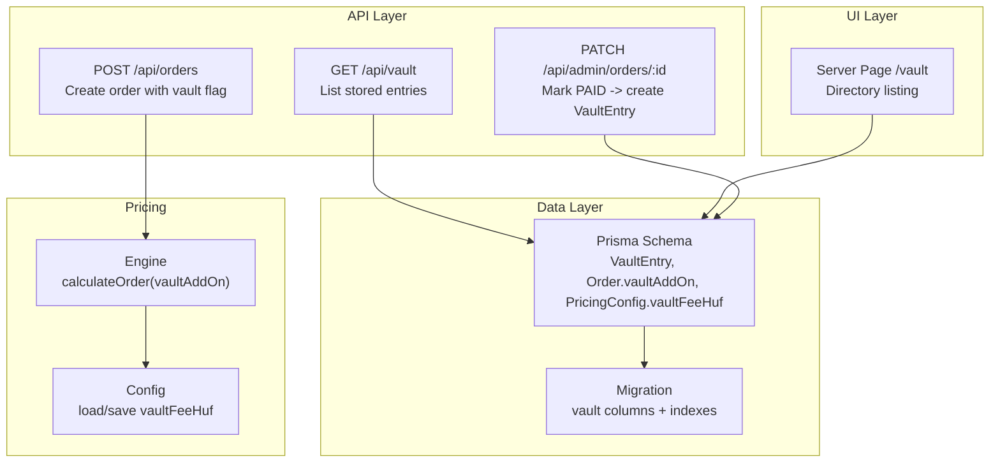
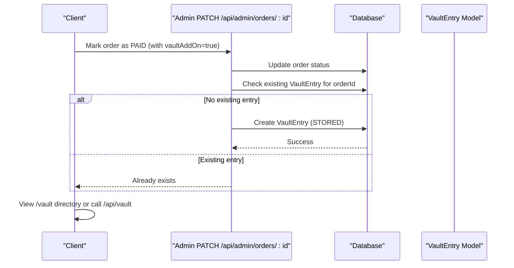
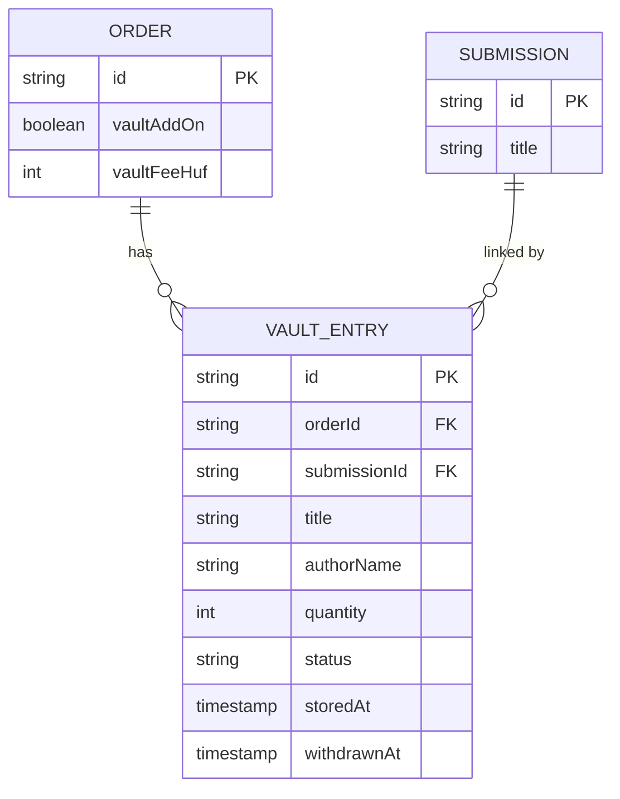
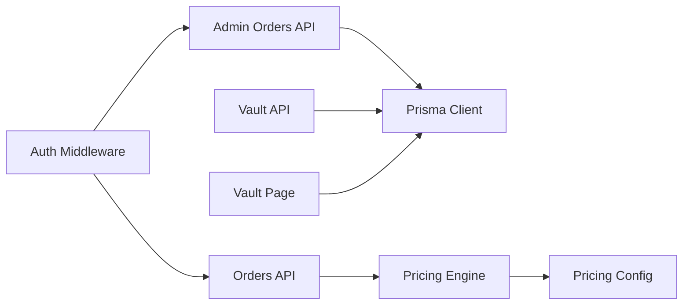

# Vault Storage System

<cite>
**Referenced Files in This Document**
- [schema.prisma](file://prisma/schema.prisma)
- [migration.sql](file://prisma/migrations/20260604085357_add_vault_storage/migration.sql)
- [route.ts](file://src/app/api/vault/route.ts)
- [page.tsx](file://src/app/vault/page.tsx)
- [engine.ts](file://src/lib/pricing/engine.ts)
- [config.ts](file://src/lib/pricing/config.ts)
- [route.ts](file://src/app/api/orders/route.ts)
- [route.ts](file://src/app/api/admin/orders/[id]/route.ts)
- [s3.ts](file://src/lib/s3.ts)
</cite>

## Table of Contents
1. [Introduction](#introduction)
2. [Project Structure](#project-structure)
3. [Core Components](#core-components)
4. [Architecture Overview](#architecture-overview)
5. [Detailed Component Analysis](#detailed-component-analysis)
6. [Dependency Analysis](#dependency-analysis)
7. [Performance Considerations](#performance-considerations)
8. [Troubleshooting Guide](#troubleshooting-guide)
9. [Conclusion](#conclusion)

## Introduction
This document explains the Vault Storage System integrated into the application. The vault is a long-term physical storage add-on for approved Titchybook orders. When an order with the vault add-on is marked as paid, the system automatically creates a permanent record (VaultEntry) that links the order to the submitted book and exposes it in a public directory. The system includes:
- A database model for vault entries and related fields on orders and pricing configuration
- An API endpoint to list stored vault entries with pagination
- A server-rendered page to display the official vault directory
- Automatic creation of vault entries when admin marks an order as paid
- Pricing integration so the vault fee is calculated and persisted per order

## Project Structure
The vault feature spans data modeling, API routes, server components, and pricing logic:
- Data layer: Prisma schema defines VaultEntry and adds vault-related fields to Order and PricingConfig
- Migration: Adds columns and indexes required by the vault feature
- API: Lists vault entries and integrates with order lifecycle
- UI: Server component renders the vault directory with pagination
- Pricing: Engine and config include vault fee calculation and persistence

**Diagram sources**
- [schema.prisma:196-213](file://prisma/schema.prisma#L196-L213)
- [migration.sql:1-36](file://prisma/migrations/20260604085357_add_vault_storage/migration.sql#L1-L36)
- [route.ts:6-31](file://src/app/api/vault/route.ts#L6-L31)
- [page.tsx:8-44](file://src/app/vault/page.tsx#L8-L44)
- [engine.ts:139-180](file://src/lib/pricing/engine.ts#L139-L180)
- [config.ts:105-117](file://src/lib/pricing/config.ts#L105-L117)
- [route.ts:30-136](file://src/app/api/orders/route.ts#L30-L136)
- [route.ts:34-129](file://src/app/api/admin/orders/[id]/route.ts#L34-L129)

**Section sources**
- [schema.prisma:196-213](file://prisma/schema.prisma#L196-L213)
- [migration.sql:1-36](file://prisma/migrations/20260604085357_add_vault_storage/migration.sql#L1-L36)
- [route.ts:6-31](file://src/app/api/vault/route.ts#L6-L31)
- [page.tsx:8-44](file://src/app/vault/page.tsx#L8-L44)
- [engine.ts:139-180](file://src/lib/pricing/engine.ts#L139-L180)
- [config.ts:105-117](file://src/lib/pricing/config.ts#L105-L117)
- [route.ts:30-136](file://src/app/api/orders/route.ts#L30-L136)
- [route.ts:34-129](file://src/app/api/admin/orders/[id]/route.ts#L34-L129)

## Core Components
- VaultEntry model: Stores title, authorName snapshot, quantity, status, timestamps; linked to Order and Submission
- Order vault fields: vaultAddOn boolean and vaultFeeHuf integer to track whether vault was purchased and its cost
- PricingConfig vault field: vaultFeeHuf used to compute vault fees during order calculations
- Vault listing API: GET /api/vault returns stored entries with pagination parameters
- Vault directory page: Server-rendered view of stored entries with pagination
- Admin order update: Automatically creates a VaultEntry when an order transitions to PAID and has vaultAddOn enabled

Key responsibilities:
- Persist vault metadata and relationships
- Compute and persist vault fees via pricing engine
- Expose vault listings securely and efficiently
- Ensure idempotent creation of vault entries

**Section sources**
- [schema.prisma:196-213](file://prisma/schema.prisma#L196-L213)
- [schema.prisma:115-164](file://prisma/schema.prisma#L115-L164)
- [schema.prisma:180-194](file://prisma/schema.prisma#L180-L194)
- [route.ts:6-31](file://src/app/api/vault/route.ts#L6-L31)
- [page.tsx:8-44](file://src/app/vault/page.tsx#L8-L44)
- [engine.ts:139-180](file://src/lib/pricing/engine.ts#L139-L180)
- [config.ts:105-117](file://src/lib/pricing/config.ts#L105-L117)
- [route.ts:34-129](file://src/app/api/admin/orders/[id]/route.ts#L34-L129)

## Architecture Overview
The vault system integrates across data, API, UI, and pricing layers. Orders can opt-in to vault storage; upon payment confirmation, vault entries are created and exposed publicly.

**Diagram sources**
- [route.ts:34-129](file://src/app/api/admin/orders/[id]/route.ts#L34-L129)
- [schema.prisma:196-213](file://prisma/schema.prisma#L196-L213)

## Detailed Component Analysis

### Database Models and Relationships
- VaultEntry: Primary key id; foreign keys to Order and Submission; fields capture title, authorName snapshot, quantity defaulting to 2, status defaulting to STORED, timestamps for storedAt and withdrawnAt
- Order: Added vaultAddOn and vaultFeeHuf to indicate purchase and cost
- PricingConfig: Added vaultFeeHuf to define the flat fee for the vault add-on

Indexes:
- VaultEntry indexed by submissionId and status for efficient queries

Foreign keys:
- VaultEntry.orderId references Order.id
- VaultEntry.submissionId references Submission.id

**Diagram sources**
- [schema.prisma:115-164](file://prisma/schema.prisma#L115-L164)
- [schema.prisma:180-194](file://prisma/schema.prisma#L180-L194)
- [schema.prisma:196-213](file://prisma/schema.prisma#L196-L213)

**Section sources**
- [schema.prisma:115-164](file://prisma/schema.prisma#L115-L164)
- [schema.prisma:180-194](file://prisma/schema.prisma#L180-L194)
- [schema.prisma:196-213](file://prisma/schema.prisma#L196-L213)
- [migration.sql:1-36](file://prisma/migrations/20260604085357_add_vault_storage/migration.sql#L1-L36)

### Vault Listing API
- Endpoint: GET /api/vault
- Query parameters: limit (1–200), offset (>=0)
- Behavior: Returns stored entries filtered by status STORED, ordered by storedAt descending, with total count
- Response: JSON containing entries array, total, limit, offset

Error handling:
- Uses dynamic rendering to ensure fresh data on each request

**Section sources**
- [route.ts:6-31](file://src/app/api/vault/route.ts#L6-L31)

### Vault Directory Page
- Server component at /vault
- Fetches stored entries using Prisma with pagination (PAGE_SIZE = 24)
- Displays empty state if no entries exist
- Renders cards with title, authorName, status badge, and formatted date
- Provides previous/next navigation based on total pages

Error handling:
- Catches query errors and shows a user-friendly message with retry link

**Section sources**
- [page.tsx:8-44](file://src/app/vault/page.tsx#L8-L44)
- [page.tsx:45-86](file://src/app/vault/page.tsx#L45-L86)
- [page.tsx:88-258](file://src/app/vault/page.tsx#L88-L258)

### Order Creation with Vault Add-On
- Endpoint: POST /api/orders
- Validates input including optional vaultAddOn flag
- Loads pricing configuration and calculates order totals including vault fee
- Persists order with vaultAddOn and vaultFeeHuf values

Validation:
- Ensures submission exists, belongs to user, is approved, and PDF ready
- Validates zone availability and pricing configuration

**Section sources**
- [route.ts:30-136](file://src/app/api/orders/route.ts#L30-L136)

### Pricing Engine Integration
- calculateOrder accepts options.vaultAddOn and computes vaultFeeHuf from configuration
- Total includes print, handling, shipping, vault fee, minus discount
- Cost per book computed and returned

Configuration:
- loadPricingConfig caches resolved config including vaultFeeHuf
- savePricingConfig persists vaultFeeHuf and invalidates cache

**Section sources**
- [engine.ts:139-180](file://src/lib/pricing/engine.ts#L139-L180)
- [config.ts:105-117](file://src/lib/pricing/config.ts#L105-L117)
- [config.ts:119-147](file://src/lib/pricing/config.ts#L119-L147)

### Admin Order Update and Vault Entry Creation
- Endpoint: PATCH /api/admin/orders/:id
- Validates status transitions and updates order
- If status becomes PAID and order has vaultAddOn, auto-creates VaultEntry if not already present
- Author name defaults to "Anonymous" if missing to protect privacy

Idempotency:
- Checks for existing VaultEntry by orderId before creating

Error handling:
- Logs failures to create vault entry for recovery

**Section sources**
- [route.ts:34-129](file://src/app/api/admin/orders/[id]/route.ts#L34-L129)

### S3 Utilities (Contextual)
- S3 client configured with region and credentials
- Functions for presigned upload/download URLs, streaming downloads, uploads, key builders, and deletion
- Not directly used by vault endpoints but part of broader asset management context

**Section sources**
- [s3.ts:1-106](file://src/lib/s3.ts#L1-L106)

## Dependency Analysis
The vault feature depends on:
- Prisma client for database operations
- Authentication middleware for protected routes
- Pricing engine and configuration for fee calculation
- Admin order update flow to trigger vault entry creation

**Diagram sources**
- [route.ts:30-136](file://src/app/api/orders/route.ts#L30-L136)
- [route.ts:34-129](file://src/app/api/admin/orders/[id]/route.ts#L34-L129)
- [route.ts:6-31](file://src/app/api/vault/route.ts#L6-L31)
- [engine.ts:139-180](file://src/lib/pricing/engine.ts#L139-L180)
- [config.ts:105-117](file://src/lib/pricing/config.ts#L105-L117)

**Section sources**
- [route.ts:30-136](file://src/app/api/orders/route.ts#L30-L136)
- [route.ts:34-129](file://src/app/api/admin/orders/[id]/route.ts#L34-L129)
- [route.ts:6-31](file://src/app/api/vault/route.ts#L6-L31)
- [engine.ts:139-180](file://src/lib/pricing/engine.ts#L139-L180)
- [config.ts:105-117](file://src/lib/pricing/config.ts#L105-L117)

## Performance Considerations
- Pagination: Both API and page use limit/offset to control result sets and reduce payload size
- Indexes: VaultEntry indexed by submissionId and status to optimize filtering and querying
- Caching: Pricing config cached in-memory with TTL to avoid frequent DB reads during high-frequency calculations
- Dynamic rendering: API and page set dynamic mode to ensure fresh data on each request

Recommendations:
- Monitor query performance for large vault directories
- Consider adding additional filters (e.g., by author or date range) if needed
- Keep vaultFeeHuf configuration changes infrequent to leverage caching benefits

[No sources needed since this section provides general guidance]

## Troubleshooting Guide
Common issues and resolutions:
- Vault directory temporarily unavailable: Occurs when vault query fails; retry loading the page
- Missing vault entry after payment: Ensure admin marks order as PAID and vaultAddOn is true; check logs for creation failures
- Duplicate vault entries: System checks for existing entry by orderId before creating; verify order status transitions
- Pricing calculation errors: Validate zones and tiers; ensure vaultFeeHuf is configured correctly

Debugging steps:
- Inspect order status and vaultAddOn flags
- Verify VaultEntry existence for the order
- Review pricing configuration and engine outputs

**Section sources**
- [page.tsx:45-86](file://src/app/vault/page.tsx#L45-L86)
- [route.ts:34-129](file://src/app/api/admin/orders/[id]/route.ts#L34-L129)
- [engine.ts:139-180](file://src/lib/pricing/engine.ts#L139-L180)
- [config.ts:105-117](file://src/lib/pricing/config.ts#L105-L117)

## Conclusion
The Vault Storage System provides a robust mechanism to archive approved Titchybooks in long-term physical storage. It integrates seamlessly with order management and pricing logic, ensuring accurate fee calculation and automatic archival upon payment confirmation. The public directory offers transparency and visibility into archived works, while safeguards like idempotent creation and error handling maintain reliability. Future enhancements could include advanced filtering, export capabilities, and enhanced audit trails for vault lifecycle events.

[No sources needed since this section summarizes without analyzing specific files]