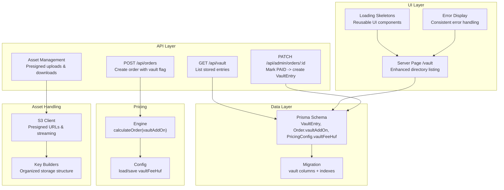
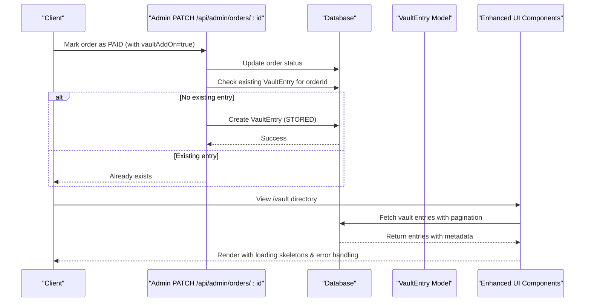
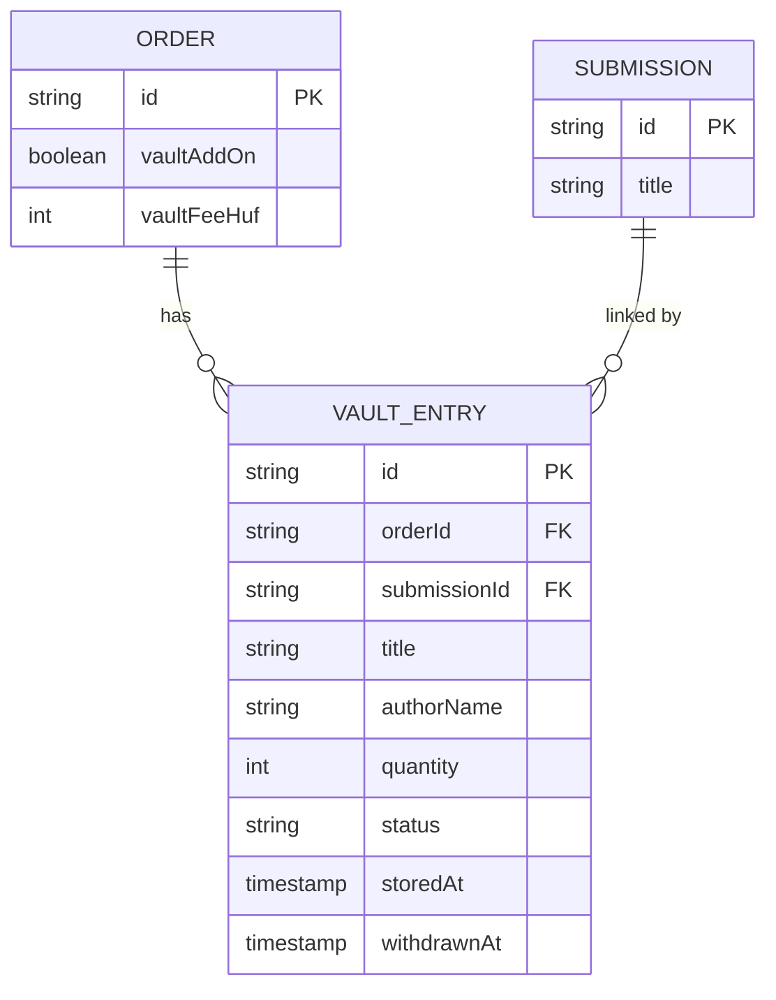
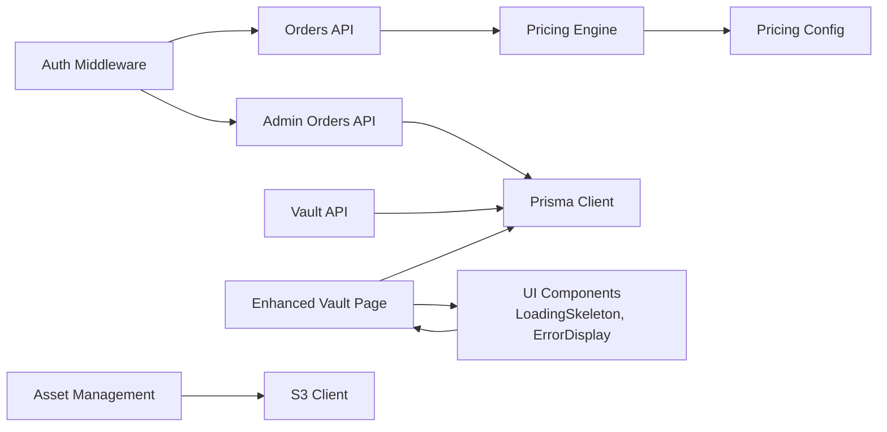

# Vault Storage System

<cite>
**Referenced Files in This Document**
- [schema.prisma](file://prisma/schema.prisma)
- [migration.sql](file://prisma/migrations/20260604085357_add_vault_storage/migration.sql)
- [route.ts](file://src/app/api/vault/route.ts)
- [page.tsx](file://src/app/vault/page.tsx)
- [loading.tsx](file://src/app/vault/loading.tsx)
- [error.tsx](file://src/app/vault/error.tsx)
- [LoadingSkeleton.tsx](file://src/components/ui/LoadingSkeleton.tsx)
- [ErrorDisplay.tsx](file://src/components/ui/ErrorDisplay.tsx)
- [engine.ts](file://src/lib/pricing/engine.ts)
- [config.ts](file://src/lib/pricing/config.ts)
- [route.ts](file://src/app/api/orders/route.ts)
- [route.ts](file://src/app/api/admin/orders/[id]/route.ts)
- [s3.ts](file://src/lib/s3.ts)
- [route.ts](file://src/app\api\assets\presign\route.ts)
- [route.ts](file://src/app\api\assets\route.ts)
</cite>

## Update Summary
**Changes Made**
- Enhanced vault directory UI with improved loading states and error handling
- Added comprehensive skeleton loading components for better user experience
- Integrated reusable UI components (ErrorDisplay, LoadingSkeleton) for consistency
- Improved vault entry display with better visual hierarchy and responsive design
- Enhanced asset handling infrastructure supporting vault storage operations
- Updated pricing integration with vault fee configuration and calculation

## Table of Contents
1. [Introduction](#introduction)
2. [Project Structure](#project-structure)
3. [Core Components](#core-components)
4. [Architecture Overview](#architecture-overview)
5. [Detailed Component Analysis](#detailed-component-analysis)
6. [Enhanced User Interface](#enhanced-user-interface)
7. [Asset Handling Integration](#asset-handling-integration)
8. [Dependency Analysis](#dependency-analysis)
9. [Performance Considerations](#performance-considerations)
10. [Troubleshooting Guide](#troubleshooting-guide)
11. [Conclusion](#conclusion)

## Introduction
This document explains the enhanced Vault Storage System integrated into the application. The vault is a long-term physical storage add-on for approved Titchybook orders with significantly improved asset handling capabilities and modern user interface components. When an order with the vault add-on is marked as paid, the system automatically creates a permanent record (VaultEntry) that links the order to the submitted book and exposes it in a public directory. The system includes:
- A database model for vault entries and related fields on orders and pricing configuration
- An API endpoint to list stored vault entries with pagination
- A server-rendered page with enhanced UI components to display the official vault directory
- Automatic creation of vault entries when admin marks an order as paid
- Pricing integration so the vault fee is calculated and persisted per order
- Comprehensive loading states and error handling for improved user experience

## Project Structure
The enhanced vault feature spans data modeling, API routes, server components, pricing logic, and modern UI components:
- Data layer: Prisma schema defines VaultEntry and adds vault-related fields to Order and PricingConfig
- Migration: Adds columns and indexes required by the vault feature
- API: Lists vault entries and integrates with order lifecycle
- UI: Server component renders the vault directory with pagination, loading skeletons, and error states
- Pricing: Engine and config include vault fee calculation and persistence
- Asset handling: Infrastructure supporting vault storage operations through S3 integration

**Diagram sources**
- [schema.prisma:196-213](file://prisma/schema.prisma#L196-L213)
- [migration.sql:1-36](file://prisma/migrations/20260604085357_add_vault_storage/migration.sql#L1-L36)
- [route.ts:6-31](file://src/app/api/vault/route.ts#L6-L31)
- [page.tsx:8-44](file://src/app/vault/page.tsx#L8-L44)
- [engine.ts:139-180](file://src/lib/pricing/engine.ts#L139-L180)
- [config.ts:105-117](file://src/lib/pricing/config.ts#L105-L117)
- [route.ts:30-136](file://src/app/api/orders/route.ts#L30-L136)
- [route.ts:34-129](file://src/app/api/admin/orders/[id]/route.ts#L34-L129)
- [s3.ts:1-106](file://src/lib/s3.ts#L1-L106)

**Section sources**
- [schema.prisma:196-213](file://prisma/schema.prisma#L196-L213)
- [migration.sql:1-36](file://prisma/migrations/20260604085357_add_vault_storage/migration.sql#L1-L36)
- [route.ts:6-31](file://src/app/api/vault/route.ts#L6-L31)
- [page.tsx:8-44](file://src/app/vault/page.tsx#L8-L44)
- [engine.ts:139-180](file://src/lib/pricing/engine.ts#L139-L180)
- [config.ts:105-117](file://src/lib/pricing/config.ts#L105-L117)
- [route.ts:30-136](file://src/app/api/orders/route.ts#L30-L136)
- [route.ts:34-129](file://src/app/api/admin/orders/[id]/route.ts#L34-L129)

## Core Components
- VaultEntry model: Stores title, authorName snapshot, quantity, status, timestamps; linked to Order and Submission
- Order vault fields: vaultAddOn boolean and vaultFeeHuf integer to track whether vault was purchased and its cost
- PricingConfig vault field: vaultFeeHuf used to compute vault fees during order calculations
- Vault listing API: GET /api/vault returns stored entries with pagination parameters
- Enhanced vault directory page: Server-rendered view with loading skeletons, error handling, and responsive design
- Admin order update: Automatically creates a VaultEntry when an order transitions to PAID and has vaultAddOn enabled
- Reusable UI components: Loading skeletons and error displays for consistent user experience

Key responsibilities:
- Persist vault metadata and relationships
- Compute and persist vault fees via pricing engine
- Expose vault listings securely and efficiently
- Ensure idempotent creation of vault entries
- Provide enhanced user experience with proper loading states and error handling

**Section sources**
- [schema.prisma:196-213](file://prisma/schema.prisma#L196-L213)
- [schema.prisma:115-164](file://prisma/schema.prisma#L115-L164)
- [schema.prisma:180-194](file://prisma/schema.prisma#L180-L194)
- [route.ts:6-31](file://src/app/api/vault/route.ts#L6-L31)
- [page.tsx:8-44](file://src/app/vault/page.tsx#L8-L44)
- [engine.ts:139-180](file://src/lib/pricing/engine.ts#L139-L180)
- [config.ts:105-117](file://src/lib/pricing/config.ts#L105-L117)
- [route.ts:34-129](file://src/app/api/admin/orders/[id]/route.ts#L34-L129)

## Architecture Overview
The enhanced vault system integrates across data, API, UI, and pricing layers with improved asset handling capabilities. Orders can opt-in to vault storage; upon payment confirmation, vault entries are created and exposed publicly with enhanced user interface components.

**Diagram sources**
- [route.ts:34-129](file://src/app/api/admin/orders/[id]/route.ts#L34-L129)
- [schema.prisma:196-213](file://prisma/schema.prisma#L196-L213)
- [page.tsx:8-44](file://src/app/vault/page.tsx#L8-L44)
- [LoadingSkeleton.tsx:1-112](file://src/components/ui/LoadingSkeleton.tsx#L1-L112)

## Detailed Component Analysis

### Database Models and Relationships
- VaultEntry: Primary key id; foreign keys to Order and Submission; fields capture title, authorName snapshot, quantity defaulting to 2, status defaulting to STORED, timestamps for storedAt and withdrawnAt
- Order: Added vaultAddOn and vaultFeeHuf to indicate purchase and cost
- PricingConfig: Added vaultFeeHuf to define the flat fee for the vault add-on

Indexes:
- VaultEntry indexed by submissionId and status for efficient queries

Foreign keys:
- VaultEntry.orderId references Order.id
- VaultEntry.submissionId references Submission.id

**Diagram sources**
- [schema.prisma:115-164](file://prisma/schema.prisma#L115-L164)
- [schema.prisma:180-194](file://prisma/schema.prisma#L180-L194)
- [schema.prisma:196-213](file://prisma/schema.prisma#L196-L213)

**Section sources**
- [schema.prisma:115-164](file://prisma/schema.prisma#L115-L164)
- [schema.prisma:180-194](file://prisma/schema.prisma#L180-L194)
- [schema.prisma:196-213](file://prisma/schema.prisma#L196-L213)
- [migration.sql:1-36](file://prisma/migrations/20260604085357_add_vault_storage/migration.sql#L1-L36)

### Enhanced Vault Directory Page
**Updated** The vault directory page now features enhanced user interface components including loading skeletons, error handling, and improved visual design.

- Server component at /vault with comprehensive error handling
- Fetches stored entries using Prisma with pagination (PAGE_SIZE = 24)
- Displays empty state with informative messaging if no entries exist
- Renders cards with title, authorName, status badge, and formatted date
- Provides previous/next navigation based on total pages
- Integrates reusable LoadingSkeleton components for smooth loading experience
- Uses ErrorDisplay component for consistent error presentation

Error handling:
- Catches query errors and shows user-friendly message with retry link
- Implements graceful degradation with loading states
- Provides clear feedback for different error scenarios

**Section sources**
- [page.tsx:8-44](file://src/app/vault/page.tsx#L8-L44)
- [page.tsx:45-86](file://src/app/vault/page.tsx#L45-L86)
- [page.tsx:88-258](file://src/app/vault/page.tsx#L88-L258)
- [loading.tsx:1-10](file://src/app/vault/loading.tsx#L1-L10)
- [error.tsx:1-13](file://src/app/vault/error.tsx#L1-L13)

### Enhanced User Interface Components
**New** The vault system now leverages reusable UI components for consistent user experience across the application.

- **LoadingSkeleton**: Provides animated placeholder components for various UI patterns
  - SkeletonPageHeader: Header placeholders with subtitle support
  - SkeletonGrid: Grid-based loading states with configurable columns
  - SkeletonCard: Card-based loading states with customizable line counts
  - SkeletonBlock: Basic block-level loading animations

- **ErrorDisplay**: Consistent error presentation component
  - Standardized error icon and styling
  - Configurable error messages
  - Retry functionality integration
  - Accessible design with proper ARIA labels

These components ensure consistent loading states and error handling throughout the vault interface.

**Section sources**
- [LoadingSkeleton.tsx:1-112](file://src/components/ui/LoadingSkeleton.tsx#L1-L112)
- [ErrorDisplay.tsx:1-56](file://src/components/ui/ErrorDisplay.tsx#L1-L56)

### Vault Listing API
- Endpoint: GET /api/vault
- Query parameters: limit (1–200), offset (>=0)
- Behavior: Returns stored entries filtered by status STORED, ordered by storedAt descending, with total count
- Response: JSON containing entries array, total, limit, offset

Error handling:
- Uses dynamic rendering to ensure fresh data on each request

**Section sources**
- [route.ts:6-31](file://src/app/api/vault/route.ts#L6-L31)

### Order Creation with Vault Add-On
- Endpoint: POST /api/orders
- Validates input including optional vaultAddOn flag
- Loads pricing configuration and calculates order totals including vault fee
- Persists order with vaultAddOn and vaultFeeHuf values

Validation:
- Ensures submission exists, belongs to user, is approved, and PDF ready
- Validates zone availability and pricing configuration

**Section sources**
- [route.ts:30-136](file://src/app/api/orders/route.ts#L30-L136)

### Pricing Engine Integration
- calculateOrder accepts options.vaultAddOn and computes vaultFeeHuf from configuration
- Total includes print, handling, shipping, vault fee, minus discount
- Cost per book computed and returned

Configuration:
- loadPricingConfig caches resolved config including vaultFeeHuf
- savePricingConfig persists vaultFeeHuf and invalidates cache

**Section sources**
- [engine.ts:139-180](file://src/lib/pricing/engine.ts#L139-L180)
- [config.ts:105-117](file://src/lib/pricing/config.ts#L105-L117)
- [config.ts:119-147](file://src/lib/pricing/config.ts#L119-L147)

### Admin Order Update and Vault Entry Creation
- Endpoint: PATCH /api/admin/orders/:id
- Validates status transitions and updates order
- If status becomes PAID and order has vaultAddOn, auto-creates VaultEntry if not already present
- Author name defaults to "Anonymous" if missing to protect privacy

Idempotency:
- Checks for existing VaultEntry by orderId before creating

Error handling:
- Logs failures to create vault entry for recovery

**Section sources**
- [route.ts:34-129](file://src/app/api/admin/orders/[id]/route.ts#L34-L129)

## Enhanced User Interface
**New Section** The vault system now provides a significantly improved user interface with modern design patterns and enhanced user experience.

### Loading States
The vault directory implements comprehensive loading states using reusable skeleton components:
- Animated placeholders that match the final layout structure
- Responsive grid layouts with configurable column counts
- Smooth transitions between loading and loaded states
- Consistent visual language across all loading scenarios

### Error Handling
Enhanced error handling provides users with clear feedback and recovery options:
- Graceful error presentation with contextual messaging
- Retry functionality for transient failures
- Consistent error styling and accessibility
- Fallback states for network or database issues

### Visual Design
The vault directory features a modern, accessible design:
- Responsive grid layout adapting to different screen sizes
- Clear visual hierarchy with appropriate typography
- Consistent spacing and alignment
- Accessible color schemes and contrast ratios
- Intuitive navigation with pagination controls

**Section sources**
- [page.tsx:90-258](file://src/app/vault/page.tsx#L90-L258)
- [loading.tsx:1-10](file://src/app/vault/loading.tsx#L1-L10)
- [LoadingSkeleton.tsx:21-85](file://src/components/ui/LoadingSkeleton.tsx#L21-L85)

## Asset Handling Integration
**New Section** The vault system integrates with the broader asset handling infrastructure to support enhanced storage and retrieval capabilities.

### S3 Integration
The vault system leverages the existing S3 infrastructure for robust file management:
- Presigned upload URLs for secure direct-to-cloud uploads
- Organized storage structure with user-specific directories
- Streaming support for large file operations
- Efficient key building for different asset types

### Asset Management APIs
Enhanced asset handling includes comprehensive API endpoints:
- **Presigned Uploads**: Generate secure upload URLs for client-side uploads
- **Asset Metadata**: Store and retrieve asset information with validation
- **Secure Downloads**: Stream assets directly from S3 with access control
- **Asset Deletion**: Clean up both database records and S3 objects

### Security and Validation
Asset handling includes multiple security layers:
- Authentication and authorization checks
- File type validation against accepted image types
- Size limits and format restrictions
- Ownership verification for asset operations

**Section sources**
- [s3.ts:1-106](file://src/lib/s3.ts#L1-L106)
- [route.ts:1-46](file://src/app/api/assets/presign/route.ts#L1-L46)
- [route.ts:1-91](file://src/app/api/assets/route.ts#L1-L91)
- [route.ts:36-86](file://src/app/api/assets/[assetId]/image/route.ts#L36-L86)
- [route.ts:1-54](file://src/app/api/assets/[assetId]/route.ts#L1-L54)

## Dependency Analysis
The enhanced vault feature depends on:
- Prisma client for database operations
- Authentication middleware for protected routes
- Pricing engine and configuration for fee calculation
- Admin order update flow to trigger vault entry creation
- Reusable UI components for consistent user experience
- S3 infrastructure for asset storage and retrieval

**Diagram sources**
- [route.ts:30-136](file://src/app/api/orders/route.ts#L30-L136)
- [route.ts:34-129](file://src/app/api/admin/orders/[id]/route.ts#L34-L129)
- [route.ts:6-31](file://src/app/api/vault/route.ts#L6-L31)
- [engine.ts:139-180](file://src/lib/pricing/engine.ts#L139-L180)
- [config.ts:105-117](file://src/lib/pricing/config.ts#L105-L117)
- [LoadingSkeleton.tsx:1-112](file://src/components/ui/LoadingSkeleton.tsx#L1-L112)
- [ErrorDisplay.tsx:1-56](file://src/components/ui/ErrorDisplay.tsx#L1-L56)

**Section sources**
- [route.ts:30-136](file://src/app/api/orders/route.ts#L30-L136)
- [route.ts:34-129](file://src/app/api/admin/orders/[id]/route.ts#L34-L129)
- [route.ts:6-31](file://src/app/api/vault/route.ts#L6-L31)
- [engine.ts:139-180](file://src/lib/pricing/engine.ts#L139-L180)
- [config.ts:105-117](file://src/lib/pricing/config.ts#L105-L117)

## Performance Considerations
- Pagination: Both API and page use limit/offset to control result sets and reduce payload size
- Indexes: VaultEntry indexed by submissionId and status to optimize filtering and querying
- Caching: Pricing config cached in-memory with TTL to avoid frequent DB reads during high-frequency calculations
- Dynamic rendering: API and page set dynamic mode to ensure fresh data on each request
- **Enhanced**: Loading skeletons provide immediate visual feedback without blocking user interaction
- **Enhanced**: Reusable UI components reduce bundle size and improve performance through code sharing
- **Enhanced**: Error boundaries prevent cascading failures and maintain application stability

Recommendations:
- Monitor query performance for large vault directories
- Consider adding additional filters (e.g., by author or date range) if needed
- Keep vaultFeeHuf configuration changes infrequent to leverage caching benefits
- Leverage loading skeletons for perceived performance improvements
- Use error boundaries to contain failures and maintain user experience

## Troubleshooting Guide
Common issues and resolutions:
- Vault directory temporarily unavailable: Occurs when vault query fails; retry loading the page
- Missing vault entry after payment: Ensure admin marks order as PAID and vaultAddOn is true; check logs for creation failures
- Duplicate vault entries: System checks for existing entry by orderId before creating; verify order status transitions
- Pricing calculation errors: Validate zones and tiers; ensure vaultFeeHuf is configured correctly
- **Enhanced**: Loading state issues: Verify skeleton components are properly imported and configured
- **Enhanced**: Error display problems: Check ErrorDisplay component props and error boundary setup
- **Enhanced**: Asset upload failures: Verify S3 credentials and presigned URL generation

Debugging steps:
- Inspect order status and vaultAddOn flags
- Verify VaultEntry existence for the order
- Review pricing configuration and engine outputs
- Check UI component prop validation and error boundaries
- Verify asset handling API responses and S3 connectivity

**Section sources**
- [page.tsx:45-86](file://src/app/vault/page.tsx#L45-L86)
- [route.ts:34-129](file://src/app/api/admin/orders/[id]/route.ts#L34-L129)
- [engine.ts:139-180](file://src/lib/pricing/engine.ts#L139-L180)
- [config.ts:105-117](file://src/lib/pricing/config.ts#L105-L117)
- [ErrorDisplay.tsx:1-56](file://src/components/ui/ErrorDisplay.tsx#L1-L56)

## Conclusion
The enhanced Vault Storage System provides a robust mechanism to archive approved Titchybooks in long-term physical storage with significantly improved user experience and asset handling capabilities. It integrates seamlessly with order management and pricing logic, ensuring accurate fee calculation and automatic archival upon payment confirmation. The public directory offers transparency and visibility into archived works while leveraging modern UI components for loading states, error handling, and responsive design. The enhanced asset handling infrastructure supports secure file operations through S3 integration. Future enhancements could include advanced filtering, export capabilities, enhanced audit trails for vault lifecycle events, and further UI refinements based on user feedback.